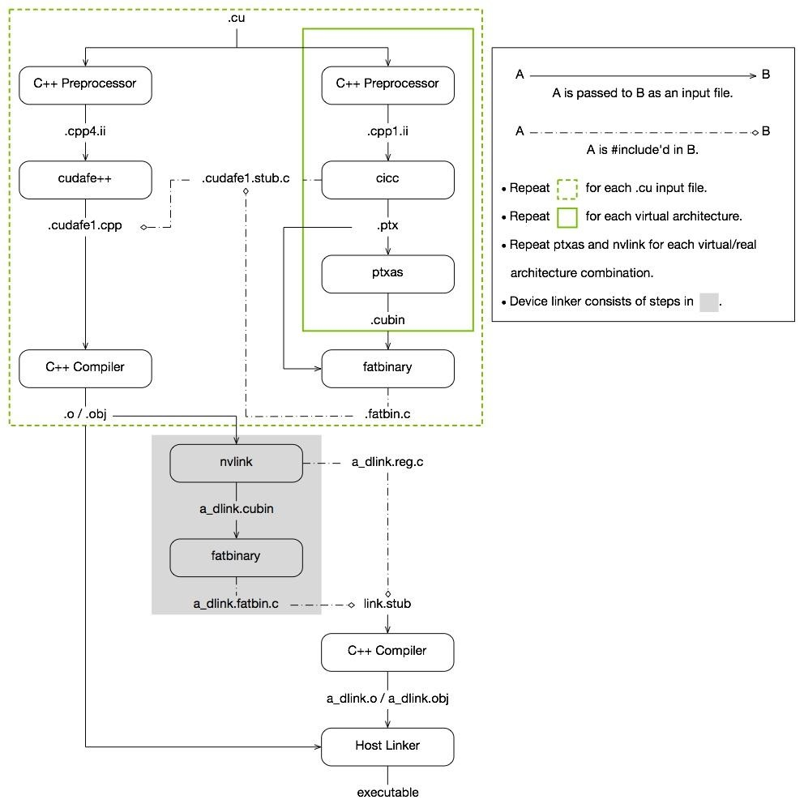

# cuda和GPU的探索

## 简单的cuda程序样例
```
#include<cuda_runtime.h>
#include<cstdlib>
#include<cassert>

__global__ void add_vector(int* res,int* a,int* b,int num){
    int index=threadIdx.x+blockIdx.x*blockDim.x;
    if(index<num){
        res[index]=a[index]+b[index];
    }
}

void random_array(int* a,int n){
    for(int i=0;i<n;i++){
        a[i]=rand();
    }
}

int main(){
    int* h_a;
    int* h_b;
    int* h_res;
    int* cuda_a;
    int* cuda_b;
    int* cuda_res;

    int num=2048*2048;
    int numbyte=num*sizeof(int);
    h_a=(int*)malloc(numbyte);
    h_b=(int*)malloc(numbyte);
    h_res=(int*)malloc(numbyte);
    random_array(h_a,num);
    random_array(h_b,num);

    cudaMalloc(&cuda_a,numbyte);
    cudaMalloc(&cuda_b,numbyte);
    cudaMalloc(&cuda_res,numbyte);

    cudaMemcpy(cuda_a,h_a,numbyte,cudaMemcpyHostToDevice);
    cudaMemcpy(cuda_b,h_b,numbyte,cudaMemcpyHostToDevice);
    add_vector<<<num/512,512>>>(cuda_res,cuda_a,cuda_b);
    cudaMemcpy(h_res,cuda_res,numbyte,cudaMemcpyDeviceToHost);

    for(int i=0;i<num;i++){
        assert(h_res==h_a+h_b);
    }

    cudaFree(cuda_a);
    cudaFree(cuda_b);
    cudaFree(cuda_res);
    free(h_a);
    free(h_b);
    free(h_res);
}
```
这是一个demo实现的是使用GPU进行向量加法的加速，我们来分析一下这个简单的程序。

首先是无聊的前期准备工作，给h_a、h_b、h_res三个数组分配num大小的数组空间，然后用随机数初始化h_a、h_b数组，目标是计算h_a和h_b求和的结果，保存到h_res中
```
    int num=2048*2048;
    int numbyte=num*sizeof(int);
    h_a=(int*)malloc(numbyte);
    h_b=(int*)malloc(numbyte);
    h_res=(int*)malloc(numbyte);
    random_array(h_a,num);
    random_array(h_b,num);
```
为了让GPU可以计算h_a和h_b数组的内容，但是GPU只能直接访问GPU自己的专属现存的数据，无法直接访问CPU上面的内容，所以我们需要首先把需要计算的数据从host设备(CPU的内存)移到device设备(GPU内存)上来。

cudaMalloc(void** ptr,int num)函数传入一个指针的地址，然后它会向GPU申请分配一块num字节的显存空间，显存空间的首地址被保存到ptr指向的指针当中。于是我们向GPU申请了三块大小为numbyte的显存空间，地址被保存到cuda_a、cuda_b、cuda_res三个变量当中。
```
    cudaMalloc(&cuda_a,numbyte);
    cudaMalloc(&cuda_b,numbyte);
    cudaMalloc(&cuda_res,numbyte);
```
需要注意malloc申请的是Host的虚拟地址，只有在Host上使用是有意义的；cudaMalloc申请的是Device的虚拟地址，只有把这个地址的值传送给Device，让Device使用才是有意义的。

然后我们使用cudaMemcpy函数把Host的h_a和h_b向量的数据传递到Device的cuda_a、cuda_b数组上面。`cudaMemcpy(void* dst,void* src,int num,enum kind)`中kind指示了转递的类型，如果是cudaMemcpyHostToDevice那么就是从Host的内存传递数据给Device，dst需要是Device地址，src需要是Host地址；cudaMemcpyDeviceToHost就是从Devie内存传递数据给Host，dst需要时Host地址，src是Device地址。所以现在GPU获得他需要的数据了。
```
    cudaMemcpy(cuda_a,h_a,numbyte,cudaMemcpyHostToDevice);
    cudaMemcpy(cuda_b,h_b,numbyte,cudaMemcpyHostToDevice);
```
GPU的数据已经就位了，下一步就是运行GPU的程序，也就是如下代码。在cuda当中用__host__修饰的就是CPU执行的代码，可以省略不写，用__global__修饰的就是GPU执行的代码，这部分函数会被编译得到GPU的可执行文件，然后在运行add_Vector的时候被发送给GPU，GPU就会运行这部分代码实现我们需要的向量加法功能。

`add_vector<<<num/512,512>>>(cuda_res,cuda_a,cuda_b);`这是cuda的GPU代码特有的调用方式，我们后续再进行介绍，总之它调用了GPU做add_vector，实现了cuda_a和cuda_b的向量相加，并且把结果加到了cuda_res上来。
```
    add_vector<<<num/512,512>>>(cuda_res,cuda_a,cuda_b);

__global__ void add_vector(int* res,int* a,int* b,int num){
    int index=threadIdx.x+blockIdx.x*blockDim.x;
    if(index<num){
        res[index]=a[index]+b[index];
    }
}
```
之后我们再次调用cudaMemcpy将数据从GPU的cuda_res传递到CPU的h_res上去，就得到了h_a+h_b的结果。
```
    cudaMemcpy(h_res,cuda_res,numbyte,cudaMemcpyDeviceToHost);
```
最后做一些内存的回收，free回收malloc分配的Host内存，cudaFree回收cudaMalloc分配的Device内存。
```
    cudaFree(cuda_a);
    cudaFree(cuda_b);
    cudaFree(cuda_res);
    free(h_a);
    free(h_b);
    free(h_res);
```

## SIMT编程模式
在介绍`__global__ add_vector`的代码和调用为什么长得这么奇特之前，我们先介绍一波GPU的结构和编程的对应关系，具体的GPU的体系结构和微架构之类的细节，我们之后详谈，另外现在介绍的GPU结构模型是简化过、抽象过的，只是为了方便大家快速理解软件的构造，至于硬件真是怎么适配，那是另一个复杂的问题。

### thread与core
对于CPU，我们可以将一个process编写一个多thread程序，然后我们有4个core，我们就可以每次调度4个thread到4个core上，然后一次算4个thread的内容。而对于GPU我们有上千个core，甚至上万个core，所以我们可以编写一个有数万thread的程序，然后交给GPU的数万个core运行。高度并行的批数据处理程序很适合编写这种多thread程序：比如向量加法，我们把两个1w维的向量a和1w维的向量b相加，我们可以写一个1万个thread的程序，第i个程序负责把a的第i个分量和b的第i个分量相加，这样所有的thread算完，我们的向量相加的任务就结束了。

我们看一下下面的程序，只是之前的简化版本。我们在add_vector后面的<<<>>>填入512，就说我们需要512个线程，那么GPU收到我们的命令之后就会产生512个thread，这本身也是GPU强大的地方，他可以快速地初始化大量的线程，这对于CPU是无法做到的。然后这些线程就会被分配到空闲的core上运行，比如我们有128个core，那么运行4批就算完了。对于所有的线程他们都执行add_vector的代码，基本同时开始并且同时结束，thread中间唯一的区别是它们的threadIdx号不一样，会被一次标号为0-511，这是每个TCB的一部分，除此之外没有任何的区别。程序员编程的时候可以根据这个threadIdx.x不同来访问不同的数据，比如第i个thread访问第i个向量分量。
```
    add_vector<<<1,512>>>(cuda_res,cuda_a,cuda_b);

__global__ void add_vector(int* res,int* a,int* b,int num){
    int index=threadIdx.x;
    if(index<num){
        res[index]=a[index]+b[index];
    }
}
```
### block与SM
对于一个GPU来说他可能有1024个core，如果他产生了1024个thread，然后用一个中央的调度器把每一个thread分配到每一个core上面，对于这个调度器来说要求太大了，他必须同时具备同时处理1024个单独线程调度的能力。在硬件实现上，如果1024个core完全独立的一级层次，那么其他的所有部件都需要同时面对1024个core的调用请求，这个仲裁压力也太大了。所以对于core我们需要一个二级结构组织起来，这个就是SM(stream multiprocess)。

每个SM比如说包含128个core，然后一共有8个SM；对应的我们的1024个thread也是，我们把thread组织成block，每个block包含128个thread，一共只有8个block。于是我们的中央调度器先把8个block分配到对应的8个SM上就可以了，那他的调度压力就非常小了，只需要管理8个部件而已。于是我们的管理层次就是：
```
grid----block----thread
 GPU----  SM ---- core
```

### warp与core组
每个block包含他的128个thread到达SM之后，SM有一个二级调度器负责调度128个thread，压力虽然不是1024那么大了，但是还是很大，所以进一步划分层次，我们将32个thread当成一个整体调度，成为一个warp，他们永远做一样的事情被调度器当作一个整体简单处理。这样的话每个SM其实只需要调度4个warp，那么它的调度压力也变得很小了，可以用简单的控制逻辑解决掉。于是我们的管理层次就变为了：
```
grid----block---- wrap----thread
 GPU----  SM ----cores---- core
```
### GPC与cluster
此外对于GPU来说，8个SM直接调度似乎还是太多了，所以将比如4个SM组织为一个GPC，将block组织为cluster，这样顶级调度只需要将2个cluster发给2个GPC，GPC的调度器再将4个block分配个4个SM即可。这样的分层模式可以使得，每一级的压力都可以大大减小。于是我们的管理层次变为了：
```
grid----cluster----block---- wrap----thread
 GPU----  GPC  ----  SM ----cores---- core
```
### 回到cuda编程语法
所以我们使用add_vector的时候，`<<<>>>`里面就需要传入两个额外的参数作为block的个数和每个block的thread的个数，然后GPU就会产生对应个数的block和thread，然后自动分配给SM和core。比如`add_vector<<<num/512,512>>>(cuda_res,cuda_a,cuda_b)`就是定义了每个block包含512个thread，有`num/512`个block，这样每个向量分量都有一个对应的thread来进行计算。当然也可以少定义一些thread，每个thread多计算几个分量也是可以的，不考虑性能的优劣等细节，他们都是可行的选择。

此外我们的block的个数和thread的个数并不是一个一维的数字，实际上他们的数据类型为`dim3`，是一个三维的数据，比如一个block的512个thread可以选择设置维度为简单的(512)，也可以设置为(128,4)，也可以设置为(32,4,4)都是一样的，他们都意味着一个block有512个thread。我们一开始输入的512会被编译器转换为(512,1,1)，而(128,4)会被转换为(128,4,1)，因此其实都是三维向量表示thread的分布，唯一的区别是每个thread的编号threadIdx.x、threadIdx.y和threadIdx.z会不一样。

比如(4,1,1)得到的四个thread，它们的threadIdx依次是(0,0,0)、(1,0,0)、(2,0,0)、(3,0,0)；而对于(2,2,1)得到的编号就是(0,0,0)、(1,0,0)、(0,1,0)、(1,1,0)。但是在执行的时候这两种编号得到的线程不会被区别对待，可能说如果你需要用threadIdx作为二维矩阵索引的时候，它可以直接拿来使用，而第一种需要换算一波，某种意义上可以加速计算，但也仅此而已。另外对于一个block的thread维度被保存在blockDim这个特殊的dim3变量当中，可以在cuda编程的时候访问。

对于block也是如此，他也是一个三维的数据，道理和thread一样，三维的编号可以用编程时候的只读变量blockIdx来访问，block的维度可以用只读变量gridDim来访问。

### SIMT难以胜任的任务类型
#### 1.并行度较低的程序
我们一直说显卡可以加速图形计算、可以加速神经网络训练、可以加速批数据处理，但是并不是所有任务都适合GPU进行的。GPU的时钟周期比CPU慢不少，同样一个代码，如果CPU和GPU都是一个线程运行的话，CPU的时钟周期比GPU快很多，GPU跑一条指令，CPU可以跑比如4条；对于流水线常见的冲突问题，GPU一般就是死等，但是CPU可以分支预测、乱序执行、多发射等等技术，比如双发射四发射就一个周期多跑了好几条，有stall后面的指令在乱序和预测的支持下提前运行；对于内存访问，GPU的cache远少于CPU，cache命中率低，内存访问更慢。所以单线程而言说不定CPU可以比GPU快个10倍不止。但是对于数据批处理任务，比如向量加法，再烂的GPU也可以同时跑比如1024个thread，但是很多先进的CPU最多跑32个thread也很夸张了，哪怕单个核快10倍也还是慢。所以GPU的计算能力高度依赖于并行，如果是想编译这样的高度线性、高度复杂控制的任务，GPU远差于CPU，不如用CPU跑。

#### 2.同步要求高的程序
CPU的thread之间可以用多种方式进行任意的同步，但是GPU的thread同步很困难，它只支持wrap内部的同步、一个block的所有thread的同步、一个grid的所有block的同步等粗粒度的同步，无法处理很精细的同步机制，或者说如果想要实现代价很大。像向量加法这种thread之间就没有任何的交流，那么GPU就可以很流畅的执行。而一旦需要加速同步等任务，CPU倒还好，GPU操作不当还很容易死锁。

#### 3.数据规模小的程序
GPU的运行开销是比较大的，kernel的launch、线程的初始化、内存的分配、数据的传输和任务的释放都需要一定的开销，如果数据量太小不足以分摊这部分开销，那直接CPU现场跑掉算了，数据从CPU运到GPU也挺花时间的。

## 内存的分配与管理
### 1.malloc
`malloc`不是cuda的一部分，放在这里就是为了图个完整。他会从Host的heap上分配一块内存，但是这个地址对于Device是没有意义的，GPU无法用任何正常的方法访问这个内存区域，如果有bug另说。如果想要知道一个内存地址的类型，我们可以用如下的代码：
```
    int* ptr=(int*)malloc(sizeof(int)*1024);
    cudaPointerAttributes attr;
    cudaPointerGetAttributes(&attr,ptr);
    printf("type=%d,host=%p,device=%p\n",attr.type,attr.hostPointer,attr.devicePointer);
```
`cudaPointerAttributes`是一个描述指针类型的结构，然后用`cudaPointerGetAttributes`函数就可以将一个地址的指针类型等信息存到这个结构里面。`cudaPointerAttributes`的type分量表示指针的类型，分为4种，分别是非分配、Host、Device和Managed，hostPointer是Host访问这块内存需要的地址，devicePointer是Device访问这块内存需要的地址，如果无法访问那么地址就是0。

对于malloc分配的内存，用`cudaPointerGetAttributes`得到的type是Host，hostPointer地址是heap的地址，devicePointer是nil无法访问。所以说明malloc是得到Host上的物理地址，Host得到heap的地址，Device无法直接访问这块内存。

### 2.cudaMalloc
`cudaMalloc`的使用方法如下：
```
    int* cuda_ptr;
    cudaMalloc((void**)&cuda_ptr,sizeof(int)*1024);
```
使用`cudaPointerGetAttributes`得到的type是device，hostPointer是nil，devicePointer是有效地址数据，所以cudaMalloc分配得到的内存是Device上面的显存，只能Device用devicePointer的地址访问，Host无法直接访问这块Device的内存。

### 3.cudaMallocHost
`cudaMallocHost`的使用方法如下：
```
    int* ptr;
    cudaMallocHost((void**)&ptr,sizeof(int)*1024);
```
使用`cudaPointerGetAttributes`得到的type是host，该函数接口会分配一个host上面的物理内存，但是并不在heap上，而是用memory mapping新映射一个内存空间，同时这个host的内存地址也会被device映射到他的也表上。比如我们得到的cudaMallocHost的地址是0x3000000，那么当host访问0x3000000的时候就会直接通过host的页表找到对应的内存访问，和其他的host内存访问没有任何区别，仅仅是地址区域在逻辑上不在heap或者stack上罢了；当device访问0x3000000，它会通过页表得知这个内存是host的内存，然后用pcie去读取host的内存。所以虽然这块内存分配在host上，但是是device和host都可见的，而且用同一个内存地址访问。所以使用`cudaPointerGetAttributes`得到的type是host，hostPointer和devicePointer是同一个值。

此外，`cudaMallocHost`分配得到的页是pinned的页，所以说`cudaMallocHost`最好是页的整数倍，不然是一个很浪费的事情，好在GPU一般传递的都是大块的数据，所以问题不大。使用pinned页的好处在于，pcie数据传输可以更迅速，因为如果页没有被pinned住的话，这个页随时都可能会被swap出内存，因此pcie传输的时候，会先把这个页的数据拷贝到另一个pinned页上，然后再进行pcie的传输，反之亦然，所以直接使用pinned的内存，可以减少一次内存的拷贝，节约时间。

### 4.cudaHostRegister
`cudaHostRegister`的使用方法如下：
```
    int* ptr;
    int* cuda_ptr;
    ptr=(int*)malloc(sizeof(int)*1024);
    cudaHostRegister(ptr, sizeof(int)*1024, cudaHostRegisterMapped);
    cudaHostGetDevicePointer((void **)&cuda_ptr, ptr, 0);
```
首先我们用`malloc`得到了一个Host的内存，这个时候这个内存地址仅对Host有意义，该内存也只有Host可以访问，然后我们用`cudaHostRegister`将这个Host的地址范围交给Device，向Device注册这个Host的地址，于是Device分出一块Device的逻辑地址空间来映射这个Host的地址空间，修改自己的页表。之后我们可以用`cudaHostGetDevicePointer`来得到Host地址注册到Device之后被Device分配得到的地址，之后的kernel执行的时候，Device可以用这个地址来访问Host上对应的内存。`cudaHostRegister`+`cudaHostGetDevicePointer`的组合和`cudaMallocHost`其实只是在使用上存在一些区别，实现上基本一致，最大的区别可能就是`cudaMallocHost`对于Host物理内存分配的虚拟地址是一样的，但是`cudaHostRegister`分配的虚拟地址是互异的。

所以使用`cudaPointerGetAttributes`得到的type是host，hostPointer是heap上的地址，devicePointer是另外映射的地址。


### 5.cudaMallocManaged
`cudaMallocManaged`的使用方法如下：
```
    int* ptr;
    cudaMallocManaged(&ptr,sizeof(int)*1024,cudaMemAttachGlobal);
```
使用`cudaPointerGetAttributes`得到的type是managed，hostPointer和devicePointer是相同的地址，Host和Device都可以用相同的虚拟地址访问这个内存，这点和`cudaMallocHost`是非常相似的，最大的区别就是物理内存并不是仅仅在Host上的。

Managed的物理内存并不分配，它仅仅是在host端注册了这个内存范围，比如vm_area_struct注册了这个内存块的信息，对于Device也是类似的，虽然不知道具体注册的函数接口之类的，但是也是类似的机制。然后当Host访问对应的虚拟地址的时候，因为page fault才分配对应的物理内存，Device也是当Device访问对应的虚拟地址的时候，Device才分配自己的显存。此外如果Host写了自己Managed的物理内存，它仅仅是在它Host的物理内存上写的，比如Host分配了1MB的内存，然后Host都写入了1，然后Device没读写过这部分内存，那么Device就不会分配对应的显存，也不需要把Host的数据传递到Device当中，如果Device读写了其中一部分，那么只有对应的那一部分数据会被Device分配内存，然后Host和Device传递数据同步这部分的数据。

也就是说，Host和Device访问了内存，对应的页才会在Host和Device上分配，Host和Device都读写了同一个内存地址，这个内存所在的页才会在Host和Device之间传递数据进行同步，没有被访问的内存范围不会分配实际的物理地址，没有被双方同时访问的页更不会相互传递数据。这样的好处一个是同一地址进行内存管理，内存的使用非常方便，当然如果愿意多敲几行代码，这也不是巨大的优点；第二就是内存的按需分配和按需传递，可以节约不必要的开支，也有利于多进程同时运行时，按需分配内存。当然如果分配内存的所有数据都要被Device和Host访问，而且要被反复使用的话，额外的管理开销可能会很巨大，效果也许不如直接`cudaMalloc`。

## cuda程序的编译和编译结果的组成
cuda程序使用nvcc进行编译最后得到一个C的elf文件，那么他是怎么把一个GPU运行的程序转换为一个常见的C程序，对于GPU需要运行的代码它做了哪些的处理，对于cuda的语法糖它做了那些的转换呢？

### 一些差异
我们用readelf来输出一下sample.cu最后编译得到的sample文件，会发现它就是一个很正常的elf文件，但是它的segmentation多了一些东西，一个是在rodata部分多了一个nv_fatbin段和一个__nv_module_id段，在data部分多了一个.nvFatBinSegment段，这其中一定包含了和GPU执行代码紧密管理的部分。因为GPU执行的二进制代码一开始肯定是存储在elf当中的，并且因为这部分代码无法被CPU执行，所以他们肯定是在数据段部分，考虑到可执行代码一般无法被修改，所以很有可能就是rodata部分的nv_fatbin。

__nv_module_id的内容如下
```
Hex dump of section '__nv_module_id':
  0x0008b9d0 5f5f4e56 5f4d4f44 554c455f 494400   __NV_MODULE_ID.
```
他就是一段魔数而已，所以没什么值得重点考量的，因此我们后期把重心放在.nv_fatbin和.nvFatBinSegment上。

之后我们观察objdump得到的代码，`cudaMalloc`之类的函数api调用都是正常的函数调用的模式，但是如`add<<<grid,block>>>(res,a,b,n)`得到的汇编却比较特殊，add函数进入之后是一个stub函数，然后进行一系列特殊的操作，因此对应CPU调用GPU对应的函数部分会进行一些特殊的处理，这其中应该也找到CPU如何调用GPU工作的线索。然后asm文件中处理我们手写的函数，add被增加的一堆函数还有很多`__cudart1-----__cudart3000`之类的函数，他们估计是cuda的库函数，但是因为函数名被隐去了，失去了可读性，难以直接找到有用的信息。

这些和常规C代码编译结果不同的地方隐含了cuda程序调用GPU工作的一些秘密，对他们如何编译得到，如果执行进行研究，也许有助于我们探索GPU和CPU如何协同工作。

### 正式开始
我们可以用`nvcc sample.cu -o sample --dryrun`命令输出nvcc编译sample.cu时候的中间命令，此外我们可以用`nvcc sample.cu -o sample --keep`保留nvcc编译得到的中间结果，所以综合这两部分，我们可以很方便的观察到sample编译得全过程。

使用`nvcc sample.cu -o sample --dryrun`得到的输出如下，我们删去了其中大量的参数部分，仅仅留下了中间文件之间的关联：
```
gcc sample.cu -o sample.cpp1.ii

cicc --include_file_name sample.fatbin.c 
    --gen_module_id_file --module_id_file_name sample.module_id 
    --gen_c_file_name sample.cudafe1.c 
    --stub_file_name sample.cudafe1.stub.c 
    --gen_device_file_name sample.cudafe1.gpu 
    sample.cpp1.ii -o sample.ptx

ptxas sample.ptx  -o sample.sm_52.cubin

fatbinary --image3=kind=elf,sm=52,file=sample.sm_52.cubin 
    --image3=kind=ptx,sm=52,file=sample.ptx 
    --embedded-fatbin=sample.fatbin.c

gcc sample.cu -o sample.cpp4.ii

cudafe++ --gen_c_file_name sample.cudafe1.cpp 
    --stub_file_name sample.cudafe1.stub.c 
    --module_id_file_name sample.module_id 
    sample.cpp4.ii

gcc sample.cudafe1.cpp -o sample.o

nvlink --register-link-binaries=sample_dlink.reg.c 
    sample.o -o sample_dlink.sm_52.cubin

fatbinary -link 
    --image3=kind=elf,sm=52,file=sample_dlink.sm_52.cubin 
    --embedded-fatbin=sample_dlink.fatbin.c

gcc -DFATBINFILE=sample_dlink.fatbin.c 
    -DREGISTERLINKBINARYFILE=sample_dlink.reg.c 
    -m64 /usr/lib/nvidia-cuda-toolkit/bin/crt/link.stub 
    -o sample_dlink.o
```

使用`nvcc sample.cu -o sample --keep`保留的文件目录如下：
```
.
├── sample.cpp1.ii
├── sample.cpp4.ii
├── sample.cu
├── sample.cudafe1.c
├── sample.cudafe1.cpp
├── sample.cudafe1.gpu
├── sample.cudafe1.stub.c
├── sample_dlink.fatbin
├── sample_dlink.fatbin.c
├── sample_dlink.o
├── sample_dlink.reg.c
├── sample_dlink.sm_52.cubin
├── sample.fatbin
├── sample.fatbin.c
├── sample.module_id
├── sample.o
├── sample.ptx
└── sample.sm_52.cubin
```
现在我们依次分析一下每一条指令都做了什么，产生了哪些文件，每个文件的变化和功能。

### 步骤一
```
gcc sample.cu -o sample.cpp1.ii
```
sample.cu本身其实就是一个带了cuda语法扩展的C++程序，或者说带了cuda语法扩展和C++语法扩展的C程序，所以可以用gcc这个C编译器进行编译预处理(编译预处理的语法是一样的)，然后gcc会处理诸如`#define`、`#include`等命令，然后得到一个编译预处理结束的ii文件。这个文件非常庞大，这主要是因为它include的文件非常多，展开来就显得很庞大，但是实际上只有最末尾的一部分代码是我们自己编写的sample的部分。

### 步骤二
```
cicc --include_file_name sample.fatbin.c 
    --gen_module_id_file --module_id_file_name sample.module_id 
    --gen_c_file_name sample.cudafe1.c 
    --stub_file_name sample.cudafe1.stub.c 
    --gen_device_file_name sample.cudafe1.gpu 
    sample.cpp1.ii -o sample.ptx
```
因为我们的cuda程序是CPU和GPU协同运行的，所以我们既需要编译得到常规CPU运行的C代码，也需要运行GPU可以运行的GPU的二进制代码；此外我们的CPU程序比如可以用`add<<<grid,dim>>>(res,a,b,n)`来调用GPU程序，但是GPU程序是无法直接被调用的，所以这里需要生成CPU间接调用GPU的代码；另外就是我们有很多GPU代码的信息，我们CPU需要执行GPU的代码就需要管理这部分信息，所以需要一些代码来注册和管理GPU代码的信息。而这些对应的代码的初始形态都是在这个命令中被产生的，包括GPU代码管理的CPU代码、GPU代码调用的CPU代码、GPU可执行的二进制代码的中间形态等。

#### sample.module_id
似乎不是每个文件都用的，有些文件之后似乎没有被用到，比如sample.module_id，里面只有一行`_394179f1_9_sample_cu_e9c26b7d`序号，估计只是cuda文件管理的时候派一下用场吧。

### sample.cudafe1.c
里面的内容是一堆全局变量的定义，但是似乎没有人用它，估计不起到大的作用

#### sample.cudafe1.gpu
这部分会把sample.cpp1.ii当中GPU相关的那些代码，比如用`__device__`、`__shared__`，或者用`__global__`修饰的部分提取出来，得到这样一个文件。

文件开头是大量的enum、typedef、struct的定义，估计是类似于include的展开，等待被后续引用，不过大多数都用不上；然后中间部分是函数声明，所有我们使用过的CPU函数都会被他认为是一个`extern __device__`的函数，等待被外部链接，不过实际上这些并不是GPU需要的函数，所以后续也不会产生什么作用，无需理睬；然后是我们自己编写的`__global__`函数的函数声明，诸如`gpu_vector_add`函数会产生`_Z14gpu_vector_addPiS_S_i`的函数声明，这里的前缀和后缀应该是根据函数的调用参数来加的，另外还有两个特别的函数声明`_ZN4dim3C1Ejjj`和`_ZN4dim3C2Ejjj`我们后续介绍；之后是`__device__`涉及的一些全局变量。

之后就是`__global__`函数对应的函数定义，比如我们的`gpu_vector_add`就从一开始的
```
__global__ void gpu_vector_add(int* a,int* b,int* res,int n){
    int index=threadIdx.x+blockIdx.x*blockDim.x;
    res[index]=a[index]+b[index];
}
```
被编译为了sample.cudafe1.gpu中的：
```
__global__ __var_used__ extern void _Z14gpu_vector_addPiS_S_i(int *, int *, int *, int);
__global__ __var_used__ void _Z14gpu_vector_addPiS_S_i(
int *a, 
int *b, 
int *res, 
int n){
{
 int __cuda_local_var_54379_9_non_const_index;
__cuda_local_var_54379_9_non_const_index = ((int)((threadIdx.x) + ((blockIdx.x) * (blockDim.x))));
(res[__cuda_local_var_54379_9_non_const_index]) = 
((a[__cuda_local_var_54379_9_non_const_index]) + (b[__cuda_local_var_54379_9_non_const_index])); 
}}
```
可以看到两者除了变量名、函数名加了一堆前缀之外没有什么区别，而加前缀估计也只是为了方便编译阶段的处理。所以基本只是把我们定义的`__global__`函数都提取出来了而已。

最后我们稍微解释一下比较特别的`_ZN4dim3C1Ejjj`和`_ZN4dim3C2Ejjj`，他们的函数定义如下：
```
__asm__(".align 2");
___device__(static  __no_sc__) __inline__ void _ZN4dim3C1Ejjj( 
    struct dim3 *const this, 
    unsigned vx, 
    unsigned vy, 
    unsigned vz){
    (this->x) = vx;
    (this->y) = vy;
    (this->z) = vz; 
}
__asm__(".align 2");
___device__(static  __no_sc__) __inline__ void _ZN4dim3C2Ejjj( struct dim3 *const this,  unsigned __T2,  unsigned __T3,  unsigned __T4){ 
    _ZN4dim3C1Ejjj(this, __T2, __T3, __T4);
}
```
所以两个函数做的是一件事情，就是初始化dim3结构，我们的`add<<<grid,block>>>()`涉及到的grid和block就是两个dim3，他们在做赋值操作的时候就可以使用这两个函数，grid用的是第一个`_ZN4dim3C1Ejjj`，而block用的是第二个`_ZN4dim3C2Ejjj`。

#### sample.ptx
GPU上运行的kernel函数会被编译生成ptx文件，ptx类似于cuda汇编的ir，实际上它的ssa风格就是和C的ir高度一致的。GPU直接运行的指令集被称之为SASS，但是GPU的SASS每一个架构都会有很大的差异，所以如果允许用户直接编写SASS的话，nvidia公司必须维护SASS的兼容能力，因此它没有提供用户编写SASS的结构，而是提供了SASS的上层ir，称之为ptx code。用户可以直接编写ptx code，也可以在kernel中内嵌ptx code进行编程，然后再通过nvidia提供的编译器将ptx编译为sass被GPU执行。所以该文件就是GPU最后的可执行代码的初始形态。

比如说我们经典的`gpu_vector_add`对应的kernel就被编译为了：
```
.visible .entry _Z14gpu_vector_addPiS_S_i(
    .param .u64 _Z14gpu_vector_addPiS_S_i_param_0,
    .param .u64 _Z14gpu_vector_addPiS_S_i_param_1,
    .param .u64 _Z14gpu_vector_addPiS_S_i_param_2,
    .param .u32 _Z14gpu_vector_addPiS_S_i_param_3
    )
{
    .reg .b32 %r<8>;
    .reg .b64 %rd<11>;

    ld.param.u64 %rd1, [_Z14gpu_vector_addPiS_S_i_param_0];
    ld.param.u64 %rd2, [_Z14gpu_vector_addPiS_S_i_param_1];
    ld.param.u64 %rd3, [_Z14gpu_vector_addPiS_S_i_param_2];
    cvta.to.global.u64 %rd4, %rd3;
    cvta.to.global.u64 %rd5, %rd2;
    cvta.to.global.u64 %rd6, %rd1;
    mov.u32 %r1, %tid.x;
    mov.u32 %r2, %ctaid.x;
    mov.u32 %r3, %ntid.x;
    mad.lo.s32 %r4, %r2, %r3, %r1;
    mul.wide.s32 %rd7, %r4, 4;
    add.s64 %rd8, %rd6, %rd7;
    ld.global.u32 %r5, [%rd8];
    add.s64 %rd9, %rd5, %rd7;
    ld.global.u32 %r6, [%rd9];
    add.s32 %r7, %r6, %r5;
    add.s64 %rd10, %rd4, %rd7;
    st.global.u32 [%rd10], %r7;
    ret;
}
```
对于ptx我没有深入的研究它的语法，和ptx指令的语义，因为这主要就是遵循某种规范而已，比如load操作用ld实现，提供若干种ld格式和修饰，这都是比较平凡的事情，只需要有一个完整的官方文档可以查询即可。

稍微讲一些ptx比较有趣的现象：一开始出现的是函数的声明，我们的4个参数被依次传入，但是当ptx使用这个四个参数的时候使用的是ld指令，而不是直接使用。
```
    .param .u64 _Z14gpu_vector_addPiS_S_i_param_0,
    .param .u64 _Z14gpu_vector_addPiS_S_i_param_1,
    .param .u64 _Z14gpu_vector_addPiS_S_i_param_2,
    .param .u32 _Z14gpu_vector_addPiS_S_i_param_3

    ld.param.u64 %rd1, [_Z14gpu_vector_addPiS_S_i_param_0];
    ld.param.u64 %rd2, [_Z14gpu_vector_addPiS_S_i_param_1];
    ld.param.u64 %rd3, [_Z14gpu_vector_addPiS_S_i_param_2];
```
这是因为在C函数调用的时候，我们可能说把参数传递到寄存器a0-a7当中，然后使用这个几个寄存器就可以直接使用传入的参数了，但是CPU没有办法把它的参数用寄存器传递给GPU。GPU是分配了一段constant memory，当kenerl被运行，参数被传递过来之后，传递的参数会被保存到constant memory对应的位置，然后当我们执行kernel的时候，再从constant memory的方式载入对应的参数即可，反正传入的参数只是值，没有对应的物理内存，不会被改变，当作constant量合情合理。

其次ptx code在这里使用的是SSA的模式，也就是每一个寄存器只会被赋值一次，这样的方法虽然会导致ptx code当中使用的寄存器很多，但是后续SSA分析进行寄存器分配会比较容易，多余的寄存器后续也会被合并掉，此外这里使用了r和rd两套寄存器，将地址和数据分开来处理，便于后续的编译。
```
    .reg .b32 %r<8>;
    .reg .b64 %rd<11>;
```

最后就是特殊数据的读取，比如threadIdx、blockDim、blockIdx的读取，他们在ptx code阶段被认为保存在特殊的寄存器tid、ntid、ctaid当中，当然编译到SASS之后又会有新的区别，threadIdx、blockIdx每个thread和block是不一样的，它是由真实的寄存器保存的，但是blockDim和gridDim就是一个常数罢了，所以会被分配到constant memory，之后读取constant memory就可以了。此外为什么blockIdx对应的特殊寄存器不叫blockid而是叫ctaid呢，那是因为在硬件层面上这个block的分配又被称之为cooperative thread array，简称CTA，因而得名。
```
    mov.u32 %r1, %tid.x;
    mov.u32 %r2, %ctaid.x;
    mov.u32 %r3, %ntid.x;
```

#### sample.cudafe1.stub.c
我们之前提到cicc编译得到GPU代码管理的CPU代码、GPU代码调用的CPU代码、GPU可执行的二进制代码的中间形态等三个关键部分，上卖弄的sample.ptx就是GPU可执行的二进制代码的中间形态，而sample.cudafe1.stub.c就是剩下的GPU代码管理的CPU代码、GPU代码调用的CPU代码。

编译命令当中的`--include_file_name sample.fatbin.c`就是为该文件准备的，这个文件会多一行
```
#include "sample.fatbin.c"
```
这个文件是什么，派什么用场，我们后续再解释

对于每一个kernel函数，他都会转变为如下的函数，我们继续以`gpu_vector_add`为例子：
```
extern void __device_stub__Z14gpu_vector_addPiS_S_i(int *, int *, int *, int);

void gpu_vector_add( int *__cuda_0,int *__cuda_1,int *__cuda_2,int __cuda_3)
{
    __device_stub__Z14gpu_vector_addPiS_S_i( __cuda_0,__cuda_1,__cuda_2,__cuda_3);
}

void __device_stub__Z14gpu_vector_addPiS_S_i(int *__par0, int *__par1, int *__par2, int __par3){
    __cudaLaunchPrologue(4);
    __cudaSetupArgSimple(__par0, 0UL);
    __cudaSetupArgSimple(__par1, 8UL);
    __cudaSetupArgSimple(__par2, 16UL);
    __cudaSetupArgSimple(__par3, 24UL);
    __cudaLaunch(((char *)((void ( *)(int *, int *, int *, int))gpu_vector_add)));
}
```
可以看到我们的gpu_vector_add只是一个简单的函数跳板，调用gpu_vector_add其实是调用__device_stub__Z14gpu_vector_addPiS_S_i，然后该函数使用__cudaLaunchPrologue声明参数的个数，用__cudaSetupArgSimple传递参数，最后用__cudaLaunch调用对应的kernel函数。更具体的细节，我们在执行流程分析的时候再进一步的展开。

这些就是所谓的CPU调用GPU的函数，不过这里其实也只是一部分，仅仅是被调用方的C代码，被调用方还有另一部分的C代码，我们后面遇到了继续分析。

然后它额外产生了两个重要的函数，这两个函数负责CPU对GPUkernel代码的管理：
```
static void __nv_cudaEntityRegisterCallback( void **__T5) {  
    __nv_dummy_param_ref(__T5);
    __nv_save_fatbinhandle_for_managed_rt(__T5);
    __cudaRegisterEntry(__T5, ((void ( *)(int *, int *, int *, int, int, int))gpu_matrix_mul), _Z14gpu_matrix_mulPiS_S_iii, (-1));
    __cudaRegisterEntry(__T5, ((void ( *)(int *, int *, int *))gpu_matrix_add), _Z14gpu_matrix_addPiS_S_, (-1));
    __cudaRegisterEntry(__T5, ((void ( *)(int *, int *, int *, int))gpu_vector_add), _Z14gpu_vector_addPiS_S_i, (-1));
}
static void __sti____cudaRegisterAll(void) {  
    __cudaRegisterBinary(__nv_cudaEntityRegisterCallback);
}
```
第一个__sti____cudaRegisterAll函数进行GPU执行的binary的第一阶段注册，然后调用__nv_cudaEntityRegisterCallback注册每一个kenerl函数的信息。我们稍微展开一下，我们最后肯定是会把GPU的可执行代码编译为一个binary段保存在elf当中的，然后__cudaRegisterBinary首先对这部分的binary做一个管理和注册，然后调用__nv_cudaEntityRegisterCallback。每一个kernel的C代码入口是唯一的，我们将这个唯一的C代码入口地址和bianry中对应的kenerl绑定，然后我们前面调用比如`__device_stub__Z14gpu_vector_addPiS_S_i`的时候，它的`__cudaLaunch(gpu_vector_add)`就可以根据gpu_vector_add找到对应的kernel结构，然后调用让gpu调用这个kernel。

### 步骤三
```
ptxas sample.ptx  -o sample.sm_52.cubin
```
我们把sample.ptx编译为sample.sm_52.cubin，这个cubin就是所谓的GPU运行的binary，里面有text对应的SASS，还有对应的其他数据之类的信息，cubin也是一个elf格式组织的文件，只不过里面的段和C的不一样而已。sm_52是因为每一种GPU的架构是不一样的，我们称之为权能，也可以理解为GPU的架构编号，sm_52就是权能为5.2的GPU的可以直接执行的SASS，换言之这个cubin只有支持权能5.2的GPU才可以运行。5.2由major版本号5和minor版本号2组成，每个不同的nvidia系列一般是一个全新的major，系列内部的minor有差异，对于SASS指令集和微架构，同一个major内部差不多，但是major之间会大相径庭。

我们可以用cuobjdump观察sample.cm_52.cubin内部的结构，内部的段比如如下：
```
64bit elf: type=2, abi=7, sm=52, toolkit=115, flags = 0x340534
Sections:
Index Offset   Size ES Align        Type        Flags Link     Info Name
    1     40    1f5  0  1            STRTAB       0    0        0 .shstrtab
    2    235    24b  0  1            STRTAB       0    0        0 .strtab
    3    480    108 18  8            SYMTAB       0    2        8 .symtab
    4    588     90  0  4         CUDA_INFO       0    3        0 .nv.info
    5    618     a4  0  4         CUDA_INFO       0    3        c .nv.info._Z14gpu_matrix_mulPiS_S_iii
    6    6bc     68  0  4         CUDA_INFO       0    3        d .nv.info._Z14gpu_matrix_addPiS_S_
    7    724     74  0  4         CUDA_INFO       0    3        e .nv.info._Z14gpu_vector_addPiS_S_i
    8    798     d8  8  8    CUDA_RELOCINFO       0    0        0 .nv.rel.action
    9    870    164  0  4          PROGBITS       2    0        c .nv.constant0._Z14gpu_matrix_mulPiS_S_iii
    a    9d4    158  0  4          PROGBITS       2    0        d .nv.constant0._Z14gpu_matrix_addPiS_S_
    b    b2c    15c  0  4          PROGBITS       2    0        e .nv.constant0._Z14gpu_vector_addPiS_S_i
    c    ca0    e40  0 20          PROGBITS       6    3 1c000008 .text._Z14gpu_matrix_mulPiS_S_iii
    d   1ae0    140  0 20          PROGBITS       6    3  8000009 .text._Z14gpu_matrix_addPiS_S_
    e   1c20    100  0 20          PROGBITS       6    3  800000a .text._Z14gpu_vector_addPiS_S_i
```
可以看到每一个kernel都有自己对应的.nv.constant0段、.text段、.nv.info段，constant段是kernel需要的constant memory空间的内容，一般都是0，需要后期载入kernel的时候再填充，.text段就是对应的SASS，.nv.info是一些段的信息，比如传入参数的信息、堆栈的信息等，估计__sti____cudaRegisterAll会充分解释这部分的信息，之后constant的填充、参数的传递等也离不开.nv.info的指导。

### 步骤四
```
fatbinary --image3=kind=elf,sm=52,file=sample.sm_52.cubin 
    --image3=kind=ptx,sm=52,file=sample.ptx 
    --embedded-fatbin=sample.fatbin.c
```
该操作负责将sample.ptx和sample.sm_52.cubin打包生成一个sample.fatbin.c文件，得到的内容基本如下：
```
#define __CUDAFATBINSECTION  ".nvFatBinSegment"
#define __CUDAFATBINDATASECTION  ".nv_fatbin"
asm(
".section .nv_fatbin, \"a\"\n"
".align 8\n"
"fatbinData:\n"
".quad 0x00100001ba55ed50,0x0000000000002770,0x0000004001010002,0x00000000000020e0\n"
".quad 0x0000000000000000,0x0000003400010007,0x0000000000000000,0x0000000000000011\n"
........
".quad 0x381901e9381a0223,0x38d00115371701e9,0x0a0a3b7465720a3a,0x00000000000a0a7d\n"
".text\n");
extern const unsigned long long fatbinData[1264];
static const __fatBinC_Wrapper_t __fatDeviceText __attribute__ ((aligned (8))) __attribute__ ((section (__CUDAFATBINSECTION)))= { 0x466243b1, 1, fatbinData, 0 };
```
其中定义了一个.nv_fatbin段，里面的内容就是原封不动的cubin和压缩之后的ptx，所以我们的.nv_fatbin就是我们GPU的可执行程序部分，这个段现在大小就是`unsigned long long fatbinData[1264]`的大小，所以访问fatbinDatat其实就是访问这个段。那为什么要包含SASS和ptx两部分呢？主要是因为不同的权能的GPU，它们的SASS不一样，如果他们执行的时候发现SASS不一样，那么就可以额外的执行cudalib的jit功能，将ptx重新编译为对应版本的SASS运行，从而提高了代码的可移植性和兼容性。

之后定义了.nvFatBinSegment段，这个段的数据结构被定义在"fatbinary_section.h"当中，
```
typedef struct {
  int magic;
  int version;
  const unsigned long long* data;
  void *filename_or_fatbins;  /* version 1: offline filename,
                               * version 2: array of prelinked fatbins */
} __fatBinC_Wrapper_t;
```
第一个4字节的0x466243b1是一个魔数，没什么意义；第二个自己是版本，指示filename_or_fatbins的内容，第三个data就是fatbinData数组的地址；最后一个就是filename_or_fatbins的地址，可以看到可以指向一个文件名字符串，说明fatbin在这个文件中，也可以指向一个prelinked fatbins中，说明那个数组当中有一堆需要额外运行的fatbin。

所以nvFatBinSegemnt就是对.nv_fatbin的描述，对于这个.nv_fatbin段，nvFatBinSegment指出他的位置，且没有额外的file或者prelinked fatbins的依赖。

我们之前说了在sample.cudafe1.stub.c中include了sample.fatbin.c，所以我们的sample.cudafe1.stub.c就包含了这两个段，至此只要后续的代码include了我们的sample.cudafe1.stub.c，就包含了GPU代码管理的CPU代码、GPU代码调用的CPU代码、GPU可执行的二进制代码这GPU相关的三个关键部分。

### 步骤5
```
gcc sample.cu -o sample.cpp4.ii
```
和步骤1一样再次产生一个预编译处理文件，不同的地方在于编译的选项有所不同，所以最后的结果有所差异，估计关系不大

### 步骤6
```
cudafe++ --gen_c_file_name sample.cudafe1.cpp 
    --stub_file_name sample.cudafe1.stub.c 
    --module_id_file_name sample.module_id 
    sample.cpp4.ii
```
生成sample.cudafe1.cpp文件，该文件include了之前的sample.stub.c，因此已经包含了GPU部分的代码，余下的cpp本身的代码就是在处理CPU部分的代码，生成的代码就是预处理之后大量的声明、定义等等，比较特别的是，所有GPU相关的代码被`#if 0 #endif`注释掉了，然后诸如`add<<<grid,block>>>(res,a,b,n)`被替换为了
```
(__cudaPushCallConfiguration(grid, block)) ? (void)0 : add(res,a,b,n); 
```
至此我们的cuda代码就正式变为了简单的C++代码，这部分的语法糖的修改就是完成了CPU调用GPU函数的调用方处的代码操作。

### 步骤7
```
gcc sample.cudafe1.cpp -o sample.o
```
编译得到.o文件，我们编写的所有代码，包括基本的CPU代码，CPU管理fatbin的代码，CPU调用GPU的代码、GPU执行的代码都在这里了。

### 步骤8
```
nvlink --register-link-binaries=sample_dlink.reg.c 
    sample.o -o sample_dlink.sm_52.cubin
```
生成sample_dlink.reg.c，貌似没什么用；生成sample_dlink.sm_52.cubin，这是从原来的sample.o中抽离出来的，这部分cubin只包含简单的SASS，至于为什么要多此一举，并不是很清楚。

### 步骤9
```
fatbinary -link 
    --image3=kind=elf,sm=52,file=sample_dlink.sm_52.cubin 
    --embedded-fatbin=sample_dlink.fatbin.c
```
将sample_dlink.sm_52.cubin生成sample_dlink.fatbin.c，该文件和之前的sample_dlink.fatbin.c差不多，但是它及不包含SASS，也不包含ptx，所以fatbinData更小，这部分也是被定义在.nv_fatbin中，它的nvFatBinSegment段则是如下的：
```
static const __fatBinC_Wrapper_t __fatDeviceText __attribute__ ((aligned (8))) __attribute__ ((section (__CUDAFATBINSECTION)))= 
	{ 0x466243b1, 2, fatbinData, (void**)__cudaPrelinkedFatbins };
```
可以看到这个段并不是我们自己的kernel的nv_fatbin，而是用来表述__cudaPrelinkedFatbins当中的fatbin的，估计是GPU运行需要一些cuda另外预先编译好的SASS才可以运行，所以需要这个段作为跳板来链接这些内容。

最后sample_dlink.fatbin.c和sample.fatbin.c的内容都会被整合到.nv_fatbin和.nvFatBinSegment当中来。比如.nvFatBinSegment的内容如下：
```
Hex dump of section '.nvFatBinSegment':
  0x000a9058 b1436246 02000000 f08e0800 00000000 .CbF............
  0x000a9068 e0910a00 00000000 b1436246 01000000 .........CbF....
  0x000a9078 50920800 00000000 00000000 00000000 P...............
```
前面24个字节就是sample_dlink.fatbin.c的nvFatBinSegment的内容，后面24个字节就是sample.fatbin.c的内容。

### 步骤10
```
gcc -DFATBINFILE=sample_dlink.fatbin.c 
    -DREGISTERLINKBINARYFILE=sample_dlink.reg.c 
    -m64 /usr/lib/nvidia-cuda-toolkit/bin/crt/link.stub 
    -o sample_dlink.o
```
将sample_dlink.fatbin.c编译为sample_dlink.o

### 步骤11
```
g++ sample_dlink.o sample.o -lcudart_static -o sample
```
然后把.o都链接得到最后的sample，这个时候需要一个-lcudart_static，他会把所有的cudalib静态链接到sample当中，则会也就是sample当中那么多的cudart的由来，但是虽然汇编都是有的，却没有其他任何lib信息，很难看懂。

### 小结
所以我们可以得到最后编译的流程如下：

右侧分支的`.cu->.cpp1.ii->.ptx->.cubin->.fatbin.c->cudafe1.stub.c`产生GPU的执行代码，和CPU管理和调用GPU的代码；左侧分支的`.cu->.cpp4.ii->.cudafe1.cpp->.o`得到CPU自身执行的代码，并包含GPU执行的部分；下方的`.o->_dlink.cubin->_dlink.fatbin.c->.o`得到prelink_fatbin相关的GPU代码；最后所有的.o链接得到最后的.exe文件。

## cuda程序的执行过程
cuda、nvidia本身的资料非常有限，所以下面的分析基于一些零碎的资料+cuda的代码和个人的推测，同时因为amd的代码和cuda的有高度的对称性，也从那里获得了一些灵感，所以仅仅放在这里为其他研究cuda的朋友提供参考。

### 初始化部分
首先elf运行的时候先是常规的启动过程，然后进入`dl_init`函数，该函数会遍历elf当中`.init_array`数组当中的每一个init函数，来初始化我们的程序。cuda的`.init_array`至少包含5个初始化函数。

#### __cudart412
`__cudart412->__cudart1594->pthread_once`
这是第一个初始化函数的执行流程，因为是cuda的user runtime是闭源的，所以没有办法直接查到对应的资料，但他一定是在做cuda相关的初始化操作。

当一个cuda的process在运行的时候，GPU driver会为这个进程产生一个对应的context，此外因为CPU和GPU是异步工作的，当有一个线程在运行CPU的时候还需要另一个线程运行GPU，所以很有可能这个函数进行了context的初始化，并且进行了面向GPU driver线程的创建。这里仅做猜测。

#### frame_dummy
这个是C本身就会自带的唯一一个`init_array`的函数，基本上什么都不做。

#### __sti____cudaRegisterAllv
这个就是我们之前在sample.cudafe1.stub.c当中产生的函数，负责nv_fatbin的信息管理和kernel函数CPU调用的管理，这部分AMD有充分的源代码，我们笼统的看一下。

对于`__sti____cudaRegisterAllv`其中的内容如下：
```
static void __sti____cudaRegisterAll(void) {  
    __cudaRegisterBinary(__nv_cudaEntityRegisterCallback);
}
```
其实这些都是被定义在crt/host_runtime.h中的宏，我们把宏展开，最后得到的结果如下：
```
static void __sti____cudaRegisterAll(void) {
    __cudaFatCubinHandle = __cudaRegisterFatBinary  ((void*)&__fatDeviceText);
    void (*callback_fp)(void **) =  (void (*)(void **))(__nv_cudaEntityRegisterCallback); 
    (*callback_fp)(__cudaFatCubinHandle);
    __cudaRegisterFatBinaryEnd(__cudaFatCubinHandle);
    atexit(__cudaUnregisterBinaryUtil);
}
```
首先调用__cudaRegisterFatBinary函数，该函数会对nv_fatbin进行处理，将里面的信息保存到特定的数据结构当中，然后返回数据结构的handler。之后调用__nv_cudaEntityRegisterCallback，对handler继续做后续的注册管理工作。结束之后调用__cudaRegisterFatBinaryEnd做下一阶段的收尾处理。最后因为程序退出之后需要对bianry再做一些操作，所以把处理函数__cudaUnregisterBinaryUtil函数注册到atexit中，来做register的逆操作unregister。

对于`__nv_cudaEntityRegisterCallback`，他也是有一系列的宏组成的，我们把宏展开得到如下的内容：
```
static void __nv_cudaEntityRegisterCallback( void **handle){
    volatile static void **__ref __attribute__((unused));
    __ref = (volatile void **)handle;
    __nv_save_fatbinhandle_for_managed_rt(handle);
    __cudaRegisterFunction(handle, (const char*)funptr, #func, #fun, -1, (uint3*)0, (uint3*)0, (dim3*)0, (dim3*)0, (int*)0);
}
```
该函数首先把handle读到一个变量里面，不知道为什么要这么做。然后调用__nv_save_fatbinhandle_for_managed_rt处理handler。之后对于每一个kernel函数的CPU调用入口，我们用__cudaRegisterFunction注册这个调用入口地址和对应的GPU的SASS的关系。

#### __GLOBAL_sub_I_Zn7Compute11rand_memoryFPii
该函数调用`static_initialization_and_destruction`进行全局变量的构造函数，并注册对应的析构函数，所以和cuda没关系，是C++本身自带的函数。

#### __cudart424
仅作纯粹的ALU计算，似乎没什么用

#### 小结
初始化函数都运行完之后，程序就继续返回dl_main，然后进行动态连接和进入main函数，就和正常的C程序一样。所以初始化部分，cuda应该完成了context的建立、面向GPU driver的线程的建立、nv_fatbin信息的管理、CPU到GPU的符号注册等。

### cuda API的调用
cuda API的调用都是直接call函数即可，因为cuda做的事静态链接，所以直接跳到某一个__cudartxxxx函数当中，然后反复调用各种__cudartxxxx。虽然cuda的runtime做了静态链接，但是并不是全部的runtime代码都在这里了，实际上这部分runtime有可能调用外部cudalib.so的内容，哪怕elf没有对这个文件有动态连接的指示。

此外在第一次调用例如cudaMalloc函数的时候会发现这个函数执行的时间会比以后调用该函数的函数长很多，而且当且仅当这一次，程序会访问fatbin段。当然不排除别的地方我没注意到。之后阅读论文的时候发现，程序在一开始会进行一次数据传输，把cuda的GPU代码以数据的形式传输到GPU上，之后如果要执行这个GPU代码，仅仅只需要向GPU发送参数和命令即可，无需再次传输GPU的text段等信息。所以这一次malloc非常慢应该是因为内部执行的时候，第一次执行cuda API，检查某些cuda环境的时候触发了对应的机制，于是被传输过去了。例如说cudaMalloc需要修改页表，但是因为nvfatbin还没有传过去，对面的GPU没有为这个context分配页表，于是报错说页表不存在什么的，然后这里就知道nvfatbin还没传过去，就传过去了。

### kenerl调用
让我们看看调用简单的`gpu_vector_add`会发生什么。

在一开始的sample.cu中，kernel函数的调用语法是：
```
    gpu<<<grid,block,sharedmem,stream>>>(res,a,b,n);
```
这里的sharedmem和stream之前一直都是缺省的，那么后续就会默认这两个参数的值是0，就好像grid和block如果输入的不是dim3的结构而是简单的int数据的话，就会自动转换为dim3，只不过x、y、z中剩下的两个参数的值是1罢了。

然后经过了编译时期的步骤6，在sample.cudafe1.cpp当中这句语法糖被转换为了：
```
    (__cudaPushCallConfiguration(grid, block, sharedmem, stream)) ? (void)0 : gpu_vector_add(res,a,b,n); 
```
首先运行__cudaPushCallConfiguration函数，这个函数将4个参数传递到kernel函数调用的configuration堆栈当中，如果这个操作报错了，那么就不会进行后续的操作，不然的话就会调用gpu_vector_add函数开始执行。这里会用到我们在sample.gpu中提到的`_ZN4dim3C1Ejjj`和`_ZN4dim3C2Ejjj`，这里的4个参数是首先压入堆栈，然后才调用__cudaPushCallConfiguration函数的，而grid和block复制到堆栈的传参区域就是用这两个函数复制过去的。

然后执行gpu_vector_add函数，该函数在之前的sample.cudafe1.stub.c当中定义，它的内容是：
```
void gpu_vector_add( int *__cuda_0,int *__cuda_1,int *__cuda_2,int __cuda_3)
{
    __device_stub__Z14gpu_vector_addPiS_S_i( __cuda_0,__cuda_1,__cuda_2,__cuda_3);
}
```
于是使用这个函数为跳板调用了__device_stub__Z14gpu_vector_addPiS_S_i函数，如下。
```
void __device_stub__Z14gpu_vector_addPiS_S_i(int *__par0, int *__par1, int *__par2, int __par3){
    __cudaLaunchPrologue(4);
    __cudaSetupArgSimple(__par0, 0UL);
    __cudaSetupArgSimple(__par1, 8UL);
    __cudaSetupArgSimple(__par2, 16UL);
    __cudaSetupArgSimple(__par3, 24UL);
    __cudaLaunch(((char *)((void ( *)(int *, int *, int *, int))gpu_vector_add)));
}
```
这里面的函数全部都是宏，也全部都定义在那个crt/host_runtime.h中，展开来的结果如下：
```
void __device_stub__Z14gpu_vector_addPiS_S_i(int *__par0, int *__par1, int *__par2, int __par3){
    void * __args_arr[3];
    int __args_idx = 0;
    __args_arr[__args_idx] = (void *)(char *)&par0;++__args_idx;
    __args_arr[__args_idx] = (void *)(char *)&par1;++__args_idx;
    __args_arr[__args_idx] = (void *)(char *)&par2;++__args_idx;
    __args_arr[__args_idx] = (void *)(char *)&par3;++__args_idx;
    volatile static char *__f __NV_ATTR_UNUSED_FOR_LAUNCH;
    __f = fun;
    dim3 __gridDim, __blockDim;
    size_t __sharedMem;
    cudaStream_t __stream;
    if(__cudaPopCallConfiguration(&__gridDim, &__blockDim, &__sharedMem, &__stream) != cudaSuccess)
        return;
    if (__args_idx == 0) {
        (void)cudaLaunchKernel(fun, __gridDim, __blockDim, &__args_arr[__args_idx], __sharedMem, __stream);
    } else {
        (void)cudaLaunchKernel(fun, __gridDim, __blockDim, &__args_arr[0], __sharedMem, __stream);
    }
}
```
首先定义一个参数指针数组，然后把每一个参数的地址保存到这个arg数组当中，然后用__cudaPopCallConfiguration将之前push的4个参数保存到grid、block、sharedmem、stream四个参数中。如果pop正确可以继续执行，然后调用cudaLaunchKernel正式执行这个kernel，这里的参数就是CPU调用地址fun、4个kernel配置参数和arg数组。

所以复杂的kernel函数调用如果我们不去考虑那个`<<<>>>`的语法糖的话，直接使用C++的api执行就是如下的：
```
    void *args_arr[3]={&arg0,&arg1,&arg2,&arg3};
    cudaLaunchKernel(gpu_vector_add,gridDim,blockDim,&args_arr[3],sharedMem,stream);
```
变得如此简短。现为我们之前init注册的时候，将gpu_vector_add函数指针和字符串"__device_stub__Z14gpu_vector_addPiS_S_i"一起传入了__cudaFunctionRegister，因为在nvfatbin中可以用字符串"__device_stub__Z14gpu_vector_addPiS_S_i"找到对应的kernel的段，所以这些段的信息可以和函数指针gpu_vector_add绑定，因此调用cudaKernelLaunch的时候就可以根据函数指针找到对应的.nv.info，然后kernel的配置参数也有了，函数的参数也有了，后续的运行就可以齐全了。cudaLaunchKernel会向GPU发送需要执行的kernel的地址、参数、配置等命令包，然后GPU就会把显存中对应的kernel载入，设置线程，开始运行，运行完毕后返回运行结果等。

#### stream和graph
我们进一步考量cudaKernelLaunch是如何工作的，这部分nvidia没有开源，网上也没有资料，所以参考的是AMD的源代码，但是我认为背后的肌理可能非常相似。首先引入两个概念stream和graph。每个process可以有多个stream，在运行kernel的时候可以指定执行这个kernel的stream，然后这个kernel就会到对应stream当中去排队等待执行。stream确保同一个stream中的流顺序执行，如果用户认为自己的两个kernel没有数据依赖，可以同时执行，那么可以用两个stream分别执行两个kernel，就可能会被GPU driver同时执行。而同一个stream的kernel除非显示声明，不然是依次执行的，所以对于有数据依赖的程序，比如A kernel的输出是B kernel得输入，那不如一个stream执行。一般调用kernel的时候如果不指定stream，那就是用默认的0号stream执行。

对于同一个stream中的kernel也是可以显式声明并行的，比如在kenerl1中插入`cudaTriggerProgrammaticLaunchCompletion();`那么当所有的kernel1执行完这个函数之后，第二个kernel2就会开始运行，这样如果kernel1的前半部分和kernel2有依赖，就可以用该函数来让kernel1的后半部分和kernel2并行。此外如果kernel2的后半部分会和kernel1发生冲突，那么可以在kernel2中插入`cudaGridDependencySynchronize();`这样的话，kernel2的所有线程运行到这个函数就会停顿直到kernel1运行完毕为止。所以对于下面的kernel：
```
__global__ kernel1(){
    partA;
    cudaTriggerProgrammaticLaunchCompletion();
    partB;
}
__global__ kernel2(){
    partC;
    cudaGridDependencySynchronize();
    partD;
}
int main(){
    kernel1<<<grid,block,0,stream>>>();
    kernel2<<<grid,block,0,stream>>>();
}
```
这样的话partA先执行，然后触发`cudaTriggerProgrammaticLaunchCompletion`，partB和partC开始执行，然后触发`cudaGridDependencySynchronize`，在partB和partC都执行完之后partD开始执行。

不过尽管如此，这种并行语法还是很弱的，它只能使第一个和第二个顺序的kernel指定可以重叠运行的有且仅有一个部分，如果有多个子部分可以重叠运行，那么就会很困难，必须要把大kernel拆成一对小的，或者依靠比如global memory做同步之类的操作，反正很不方便。当然介于这种情况在流处理任务中不多见，所以不需要将太多精力放在这上面。

对于复杂的依赖性任务，我们可以用graph的形式表示。对于每一个kernel任务或者内存memcpy任务，我们为他们构造对应的graphnode，传入对应的参数，然后将有依赖的任务绘制一下有向边，然后我们让stream去执行这个graph，stream就会根据拓扑排序的顺序执行这个graph，让没有以来的任务被充分并行起来。相对于stream简单的串行或者前后两个kenrel重叠，这种graph结构表达能力更强，理解起来也很直观。

好了我们回过头来继续聊cudaLaunchKernel之后发生了什么。这里我们参考的是hipLaucnhKernel的代码，该函数会调用capturehipLaunchKernel函数，这个函数会检查参数是否正确，然后给自己的stream加一个锁，然后构造一个graphnode，将函数名、配置参数、输入参数存储到graphnode当中。所以对于一个stream而言，它运行的所有kernel最后都会变为一个graphnode，然后对于前面运行的kernel的每一个graphnode都和新的graphnode加一条依赖边，这样形成新的graph，除非前面的kernel都执行完毕，不然后面的kernel不会执行。所以stream的底层还是一张graph，构造图完毕后去掉之前的锁。然后函数返回。

kernel在GPU的执行和CPU是异步的，每一次kernel调用CPU只是把新的graphnode加入stream的node当中，所以另外存在一个线程会在GPU可以接受新的kernel的时候从graph中拿出一个新的节点，然后交给GPU执行，这也就是为什么之前猜测会构造新的线程的原因了，但是调试指出，这里的线程不止一个，有6-8个，可能各自有各自的用处。

因此kernel的执行和CPU的执行是异步的，所以当kernel还没运行完的时候访问GPU关联的内存其实是不安全的。有以下几种情况，比如我用cudaMemcpy拷贝kernel正在使用的GPU内存，这是安全的，因为cudaMemcpy会自动等关联的kernel结束工作才开始传输；如果GPU关联的是cudaMallocHost的CPU的内存，那么这个时候如果kernel没有运行结束会发生段错误，所以需要在访问以前执行一条比如cudaDeviceSynchrone的同步指令，等待kernel运行完毕才可以。

至此软件部分告一段落了。

## GPU的硬件执行
GPU是一个pcie设备，soc用MMIO的方式映射GPU的内存空间。soc对于GPU的内存空间映射分为两块，第一块是GPU的寄存器组，第二块是GPU的显存，可以看到前者主要负责控制信号的传递，后者主要负责数据的传递。此外GPU上是有一个小型的操作系统在运行的，类似于CPU的操作系统那种，可以处理一些调度、通信、内存管理之类的东西，毕竟靠GPU的流处理器做这些事效率很低，而且无法并行，不过nvidia的官方文档没有说他叫什么，所以我们不妨暂时称他为GPUos吧。资料很不全面，我尽量猜测对应的细节，其他跨度较大的阶段只能勉强看看了；此外在这里我并不会事先介绍所有的硬件，我只在必须介绍他们的时候引入，以免在一开始就考虑过多的可以被认为是透明的硬件细节。

### context创建和task运行
每当有一个CPU process在GPU上工作的时候，GPU os就会产生对应的一个context与之相对应，用来管理CPU process在GPU上的任务，这个context也包含了自己的页表，用来管理自己的虚拟地址空间。每一个GPU context都有自己对应的页表和虚拟地址空间，相互之间隔离开来。此外GPU os也给每一个context的task提供了时间片，这样多个context的task同时运行的时候就可以根据时间片进行任务的切换，进而进行GPU的multi-task。context的TCB和page table有可能是直接分配在global memory上的，当CPU用各种函数向GPU请求内存和注册内存的时候，页表都要进行对应的修改，有的页表映射到GPU的物理内存上，有的映射到CPU的物理内存上；GPU的操作系统有自己的进程调度机制、自己的内存管理机制、自己的缺页异常处理机制等一些列和CPU对标的任务，这些任务很多时候是不需要GPU高并行度流式处理的特性的，所以用简单的类似CPU的处理器就可以了，GPU每个task的thread有几万个甚至几十万个，但是GPU的task是比较少的，调度压力远小于Host的CPU。

当CPU的一个cuda程序开始执行的时候，他首先向GPU发送一个数据包，是GPU所有的nv_fatbin数据，这些数据可能包含了很多的kernel，并为这些kernel准备合适的页表。如果用cuda API分配内存、注册内存、释放内存，就填写对应的页表进行配置。然后之后CPU调用某一个kernel的时候，再发送一个命令包，包含要执行的kernel的地址、参数等信息，然后GPU才从nvfatbin中launch这个kernel，将text载入对应的地址、constant载入对应的constant memory、配置好对应的页表，然后初始化必要的block和thread，然后开始将block调度到对应的SM上去。这部分有疑问可以参看前面SIMT章节。

如果这些值都是依次初始化的那么其实对于比较小的任务，初始化的代价就会非常巨大，比如向量加法，它的代价甚至比初始化写六个寄存器还要小，那么就不值得了，所以tid应该有方法比较快速的批初始化才对。但是block可以比较明确的肯定他就是线性初始化和线性调度的，不过依次之间的间隔只有十几个到几十个时钟周期的差距，这个差距并不大。所以tid肯定是快速初始化的，不可能线性进行，不然无法再10个周期内完成。可能的方法是一开始就把一个block的所有tid都产生好，然后大家批量复用一下。

### block的调度
block和thread的初始化和block的分配调度由硬件gigaThread engine执行。每个block和thread的初始化主要需要初始化的有PC和tid、ctaid寄存器，其中PC大家都是一样的，但是tid和ctaid是各不相同的，需要依次初始化为不一样的值。

#### blcok的初始化和分配
block的初始化和分配是线性进行的，这里参考的是[该文章](https://www.cs.rochester.edu/~sree/fermi-tbs/fermi-tbs.html#sec-7-1)得到的结论。block被依次初始化对应的ctaid和其他内容，然后依次轮询每一个SM看是否可以放入这个block，如果可以的话就将该block放入该SM当中，每个block的初始化到调度大约需要10-20个SM周期的时间，当然如果让初始化和分配成为多个流水级，这个时间可以更久。对于一维的grid，block是根据blockIdx.x依次从小到大调度的，而对于二维的grid，block则是根据一种蛇形的走位方式进行调度的，如下图。正是[参考文献](https://www.cs.rochester.edu/~sree/fermi-tbs/fermi-tbs.html#sec-7-1)中SM分配的轮询和二维grid中的特殊遍历方式暗示了block分配的线性进行。


#### thread的初始化
thread的初始化和分配不可以是线性的，它必须是常数时间内完成。如果N个thread需要O(N)的时间才可以完成，那么对于简单的向量加法CPU也只需要O(N)的时间就完成，做一次加法也许不比简单的tid赋值来的慢，那么GPU不能得到加速，何况block的调度只需要10-20个周期，这不可能完成512个thread的线性初始化，那么除非50个thread一个周期。比较可能的实现是一开始就为所有的thread都提供好对应的tid初始化结构，反正每个block要初始化的所有tid的结构是一样的，然后每次直接用这个结构批量初始化所有的thread即可。

#### block的SM共享
对于一个block，它需要的资源数量必须保证它可以被一个SM接受。比如一个SM最多只能运行1024个thread，但是block定义了2048个thread，那么在编译阶段就会报错；一个SM最多只能提供比如65536个寄存器，但是block的1024个thread分别需要使用1024个，那么也会报错；一个SM最多提供比如48KB的shared memory，但是一个block需要64KB也会报错。总之编译期间一定会检查你的block是不是满足资源，如果不满足就会报错。即使编译期间没有报错，执行的时候函数也会检查参数对应的资源需求是不是太大了，如果是的话kernel就不会被launch执行。所以放心吧，一个SM完全可以给一个block提供充足的资源，一个block完全可以在一个SM上被执行，不存在一个block需要多个SM才可以运行的情况。如果一个SM的资源可以放下多个block，可能是不同grid的block，也可能是同一个，那么他就可以共享这个SM运行。对于更高级的nvidia的GPU，如果一个block的部分wrap先运行完毕，这些wrap可以先行释放资源，那么可以一个SM只运行0.x个block，其他block使用释放的资源也是可以的。

#### block的切换
block除了可以分配SM、共用SM、释放SM还可以在SM上切换。因为上面指出context的task是有时间片的，可以多任务，所以如果一些task太长了会切换出来，交给下一个task。这个切换的代价是巨大的，每个SM的register、shared memory都需要被保存起来，每个block都需要自己的切换空间，而且新启动的时候需要载入原来的内容。但是实验表明这就是会发生的，甚至同一个task的block也会发生一个SM的切换。如果是多个block在一个SM上运行的切换，间隔仅仅使另一个可以连续运行的时间，但是如果是block直接切换的话，代价就会比较大了。

### wrap的执行和调度
现在我们的一个block，比如说他是1024个thread被调度到了一个SM上面，现在就可以在SM开始运行了。1024个thread当中每32个thread被组织为一个wrap，一个wrap的32个thread永远执行一样的指令，他们永远一起行动、一起等待，如果32个thread在执行指令的时候有一个thread没有就位，所有的thread等待他就位为止。这位知乎大佬的[文章](https://www.zhihu.com/people/xiaoguiren/posts)中给出了一个生动的比喻，thread英文含义是线，wrap就是一束线，wrap执行一条指令就好比梭子纺过纱机的32根线，每一根线都会被码新的一层丝线。姑且我们就这么看待wrap吧。

#### GPR介绍
对于每个thread而言，它都有对应的寄存器组和PC，考虑到wrap是一个整体，所以只需要每个wrap提供一个PC寄存器就可以了，但是寄存器组还是每个thread都需要的。所以我们是提供了最多1024个寄存器组吗？并不是，实际上更加的灵活，SM是提供了一个大块的generation purpose register块，一共包含了若干个bank和总计65536个GPR。然后thread根据自己的需要分配对应数目的GPR，比如只有256个thread，每个thread需要10个GPR，那么就分摊走2560个GPR。不过每个thread的逻辑GPR是怎么映射到GPR块的物理GPR的也是一个存疑的问题，但是GPU的GPR不存在寄存器重命名的操作，因此不需要寄存器中命名的硬件支持，一旦一开始确定了映射，那么后续也就不会更改映射关系了。个人觉得可能是每一个thread的GPR在访问之前需要加一个偏移量，比如thread1的16个GPR从0开始到15，而thread2的16个GPR则16开始，16+0-16+15，以此类推。GPR还有一个特点就是，虽然它有65536个，但是他们不能被同时访问，这些GPR分为了多个bank，如果两个thread正好访问同一个bank就必须等待，或者一个thread的多个寄存器在同一个bank也需要等待。

GPR每个的大小都是4个字节。如果数据的大小正好就是4字节，那么存在这个GPR里是刚刚好的，如果数据小于4字节，那么在不考虑特殊操作的情况下也是占用一个GPR，会损失一些空间；但是可以用一些特殊指令或者track把比如两个16位的数据存到一个32位的GPR里，这样后续可以用一些特殊指令对两个半字同时进行加法运算等操作；如果是64位的数据比如double，那么就需要一次使用两个连续的GPR才可以，这个时候指令会隐式的指出这个GPR是多个GPR组成的，但是写汇编的时候只要写几个GPR中最小的那个就可以了，而且一定是对齐的。SASS指令给GPR寻址的域是8位，所以一个thread最多可以访问512个GPR，更多的GPR的使用会导致寄存器溢出等操作来额外处理，GPR的255是一个特殊的寄存器，他被认为访问了0寄存器。

#### scheduler和dispatch port
GPR和其他的寄存器解决了表示wrap和thread状态的数据的存储问题(就是PC、GPR和其他的特权寄存器等)，只要这个block还在这个SM上，这些thread就静静的躺在对应的GPR和PC寄存器中，直到scheduler调度了它们对应的wrap，dispatch port发射了对应的指令，写回的结果修改了对应的mmeory和register等。

一个SM可能有4个scheduler、8个dispatch port、128个core、128个FP、64个SFU、65536个GPR，上面有1个block的1024个thread。比如下图：

那么这个时候这些资源可能是均匀分成4分来进行调度管理的，比如每个scheduler管理自己对应的2个dispatch port、32个core、32个FP、16个SFU、调度8个wrap，可以看到数字变小了以后，硬件设计的压力瞬间变小了。然后scheduler就调度这8个wrap看看谁是可以准备发射没有stall的，就将它的指令取出来放到dispatch port当中等待发射，可能是2个wrap一个提供一个inst，也可能是1个wrap提供2个inst，当然也可能只能凑出一个inst，甚至一个都没有。这里发射的指令绝对不做乱序，没有什么跳转预测、没有乱序执行、没有保留站、没有冲突检测，什么都没有，只是纯粹的顺序执行，最多双发射。SM的迅速依赖于wrap的32个thread同时运行，以及一个wrap停顿之后，下一个wrap马上顶上。

这种配置下的dispatch port可以跑两条不同类型的指令，算术整型指令是交给core、浮点指令交给fp、特殊指令交给sfu、访存指令交给访存单元、跳转指令交给其他部分，所以往往可以同时发射一条算术指令和一条其他指令。如果是算术指令32个core正好可以跑一组，对于SFU只有16个的可能就要跑两次。

所以block在SM的执行就是每个thread在GPR上分配自己的GPR区间，然后每个scheduler从所有的wrap中找到可以运行的wrap将他们可以发射的inst载入到dispatch port中发射，发射的指令如果是算术指令的话就从GPR中读取对应的寄存器的值，如果GPR冲突了还需要额外的等待，然后进入对应的计算单元计算，最后写回GPR。这个过程也是有简单的流水化操作的，虽然指令动不动就会stall一到两拍，但是多少可以并行一些。


#### 指令获取
指令是有指令cache的，每次获取指令都是从指令cache中获得的，应该也会有指令的预取模块。

### 指令执行
#### 算术指令
##### 整数指令和core
整数指令包括加法指令、减法指令、移位指令、与或非逻辑指令等常见的指令。移位指令提供了一种特殊的指令，可以将2个32位指令当作一个整体进行移位操作，从而实现大整数的移位等操作。

此外还有整数乘法指令等，但是没有整数除法指令，自然也没有取余指令，这两类指令需要用其他整数指令用内嵌函数的方式实现，效率很慢，需要避免。如果是常数的乘法往往会做一些优化，比如2的幂次的常数转换为移位操作，简单常数的乘法可以转换为多个移位运算的组合等等。

整数运算的操作数可以是GPR寄存器、立即数、predicate寄存器、uniform寄存器、constant memory number等数据，这里操作数如果是内存只能是constant memory，原因我们在介绍访存的时候再介绍，其他几类寄存器也在相关指令介绍的时候再详谈。整数指令交由core运行，简单的整数指令可能只需要一个周期，复杂的可能要多个周期，对于stall的控制并不是使用动态监测，我们后面详细介绍。

常见的指令有：
|指令|功能|
|---|---|
|IADD|整数加法|
|ICMP|整数比较|
|IMAD|两个整数相乘，在和第三个整数相加，常用于矩阵运算等|
|IMNMX|计算两个整数较大的数，或者较小的数|
|IMUL|整数乘法|
|ISAD|整数求差的绝对值|
|LOP|整数逻辑运算，如与、或、异或|
|SHF|通道位移，就是两个32位整数当作整体位移|
|SHL|整数左移|
|SHR|整数右移|
|FLO|寻找整数第一个前导1的位置|
|POPC|计算整数中1的个数|
|I2I|整数不同类型的转换|
其他的不罗列了，更多内容参见这篇[文章](https://www.informit.com/articles/article.aspx?p=2103809&seqNum=7)

对于IADD、IMUL、SHL、SHR等指令，我们在cuda编程的时候可以用C的+、*、<<、>>等算子表示，然后编译器可以自动生成，但是很多的指令的功能可能C有限的运算符无法表示，这个时候有三种方法可以使用这些特殊的指令。第一是依靠编译器自动的优化，但是很多时候可能会不尽人意，或者不如直接指令特殊指令来的效果好；第二是用内联汇编的方式来进行，不过内联汇编可能和C语法不是很搭，而且这里涉及到了ptx语法是否兼容等问题；最后就是每个指令可能提供了配套的instrinc函数，只要使用这个函数就可以产生对应的一条指令，具体函数的名字可以查一下文档。比如POPC指令对应的__popc，SHF指令对应的__funnelshift_x系列等。具体的对应关系可以看这一系列[文章](https://www.informit.com/articles/article.aspx?p=2103809&seqNum=2)

##### 浮点数指令和FPU
浮点数指令包括浮点加法、减法、乘法等，浮点的操作数除了可以是32位的GPR作为一个32位的浮点数，也可以是2个GPR作为一个64位的浮点数，也可以是1个GPR作为2个16位的浮点数，诸如此类。这些运算都是和CPU的FPU类似的运算部件，都是常规的高精度计算部件。

浮点数指令交给FU单元进行运算。常见的浮点指令有：
|指令|功能|
|---|---|
|DADD|双精度加法|
|FADD|单精度加法|
|DFMA|双精度乘法再做加法|
|FFMA|单精度乘法再做加法|
|DMAX|双精度求最大值|
|FMAX|单精度求最大值|
|DMIN|双精度求最小值|
|FMIN|单精度求最小值|
|DMUL|双精度乘法|
|FMUL|单精度乘法|
|F2F|浮点数不同精度之间的转换|
|I2F|不同类型的整数转换到不同精度的浮点数|
|F2I|不同精度的浮点数转换为不同类型的整数|

##### 特殊功能指令和SFU
SFU单元是special function unit，可以处理特殊的算数运算。上面的FP单元没有提供浮点的除法或者开方指令，因为浮点数的除法实现起来比乘法要慢很多，相反SFU实现了浮点数的倒数指令，可以求$f(x)=1/x$，还有求$f(x)=1/\sqrt{x}$的指令。在计算得到$1/x$和$1/\sqrt{x}$之后，将他们和y、x相乘就可以得到$y/x$和$\sqrt{x}$，从而用两条指令实现除法和开方的目的。

这里的倒数运算采用的是牛顿迭代法的数值计算方式，要求$y=1/a$，则有
$$
\begin{aligned}
&\because y=1/a\\
&\therefore f(y)=1/y-a=0\\
&\therefore y_{n}=y_{n-1}-f(y_{n-1})/f'{y_{n-1}}\\
&\therefore y_{n}=y_{n-1}-\frac{y^{-1}_{n-1}-a}{-y_{n-1}^{-2}} \\
&\therefore y_{n}=2y_{n-1}-ay_{n-1}^2
&\end{aligned}
$$
这里的倒数运算采用的是牛顿迭代法的数值计算方式，要求$y=1/\sqrt{a}$，则有
$$
\begin{aligned}
&\because y=1/\sqrt{a}\\
&\therefore f(y)=1/y^2-a=0\\
&\therefore y_{n}=y_{n-1}-f(y_{n-1})/f'{y_{n-1}}\\
&\therefore y_n=y_{n-1}-\frac{y^{-2}-a}{-2y^{-3}}\\
&\therefore y_n=\frac{3y_{n-1}-ay^3}{2}
\end{aligned}
$$
这样就可以用较快速的乘法、加法取代除法和开方运算，但是代价就是精度会有所损失，所以很多时候在实际使用时还是需要用一些数值方法，将多个除法进行配合进行使用，来提高精度。

此外还提供了log2、exp2、cos、sin等运算单元，都是采用一些近似或者数值的计算方法。对于cos和sin提供了rro操作可以将任意大小的浮点数转换到$-\pi~\pi$之间，然后在进行cos、sin的计算，这样可以大大提高精度。但是这些算法精度都没有非常高，高精度场景下还是需要额外的操作来矫正。

特殊功能的数学运算指令交给SFU来进行，提供的常见指令如下：
|指令|功能|
|---|---|
|LG2|log2运算|
|EX2|exp2运算|
|RCP|计算倒数|
|RSQ|计算开放根的倒数|
|RRO|在sin、cos之前使用，将数据范围缩减到2$\pi$范围|
|COS|cos运算|
|SIN|sin运算|

###### 功能单元的collector
core、FPU、SFU都有一个collector的寄存器组，这些寄存器组用来存放之后计算单元需要的数据的值，比如GPR的值、imm的值等等，当一条指令从dispatch port发射到计算单元开始运算之前需要首先取值，并将数值存放到对应的计算单元的collector当中去，流水线的中间寄存器很多时候就起到了这个作用。如果操作数的值需要取几个周期，比如GPR的bank冲突了，或者访存在等待，那么collector就要几个周期等数据收集齐全之后才可以开始后续的计算。

#### 访存指令
访存单元是LD/ST单元，用来处理访存事务，具体访存的硬件细节自然是查不到的，所以这里主要是介绍一些GPU的存储架构等内容。LD/ST单元再进行访问之前会进行页表的翻译工作，所有的LD/ST共用一个页表转换单元，这个页表转换单元也是有自己的TLB进行缓存，为了可以高效地进行地址转换，这个TLB会比较大。

##### LDS/STS与shared memory与L1 cache
一个SM做在一个紧凑的片上区域，内部的数据传输和运算是非常高效和稳定。类似于CPU有自己的片上L1 cache和L2 cache等，GPU的SM也有自己的片上存储器，来方便快速的内存数据访问。这块片上内存的大小一般是64KB，然后被进一步分成大小为16KB和48KB的两部分，一部分是片上的L1 cache，就和CPU的L1 cache差不多，一个是shared memory。有的GPU可以配置16KB和48KB哪部分用来充当L1 cache，哪部分用来充当shared memory；有的GPU可能就是L1 cahe大小为16KB，而shared memory大小为48KB。因为是片上的存储，所以访问速度非常的快，一般只要1-2个周期就可以访问得到对应的值。

L1 cache大致就是和CPU的L1 cache差不多，不过因为SM分为多个thread、外部的内存也分了多种内存，所以L1 cache的tag除了virtual address等信息之外，可能还有threadIdx、memory kind等信息。当使用LD/ST访问片外的存储，比如global memory之类的时候在LD/ST中设置对应的操作位来选择要不要把数据缓存到cache当中，当数据要被反复读取的时候载入cache可以提高后续的收益，但是如果只会被访问一两次，那用GPR暂存就好了，没有必要存入L1 cache。

shared memory是SM的所有thread公用的内存，他们共享shared memory的地址空间。因为一个SM一次只跑一个block，而SM的shared memory只会被这个block共享，所以它不需要虚拟地址，是直接使用实地址访问的。而且所有的shared memory的地址在这个block的所有的thread眼中是一致的。不过也不绝对，现在一个SM可以跑多个block，那么shared memory就会被这些block共享，但是他们的shared memory地址是相互隔离的；再加上很多资料指出现在的cuda程序是统一内存管理，就是shared memory、global memory、constant memory等共享一个虚拟地址范围；所以可能shared memory还是需要虚拟内存的转译的。

shared memory可以使用ST/LD指令访问的，当使用LD访问的时候，因为是一个wrap的所有thread同时访问，甚至多个wrap同时访问，可能会存在访问多个地址的情况。shared memory访问多个bank，如果访问的是不同的bank的地址，相互之间是不会发生冲突的，如果访问的是同一个bank的同一个address，那么也不会发生冲突，最后得到的数据会广播到所有的LD单元来提取满足要求的address对应的数据。如果是ST的话，即使访问的是同一个bank的同一个address，那么写入的数据还是要被排队，然后一个一个的写进去，即使做的不是原子访问操作。可以考虑到这样的布线会多么的恐怖，所以实际上GPU的内存管理、冲突处理等是非常的复杂的，个人觉得可能是GPU最复杂的地方，好在忽略具体实现就变得不难了。

当cuda编程的时候，如果数据结构前面声明了`__shared__`，那么就会被设置为shared memory的数据，然后再访存的时候就会自动使用STS和LDS指令，不需要担心shared memory提供的数据一个block使用，因为如果这样运行时会发现错误不执行或者编译时直接报错的。

##### LDL/STL和local memory
每个thread可能会有自己的local memory。比如说我们分配了一个数组变量`a[100]`，如果是简单的运算可能它会被优化为GPR，然是如果实在没法优化它就会被优化为数组。如果是C程序的话就是一个stack上的内存，但是thread是没有stack的，所以就会被分配一段local memory。

这段local memory实际上是在glocal memory上分配出来的，但是可以想见在每个thread眼中它们的虚拟地址都是一样的，但是实际上他的物理地址都是不一样的，那么使用LDL/STL寻址的时候可能还要根据tid和ctaid的不同做一些偏移量的转换，来进一步区分对应的地址范围。比如说我们的所有local memory是在虚拟地址当中的一个大数组，例如一共32个thread，每人32个字，那么就是`int lcoal[32][32]`，于是乎寻址就是`base+threadIdx*scale+offset`，可能是这样，然后base、scale、tid、ctaid的值需要额外的寄存器依赖。如果不考虑寻址上的差异，这个local memory的访问操作和global memory的访问操作是一样的。

##### LDG/STG和global memory
所有的block共享global memory，当然是指context的page table指示的页表虚拟地址空间和被实际映射到的物理内存。global memory的数据每次读取是读取128个字节的，当wrap使用LDG/STG访存global memory的时候，根据需要的地址范围被重新排列组织为128字节、128字节的任务系列，然后依次访问，每次访问往往要32-64个时钟周期以上。所以global memory的数据最好是128字节对齐的，如果一个LDG要读取的数据在两个128字节的列上，那么就会被设置为两个读取事务，读的就会比较慢。

如果LDG/STG查询页表发现需要读写的数据是managed，而且没有分配就需要引发page fault，然后重新分配页；如果数据是host的，那么就需要从CPU那里把数据用pcie总线协议传递过来；如果数据是nil的就会读写失败，但是并不会报错，剩下的该执行的还是会执行的，虽然最后得到的数据也许是错误的。

所以LDG和STG需要的时间是无法实现确定的，需要一些特殊的处理手段。我们在后面介绍如何处理数据竞争的时候讲解这个问题。

##### LDC和constant memory
constant memory和global memory不是同一块memory，这个memory比较特殊，它可以存储来自cpu设置的数据，比如后续GPU程序需要使用的常量，但是无法使用GPU进行写，因为GPU程序眼中这里的数据是用来读的，不可以写。读context memory的场景有很多种，可以用LDC指令直接读constant memory的值，也可以在算术指令中操作数直接指定constant memory的地址。这是因为对于所有的thread而言，它们的同一条指令往往是读同一个constant地址的，所以其实对于constant一次只需要读出一个字就可以了，然后广播给所有的线程，当然如果是不同地址同一bank，那只能等待冲突解决。

constant在cuda编程的时候可以手动声明，比如`__const__`定义的数据就会在一开始被安排在constant内存，反正对于所有线程值都是一样的。那么对于const类型的变量，如果不适用常量初始化的可能就会被分配到GPR或者local memory，然后仅仅编译器确保编译期间不会被访问而已，但是可能会被一些恶意攻击在运行时写入。其他的一些常量也可能会被写入constant memory，比如函数的传入参数、gridDim、blockDim等常量就会被生成到constant memory当中去。

constant在SASS中往往是以`c[0][0x100]`，也就是第0bank的第0x100个字节之类的，但是可以想到每个kernel都可能会使用这个`c[0][0x100]`，所以实际的constant memory也是用虚拟地址需要转换过的。

##### L2 cache
在所有的SM之外，global memory之上有一块L2 cache，就是片外cache。当访问global memory的时候可以先访问L2 cache来获得数据，这个过程是自动的，不想L1 cache需要手动管理。但是新的GPU提供了配置方法，可以指定某些内存范围被L2缓存的概率等因素，来防止多个数据被同时访问的时候发生cache的抢占，最后发生cache数据的扰动，使得效率大大降低。

##### surface memory和texture memory
GPU对于纹理映射等操作提供了专门的texture memory、surface memory和数据结构来进行加速，不过本人不清楚纹理映射是干什么的，也不清楚texture memory和surface memory有啥特别之处，所以就不在这里展开了。可以用TEX指令读取texture memory，这个任务由texture fetch模块执行，surface memory也有对应的指令和单元，可以用LDSU/STSU进行读写。texture memory只读，但是surface memory可以写。

访存相关的部分指令：
|指令|功能|
|---|---|
|LD/LDG|global memory载入|
|ST/STG|gloabl memory存储|
|LDC|constant memory载入|
|LDL|local memory载入|
|STL|local memory存储|
|LDS|shared memory载入|
|STS|shared memory存储|
|TEX|texture memory访存|
|LDSU|surface memory载入|
|STSU|surface memory存储|
|ATOM|原子内存操作，有返回值|
|RED|原子内存操作，没有返回值|

稍微解释一下RED和ATOM的区别。ATOM就是原子内存操作，可以做原子写、加、交换等操作，然后可以返回一个返回值，比如原子加的结果，原子交换的结果，但是有时候我们可能不需要返回值，这个时候就可以用RED，这被称为reduce操作，他在和内存交互完之后不返回结果，比如加一个数之后不返回和，这样就比ATOM做的事情更少，那么效率更高，也不容易发生什么读写冲突。

我们总结一下m各个memory的特性：
|存储单元|位置|是否cache|访存速度|是否可写|共享范围|
|---|---|---|---|---|---|
|GPR|on chip|NA|快|yes|thread|
|shared memory|on chip|NA|较快|yes|block|
|local memory|off chip|no|慢|yes|thread|
|global memory|off chip|yes|慢|yes|grid|
|constant memory|off chip|yes|中|no|grid|
|texture memory|off chip|yes|中|no|grid|

下图为memory的层次结构图：


#### 控制流指令
我们之前提到，wrap的32个thread每次运行的是同一条指令的，那么如果我们遇到了if-else这样的操作，我们有的thread可以满足条件需要运行，有的thread不满足条件不能运行，那我们要怎么让有的thread运行，有的thread不运行呢？我们介绍三种方法，不过可能有些退出历史舞台了。

##### predicate寄存器和predicate指令
GPU提供了一组一位的谓词寄存器组，称之为predicate register，一共提供了8个编号，前面的p0-p6是正常的寄存器，p7时pT就是恒等于true。可以使用一些逻辑指令或者别的指令设置p0-p6寄存器的值，计算可以使用GPR、predicate、imm、constant等。此外predicate还可以用于整数的计算，比如predicate充当进位，然后可以配合add实现x86的adc的功能。常见的指令有
|指令|功能|
|---|---|
|SETP.EQ|进行等于计算，然后设置predicate值|
|SETP.NE|进行不等于计算，然后设置predicate值|
|SETP.LT|进行小于计算，然后设置predicate值|
|SETP.LE|进行小于等于计算，然后设置predicate值|
|SETP.GT|进行大于计算，然后设置predicate值|
|SETP.GE|进行大于等于计算，然后设置predicate值|
|SETP.AND|进行与计算，然后设置predicate值|
|SETP.OR|进行或计算，然后设置predicate值|
|R2P|将GPR值赋值predicate|
|P2R|将predicate值赋值GPR|

这些指令都是很容易理解的，和CPU的比较单元没什么本质的区别，关键是它的使用。对于每一条指令，我们可以用一个@Px的修饰符来指定，该指令只有在Px为真的情况下才会运行，@!Px则是为假才运行。所以对于如下的if-else语句：
```
if(R0==R1){
    R0+=1;
}else{
    R1+=1;
}
```
我们就可以得到SASS汇编为
```
SETP.EQ P0,R0,R1
@P0 IADD R0,R0,1
@!P0 IADD R1,R1,1
```
如果只是简单的if-else等指令就可以使用这样的方式进行，一个wrap中的32个thread满足条件的就会在P0的控制下运行，不满足条件的就不运行。这就类似于ARM的条件执行指令，和x86的条件执行指令。predicate的控制方法其实只是把操作的写回操作删除掉，即使这个操作的thread是Px==false的，它对应的core还是会执行运算，只是运算的结果不会写回而已，还是要消耗能源的。但是如果if-else背后的指令短小精悍，那么用这个@P0的方法还是很好的，在x86等操作中对于if-else用条件执行简单指令组合代替跳转，也是常见的抵消分支预测代价的操作，更不要说GPU一旦分支跳转清空流水线的代价会更大。

7个predicate是可以满足所有的分支的复杂情况的。一个predicate可以表示两种状态，6个predicate就足以表示32个状态，我们的if-else无论多么的复杂，最多也就32种分支，那么也足够分散表示每个的执行流了，提供一种简单的方法：一开始所有的寄存器都是0，在第一次分流的时候满足条件的寄存器设置为1；第N次分流的时候，满足条件的寄存器使用`SETP.COND.AND PN,R0,R1,R{N-1}`指令就可以进一步分流，PN只是了当前满足条件的thread。当进入下一个分支的时候就可以使用`SETP.NE.AND PN,PN,PT,R{N-1}`来使能第N次分流的下一个分支。以此类推。不过如果只剩下一个流的时候就要加以分辨选择直接跳过，不然的话就要运行没有一个流的代码，虽然也不是不可以。

对于predicate有一种使用技巧，比如我们的伪C代码是这样的：
```
if(R0==R1){
    mem[R1]=mem[R1]+1;
}else{
    mem[R0]=mem[R0]+1;
}
```
直接写成predicate的方法就是这样的：
```
SETP.EQ P0,R0,R1
@P0 LDG R3,[R1]
@P0 IADD R3,R3,1
@P0 STD R3,[R1]
@!P0 LDG R4,[R0]
@!P0 IADD R4,R4,1
@!P0 STG R4,[R0]
```
但我们可以改成这样
```
SETP.EQ P0,R0,R1
@P0 LDG R3,[R1]
@!P0 LDG R4,[R0]
@P0 IADD R3,R3,1
@!P0 IADD R4,R4,1
@P0 STD R3,[R1]
@!P0 STG R4,[R0]
```
分支1的LDG在进行访存的时候，需要等待，也许分支2的部分指令可以先行一步开始并行，那么在分支1等待的时候，就可以先一步运行分支2的指令，如此交替执行就可以比较好的利用不同分支不相冲突的指令让他们充分并行起来，相对于所谓的遮盖时延，我更愿意使用充分并行这个词来指代这个思想。

##### branch synchronization stack
相对于分支一复杂，predicate要人工构造层次，branch synchronization stack就可以人工构造层次。当要第一次if-else分流的时候，计算对应的P0，然后使用push修饰符就可以把这一组的P0保存到branch synchronization stack当中，这个stack影响的就不是写回的wen信号了，而是直接影响thread的active信号，这样只有真正要运行的thread才会真正让core工作，比较节约能源。之后再一次需要分流的时候，那么在设置一次P0，再次push即可。等这个分支运行完，需要运行下一个分支的时候，修饰符执行complement，stack的active取反，那么另外一半的线程开始工作；等分支合流的时候就修饰符执行pop，那么所有线程返回上一个分流的集合继续工作。相对于predicate的手动管理，stack提供了另一组硬件，可以自动管理，而且不占用predicate的资源，比predicate会高效一些。因为一个wrap只有32个thread，所以可以压入6个stack就足够了，此外stack需要可以分辨是不是只有0个thread了，如果是的话要可以明智的选择跳过。但是branch synchronization stack本质上并不比predicate更先进，因为他还是一部分等待，另一部分继续执行。branch synchronization stack也可以想predicate那样交错执行两个分支，只要他返回complement stack top就可以了。
代码如下：
```
SETP.EQ P0,R0,R1
*PUSH
LDG R3,[R1]
IADD R3,R3,1
STD R3,[R1]
*COMPLEMENT
LDG R4,[R0]
IADD R4,R4,1
STG R4,[R0]
*POP
```

##### SSY+SYNC机制
在GPU种wrap的分流和合流操作英文称之为Divergence and Convergence。相对于前面的先左侧或者先右侧，他比较特别，我不太清楚他的硬件建模是什么样子的，但是可以直接讲一下它的意思。首先我们知道代码在0x100之后要分流，会在第0x200的地方合流，所以我们在0x100之前的某个位置比如0x80加入一条`SSY 0x200`，指示在0x200的地方会合流，然后在0x200的地方加入一条SYNC。然后wrap分流之后就会自动将两个分流部分当作两个wrap那样进行交错调度执行，直到一方执行到0x200的SYNC的时候就会自动暂停等待，等所有的指令都到了0x200的时候，就可以继续执行了。代码如下：
```
0x80  SSY 0x200
....
0x100 @P0 BRA 0x150
0x108 ADD R0,R0,1
....
0x148 BRA 0x200
0x150 ADD R0,R0,1
....
0x200 SYNC
```

执行的图就从原来的if-else模式变为了下图的ssy-sync模式：


常见的控制流指令有：
|指令|功能|
|---|---|
|BRA|相对偏移地址跳转，类似branch|
|BRK|break跳出循环|
|BRX|跳到相对索引地址，switch那种跳|
|CAL|call函数调用，相对地址|
|JCAL|call函数调用，绝对地址|
|RET|return返回函数调用|
|JMP|跳到绝对地址|
|CONT|continue|
|EXIT|结束程序|
|SSY|设置分流的同步点|
|BPT|打断点|

具体的硬件实现细节其实难以考察，虽然说编写__global__程序的时候可以调用__device__的程序，但是一般来说__device__的程序都是直接inline到__global__程序当中去的，所以没有遇到过；对于递归调用是会被转换为循环的模式的，反正可以用堆栈解决这个问题，但是开销很大，不提倡使用；对于CALL和RET那么会不会有对应的stack，是使用local memory吗？

对于函数调用是可以调用C的函数的，他会把任务发还给CPU，等CPU运行完在把结果返回回去，其中的细节也有待深究，比如可以执行printf；BRX这种每个thread跳转到不同地址的情况就很复杂，不知道怎么处理分流，考虑到现在每一个thread都有自己的PC了，难道真的可以以thread为单位进行调度？编程得到的SASS就是SSY+SYNC，难道只要SSY之后，所有的thread就都自由了，可以自由调度了吗？

BRK和CONT是不会后面跟随地址的，所以地址存在哪里，难道是branch synchronization stack吗？他可以确定BRK的地址，但是对于CONT是怎么做到的呢？

这些问题都是存疑的。

#### uniform指令
一个wrap虽然有32个thread，他们可能有一部分指令每次计算的内容都是一样的，比如读取一个constant memory的值，然后对他做一些加减乘除，对于这32个thread而言，这他们计算的数据流、相关的控制流都是完全一样的，所以我们是不是可以这样：这部分指令只要有一个线程计算就可以了，其他的线程拿一下对应的结果就可以了。于是uniform处理单元和uniform指令集就应运而生了。

cuda编程的时候没法指定那些部分使用uniform指令，除非内联汇编，但是cuda的编译器会检测哪些部分是所有的thread共有的，然后把它转化为uniform指令，如果数据流和控制流是每个thread互异的，那么就继续保持原来的指令。对应的我们的硬件也提供了一套uniform专用的register、predicate regisyer、core等，现在我们换一个视角，我们的SM包含大块GPR+32个core的一套并行电路和小型的register组+1个core的小型uniform电路，然后一个wrap开始执行，所有thread共用的指令交给uniform执行，不公用的部分交给正常的core执行，如是而已。

此外还需要有指令可以读取uniform的寄存器到GPR中，或者GPR计算的时候直接使用uniform的寄存器，这个操作很简单，只要发送一条指令，然后uniform对应寄存器的值广播到每个thread的寄存器组或者core即可，那么自然没有办法从GPR传递数据到uniform，因为32个thread的32个数传到uniform的一个寄存器是做不到的，也是没意义的。

#### 同步和通信
对于wrap间的指令，我们使用SYNC进行wrap内部的同步，如果大家因为某些原因分流了，就可以使用SYNC同步到一起，然后继续一起流淌。这个细节前面讲过了，就不再多重复了，可以用instrinc函数__synchrone_wrap插入该指令。

对于wrap内部的32个thread，有时候我们的下一阶段的行动时需要32个thread一起决定的，比如如果32个线程读内存得到的结果都是0，那么就退出，不然就继续执行，这个时候需要检查32个内存是不是都满足都满足都写条件，或者部分满足某些条件什么的。为此提供了投票指令VOTE，他会检查32个thread的predicate是不是都是0或者1，或者部分是0或者1，如此多种模式，进而根据32个thread的情况协同之后的操作。

wrap之间的thread有的时候需要通信，比如说第1个线程需要第7个线程的某个变量的值，所以提供了shuffle指令可以进行wrap的线程之间的数据传递。shuffle分为4种，首先有一个位宽参数指定交流的范围，如果是32那么就是32个thread当作一个整体做交流，如果是16就是把thread分为两组在内部进行交流，如果是8就是4组，如此类推。之后第一种shuffle是指定一个ID，然后每一组的第ID个thread就把他的某个值发送给其他的thread；第二种是指定一个offset，然后每一组的thread得到自己的ID+offset的那个thread的值；第三种是ID-offset的值；第四种是指定一个mask，然后ID^mask的值。

如果是块内的需要做同步可以用__synchrone来同步，也可以用shared memory来做块内的通信。如果是grid内部，没有办法同步所有的block，可以用global memory来通信。所以通信和同步对于GPU还是很难得，能不用最好不用。

总结一下指令：
|指令|功能|
|---|---|
|SYNC|同步指令|
|VOTE|投票指令|
|SHUF|shuffle指令|

#### 特殊寄存器访问
特殊寄存器基本都是只读的，所以SASS只有S2R的特殊寄存器读取指令，没有特殊寄存器写入指令。要读什么特权寄存器，用S2R就可以了，罗列一些特殊寄存器。比如tid.x、tid.y、tid.z和ctaid.x、ctaid.y、ctaid.z这六个寄存器分别对应threadIdx.x、threadIdx.y、threadIdx.z和blockIdx.x、blockIdx.y、blcokIdx.z，用来表示thread和block的编号。此外还有clock和clock64，可以在cuda中用clock()和clock64()来得到，一个是SM的clock寄存器，一个是GPU全局的clock寄存器，每一个时钟周期就会加1，可以用于计时，不精确的指令测速可以使用这两个寄存器的值。

#### 控制码和竞争处理
对于结构竞争和控制竞争，GPU是检测到了之后开始等待。那么对于数据竞争是怎么做的？比如第一条指令写了R1，第二条指令要读R1，他是怎么调度来处理RAW、WAR、WAW的呢？首先cuda的编译器是很强大的，他会做算法的优化、指令的重排和调度，让指令之间的冲突尽可能的少，相邻最好不占用同一个发射通道、伪数据相关的WAR和WAW因为GPU不会做寄存器重名可以事先分开等等。而对于之后还留下来的数据竞争则是stall的方法来解决的，stall等待没有竞争为止，而对于stall他也不是动态对之前的几条指令检测的，而是实现用编译器静态分析好，预先计算出每条指令怎么等待、等待多久，然后记录到control code的编码之中保存到指令中，然后执行指令的时候根据control code的值进行指令发射的stall。对于control code可以参看这篇[文章](https://zhuanlan.zhihu.com/p/166180054)和这篇[文章](https://github.com/NervanaSystems/maxas/wiki/Control-Codes)

control code由如下几个域组成
```
| reuse | wait barry |read barry|write barry| yield |  stall |
|  4bit |    6bit    |   3bit   |    3bit   |  1bit |  4bit  |
```
我们依次介绍每个域设置的原因和起到的作用，有的时候个人觉得原因比作用更重要。相比于我们有一个什么方法，这个方法是什么，他可以达到什么效果；我们遇到什么问题，如何解决这个问题，我们是用了什么方法是更好的介绍方式。

##### reuse
我们之前提到每一个计算单元core、FPU和SFU都有自己的collector用来收集需要使用的数据，比如GPR寄存器的值、特殊寄存器的值、predicate寄存器的值等等，但是这些值有的时候获得是需要一到两个周期的，比如GPR的读取有时候可能因为bank冲突就需要多读几个周期，那么有没有办法加加速呢？

现在我们有两条指令
```
ADD R0,R2,R3
ADD R1,R2,R4
```
那么执行完第一条指令之后，R2、R3的值已经保存到了core的collector的第一个寄存器和第二个寄存器里面了，那么执行第二条指令的时候我们发现collector第一个寄存器需要载入的R2已经在collector里了，所以其实就不需要再读一次GPR的了，而第二个寄存器需要R4但是里面的是R3那还是需要再读一次GPR。因此我们可以在control code里面为每一个collector的槽设置一个reuse bit，如果这个指令的第x个寄存器的值和下一个指令的第x寄存器的值是一样的，那么就可以把reuse的第xbit设置为1，那么下一条指令就可以省去collector第x槽读数的操作了。对于计算指令一般来说有至少3个操作数，比如乘法指令，所以需要至少三个reuse bit，但是GPU的control code提供了4个，可能是因为存在4操作数指令或者为将来的扩展做预留吧。

另外对于下面这个例子，这是[文章](https://zhuanlan.zhihu.com/p/166180054)作者疑惑的地方，但是我们可以给出解释：
```
1: [R---:B------:R-:W-:-:S02]     FSETP.GT.AND P1, PT, R9.reuse, c[0x0][0x18c], PT ;
2: [----:B------:R-:W-:-:S02]     LEA.HI.X.SX32 R4, R4, c[0x0][0x164], 0x1, P3 ;    
3: [R---:B------:R-:W-:-:S02]     LEA R5, P3, R0.reuse, R5, 0x2 ;                   
4: [----:B------:R-:W-:-:S02]     FSEL R9, R9, c[0x0][0x18c], !P1 ;                 
5: [----:B------:R-:W-:-:S02]     LEA.HI.X R4, R0, R4, R3, 0x2, P3 ;
```
我们可以看到第1条和第4条的R9是相同的，第3条和第5条的R0是相同的，所以作者在疑惑是不是应该把第1条和第4条放在一起，第3条和第5条放在一起？其实没有必要，因为reuse不是和指令的顺序相关联的，而是和指令的执行不见得collector相关联的，我们的第一条指令在FPU执行，第2、3条去core执行，第4条之后去了FPU执行，这个时候他检查的collector就是被第1条指令影响的，所以它的R9可以和第1条的R9匹配，可以用reuse保留collector对应槽寄存器的值，第五条指令进入core的时候检查collector是被第3条指令影响的，所以它的R0和第3条的R0匹配，可以reuse。另外core指令和FPU指令交错有它的好处，可以在发射的时候dispatch同时发射一条core指令和一条fpu指令，从而提高发射的速度。

这里也暗示wrap的调度可能不是简单的轮询，如果是多个wrap轮询发射，那么core的collector的寄存器的值对其他的wrap毫无意义，那么reuse也会变得没有意义，所以大概率是如果wrap还可以发射，应该有先让他继续发射，后面的yield应该也体现了这一点。

##### stall
stall是好理解的，比如我的指令1在FPU运行需要3拍才可以执行完，这个因为我了解硬件是可以事先知道的，而我的指令2也要在FPU运行，因此他要等待3拍才可以被发射出去。那么我就可以在control code的stall为上写3，那么这条指令发射之后等3拍在发射下一条指令，那么他就可以正常运行了。

对于core、SPU、FPU这些封闭性很强的指令，他们每条指令执行的时间是事先都可以知道的，因此我们在编译的时候就可以计算出这些简单指令占据运算单元的时间，然后后续发射的指令如果要没有结构竞争或者没有数据竞争需要stall的时间，把这个stall记录到control code即可。因为编译器事先解决了这个冲突stall时间的问题，所以硬件就可以把这些冲突stall检查的逻辑全部删去，就可以大大节省运行能耗和硬件的开销。

stall一共是4位，所以最多可以等待15个周期。

##### barry
wait barry、read barry和write barry是结合起来工作的。如果我们只有算数指令和控制指令，每个指令的运算部件都是自己私有的，他们的运算时间都是事先可以知道的，所以我们可以是先计算出确切的stall，然后让他等待既可以了，但是对于store、load指令，访存的逻辑是复杂的，他的执行时间受到其他的block和访问的address等大量数据的影响，所以是无法预先计算出对应的访存时间。那怎么办呢？不能静态检测就只能动态监测了，那么就是用scoreboard呗。

GPU为wrap提供了6个barry寄存器，来充当scoreboard。对于如下的指令：
```
LDG R0,[R1]
ADD R2,R0,1
```
我们的ADD指令的R0是依赖于LDG这条指令的，所以必须要等待LDG指令运行完毕才可以继续运行。因此LDG在执行的时候就需要把对应的barry寄存器设置为1，然后等执行完毕之后就会设置为0。而ADD指令则选择等待对应的barry直到它的值变为0然后才可以发射出去执行。

对于6个barry，如果要设置barry，读指令在control code的3位read barry处选择要设置的barry的编号，然后就可以在发射之后将对应的barry置位。我们的read barry域虽然有3位可以索引0-7，但是很可惜barry只有6个，000表示不设置barry，001-110表示设置0-5号barry，111没有意义也不会出现。barry在32个load开始运行的时候，每开始运行一个load，barry的值加1，然后每完成一个load，barry的值减1，直到最后load执行完毕，barry的值减为1。如果是写的store指令，那么就设置write barry为6个barry的序号。编译器选择要使用的barry序号，确保在一个barry没有释放之前不会被再次使用。

而等待barry的一方则在wait barry哪里设置要等待的barry序号，如果要等待0-5号barry就把wait barry的0-5位设置为1即可。不同于设置方一次只能设置一个barry，等待方可能有多个操作数都要等待其他指令的barry，所以6个barry都要可以管理到，因此采用了one-hot编码的方式。

##### yield
没有确切的文献指出他实锤是干什么的，可以知道的是yield是和stall搭配工作的，然后yield=1可能是在告诉scheduler这个wrap可以被调度出去，让其他的wrap有先运行，因为stall的时间可能会很久。具体不清楚。这也说明了我们的wrap调度大概率不是轮询的，而是可能一个wrap可以执行就尽量让他先被满足，减少调度切换的成本，这估计也是reuse和yield可以发挥作用的原因。

##### 其他
可以看到一条指令的长度是64位，对应的control code需要21位，所以他们选择将3条指令的control code总计63位打包，然后加上一个无效位就是64位，然后3条指令+1条control code作为一个整体排不在text段当中。早期的GPU体系架构因为control code比较短，所以是7条指令+1条control code，之后就是3条指令+1条control code，所以可以想象到我们的instruction fetch单元每次取指令一定是8条或者4条一个整体fetch出来的，然后再重新把指令和对应的control code组合起来。到后面control code进一步增加，现在已经变为了1条inst+1条control code，所以干脆control code就直接是inst的一部分就可以了，所以现在的SASS一个指令是128位，也没必要打包解包了。

## AI模型如何在GPU上运行
因为组会额外讨论了这部分，所以我在这里插入叙述一下AI模型在GPU上运行的基本流程，当然落实到细节说不定就是另一个样子了。

我们以普通的图像分类神经网络为例，他可能是14个卷积层+relu层的组合一次连接，最后加上一个全连接层+relu层的组合。AI模型在运行的时候图像依次经过卷积层+relu层的计算，得到一个新的二维结果，然后展开为1维向量在经过全连接层+relu层的计算得到最后的结果。现在我们把他们编译为cuda程序对应的binary会是什么样子的？AI模型每个层的参数会被保存到其他的文件当中，每个层的参数会保存到code段或者data段或者外部文件中，然后每个层最后就是一个单纯的cudnn.lib的kernel函数，比如卷积层就是比如叫conv这样的kernel，relu就是叫relu的kernel，全连接层就是比如叫matrix_mul这样的kernel，其实我们也可以自己手搓，最多比较慢而已，然后这些kernel可能就被打包到了nv_fatbin这样的段里。

等模型开始运行的时候，我们把神经网络需要的网络层对应的kernel们发送给GPU，GPU把他们暂存起来。然后对于每一个层都有一堆的模型参数，于是CPU向GPU请求空间，然后把参数从文件里读出来传递过去。如果大家运行过tensorflow框架的话，tensorflow运行一开始输出得log就是一堆层的memory的申请，如果显存不够大memory申请失败，tensorflow还会给出warning，因为G神经网络的参数只能寄存到CPU的memory种，GPU运行AI模型速度会比较慢。

之后我们比如要推理一张图像，我们载入这张图像，在GPU中分配内存，把图像存入GPU，然后开始推理。第一个层是比如3*3的卷积层，我们CPU向GPU发送命令，要launch卷积层的kernel，kernel中的data、const data就被存入对应的地方；传递参数比如卷积核的大小、卷积核存放的GPU地址、图像的大小、图像存放的地址，这些值会被写入const data。然后GPU开始运行code，运行完毕之后得到新的结果写入某个memory，这样第一个conv层就运算完毕了，之后依此类推即可。

## 结束语
至此前段时间对于nvidia GPU的研究就告一段落了，可能很长一段时间都不会在接触这个领域，所以在我忘记之前把记得的都写下来，希望可以帮助朋友们和未来的自己。好了，向着ARM的mali GPU进发。

## 参考资料
https://docs.nvidia.com/cuda/cuda-c-programming-guide/index.html#cluster-group-cg
https://docs.nvidia.com/cuda/parallel-thread-execution/index.html#release-notes
https://zhuanlan.zhihu.com/p/75720006
https://github.com/NervanaSystems/maxas/wiki/Control-Codes
https://www.informit.com/articles/article.aspx?p=2103809&seqNum=7
http://link.zhihu.com/?target=https%3A//github.com/nintyconservation9619/nintyconservation9619.github.io/tree/master/Switch%2520SDK/Docs-JAP/Documents/Package/contents/SASS
https://zhuanlan.zhihu.com/p/413145211
https://www.cnblogs.com/timlly/p/11471507.html#321-nvidia-tesla%E6%9E%B6%E6%9E%84
https://www.cs.rochester.edu/~sree/fermi-tbs/fermi-tbs.html#sec-7-1
