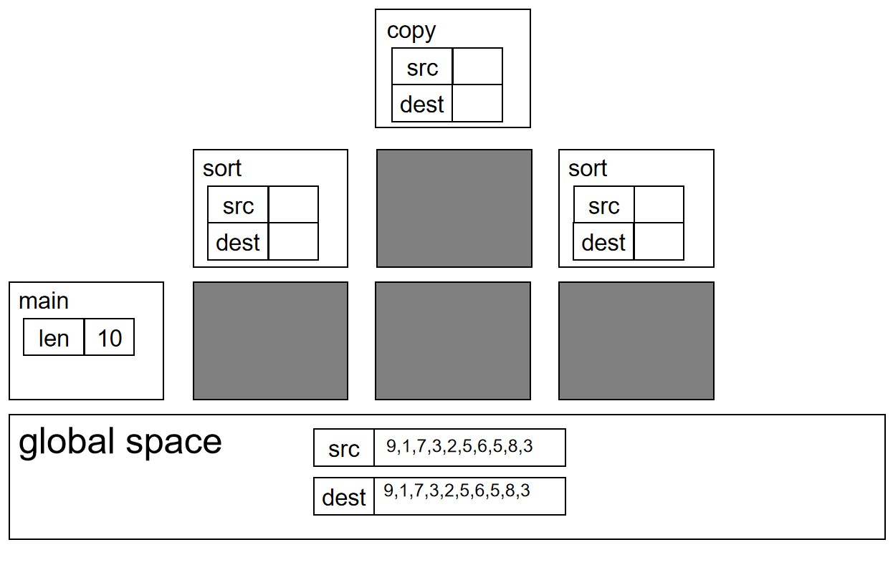

# ELF 的一些探索（一）：C 的模型和顺序语句对应的 asm 模型

## 一个简单的 C 程模型
我们首先来看一下这个 C 程序的内存模型：
```C

int src[10]={9,1,7,3,2,5,6,5,8,3};
int dest[10];

void copy(char* dest,const char* src,int len){
    for(int i=0;i<len;i++){
        dest[i]=src[i];
    }
}

void sort(char* dest,const char* src,int len){
    copy(dest,src,len);
    for(int i=0;i<len-1;i++){
        int max=dest[0];
        int index=0;
        for(int j=1;j<len;j++){
            if(dest[j]>max){
                max=dest[j];
                index=j;
            }
        }
        dest[index]=dest[len-1];
        dest[len-1]=max;
    }
}

int main(){
    int len=10;
    sort(dest,src,len);
    int max=dest[len-1];
    printf("the max value of src is src is %d\n",max);
}

```

好吧有点复杂，我们一点一点来看内存是如何布局的。一开始因为程序没有启动，所以程序空间是空的。然后程序启动了，属于是程序空间有东西了。

首先是我们有全局数组 src 和 dest，我们知道这两个数组是在全局空间的两段连续的内存。所以可以有如下的布局，全局空间和里面的两段内存：


因为 main 函数是 C 程序运行的第一个函数，所以我们首先运行 main 函数，因此我们需要为 main 函数开辟一个本地空间，用来存放 main 函数自己的本地变量，于是进入 main 函数之后的内存布局如下：


然后我们定义了一个 int 类型的变量 len，于是我们的 main 函数本地空间出现了一个大小为 int 的一个变量，然后我们给这个变量赋值。内存布局如下：


之后我们运行 sort 函数，于是我们为 sort 函数创建一个本地空间，然后将工作现场从 main 函数的本地空间转移到 sort 函数，然后开始执行 sort 函数的工作。因为 sort 函数传入了两个参数 src 和 dest 是两个指针变量，所以我们的 sort 局部空间需要为 src 和 dest 这两个局部变量开辟一块空间，指针的内容指向对应的地址。于是内存布局如下：


之后我们的 sort 函数调用了 copy 函数，于是我们为 copy 函数开辟局部空间，将工作现场转移到 copy 的局部空间，为 src 和 dest 的传入参数开辟局部空间，这一过程和上面 main 调用 sort 是一样的，得到内存布局如下：


之后我们的 copy 函数执行完毕，dest 的值被赋值为 src 的值，然后我们退出 copy 函数的局部空间，返回 sort 的局部空间，copy 的局部变量和 copy 的局部空间一起荡然无存。sort 的现场再次可见，然后我们继续执行 sort 的变量操作。得到的内存布局如下：



sort 函数执行完毕之后再次返回到 main 函数，于是 sort 的局部空间清空，返回 main 的局部空间。main 之后继续执行，遇到`int max=dest[len-1]`语句开辟新的空间给 max 的变量，然后继续执行，知道运行完毕。这期间的内存布局如下：


最后 main 函数也执行完毕，我们的 main 函数的本地空间也消亡了，然后程序结束了，我们的所有内存都消亡了，包括全局空间和里面的全局变量。所以我们可以总结一下这里涉及到的几类变量和空间的特点：

1. 全局变量：存放在全局空间，在程序启动的时候就随着全局空间一起产生，在程序结束的时候就随着全局空间一起湮灭，所以生存期是从程序开始到程序结束。作用域其实是一个编程语言的概念，毕竟变量在内存了，总有办法得到它的值的，不能说它不能被使用，这里的作用域是指在编程语言语法允许的范围内可以被使用的范围，也就是从被定义开始的那一行到程序末尾的所有函数范围，如果是定义之前的函数就会因为没有这个变量的定义，而无法使用它，故而这个范围不属于作用域。

2. 局部变量：生存期为在对应函数的局部空间、进入函数执行到定义语句的时候变量被创造，等函数退出的时候变量消失。作用域为函数被定义开始到函数结束。

现在对于 C 语言的内存模型我们有一个初步的认识了，我们为全局空间、局部空间、全局变量、局部变量建模了，但是我们一个程序除了数据部分还有必不可少的代码部分，这部分被执行的代码也是存在于内存的，所以可以想见还有一个代码空间用于存放我们的代码，于是我们有了更完善的内存模型如下：


## 对应的汇编模型

我们知道 C 是一种高级语言，他是被编译为汇编，进而编译为二进制开始执行的，那么它对应的汇编什么样子，是怎么执行的，是怎么样的一个内存模型呢？我们先停下来聊一聊计算机的硬件。

一个计算机至少是有处理器和 memory 两部分组成的，我们的 C 程序的代码空间、全局空间、局部空间什么的都布局在这个 memory 上，然后计算机的处理器首先读取代码空间的代码，然后解析代码的功能，然后根据代码的指示操纵全局空间和局部空间的数据。比如我们的处理器读到 main 的第一行代码`len=10;`，于是处理器解析这个代码，知道要给内存中的局部空间区域的`len`变量的位置写入值10。然后继续执行下一条，依次执行下去。

这个硬件模型足够我们处理简单的 C 程序了，但是我们如果我们进一步深究细节，依然有很多问题悬而未决：

1. C 程序是对变量做运算操作的，但变量是内存当中的某一块连续的存储单元，且内存本身只具有被读写的能力、并不具备参与操作的能力，那么我们是怎样对无法被计算的内存变量可以被计算的呢？变量计算有很多的中间结果如`a=b+c`中`b+c`的中间结果并没有对应的内存存储，那么他后续使用的时候被保存在了哪里？

2. memory 只是一个单纯的存储单元，我们仅仅可以认为它是一个很大的一维数组（可以认为是`char[]`），所谓的全局空间、代码空间、局部空间都是我们认为划分的区域，并不是 memory 本身存在的，那么我们要怎么后天把 memory 划分成我们需要的区域，并且让处理器可以知道和管理各个区域的位置呢？

3. 代码空间和全局空间是 memory 当中的一块内存区域（一个一维数组），分别存储了代码和内存变量，那么代码和数据是怎么在这个一维数组里面被组织和访问的呢？我们使用过指针都知道函数和变量都有自己对应的地址的，代码和数据在内存当中只有单纯的地址这一个属性信息，这些变量是怎么被自动转换为对应的地址？

4. 变量成为了内存当中的一块区域之后，他只剩下自己的起始地址和长度这些表征信息了，我们在 C 中一再强调的数据类型这个概念就荡然无存了，那么我们在之后的程序执行中是怎么知道每个变量的数据类型，然后做对应的操作的呢？

5. 局部空间和局部变量是可以随着函数调用不断产生、不断消亡的，那么局部空间是怎么做到动态生长和消亡？局部变量是怎么在局部空间当中组织的呢？

我们一个一个来回答。

### 通用寄存器

首先我们来回答第一个问题。总所周知，处理器是计算机的运算单元，内存是计算机的存储单元，现在我们要执行譬如`a=b+c`的操作，我们不妨认为`a,b,c`的地址分别为0x1000，0x1004，0x1008。所以我们的处理器解析代码发现要做`a=b+c`之后就会把 0x1004 和 0x1008 的值相加写入地址 0x1000。

但是处理器怎么把 0x1004 和 0x1008 的内存地址存储的值相加呢？0x1004 和 0x1008 的值在内存，而值的运算发生在处理器，所以我们需要先把值从内存搬运到处理器，然后处理器对数据做运算，再写回到内存。值到了处理器总是需要有地方存储值的数据的，因此在处理器内部会有一组寄存器来存储这些从内存载入的值。此外`a=b+c`的`b+c`的返回值作为一个临时的中间结果也是需要被暂时存储的，如果没地方存这个数据没掉了，那么之后就没法把这个数据写回内存 0x1000 的地址、赋值给变量 a 了。所以这些运算的临时结果也会被暂存到寄存器当中去。

我们可以看一下处理器和内存是如何配合执行`a=b+c`的操作的。

1. 首先处理器向内存发送地址为 0x1004 的请求，将从该地址开始的四个字节也就是数据 b 的值读入到处理器的通用寄存器 x1 中：

![MEM[0x1004]->x1](elf-img-1/a=b+c-1.jpg)

这里我们的内存模型是小端序的，我们把一个 0x12345678 存入到 0x1000-0x1003 的四个字节内存当中去，然后最低位的 0x78 在 0x1000 当中，0x56 在 0x1001 当中，依此类推。我们把四个字节或者说一个 int 从内存当中取入寄存器的时候，就将它们的数据整理为 0x12345678 写入寄存器 x1。这里认为内存硬件的最小操作粒度就是字节好了，如果最小操作粒度识别的那么内存模型要改一改，但是 anyway，对于 core 的视角而言 memory 的输入输出都是一样的。

2. 首先处理器向内存发送地址为 0x1008 的请求，将从该地址开始的四个字节也就是数据 c 的值读入到处理器的通用寄存器 x2 中：

![MEM[0x1008]->x2](elf-img-1/a=b+c-2.jpg)

3. 之后我们将 x1 和 x2 的值也就是 b 和 c 的值送入计算单元做加法，这里的 ALU 负责做加法，然后 ALU 计算输出的结果就是`b+c`运算的中间结果，我们将它暂存到 x3 当中（当然也不一定是 x3，存到 x2、x1也都是可以的）：


4. 最后我们将计算得到的结果 x3 的值写入内存的 0x1000，就把`b+c`的值写回了变量 a，完成了 a+b 的操作：

![x3->MEM[0X1000]](elf-img-1/a=b+c-4.jpg)

这就是内存和处理器内部的通用寄存器、ALU 如何配合，最后达到让不能被计算的内存变量可以被计算的细节过程。

### 指令
那么下一个问题，我们之前说了，CPU 解析代码空间的`a=b+c`，然后知道了 a、b、c 的地址，并且做了一系列内存访问、处理器计算的操作。那么`a=b+c`这条 C 语句是怎么以二进制的形式保存和排列在代码空间的呢？很简单，一条 C 语句会被编译为若干条指令序列，每条指令都是一串被精心编码且 CPU 可以解析的二进制，然后 CPU 读如这一系列指令，然后来判断自己要做什么操作，进而执行访存和计算。

我们仍旧以`a=b+c`为例，也许就可以得到如下的这串二进制，我们先以 RISC-V 的指令集举例：
```
    00001237
    00422083
    00822103
    002081b3
    00322023
```
每一行二进制就是一条指令对应的编码，根据枯燥的编码规则第一条是立即数载入指令，第二三条是内存访问指令，第四条是加法指令，第五条是内存载入指令，最早的编程方式就是根据指令手册手搓 01 字符串进行编程的。但是对着指令集的二进制编码手册看每一条指令的含义或者写指令是枯燥且低效的，所以前辈科学家提出了汇编语言，每一条指令用一个汇编的格式编写，由汇编器和反汇编器在二进制和汇编之间做转换，这样无论是阅读还是编程的效率都可以大大提高。

如果根据 RISCV 的指令集手册，我们将上面的二进制指令转化为对应的汇编指令，每条指令的长度就是4个字节：
```
    lui x4,0x1
    lw x1,4(x4)
    lw x2,8(x4)
    add x3,x1,x2
    sw x3,0(x4)
```
这些指令被保存在内存的代码空间当中，然后处理器就是读入这里的指令序列，比如读入第一个指令二进制`00001237`，然后他解析一下知道这是一条`lui x4,0x1`指令，意思是把 0x1000 写入 x4 寄存器，然后他就执行这样的立即数载入的操作，诸如此类。

譬如说我们的这五条指令保存在内存的0x0100-0x0114这个范围当中，于是我们在程序运行伊始可以得到一个如下的内存排布格局：


### PC 寄存器
现在我们知道程序以指令的格式躺在代码空间里，然后处理器访问指令并根据指令的指示访问、计算对应的数据。但是处理器眼前是一片单纯的内存，每一个内存单元都长的一样，他怎么知道自己从哪里开始读入内存数据作为自己要执行的指令呢？

我们的 CPU 内部有一个 PC 寄存器，它存储了需要访问的当前指令的地址，比如我们要执行`a=b+c`，然后对应的第一条汇编`lui x4,0x1`的地址是 0x0100，那么我们的 PC 的值就可以是 0x0100，那么 CPU 就会读入 0x0100 地址的 lui 指令，开始解析该指令，然后执行该指令。

### 有了 PC 寄存器和指令之后重新执行
有了 PC 和指令序列的内存布局之后，我们再次执行我们的`a=b+c`操作，我们首先从第一条指令`lui x4, 0x1`开始。

lui 的意思是 load unsigned immediate，也就是载入无符号数，指令格式为`lui reg, imm`，执行的内容是将 imm 左移12位写入寄存器 reg，也就是`reg <- imm<<12`。我们的`a=b+c`首先需要取 b 和 c 的值，因此我们需要计算得到 b 和 c 的地址，然后才可以用该地址访问 memory 得到对应的变量的值，所以我们用该指令得到 a、b、c 这个 int 数组的基地址 base 值，然后就可以用该基地址索引访问了。

于是 CPU 的执行过程如下：
1. 根据 PC 的值 0x0100，将 0x0100 的四字节内存内容读出，然后当作指令开始解析
2. 解析二进制发现这是一条`lui x4, 0x1`指令，所以产生一个 0x1000 的立即数
3. 然后将这个理立即数写入寄存器 x4

我们的 C 程序默认是顺序执行语句的，同理汇编默认也是顺序执行指令的，所以没有特别指示的情况下之后就应该执行下一条指令，那么 PC 的值就应该是下一条指令的地址，也就是 PC + 4，所以 PC 自动加四，准备在如下一条指令。流程图如下：


同理我们执行第二条语句`lw x1, 4(x4)`。lw 指令是 load word 的意思，将指定地址的一个四字节的 word 载入到对应的寄存器中，当然因为寄存器是 64 位的，所以这个 4 字节的 word 需要前面做符号扩展再载入，指令格式为`lw reg, imm(base_reg)`，将一个寄存器做 base 寄存器，然后和一个 imm 相加得到需要访问的地址，从内存中访问得到数据，然后将数据保存到 reg 寄存器中，即`reg <- MEM[base_reg + sext(imm)]`。

这里的 imm 不能是任意大小的，因为一条指令是 32 位的，我们的 imm 是存在指令当中的，指令的编码位数有限，只能拿出 12 位来给 imm 编码，所以 imm 是 0x000 - 0xFFF，因为 imm 是符号扩展的，所以实际上是 -0x800 - 0x7FF。

我们的 lui 指令只能拿出 20 位用于存放立即数，所以范围是 0x00000 - 0xFFFFF，但是因为载入立即数之前要左移 12 位，所以得到的是 0x0000000 - 0xFFFFFFFF 所有的页的页起始地址。所以我们可以用 lui 得到一个需要的基地址，然后改变 lw 指令的 imm 来访问这个页起始地址前后的连续 4KB 的内存数据，在 32 位的地址空间中可以满足所有的地址访问要求。这里我们的基地址 x4 是 0x1000，所以可以访问 0x800 - 0x17FF 之间的所有数据。

我们再回到`lw x1, 4(x4)`，现在 x4 + 4 等于 0x1004 也就是 b 的地址，然后我们就把 b 的值载入到寄存器 x1 中。之后 PC 继续加 4。流程图如下：


同理我们执行`lw x2, 8(x4)`，得到 c 的地址 0x1008，然后将 C 的值载入寄存器 x2。PC 继续加 4。流程图如下：


之后我们根据 PC 执行`add x3, x1, x2`，不同于 lui 的构造立即数，也不同于 lw 的访问内存，这是一条算数指令。add 指令的意思是做加法操作，指令格式是`add dest, src1, src2`，将 src1 寄存器的值和 src2 寄存器的值相加写入 dest 寄存器，即`dest <- src1 + src2`。

于是我们将 x1、x2 寄存器的值送入 ALU 做加法操作，然后将结果写回 x3 寄存器。PC 继续加 4。流程图如下：


最后我们根据 PC 执行`sw x3, 0(x4)`，sw 指令是 store word 的意思，指令格式为`sw reg, imm(base_reg)`，用和 load 指令一样的方式计算对应的地址，然后将寄存器的值存入到该地址中去，即`MEM[base_reg + sext(imm)] <- reg`。

于是我们计算得到地址为 0x1000 也就是 a 的地址，然后将 x3 的值也就是 b+c 的结果写入到该内存，最终实现`a=b+c`。PC 继续加 4。流程图如下：


现在我们终于描摹完了`a=b+c`这条指令在汇编的内存模型当中执行的细节。我们看到虽然`a=b+c`已经执行完了，但是 PC 还在继续加 4，CPU 会继续读入之后的指令，然后继续执行。

### 小结一下
我们再总结一下**这个汇编**的执行流程：
1. 我们的 C 程序的 C 语句会被编译为一系列的 asm 指令顺序排布在内存，我们的数据也会被排不在内存中。
2. PC 寄存器初始化为要执行的第一条指令的地址，之后 CPU 从 PC 指向的内存读入指令，并根据指令解析开始操作。
3. 一条指令执行完毕后 PC 自动加 4，然后 CPU 开始顺序执行顺序排列的汇编指令，开始之后的一些列操作。
4. 如果我们要操纵变量的值，我们可以用 lui 这样的立即数指令得到基址，然后用 lw 这些内存载入指令将变量的值载入 CPU。
5. 根据对变量值的操纵方法我们可以用 add 这样的算术指令做对应的算术计算。
6. 如果要对变量的值做修改，那么就用 sw 这样的内存存入指令将计算得到的值保存到内存当中。

所以对于`a=b+c`我们可以用如下的汇编或者说内存二进制排布来实现，前面一段是指令，后面一段是数据：
```
0x0100:
    lui x4,0x1
    lw x1,4(x4)
    lw x2,8(x4)
    add x3,x1,x2
    sw x3,0(x4)
0x1000:
    .word 0x00000000 //a
    .word 0x12341234 //b
    .word 0x34123412 //c
```
这里可以看到，其实指令和代码的位置似乎没有那么重要，那么我们不妨先将数据和代码相邻排布，当然因为数据地址变过了，所以对应的立即数也要改一改，于是得到：
```
0x0100:
    lui x4,0x0
    lw x1,0x118(x4)
    lw x2,0x11c(x4)
    add x3,x1,x2
    sw x3,0x114(x4)
0x0114:
    .word 0x???????? //a
    .word 0x???????? //b
    .word 0x???????? //c
```

### 数据和代码分离
那么现在我们的 C 语句变得复杂了，我们变成了
```C
    a=b+c;
    d=e+f;
```
那么我们可以依样画葫芦的得到汇编：
```
    a=b+c;
0x0100:
    lui x4,0x0
    lw x1,0x118(x4)
    lw x2,0x11c(x4)
    add x3,x1,x2
    sw x3,0x114(x4)
0x0114:
    .word 0x???????? //a
    .word 0x???????? //b
    .word 0x???????? //c

    d=e+f;
0x0120:
    lui x4,0x0
    lw x1,0x138(x4)
    lw x2,0x13c(x4)
    add x3,x1,x2
    sw x3,0x134(x4)
0x0134:
    .word 0x???????? //d
    .word 0x???????? //e
    .word 0x???????? //f
```
有同学说，你这个代码不科学。你看啊，我首先 PC 从0x0100开始执行，然后顺序执行完 0x110 的 sw 指令之后，我希望执行的是 0x120 的 lui 指令，但是 PC 会自动加 4 得到 0x0114，然后我就访问 a 的变量的值了，这又不是我想要的指令，这样不可以！

所以我得想个办法让 PC 在执行完 0x110 之后跳转到 0x120 才可以。于是我们可以在 0x110 的 sw 之后加一条跳转指令。如下：
```
    a=b+c;
0x0100:
    lui x4,0x0
    lw x1,0x118(x4)
    lw x2,0x11c(x4)
    add x3,x1,x2
    sw x3,0x114(x4)
    jal x0,0x10 //new instruct
0x0118:
    .word 0x???????? //a
    .word 0x???????? //b
    .word 0x???????? //c

    d=e+f;
0x0124:
    lui x4,0x0
    lw x1,0x13c(x4)
    lw x2,0x140(x4)
    add x3,x1,x2
    sw x3,0x138(x4)
0x0138:
    .word 0x???????? //d
    .word 0x???????? //e
    .word 0x???????? //f
```
可以看到我们新加入了一条`jal x0, 0x10`。jal 指令是 jump and link 的意思，指令格式为`jal reg, imm`，首先将 PC 的值和立即数 imm 左移一位再符号扩展相加，然后将 PC+4 写入 reg，即`reg <- PC+4; PC <- PC + sext(PC)<<1`。

imm 也很有讲究，imm 在指令中留了 20 位进行编码，所以符号扩展之后是 -0x80000 - 0x7FFFF。但是因为我们知道 RISCV 的指令都是 4 字节对齐的，所以 PC 跳转之后的低 2 肯定是 0 ，那么就没必要存在 inst 当中了，所以我们可以只讲 imm 的 2-21 这 20 位存入 inst 的 imm 编码。不过有一个冷知识，RISCV 有一个 C 扩展，里面的压缩指令宽度是 2 字节的，所以其实只能保证最低为是 0，所以其实 imm 存的是 1-20 这 20 位，所以仅仅左移 1 位得到立即数。因此跳转范围是 -0x100000 - 0xFFFFE，最低为是 0。不过还要注意，这个 0x10 是 `imm<<1` 的值。

那么将 PC+4 存入寄存器是为了什么呢？这个值难道之后还有用，在一些场景是有用的，但是现在用不到，所以我们将它写入 x0 寄存器。x0 寄存器很神奇，因为我们经常要用到 0 这个立即数，所以我们有一个专门的 x0 寄存器的值恒为 0，这样要 0 这个值的时候直接访问 x0 就可以了；且 x0 无论写入什么值，值永远是 0，所以我们可以将它作为一个垃圾桶，把不需要的值都写进去来抛弃，比如这里的 jal 操作有写回 PC+4 和跳转两个作用，我们现在只需要跳转这一个作用，所以我们可以将不需要的 PC+4 写入 x0 以示抛弃。

于是我们执行完 sw 指令之后执行 jal 指令跳转到 0x124 的地址，就可以开始执行 lui 指令，进行`d=e+f`的操作了。流程图如下：


所以对于几个顺序执行的 C 程序，我们可以得到如下的编程范式。可以看到我们的每条 C 语句可以转换为自己需要的指令块和数据块，然后中间加入一条跳转语句隔离指令块和数据块，跳转到下一个代码块，确保执行的指令是按照代码块的顺序执行的，防止指令执行着执行着开始将数据块当代码块执行。模式如下图：


我们可以将一条 C 语句帮做一个相对独立的任务，然后这个任务相关的指令块和数据块被紧密排布在一起，这样我们关心一个 C 语句对应的汇编时，他需要的所有指令和数据都在一起，可以减轻我们编程的负担。

但是我们可以看到，指令块因为相互之间是隔开的，所以我们需要额外的跳转指令将指令块连接起来，这个跳转本身是多余且耗时的，所以我们其实可以将数据块全部都移出去，让指令段在物理上相连，于是我们可以将上面的汇编改造成如下形式：
```
    a=b+c;
0x0100:
    lui x4,0x0
    lw x1,0x12c(x4)
    lw x2,0x130(x4)
    add x3,x1,x2
    sw x3,0x128(x4)

    d=e+f;
0x0114:
    lui x4,0x0
    lw x1,0x138(x4)
    lw x2,0x13c(x4)
    add x3,x1,x2
    sw x3,0x134(x4)
0x0128:
    .word 0x???????? //a
    .word 0x???????? //b
    .word 0x???????? //c
0x0134:
    .word 0x???????? //d
    .word 0x???????? //e
    .word 0x???????? //f
```
通过将指令块和数据块分离，我们可以删去所有的跳转指令，让指令更简洁。于是我们得到了新的布局范式如下图：


可见指令和数据分开存储而不是交替存储是重要的，C语言也是这么做的，它分为全局空间存放全局数据、代码空间存放指令序列来实现指令数据的分离。

### 指令和数据真的有区别吗？
我们在之前提出对于数据块和指令块排放的问题，如果是指令块和数据块交叉排放，可以用插入跳转指令的方式解决，那么不插真的就不行吗？我们来看下面这个有趣的例子：
```
    a=b+c;
0x0100:
    lui x4,0x0
    lw x1,0x118(x4)
    lw x2,0x11c(x4)
    add x3,x1,x2
    sw x3,0x114(x4)
0x0114:
    .word 0x???????? //a
    .word 0x00000800 //b
    .word 0x00000063 //c

    d=e+f;
0x0120:
    lui x4,0x0
    lw x1,0x138(x4)
    lw x2,0x13c(x4)
    add x3,x1,x2
    sw x3,0x134(x4)
0x0134:
    .word 0x???????? //d
    .word 0x???????? //e
    .word 0x???????? //f
```
现在 b 的值是 0x00000800，而 c 是 0x00000063，那么当我们执行到 sw 之后，`b+c`的计算结果 0x00000863 的值就会被写入 0x0114 里面，然后这个时候因为 PC 的值是 0x0114，所以 a 的值 0x00000863 就被当作指令读入了 CPU。现在很巧，0x00000863 的值就是指令`beq x0, x0, 0x10`。

beq 指令是一条分支跳转指令，指令格式为`beq reg1, reg2, imm`，比较 reg1 和 reg2 的值是否相等，如果相等就跳转到 PC+sext(imm<<1)，不然就 PC+4 继续执行，即`if(reg1 == reg2) PC <- PC+sext(imm<<1) else PC <- PC+4`。这里的立即数是 12 位有符号扩展德利技术，因为 PC 地址最低为是 0，所以存的是 imm 的 1-12 位，左移一位恢复需要的最低为0，跳转范围为 -0x1000 - 0xFFE。

所以我们的 CPU 执行了 beq 指令，然后顺利的跳到了 0x124 的 lui 指令处继续执行。所以只要我们精心的编排数据块和指令块的关系和内容，不加入 jal 指令也是可以运行的。

这里我们神奇的看到，我们心目中的数据也可以被当作指令处理，他在之前是数据，在之后就成了指令。所以对于 CPU 而言一个内存单元既可以是指令也可以是数据，当他被 PC 寄存器指向要被去指令的时候，他就被 CPU 当作指令，如果被 load-store 指令访问，他就被 CPU 当作数据。所以对于内存而言，内部的数据就是简简单单的数据，无所谓指令还是数据，全看 CPU 怎么对待这些数据，换句话说内存中的数据本身是平凡的，他没有指令和数据的区别，没有数据类型所谓 int、char、float 的区别，你怎么对待它，它就是什么数据。

### 数据类型如何体现？
上文我们提到内存中的数据本身是平凡的，你怎么对待它，它就是什么数据。我们在本文开始提到的第四个问题：内存中的数据都是单纯的各向同性的二进制数据，它是如何保留自己的数据类型信息的呢？这个问题的答案就呼之欲出了——我们用什么指令操纵这个数据，这个数据就是什么数据类型！

譬如说我有一个 unsigned char 类型的变量和一个 sigend char 类型的变量，当我写 C 程序读变量值的时候，前者对应的汇编是 lbu 指令，后者是 lb 指令。这两者都是载入一个字节，但是前者是无符号数扩展，后者是符号数扩展。我们的 C 程序在生成汇编的时候，不同的数据类型对应的访存操作和算术操作生成不同的汇编指令，之后汇编指令执行的时候，一个数据被不同的汇编指令操作就暗示了它是对应的数据类型。

我们罗列一下数据类型、操作和对应汇编指令的关系，同时罗列一下一些常见的 RISCV 指令。

#### 存储和访问

| 数据类型            | load | store |
| ------------------ |------|-------|
| unsigned char      | lbu  | sbu   |
| char               | lb   | sb    |
| unsigned short int | lhu  | shu   |
| short int          | lh   | sh    |
| unsigned int       | lwu  | swu   |
| int                | lw   | sw    |
| unsigned long int  | ld   | sd    |
| long int           | ld   | sd    |
| pointer            | ld   | sd    |

这一组 load 和 store 的作用和 lw、sw 基本一致，仅仅是载入的数据的宽度和数据的扩展有所区别。b、h、w、d 分别是载入起始地址开始的 1、2、4、8 个字节的数据，u 是载入的数据做无符号扩展，无 u 是做符号扩展。

#### 算术运算

| 算术运算  | unsigned char/short/int | signed char/short/int | unsigned long | signed long |  pointer   |
| -------  | ----------------------- | --------------------- | ------------- | ----------- | ----------- |
|    +     |       addw/addwi        |      addw/addwi       |   add/addi    |   add/addi  |  add/addi   |
|    -     |       subw/addwi        |      subw/addwi       |   sub/addi    |   sub/addi  |  sub/addi   |
|    *     |       muluw             |      mulw             |   mulu        |   mul       |             |
|    /     |       divuw             |      divw             |   divu        |   div       |             |
|    %     |       moduw             |      modw             |   modu        |   mod       |             |

add、sub、mul*、div*、mod*的格式和内容是一致的。对于带 w 后缀的是做 32 位操作，将计算结果截取低 32 位然后做扩展得到 64 位数； 对于带 u 后缀的是做无符号数操作，32 位扩展也是做无符号数扩展。

其中 add 和 sub 因为数值表示的的特殊性，有符号数的 add/sub 和 无符号数的 add/sub 的计算函数是一致的，所以只需要用同一个计算逻辑计算即可。

i 后缀表示这是一条立即数运算指令，该类型的指令格式为`opi dest, src, imm`，将 imm 的值符号扩展然后和 src 寄存器的值做 op 计算存入 dest。imm 范围是 -0x800 - 0x7FF，即`dest <- op(src,sext(imm))`。所以 addwi/addi 既可以做小范围加法也可以做小范围减法。

#### 位运算

| 位运算    | unsigned char/short/int | signed char/short/int | unsigned long | signed long |
| -------  | ----------------------- | --------------------- | ------------- | ----------- |
|    <<    |       sllw/sllwi        |      sllw/sllwi       |   sll/slli    |   sll/slli  |
|    >>    |       srlw/srlwi        |      sraw/srawi       |   srl/srli    |   sra/srai  |
|    &     |       and/andi          |                       |   and/andi    |             |
|    |     |       or/ori            |                       |   or/ori      |             |
|    ^     |       xor/xori          |                       |   xor/xori    |             |
|    ~     |       not               |                       |   not         |             |

这里的 not 是伪指令，`not dest, src`其实是`xori dest, src, -1`。此外对于有符号数做与或非位运算是无意义的，与或非运算只有对无符号数做才有合适的语义。

#### 逻辑运算

| 逻辑运算 | bool                |
|---------|---------------------|
| ||      | or/ori              |
| &&      | and/andi            |
| !       | xori x3, x3, 1      |

布尔类型是只有最低位是 1 或者 0，其他位都是 0。当然这里没有体现短路，这是另外的汇编技术来实现的了。

#### 比较运算
只有`<`，RISCV 是直接支持的，其他的比较操作都需要转换为`<`才可以做。

| 比较运算  | unsigned char/short/int/long/pointer |  signed char/short/int/long         | 转换关系  |
| <        | sltu x3, x1, x2/sltui                |  slt x3, x1, x2/slti                | a<b       |
| >=       | sltu x3, x1, x2; xori x3, x3, 1      |  slt x3, x1, x2; xori x3, x3, 1     | !(a<b)    |
| ==       | sub x3, x1, x2; sltui x3, x3, 1      |  sub x3, x1, x2; sltui x3, x3, 1    | (a-b)<1   |
| !=       | sub x3, x1, x2; sltu x3, x0, x3      |  sub x3, x1, x2; sltu x3, x0, x3    | 0<(a-b)   |
| >        | sltu x3, x2, x1                      |  slt x3, x2, x1                     | b<a       |
| <=       | sltu x3, x2, x1; xori x3, x3, 1      |  slt x3, x2, x1; xori x3, x3, 1     | !(b<a)    |

sltu 是 char/short/int/long/pointer 这些数据的算术运算，他将两个算术值比较得到一个布尔值的返回。可以看到`!(b<a)`在执行完`b<a`之后已经算术运算完毕得到一个布尔值，然后!是对布尔值做运算，所以采用的是逻辑运算那一小结的指令。

#### 类型转换
强制类型转换是 C 除了指针最神奇的东西了，我们来看一一下内置的 unsigned/signed char/short/int/long、bool、pointer 之间是怎么做数据类型转换的。struct、union、array 反正不能做数据类型转换。pointer 当作 unsigned long 处理即可，bool 当作 unsigned bool 处理即可。

现在考虑 signed/unsigned bool/char/short/int/long 内部的转换，如果是 bool->char->short->int->long 的顺序那么不需要转换，因为载入内存的时候 lb/lbu、lh/lhu、lw/lwu 已经将 char、short、int 自动符号扩展为 long 了。如果是 long->word->short->char->bool 的转换，那么方法如下：
| 数据类型转换 | signed                                 | unsigned                               |
|-------------|----------------------------------------|----------------------------------------|
| ->word      | addw x1, x1, x0                        | addw x1, x1, x0                        |
| ->short     | slliw x1, x1, 0x10; sraiw x1, x1, 0x10 | slliw x1, x1, 0x10; srliw x1, x1, 0x10 |
| ->char      | andi x1, x1, 0xff                      | andi x1, x1, 0xff                      |
| ->bool      | andi x1, x1, 0x1                       | andi x1, x1, 0x1                       |

如果是 signed type1 到 unsigned type2 的转换，将 signed type1 转换为对应的 unsigned type1，这一步不错任何操作，然后将 unsigned type1 转换为 unsigned type2，这一步操作参照上面的表格。

如果是 unsigned type1 到 signed type2 的转换，将 unsigned type1 转换为对应的 signed type1，这一步需要用`sllwi,srawi`搭配做符号扩展，然后将 unsigned type1 转换为 unsigned type2，这一步操作参照上面的表格即可。

#### 其他
`?:`算子等讲完分支语句，而`*,&,[],->,.`等操作等讲完局部空间布局。

#### 数组、结构、联合、枚举
对于这四种数据类型，汇编是如何处理数据类型信息的呢？

1. 基本类型的数组就是基本类型的连续排列，所以数组成员的操作按照对应的基本类型操作即可
2. 枚举就是 unsigned long 类型，只不过提供了更丰富的语义
3. 基本类型和数组组成的结构是基本类型和数组的排列，也就是基本类型的排列，所以对应的成员变量的操作就是基本类型的操作
4. 基本类型和数组组成的联合的不同成员变量的操作，就是将联合当作不同基本数据类型进行操作
5. 数组、结构、联合、基本类型组成的结构和联合展开还是基本类型，所以还是基本类型的操作

所以数组、结构、联合、枚举这些复杂的数据类型最后都会被转化为简单的基本类型的组合，他们的操作就是基本类型操作的简单组合，具体的我们等将杂项算子的时候在描述吧。

## 小结

我们介绍了 C 的内存排布和顺序执行的 C 语句对应的 asm 模型，在下一篇中我们将介绍更多 C 语句对应的 asm 模型。


