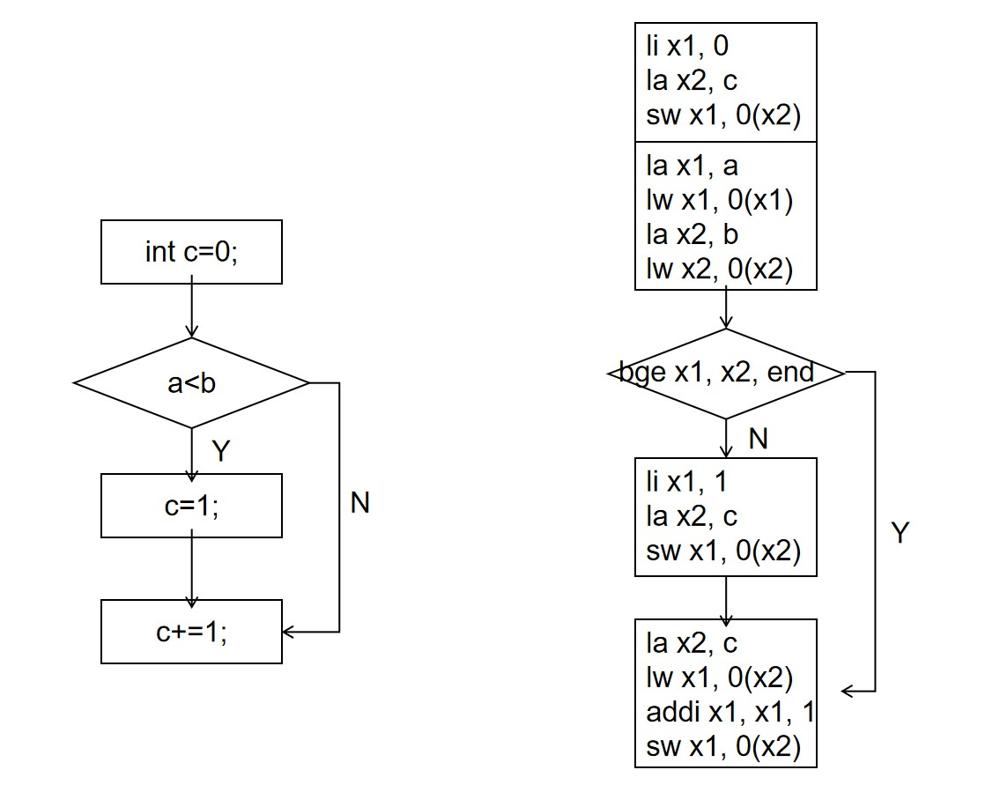

# ELF 的一些探索（二）：

## 对应的汇编模型

### 标号、地址计算和立即数生成
地址和立即数是我们编程需要频繁管理的两类数据，毕竟访存的基础是地址，数据操作的数据和地址的源头是立即数。所以如何快速构造我们需要的地址和立即数是重要的，并且如何利用汇编语言和汇编器的支持，来编写对代码管理、地址生成、立即数生成更友好的汇编是至关重要的。

#### goto 语句
首先我们来看这个 C 语句片段：
```
    a=b+c;
    goto HERE;
    some statement;
    HERE:
    d=e+f;
```
我们可以得到对应的汇编：
```
    a=b+c;
0x0100:
    lui x4,0x0
    lw x1,0x13c(x4)
    lw x2,0x140(x4)
    add x3,x1,x2
    sw x3,0x138(x4)
    jal x0,0x10
    
    add x0,x0,x0
    add x0,x0,x0
    add x0,x0,x0
    add x0,x0,x0 //the instruct skipped

HERE:
    d=e+f;
0x0124:
    lui x4,0x0
    lw x1,0x148(x4)
    lw x2,0x14c(x4)
    add x3,x1,x2
    sw x3,0x144(x4)
0x0138:
    .word 0x???????? //a
    .word 0x???????? //b
    .word 0x???????? //c
0x0144:
    .word 0x???????? //d
    .word 0x???????? //e
    .word 0x???????? //f
```

这里的 goto 的语句就是跳到代码当中的某一个标号的位置，所谓的代码**标号**其实就是一个 C 语句对应的汇编语句的地址，简单来说就是一个指令的地址，所以对应的汇编就是无条件跳转到对应的指令地址即可。

#### 标号
C 语言当中跳转的目标其实是标号，而不是跳转多少条指令的间隔，这有一个好处。我们在编程的时候无论在跳转指令和标号中间插入多少条语句，标号都是不变的，那么我们无需修改标号和 goto 语句等信息就可以实现之前的跳转功能；但是在汇编中跳转语句是跳转多少条指令，一旦跳转目标和跳转指令之间多了或者少了哪怕一条汇编，那么跳转指令就需要修改，这是很麻烦的，而且一旦算错或者没注意就会导致程序错误。所以汇编器提供了另一种跳转语句的写法：
```
        a=b+c;
0x0100:
    lui x4,0x0
    lw x1,0x13c(x4)
    lw x2,0x140(x4)
    add x3,x1,x2
    sw x3,0x138(x4)
    jal x0,HERE//from absolute instruct offset to label
    
    add x0,x0,x0
    add x0,x0,x0
    add x0,x0,x0
    add x0,x0,x0

    HERE:
        d=e+f;
HERE://from absolute address to label
    lui x4,0x0
    lw x1,0x148(x4)
    lw x2,0x14c(x4)
    add x3,x1,x2
    sw x3,0x144(x4)
0x0138:
    .word 0x???????? //a
    .word 0x???????? //b
    .word 0x???????? //c
0x0144:
    .word 0x???????? //d
    .word 0x???????? //e
    .word 0x???????? //f
```
我们将 lui 指令前面写一个 HERE 标号来指示这个 lui 指令的地址，然后我们将 jal 跳转 0x10 这种绝对的偏移改为跳转到 HERE 这个目标。之后我们的汇编器可以自己根据指令的第一个绝对标号和后面的指令序列排列计算出 HERE 的值是 0x124，然后将 jal 中的立即数也根据 HERE 的地址和 jal 的地址自动算出对应的 imm 的值。有了 label，无论我们怎么修改 jal 和 lui 的相对位置，都可以在不修改汇编语句的前提下，然后汇编器得到我们需要的二进制。

不仅仅是跳转有这个问题，内存读写也有这个问题。我们之前的汇编例子里面，因为指令和数据的格式一直在变，所以 a、b、c 三个变量存储的地址也一直在变，这会导致访存这三个地址的访存指令在计算地址的时候要一直修改对应指令，也就是修改计算 base_reg 的值和修改 load 和 store 指令的偏移。所以我们也可以用标号来解决这个问题：
```
        a=b+c;
0x0100:
    lui x4,%hi(a)
    lw x1,%lo(b)(x4)
    lw x2,%lo(c)(x4)
    add x3,x1,x2
    sw x3,%lo(a)(x4)
    lui x4,%hi(d)
    lw x1,%lo(e)(x4)
    lw x2,%lo(f)(x4)
    add x3,x1,x2
    sw x3,%lo(d)(x4)
a:
    .word 0x???????? //a
b:
    .word 0x???????? //b
c:
    .word 0x???????? //c
d:
    .word 0x???????? //d
e:
    .word 0x???????? //e
f:
    .word 0x???????? //f
```
这里的 a、b、c、d、e、f 的符号地址会在编译的时候自动计算，然后当我们指令计算访问的变量地址的时候，%hi(a) 会自动计算得到对应的 a 地址的高 20 位，然后 %lo(a) 会自动计算得到 a 地址的低 12 位，这样我们的 base_reg + offset 的访问模式就可以在不修改指令的情况下访问到对应的内存了。现在我们只剩下 0x100 这唯一的一个绝对数据了，我们不妨把 0x100 也改为符号比如 code，然后 code 的地址是多少在其他的配置中决定，这样我们修改一下 code 的配置一份代码就可以被放置在任何起始地址下被执行了，绝对地址也终于推出了我们汇编的舞台：
```
        a=b+c;
code:
    lui x4,%hi(a)
    lw x1,%lo(b)(x4)
    lw x2,%lo(c)(x4)
    add x3,x1,x2
    sw x3,%lo(a)(x4)
    lui x4,%hi(d)
    lw x1,%lo(e)(x4)
    lw x2,%lo(f)(x4)
    add x3,x1,x2
    sw x3,%lo(d)(x4)
a:
    .word 0x???????? //a
b:
    .word 0x???????? //b
c:
    .word 0x???????? //c
d:
    .word 0x???????? //d
e:
    .word 0x???????? //e
f:
    .word 0x???????? //f
```

#### la 伪指令得到变量地址
但是还是会存在问题，这是 RISCV 立即数符号扩展引入的问题。如果我的地址是比如 0x1FFF，那么 %hi 得到的是 0x1000，而 %lo 因为符号扩展得到的是 0xFFFFFFFF 也就是 -1，所以最后得到的地址是 0XFFF。这种情况需要 base_reg 的值是 %hi(label)+1。所以我们之前的汇编还是会因为 a 地址的变化而出错，那怎么办呢？

有另一种写法如下：
```
la x4, a
lw x1, (%lo(b)-%lo(a))(x4)
lw x2, (%lo(c)-%lo(a))(x4)
add x3, x1, x2
sw x3, 0(x4)
```
这里的 la 会考虑 label 低十二位符号扩展的问题，它可能得到的结果如下：
```
if %lo(label) < 0:
    lui reg, %hi(label)+1
    addi reg, reg, %lo(label)
else:
    lui reg, %hi(label)
    addi reg, reg, %lo(label)
```
总之还是汇编器帮我们根据实际情况解决技术细节。现在 32 位的地址载入我们已经解决了，那么如果是 64 位的地址怎么办？la 就会转化为 lui+addi+slli+addi+slli+addi+slli+addi 这样一个超长的指令序列来慢慢的拼接得到最后的结果，鉴于 addi 本身也是有符号数扩展的，所以这里需要考虑的前面部分 +1 的情况更加复杂，我们直接手写一个通用性很高的代码序列很困难，但是好在汇编器会帮我们解决问题。

我们可以看到，使用标号的目的就是将地址的确定和管理的任务从编程者转移到汇编器上，让汇编器来确认最后要访问的地址和生成地址的方法，减轻编程者压力的同时提高代码的可读性、可维护性、正确性：
1. 可读性：标号作为字符串可以有自己的语义信息，比需要换算才可以确定位置的立即数可以更快的确定访问的地址、暗示变量的含义。
2. 可维护性：仅符号本身与最后的绝对地址关联，其他的地址访问操作仅仅与符号关联，因此当符号的绝对地址改变的时候，其他地址访问操作的语义不会发生变化，不需要做任何修改，将程序员从地址一致性的维护中解放出来。
3. 正确性：符号转换为地址，符号关联的地址操作翻译为绝对地址关联的地址操作，这个过程是由汇编器完成的，将程序员从地址计算的压力中解放出来，且防止出现程序员地址算错的情况。

#### PC相对寻址得到变量地址
上文提到可以用 lui+slli+addi 的组合解决地址生成问题，但是如果我们不希望执行这样长的指令序列，还有如下的一个替代方法：
```
    auipc x1, %hi(a)-%hi(inst2) //+1，if sext(%lo(a)-%lo(inst2))<0
inst2:
    addi x1, x1, %lo(a)-%lo(inst2) 
    lw x2, 0(x1)
    .....
a:
    .word 0x00000000
```
auipc 指令是 add unsigned immediate pc，格式为`auipc reg, imm`，imm 是一个 20 位立即数，将 imm 左移 12 位然后和 PC 相加写入寄存器，即`reg <- PC+imm<<12`。我们这里的用 auipc 指令和 addi 指令配合计算 a 的地址，我们在确定了指令和数据的位置之后，a 的地址和 inst2 的地址也就确定了，它们之间的相对唯一也确定了。于是我们用 auipc 指令和 addi 指令配合将可以将 a-inst2 的值和 PC 的值也就是 inst2 的值相加最后得到的 a 地址。这个方法是以 PC 加上和变量之间的偏移量来进行地址计算的，所以叫 PC 相对寻址。

如果指令和需要访问的变量的偏移量小于 4G，那么我们就可以用这种方法进行内存的访问。这样无论 a 的地址需要 32 位还是 64 位都可以解决内存访问的问题；而且我们可以看到只要指令和数据的相对偏移量保持一致，无论指令和数据的起始地址是多少其实都是可以直接访问的，这个性质在之后可以起到大的用场。

#### got 得到变量地址
上面的 PC 相对寻址的方法解决了 64 位地址下、指令和变量地址差距小于 64 位下的快速寻址能力，还带来了指令序列内容与指令数据起始地址无关的优秀能力（我们直接用 lui+addi+slli 的方法得到地址就是指令序列内容和起始地址有关了）。但是如果指令和变量的地址差距大于 4G 怎么办？比如我们的指令在 0x1000 的位置，而我们要访问的地址 a 比如是 0x1234567800000000 的地址，我们要怎么快速得到这个地址？这时候可以采用 got 寻址的方法：
```
    la x1, got
    ld x1, 0(x1)
    ld x1, 0(x1)
got:
    .word a[31:0]
    .word a[63:32]
    ....
a:
    .word 0x????????

```
我们构造一个变量叫做 got，然后我们把 a 这个要访问的地址保存在 got 中，然后当我们需要访问 a 这个地址的时候，就首先访问 got 变量的到里面的值，然后用这个地址访问 a 这个变量。我们可以认为 got 就是 a 的指针，`got=&a`，然后就可以用`*got`的方式来访问 a 的值。虽然 a 变量可能和指令的偏移量非常之远，但是只要我们额外生成一个在指令周围的 got ，我们就可以先 PC 相对寻址访问 got，然后间接访问 a 即可。我们可能不止有 a 这一个变量是因为地址太远需要 got 这样的访问方法，所以我们可以将所有这些 got 放在一起组成一个间接访问的地址数组，他被称为 global offset table，简称 GOT。

GOT 的使用有若干个好处：
1. 如果访问的变量地址举例指令过远，超出 PC 相对寻址的能力，可以使用 got 快速得到变量地址，然后快速访问。
2. 如果要访问的变量的地址发生了改变，只需要汇编器修改 got 的地址为改变后的地址即可，got 和 指令的位置关系并没有改变，则无需修改指令，这样也可以实现位置无关。
3. 如果我们在编译阶段不知道需要访问的变量的地址，那么我们可以用 got 来作为访问跳板，只要在执行访问指令之前可以得到需要访问的变量的地址，然后填入 got 就可以解决这个问题。

#### li 指令载入立即数
我们花了很大篇幅讲如何获得地址，无论是直接写指令计算、根据偏移量计算、汇编通过符号计算还是查表格。现在我们还有另一个需求，如何获得需要的立即数。例如我们要执行`a=0x1234567812345678`，那么我们需要想办法构造一个这样一个 64 位的立即数才行。获得立即数是构造一个足够大的数，获得地址也是构造一个足够大的数，所以我们可以模仿前面构造地址的方法。

1. 使用 lui+slli+addi 等指令的组合人工硬编码构造需要的立即数，这是通用的，但是编程很麻烦、还容易错，执行效率也很低。不过如果立即数很简单，比如是 32 位立即数，那么 lui+addi 构造起来反而会很快。
2. 将 imm 保存在一个地址当中，然后载入这个地址的内容得到 imm，如下：
```
code:
    la x1,imm
    ld x1,0(x1)
    ...
imm:
    .word 0x12345678
    .word 0x12345678
```
这里的访问内存和前面用 got 获取地址都说明了，并不仅仅在我们的变量需要数据内存，我们的指令也需要一些数据内存来配合工作，让一些指令的功能可以足够快速的执行。如果要构造 64 位的复杂立即数，这个办法比较快速。
3. 无论是手工用指令构造立即数，还是手工用汇编构造立即数存储和访问都比较复杂，汇编提供了 li 伪指令，格式为`li reg, imm`，然后编译器会自己选择用第一种方法还是第二种方法来将立即数 imm 载入寄存器 reg。

### 分支、循环、短路、三元运算符
前面我们讲了顺序执行的 C 语句是如何转换为对应的汇编的，讲了如何将全局变量转换为汇编数据，根据变量的数据类型和运算符号采用不同的汇编得到对应的变量内存访问和运算操作。现在我们来讲述 C 语句的分支语句、循环语句是如何转换为汇编的。

#### if语句
我们来看下面这个 if 语句：
```C
    int c=0;
    if(a<b){
        c=1;
    }
    c+=1;
```
我们把它转换为对应的汇编：
```
        int c=0;
code:
    li x1, 0
    la x2, c
    sw x1, 0(x2)
        
        if(a<b){
    la x1, a
    lw x1, 0(x1)
    la x2, b
    lw x2, 0(x2)
    bge x1, x2, end

            c=1;
    li x1, 1
    la x2, c
    sw x1, 0(x2)
        }
end:
        c+=1;
    la x2, c
    lw x1, 0(x2)
    addi x1, x1, 1
    sw x1, 0(x2)
    ....
a:
    .word 0x????????
b:
    .word 0x????????
c:
    .word 0x????????
```
我们可以看到：
1. if 语句之前的顺序语句生成了一系列顺序汇编指令
2. if 语句中的 cond 部分`a<b`也声称了一系列的顺序指令，最后一一条分支跳转指令 bge 结尾，如果里面判断`a<b`的结果为真就继续运行，如果为假就跳转到 end 标号处
3. if 语句的执行部分`c=1;`转换为了一些列的顺序指令，结尾处是标号 end
4. if 语句后面的顺序语句继续生成一些列的顺序汇编指令
5. 变量（不妨认为是全局的）在另外的地方排列

我们来看一下 C 程序的执行流和 asm 的执行流，就可以看到很明显的对应关系：



唯一一处不同是，if 语句的 C 流程图是如果满足条件 cond 执行语句 stm；而 asm 流程图是不满足条件 cond，掠过语句 stm。

如果严格按照 if(cond) 的 C 语法，当 cond=1 的时候执行语句，cond=0 的时候不执行语句。所以我们应该首先对 cond 做严格的计算，如果最后的结果是数值而不是布尔类型，那么还要额外类型转换为 bool。最后对于布尔值 x1 执行`beq x1, x0, end`。例如`a==b`严格按照 C 语法应该是：
```
    la x1, a
    lw x1, 0(x1)
    la x2, b
    lw x2, 0(x2)
    sub x1, x1, x2
    sltui x1, x1, 1
    beq x1, x0, end
```

不过这样过于麻烦，有的时候会做一些优化，比如如果 cond 最后是 ==,!=,>=,<=,>,< 操作那么可以直接用 beq、bne、blt、bltu、bge、bgeu 这些指令直接计算，减少执行的指令数目。所以`a==b`不妨直接化简为，可以少跑两条指令：
```
    la x1, a
    lw x1, 0(x1)
    la x2, b
    lw x2, 0(x2)
    bne x1, x2, end
```

#### if-else 语句
我们已经知道了 if 语句如何转换为对应的汇编，那么我们来看一下 if-else 语句如何转化为对应的汇编。我们可以做以下转化：
```C
    if(cond)            
        stm1;           
    else              
        stm2;   

        ||
        ||
       \  /
        \/

    if(cond)
        stm1;
        goto END;
    stm2;
    END:
```
如果满足条件 cond 就执行 stm1，然后跳到 END，不执行后面的 stm2；如果不满足 cond 就不执行 stm1，然后顺序执行 stm2。我们现在用简单的 if 语句和 goto 语句构造了 if-else 语句，然后我们用上面所说的 goto 语句和 if 语句转化汇编的方法构造汇编即可。

我们以下面这个 C 程序片段为例：
```C
    if(a<=b){
        ++c;
    }else{
        --c;
    }
```
转化为汇编：
```
        if(a<=b){
code:
    la x1, a
    lw x1, 0(x1)
    la x2, b
    lw x2, 0(x2)
    blt x2, x1, else

            ++c;
    la x1, c
    lw x2, 0(x1)
    addi x2, x2, 1
    sw x2, 0(x1)
    j end

        }else{
else:

            --c;
    la x1, c
    lw x2, 0(x1)
    addi x2, x2, -1
    sw x2, 0(x1)
    j end

        }
end:
    ....
a:
    .word 0x????????
b:
    .word 0x????????
c:
    .word 0x????????
```
`j label`是无条件跳转到 label 地址的伪指令，未有任何副作用，一般用`jal x0,label`或者`beq x0,x0,label`来实现。

#### ||、&& 运算的短路
对于`cond1||cond2`这个表达式，如果 cond1 的值是 1，那么就返回 1，cond2 的值就不需要计算了。所以我们可以有如下的转化：
```C
    cond1||cond2

        ||
        ||
       \  /
        \/

    register tmp=0;
    if(cond1) 
        tmp=1;
    else if(cond2) 
        tmp=1;
```
对于`cond1&&cond2`这个表达式，如果 cond1 的值是 0，那么就返回 0，cond2 的值就不需要计算了。所以我们可以有如下的转化：
```C
    cond1&&cond2

        ||
        ||
       \  /
        \/

    register tmp=1;
    if(!cond1) 
        tmp=0;
    else if(!cond2) 
        tmp=0;
```
于是我们可以用 if-else 语句的方式构造 || 和 && 算子对应的汇编来支持短路。

#### ?: 三元运算符
对于`cond?exp1:exp2`的表达式，如果 cond==1，返回表达式 exp1 的值，不然返回表达式 exp2 的值，于是有如下的转换：
```C
    cond?exp1:exp2

        ||
        ||
       \  /
        \/

    register tmp;
    if(cond)
        tmp=exp1;
    else 
        tmp=exp2;
```
所以三元运算符可以转换为 if-else 语句，然后对应构造汇编即可。

#### 循环语句
我们直接转换吧，从 do-while 语句开始：
```
    do
        stm;
    while(cond);

        ||
        ||
       \  /
        \/

    LOOP:
    stm;
    COND:
    if(cond)goto LOOP;
    END:
```
于是我们用 if 语句和 goto 语句的汇编转换就可以得到 do-while 语句的汇编转换。

然后是 while 语句：
```
    while(cond)
        stm;

        ||
        ||
       \  /
        \/

    goto COND;
    LOOP:
    stm;
    COND:
    if(cond)goto LOOP;
    END:
```
可以看到 do-while 和 while 的区别只有一个 goto COND 而已。

然后是 for 语句：
```
    for(exp1;cond;exp3)
        stm;

        ||
        ||
       \  /
        \/

    exp1;
    while(cond){
        stm;
        exp3;
    }

        ||
        ||
       \  /
        \/

    exp1;
    goto COND;
    LOOP:
    stm;
    exp3;
    COND:
    if(cond)goto LOOP;
    END:
```
所以也可以搭建出来。

最后是 break 和 continue。在上面的转换可以看到所有的循环语句块都可以变为一个 LOOP-COND 的执行块和 COND-END的条件判断块，于是 break 就是`goto END`，continue 就是`goto COND`。

### swicth-case 语句
switch-case 很高级，它不仅仅是怎么讲 C 语言转化为汇编指令，它还涉及简单的数据结构。我们先给出一个简单的 switch-case 语句：
```C
    switch(val){
        case 0:val=0;break;
        case 1:val=1;break;
        case 2:val=2;break;
        case 3:val=3;break;
        default:val=5;break;
    }
```
然后哦我们来看对应的汇编：
```
    la x1, val
    lw x1, 0(x1)
    li x2, 3
    blt x2, x1, default
    //if(val>4)goto default

    slli x1, x1, 3
    la x2, got
    add x2, x2, x1
    ld x2, 0(x2)
    //x2=got[val]
L1:
    auipc x1, 0
    add x2, x2, x1
    jalr x0, 0(x2)
    //goto got[val]+L1
L2:
    la x1, val
    li x2, 0
    sw x2, 0(x1)
    j end
L3:
    la x1, val
    li x2, 1
    sw x2, 0(x1)
    j end
L4:
    la x1, val
    li x2, 2
    sw x2, 0(x1)
    j end
L5:
    la x1, val
    li x2, 3
    sw x2, 0(x1)
    j end
default:
    la x1, val
    li x2, 5
    sw x2, 0(x1)
end:
    ...
val:
    .word 0x????????
got:
    .word L2-L1
    .word L3-L1
    .word L4-L1
    .word L5-L1
```
我们依次来看每一段，第一段得到 val 的值，然后比较是不是比最大 case 的值 3 大，如果是的话那么都是去 default 分支，所以跳入 default，可以简单写为`if(val>4)goto default`
```
    la x1, val
    lw x1, 0(x1)
    li x2, 3
    blt x2, x1, default
    //if(val>4)goto default
```
然后我们访问 got 数组，这是一个 label offset的数组，用 val 的值做索引得到偏移量`got[val]`，如果 val 的值是2，那么就可以得到值 L4-L1，L4 就是键值为 2 的时候要跳入的分支的起始地址。
```
    slli x1, x1, 3
    la x2, got
    add x2, x2, x1
    ld x2, 0(x2)
    //x2=got[val]
```
最后我们用 auipc 得到 L1 时候的 PC 值也就是 L1 的值，然后将 L1 和 L4-L1 相加得到值 L4，然后用 jalr 指令跳到 L4
的地址处，也就进入了 switch-case 语句对应的分支。
```
L1:
    auipc x1, 0
    add x2, x2, x1
    jalr x0, 0(x2)
    //goto got[val]+L1
```
这里用` auipc x1,0`可以到的当前指令的 PC 值。jalr 指令是 jump register and link，格式是`jalr reg1, imm(base_reg)`，将 PC+4 的值保存到 reg1 寄存器中，跳转到 base_reg+sext(imm) 的地址，即`reg1<-PC+4; PC<-base_reg+sext(imm)`，imm 是 12 位符号数扩展。

这里涉及的巧妙之处就是采用了跳转表的数据结构，将跳转位置到各个分支的偏移保存在了键值对应得表项当中，这样即使我们有 N 个表项，也可以在 O(1) 的时间复杂度内找到对应的跳转目标。之所以保存偏移量而不是绝对地址也是有考究的，如果是偏移量，不管 L1 的地址是多少，只要指令序列不变都可以跳到对应的分支当中，表格的内容可以和指令的绝对位置无关；另外编译的时候在没有确定 L1 的绝对地址之前就可以计算出 L4-L1 这些偏移量，可以早早的结束 got 表格的计算。

当然这是最简单的情况，还有更复杂的：
1. 如果键值序列当中存在空缺，这个表项填入 default-L1
2. 如果键值起始值不是 0，那么将 key-begin_key 作为键值
3. 如果键值过于稀疏退化为 if-else 的汇编模式，开了优化就是二叉树的汇编模式
4. 如果键值有的地方稀疏、有的地方密集，那么会分别用 if-else 和跳转表来实现
5. if-else 和跳转表的适用范围可以用一些 O(N3) 的算法来判断得到

这些内容可以参看本人的《汇编与接口》课程报告。

## 小结

到目前为止，我们描述完了整数指令集的所有指令，几乎描述完了除了访存操作和函数调用之外，所有 C 语句是如何在指令集上转换为汇编的。下一节我们将要正式描述汇编如何转化为二进制，和相关的链接、载入、存储的内容。