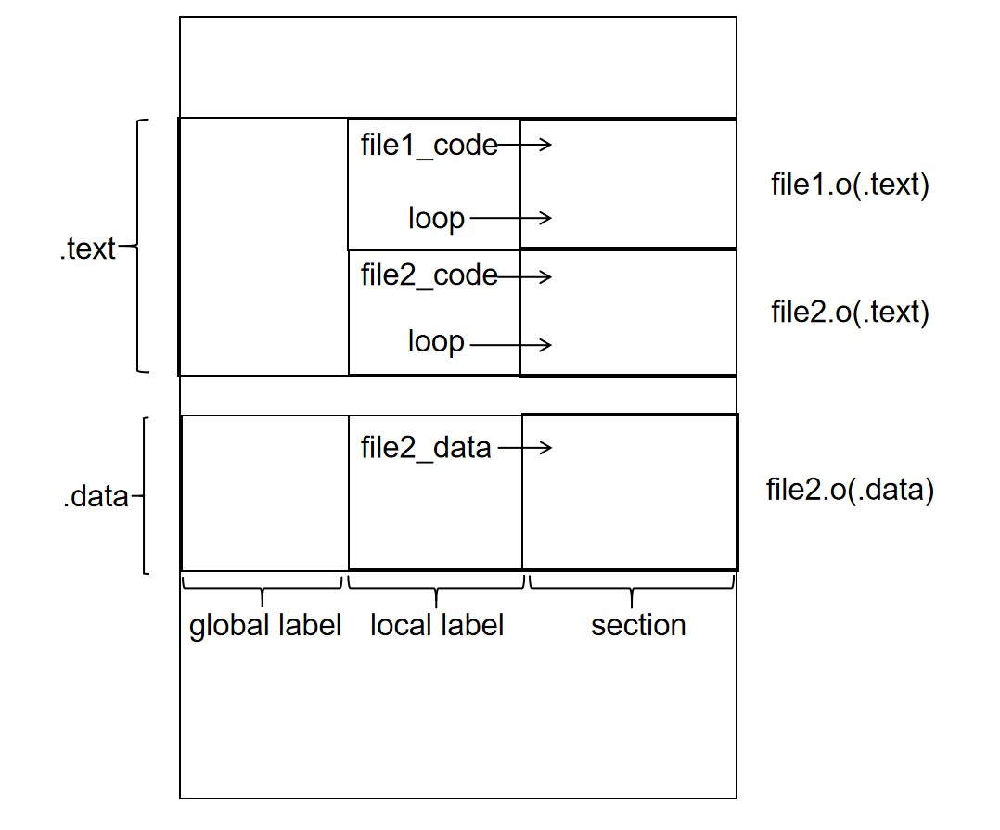
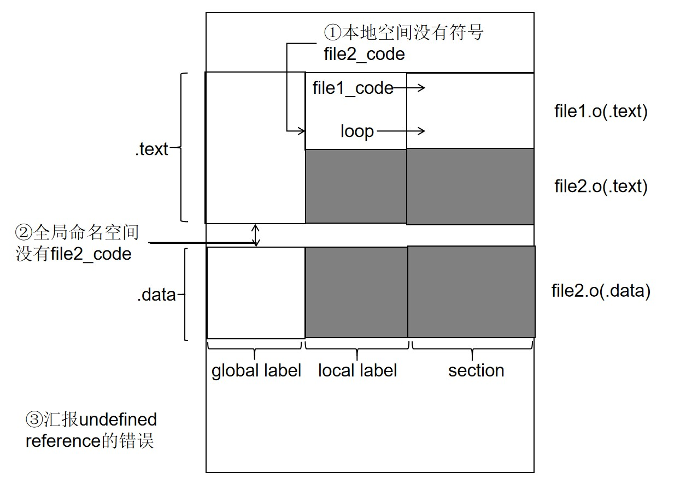
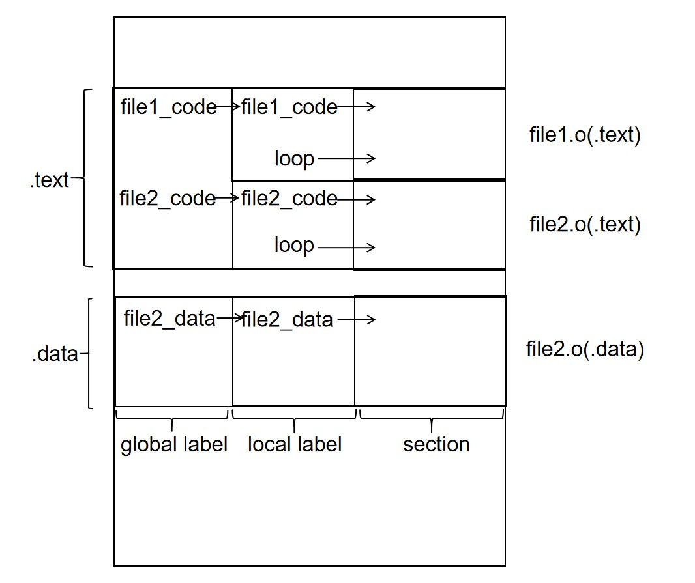
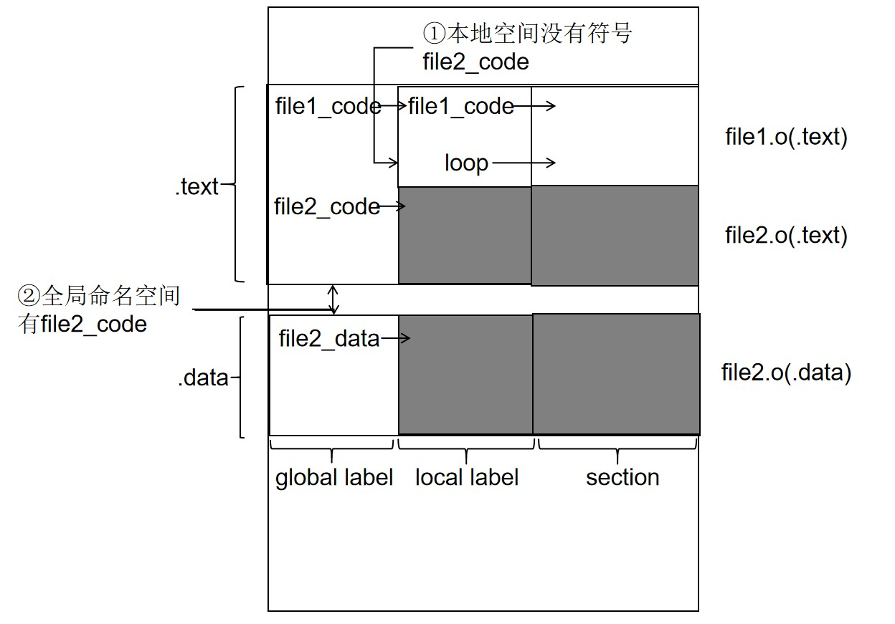
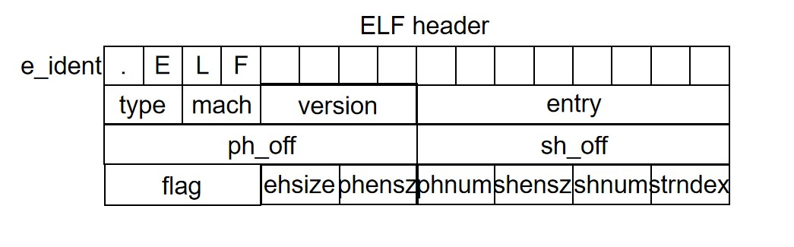
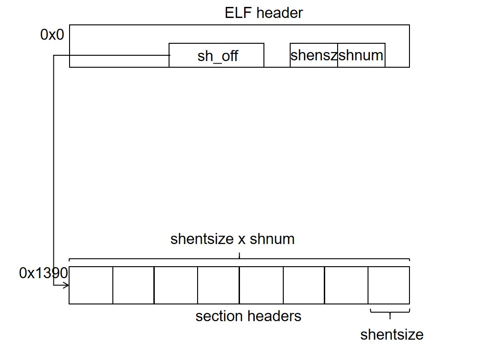
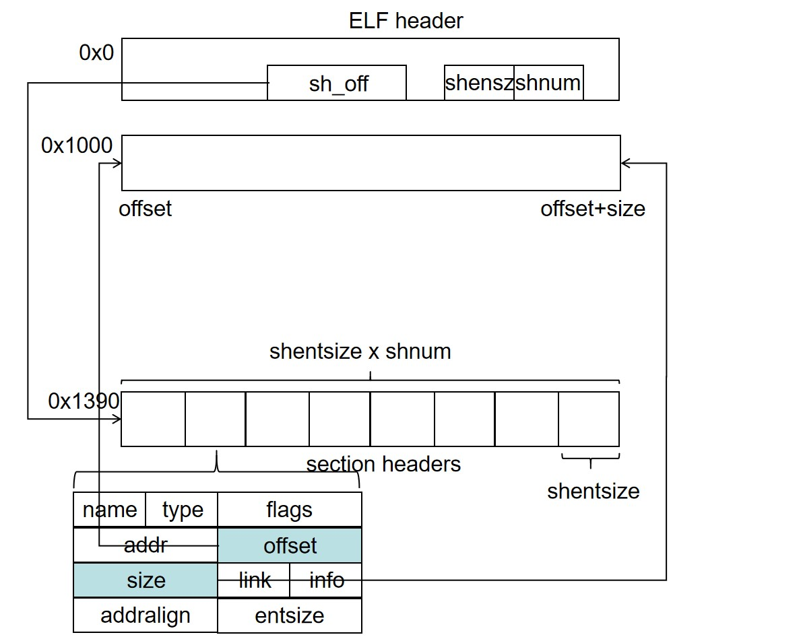
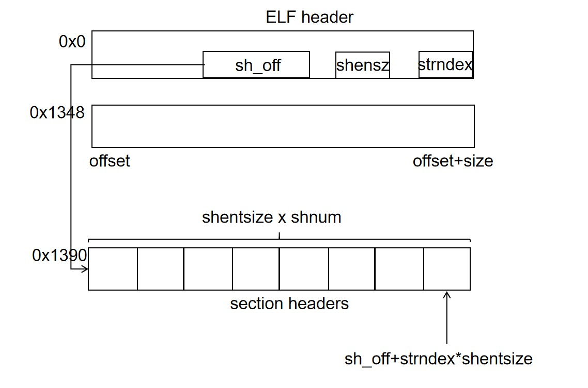
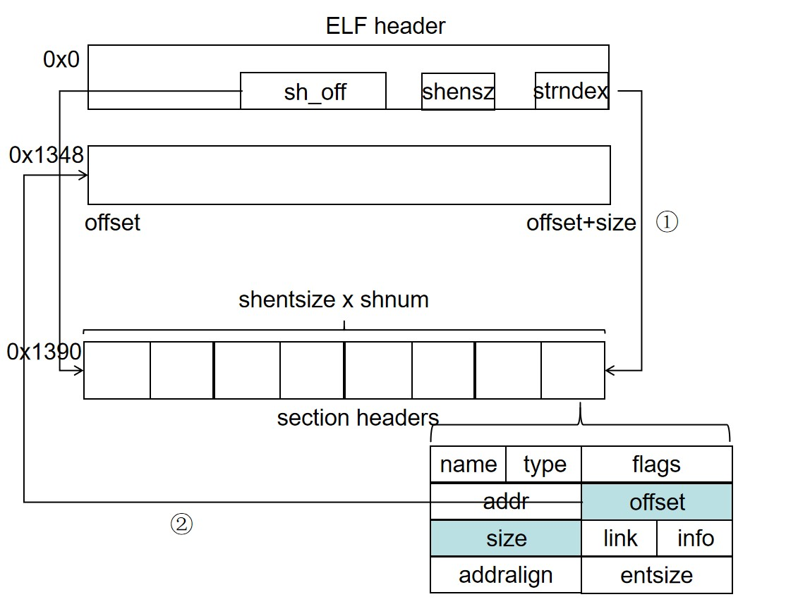
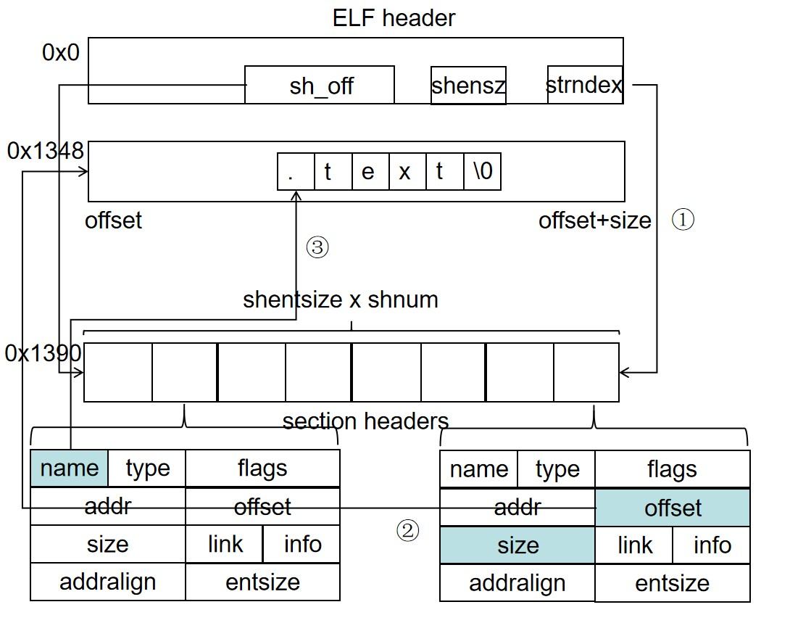

# ELF 的一些探索（四）：多文件链接和 ELF 存储格式

## 多文件链接

如果只是单纯的将多个文件编译为 obj，然后链接在一起，上一篇文章已经讲过了。但是如果多个文件的 obj 之间没有调用关系，这无疑是没有意义的，最终我们的程序在入口 label 所在的 obj 的代码范围当中执行，而不会触碰其他的 obj 的内容。所以我们要聊的就是多文件汇编怎么相互调用对方的内容。

调用其他的 obj 的内容无非两种：
1. 调用对方的数据，也就是访问对方变量
2. 调用对方的指令，也就是执行跳转，进入对方的代码段进行执行

访问变量和跳转在本文件内部依赖于自己数据和指令的 label，如果在其他文件当中，其实只需要直接使用其他文件数据和指令的 label 就可以了。

### 给个例子
比如下面这个例子，file1 想要跳到 file2 的代码 file2_code 和访问 file2 的数据 file2_data，只要直接操作 file2 的 label 即可；file2 跳到 file1 的 file1_code 也只需要直接操作 file1 的 label 即可：
```
# file1.S

.section .text
main:
    add x1,x0,x0
    addi x1,x1,0x100
    j file2_code
file1_code:
    la x1,file2_data
    lw x2,0(x1)
loop:
    j loop
```
```
# file2.S

.section .text
file2_code:
    la x2,file2_data
    sw x1,0(x2)
    j file1_code

.secion .data:
file2_data:
    .space 0x4
```

现在我们可以分别编译这两个 .S 文件得到对应的 .o，比如运行
```
    riscv64-linux-gnu-as file1.S -o file1.o
    riscv64-linux-gnu-as file2.S -o file2.o
```

### 汇编和 .extern 外部引入声明
照理说这个时候是需要报错的，因为汇编器在编译 file1.S 的时候使用到了标号 file2_code 和 file2_data，但是没有这两个标号没有被定义，会报错。所以我们需要事先声明这两个标号。对于 file2.S 也是同理，所以需要做如下修改：
```
# file1.S

    .extern file2_data
    .extern file2_code

    ...

    ------------------

    # file2.S

    .extern file1_code

    ...

```
这里的`.extern label`的伪指令说明我们的这个 label 是外部文件引入的 label，而不是本文件自身定义的，在链接的时候如果需要这个 label 的地址信息，需要去外部文件哪里找。不过实际上并不会报错，估计汇编器足够智能，如果本地没有这个 label，那么默认就是在外部文件的，之后链接的时候就去外部文件找即可。不过虽然不写`.extern`不会报错，但是还是需要做一个修饰，进而提醒自己这个 label 没定义是出于外部引用，还是单纯自己忘记定义了。

### 链接和 .global 全局可见声明
然后我们执行链接，用最简单的链接脚本即可，所有 .o 的 .text 组成最终的 .text，所有的 .data 组成最终的 .data。这里每个文件的段命名是最简单的，段排列也是最简单的。
```
    OUTPUT_ARCH( "riscv" )
    ENTRY(main)

    SECTIONS
    {
    . = 0x10000;
    .text : { *(.text)}
    . = ALIGN(0x10);
    .data : { *(.data) }
    }
```

然后我们执行链接：
```
    riscv64-linux-gnu-ld -T link.ld 2.o 3.o -o a.out
```
不巧，这个时候会遇到报错：
```
    riscv64-linux-gnu-ld: 2.o: in function `main':
    (.text+0x8): undefined reference to `file2_code'
    riscv64-linux-gnu-ld: 2.o: in function `file1_code':
    (.text+0xc): undefined reference to `file2_data'
    riscv64-linux-gnu-ld: 3.o: in function `file2_code':
    (.text+0x8): undefined reference to `file1_code'
```
file1.o 找不到需要链接的 file2_code 和 file2_data；file2.o 找不到需要链接的 file1_code。这是为什么呢？这些符号不就在对方文件的符号表里面的吗？为什么会找不到呢？

上篇文章细心阅读的小伙伴们应该已经在**ENTRY 程序入口**得到答案了，不过我们还是在展开了说说。一个文件的符号默认是本地符号，即只有本文件内部可以看到，其他文件是看不到的；同理对于一个文件而言其他文件的 label 一般也是看不到的，他们只存在于本地文件的本地符号命名空间。此外还有一种全局命名空间，如果 label 在全局命名空间，则 label 所有文件可见。我们现在的程序在链接之后的符号命名空间分布如下图，只有本地 label，没有全局 label：



所以我们的 file1.o 在链接的时候需要去寻找 file2_code 符号的地址，它会先在本地命名空间寻找有没有对应的符号信息，因为没有，所以就会去全局命名空间寻找，但是 file2 虽然定义了 file2_code 的符号，因为是外部文件不可见的，所以 file1.o 还是找不到，最后报错说`undefined reference to 'file2_code'`。



所以我们需要让 file2 的 file2_code 和 file2_data 这两个 label 进入全局命名空间。 我们只需要用`.global`在程序开头修饰需要成为全局标号的标号即可。我们将被外部文件依赖的三个 label 都用`.global`修饰：
```
    # file1.S
    .global file1_code
    ...

    ------------------

    #file2.S
    .global file2_code
    .global file2_data
    ...

```
得到的 label 分布如下：


然后我们再进行链接，这次 file1.o 在本地命名空间找到 file2_code 和 file2_data 失败之后，就可以在全局命名空间找到这两个 label，然后根据 label 地址修补对应的指令立即数，成功完成符号链接。


### 跨文件调用方法
所以我们做一个小结，如果 file1 需要调用定义在 file2 中的符号，则 file1 用`.extern`声明该符号为外部引用，file2 用`.global`声明该符号为全局可见即可。我们可以想象，如果两个 C 程序一方调用了另一方的 extern 变量，那么定义变量的一方他这个变量的符号就是会被`.global`修饰的；一个 C 文件的函数一定可以被其他 C 程序调用，除非设置为 static 函数，所以一般的 C 函数的入口 label 是被`.global`修饰的，但是 static 的函数则不会被修饰。

那为什么我们需要设置符号是全局可见还是本地可见的呢？全部搞成全局可见不就好了？
1. 如果所有文件的符号都是全局可见的，那么很容易导致全局空间符号出现同名符号，进而导致符号冲突。毕竟像`begin`、`loop`、`again`、`here`这种符号比比皆是，更不要说一些机器自动生成的符号了。
2. 不过我做符号链接的时候可以先查本地符号，在查外部符号，只要我需要外部链接的那些特殊符号不冲突就可以了，毕竟`loop`这种也不像是会被外部链接的。但是如果所有符号外部可见，那么我们的 obj 需要保存所有符号一共链接器使用，会有额外的存储开销；在链接的时候需要在所有的符号中查找需要的符号，会有查找的开销；再加上被设计用于外部链接的符号远远少于仅本地使用的符号，所以这种开销不值得。
3. 可以确保本文件提供给其他文件用户的调用接口是有限的，可控的。这样既可以防止善意用户错误使用符号导致的链接 bug，也可以防止恶意用户恶意调用某些符号进行攻击。一旦两个模块交互，模块内部和模块之间都需要管理，模块之间的接口越大，工程管理和安全管理的压力越大，如果仅仅提供一个足够狭小的接口，管理成本就可以足够小。如果编程的时候，开放一个接口是费力的，就可以防止这些接口被滥用，从而确保交互足够规范和安全。同理，C 程序的外部可调用函数和变量也应该越少越好。

### 链接前后
我们来看一下跨文件的符号链接和文件内部跨段的符号链接有什么区别，我们 objdump 其中一个 .o 进行观察：
```
    Disassembly of section .text:

    0000000000000000 <main>:
    0:	000000b3          	add	ra,zero,zero
    4:	10008093          	addi	ra,ra,256
    8:	ff9ff06f          	j	0 <main>

    000000000000000c <file1_code>:
    c:	00000097          	auipc	ra,0x0
    10:	00008093          	mv	ra,ra
    14:	0000a103          	lw	sp,0(ra) # c <file1_code>

```
可以看到 file2_code 和 file2_data 被调用访问的地方立即数就是单纯的 0，所以和文件内部链接待定的现象是一致的，没有特殊的结构出现。一定要说不一样，那么就是文件段间符号链接待定，立即数用的是目标段符号的段内偏移，而这里是简答粗暴的 0。

## 程序存储--ELF 文件

现在我们已经可以通过 .S 文件和 .ld 链接脚本的内容用链接器得到程序完整的状态布局：内存布局+寄存器布局（PC，其他寄存器都是无关项），那么下一步就是如何将这个状态布局保存到硬盘当中。我们在编程的时候知道程序是分段的，所以我们只要把这些段的内容保存起来，然后保存一个额外的数据结构指示这些段的内存起始地址，以及 PC 的初始值，我们就把我们需要的所有状态保存起来了。Linux 主流的可执行文件也是这么做的，使用 ELF 文件格式来存储程序段、记录段信息、存储 PC 的初始值等等，当然还有其他很多用于辅助的信息。

ELF 的全称是 executable and linkable file，可执行可链接文件。当然我们的行文到现在这个阶段得到的文件已经完成了所有的链接，不需要额外链接了，是单纯的可执行文件而已，我们后续将动态连接的时候才会再次遇到有链接需求的文件。

ELF 是一个文件，内部数据的存储却也是一个数据结构。我们知道内存的模型是一个一维数组，但内部的数据可以按照一些排布方式组织成为数据结构。文件在编程的时候也可以看作一个一维数组的简单模型，文件偏移就是这个数组的偏移量，内部的数据按照一定方式排布得到存储的数据结构。所以数据结构在内存中排布还是在文件中排布逻辑上被是一致，都是在一维数组中的排布。

### ELF header
ELF 文件偏移量 0 开始存储的是一个如下的数据结构，叫做 ELF header，存储了 ELF 文件的一些管理信息，我们首先解析这个 ELF 头的信息，然后根据这个 ELF 头的信息来得到其他的数据信息。
```
    #define EI_NIDENT (16)

    typedef struct {
        unsigned char e_ident[EI_NIDENT];
        Elf64_Half    e_type;
        Elf64_Half    e_machine;
        Elf64_Word    e_version;
        Elf64_Addr    e_entry;
        Elf64_Off     e_phoff;
        Elf64_Off     e_shoff;
        Elf64_Word    e_flags;
        Elf64_Half    e_ehsize;
        Elf64_Half    e_phentsize;
        Elf64_Half    e_phnum;
        Elf64_Half    e_shentsize;
        Elf64_Half    e_shnum;
        Elf64_Half    e_shstrndx;
    } Elf64_Ehdr;
```
ELF header 在文件当中的数据结构排布如下，我们可以看到这里面每个 member 的顺序是精心排布的，确保每个 member 都是对应字节对齐的，确保 member 之间没有空隙，这样便于存储的高效性和访存的高效性、正确性：


我们没有必要到处 ELF 的二进制编码，然后对照着 ELF 手册，一个字节一个字节的去解析内部存储的数据的内容，我们可以用 readelf 工具直接帮我们做二进制到语义信息的转换，执行指令`readelf -h a.out`就可以得到最后的 ELF 文件头的信息，我们之后以 elf-3 中的程序为例：
```
ELF Header:
  Magic:   7f 45 4c 46 02 01 01 00 00 00 00 00 00 00 00 00 
  Class:                             ELF64
  Data:                              2's complement, little endian
  Version:                           1 (current)
  OS/ABI:                            UNIX - System V
  ABI Version:                       0
  Type:                              EXEC (Executable file)
  Machine:                           RISC-V
  Version:                           0x1
  Entry point address:               0x10000
  Start of program headers:          64 (bytes into file)
  Start of section headers:          5008 (bytes into file)
  Flags:                             0x4, double-float ABI
  Size of this header:               64 (bytes)
  Size of program headers:           56 (bytes)
  Number of program headers:         2
  Size of section headers:           64 (bytes)
  Number of section headers:         8
  Section header string table index: 7
```

* e_ident 数组是文件的表示信息，大小是 16 字节。起始的四个字节存储的是 elf 文件的魔数，内容是 .ELF，也就是二进制 0x7f 0x45 0x4c 0x46。在 Linux 当中判断一个文件的类型根据的往往不是文件的后缀名，而是文件的魔数，如果魔数是 .ELF，那么就是 elf 文件。之后几位分别表述文件类型、大小端序、文件版本等信息，目前只用了前 7 位，余下都是 0。具体内容请参考 ELF 手册。我们的 a.out 的 e_ident 得到的文件信息如下，他是 64 位的 ELF 文件，小端序，版本 1：
```
ELF Header:
  Magic:   7f 45 4c 46 02 01 01 00 00 00 00 00 00 00 00 00 
  Class:                             ELF64
  Data:                              2's complement, little endian
  Version:                           1 (current)
```

* e_type 表示文件的类型。e_ident 的文件类型是针对文件存储格式而言的，e_type 是针对 ELF 存储的文件本身的性质而言的。可以看到当前文件是可执行文件，其他文件类型还有可重定位文件、共享目标文件、可转储文件等等，我们后续会介绍其中几类的。
```
    Type:                              EXEC (Executable file)
```

* e_machine 表示程序的硬件架构，我们这里是 RISCV 架构，其他还有比如 x86、MIPS、ARM 等等。程序运行的时候会检查当前程序的架构是不是本机器的架构，如果不是就会拒绝执行，比如我们 RISCV 的程序在 x86 的机器执行会直接报错说`bash: ./a.out: cannot execute binary file: Exec format error`：
```
    Machine:                           RISC-V
```

* e_version 表示 ELF 的版本，默认就是 1。
```
    Version:                           0x1
```

* e_entry 表示 ELF 程序的执行入口，也就是我们之前提到的 PC 的初始值。这里可以看到 e_entry 的值就是我们之前设置的 main 的值，也就是 0x10000。
```
    Entry point address:               0x10000
```

* e_flag 处理器的标志，标识处理器的类型，比如 ARM 处理器，x86 处理器等。我也不太清楚具体怎那些应用。
```
    Flags:                             0x4, double-float ABI
```

* e_ehsize 表示 elf header size，也就是 ELF header 数据结构的大小，如果想要略过 header 数据结构直接访问后续的内容，可以利用这个数据结构。有同学可能会疑惑，elf header 的大小不是`sizeof(Elf64_Ehdr)`，为什么要专门存储在文件当中？也许是为了将来的扩展性而言，也许有一天 elf 格式扩展了，elf_header 变大了，这种方式仍然可以 handler 新的数据格式。

### section headers

我们现在介绍了 ELF header 当中的一些关于平台、版本、处理器等信息的字段，现在我们谈谈最重要的**段**存储的部分，我们集中介绍 ELF header 当中和段的存储有关的字段。
```
    ...
    Elf64_Off     e_shoff;
    ...
    Elf64_Half    e_shentsize;
    Elf64_Half    e_shnum;
    Elf64_Half    e_shstrndx;
```

* e_shoff：段信息数组所在文件偏移的值。我们可能说存放了 8 个段，他们被存放在文件的某些地方，有各种特殊的属性，还有其他需要的信息，每个段的信息被存放在一个数据结构 section header 当中，然后 8 个段的数据结构被组织为一个段信息的数组 section headers，我们可以查询这个数组知道每个段的位置、长度、其他信息。在这里 e_shoff 的值是 5008，说明文件偏移 5008 个字节开始的是 section headers 数组。
```
    Start of section headers:          5008 
```

* e_shnum：有了数组的起始地址还不够，我们还需要数组的长度或者说项数，不然遍历的时候不知道什么时候停止，这个项数同时也是 section 的个数。因此有额外的 e_shnum 来指示 section header 的 number。这里可以看到 section header 的数量是 8。
```
    Number of section headers:         8
```

* e_shentsize：有时候我们可能需要知道每个 entry 的大小，因为现在的 entry 的数据结构可能比较简单，但是将来也许会变得复杂，entry 会变大。所以最好的方式是用 e_shentsize 存储 entry 的大小，然后每次按照 e_shentsize 作为偏移的到下一个 entry 的起始地址，然后如果我们是早年版本的 elf 处理程序就只取早期 entry 结构需要的数据字段做解析，支持仅早期功能的程序即可；对于扩展后的 elf 处理程序则可以使用完整的数据字段支持高级程序，这样有更好的扩展性。我们参看如下例子：
```
    struct Elf64_Shdr;
    struct Elf64_Shdr_ext {
        struct Elf64_Shdr;
        other data;
    };

    struct Elf64_Shdr_ext[8];
```
支持不同版本的 elf 处理程序可以用一样的代码得到自己需要的数据，不过这里要求扩展的字段必须是在原来的字段之后的，父类、子类、继承和这里的处理有异曲同工之处：
```
    //未扩展版本
    for(int i=0;i<elf_hdr.e_shnum;i++){
        Elf64_Shdr* shdr_entry = (Elf64_Shdr*)((unsigned char*)shdr+i*elf_hdr.e_shetsize);
        //后续处理
        .....
    }

    //扩展版本
    for(int i=0;i<elf_hdr.e_shnum;i++){
        Elf64_Shdr_ext* shdr_entry = (Elf64_Shdr_ext*)((unsigned char*)shdr+i*elf_hdr.e_shetsize);
        //后续处理
        .....
    }
```
该 elf 的 section header 的 entry 大小是 64 个字节：
```
    Size of section headers:           64 
```

文件之中 ELF_header 字段的内容和 section header 的关系、排布如下：


### section header

section headers 数组中的每个 section header 对应了一个 section 的信息，各个字段描述了 section 的类型、起始位置、长度等等信息，它的数据结构如下，然后我们就可以解析每个 section 的信息：
```
    typedef struct {
        Elf64_Word    sh_name;
        Elf64_Word    sh_type;
        Elf64_Xword   sh_flags;
        Elf64_Addr    sh_addr;
        Elf64_Off     sh_offset;
        Elf64_Xword   sh_size;
        Elf64_Word    sh_link;
        Elf64_Word    sh_info;
        Elf64_Xword   sh_addralign;
        Elf64_Xword   sh_entsize;
    } Elf64_Shdr;
```

如果我们想要查看 section headers 中每一个 section header 的信息，或者说每一个 section 的信息，那么我们可以执行`readelf -S elf文件`来得到需要的结果。我们 dump 之前编译的 elf 文件的 section headers 得到如下结果：
```
    There are 8 section headers, starting at offset 0x1390:

    Section Headers:
    [Nr] Name              Type             Address           Offset
        Size              EntSize          Flags  Link  Info  Align
    [ 0]                   NULL             0000000000000000  00000000
        0000000000000000  0000000000000000           0     0     0
    [ 1] .text             PROGBITS         0000000000010000  00001000
        00000000000000d0  0000000000000000  AX       0     0     4
    [ 2] .data             PROGBITS         00000000000100d0  000010d0
        0000000000000034  0000000000000000  WA       0     0     1
    [ 3] .rodata           PROGBITS         0000000000010104  00001104
        0000000000000008  0000000000000000   A       0     0     1
    [ 4] .riscv.attributes RISCV_ATTRIBUTE  0000000000000000  0000110c
        000000000000002e  0000000000000000           0     0     1
    [ 5] .symtab           SYMTAB           0000000000000000  00001140
        00000000000001c8  0000000000000018           6    18     8
    [ 6] .strtab           STRTAB           0000000000000000  00001308
        0000000000000040  0000000000000000           0     0     1
    [ 7] .shstrtab         STRTAB           0000000000000000  00001348
        0000000000000041  0000000000000000           0     0     1
    Key to Flags:
    W (write), A (alloc), X (execute), M (merge), S (strings), I (info),
    L (link order), O (extra OS processing required), G (group), T (TLS),
    C (compressed), x (unknown), o (OS specific), E (exclude),
    D (mbind), p (processor specific)
```
section headers 的第一个 entry 是空的，里面的数据都是 0，从第二个 entry 开始才是有意义的数据。

* sh_type：表示段的类型。NULL 表示段是不存在的，比如我们的 0 号段，可以看到段的类型有 PROGBITS、RISCV_ATTRIBUTE、SYMTAB、STRTAB 等若干种。.text、.data、.rodata 段是我们在 ld 脚本中定义得到的，这些段是我们汇编 + 链接得到的执行指令、数据的段，这些被用于执行的程序二进制类型为 PROGBITS，意思是被执行的程序的二进制。其他段的类型具体是什么意义，我们稍后再说，总之不同的类型的段有不同的数据结构组织方式和不同的使用方式

* sh_flags：表示段的权限。这个段的权限只有对于 PROGBITS 段才有意义，我们之前提到存在安全机制来确保每个段执行时的访问权限，防止被误操作或者恶意攻击。对于不是 PROGBITS 的段不会被用于载入内存执行，所以访问权限对这个段的数据无意义，所以 flag 的值就是 0。我们可以看到 X 表示可以执行、A 表示可以读、X 表示可以执行，因为一个程序本身而言，每个段总要是可读的，不然没法操作他们。.text 因为是执行指令，所以仅可以被执行和读，权限为 AX；.data 可读可写不可知性，所以权限是 AW；.rodata 只读不可写不可执行，所以权限是 A。

* sh_offset + sh_size：段的文件内偏移和文件长度，根据这两个信息就可以知道段在文件的起始地址和结束地址。



* sh_addr：段的虚拟地址入口，只有 PROGBITS 才需要载入内存执行，所以只有 PROGBITS 才会有 sh_addr，其他类型的段这个值是 0。我们可以看到比如 .text 段，addr 和 offset 的值的页内偏移都是一样的，这是为了快速将段从 elf 载入 memory 的需要，我们之后再慢慢聊这个优秀的对齐设计。

* sh_addralign：段的地址对齐要求，段的起始地址模 addralign 必须是 0，不然的话就不满足对其要求。例如 .text 是指令段，指令都是 4 字节对齐的，所以 elf 会自动要求这个段是 4 字节对齐，addr_align = 4。对于 .data 和 .rodata，elf 并不知道它们的对齐要求，所以还是要写 ld 脚本的时候编程人员自行解决，所以 align 的值是 1，就是有对齐要求，但是是和没要求一样的 1。对于 NULL 段因为这个段根本不存在，所以对其要求是 0，就是没要求。可以看到 elf 是默认 .text 是指令段的，所以不是设计为指令段，不要用 .text 这个名字。

* sh_entsize：段的数据结构项的大小。很多段可能是一些数据结构的数组，所以这里提供了 entsize 指示这些数据结构的大小。段的 type 指示段的类型，也暗含了这个段是不是一个特殊结构的数组，以及这个特殊结构的内容，那么 sh_entsize 就为之后遍历这个段和向下兼容提供了方便（参考 eh_shentsize 的介绍，en_shentsize 数组之于 section headers，类似于 sh_entsize 之于哪些数据结构数组段）。

* sh_link，sh_info：section 的链接信息和其他附加信息。

### .shstrtab 段

我们现在介绍了 section header 当中除了 sh_name 以外的所有字段，唯独没有介绍 sh_name 也就是段的名字，这是因为这个过程比较复杂，我们需要慢慢讲来。

我们来看在 dump 出来的 section header 的信息，段 .shstrtab 的信息如下，可以看到它是第 7 个段。elf header 中的 e_shstrndx 值就是 7，这个字段其实就是在指示 section header 的第 e_shstrndx 段，就是后续 section 得到 name 的 .shstrtab 段，我们可以根据 elf header 的 e_shoff、e_shentsize、e_shstrndex 快速定位到这个段：
```
    [Nr] Name              Type             Address           Offset
        Size              EntSize          Flags  Link  Info  Align
    [ 7] .shstrtab         STRTAB           0000000000000000  00001348
        0000000000000041  0000000000000000           0     0     1
```
.shstrtab 是 section header string table 的意思，存储了所有段名字的字符串。它的类型是 STRTAB 也就是 string table，这种类型的段用于存储其他数据结构需要的字符串序列，它的第一个字节是一个 NULL，然后是第一个字符串的内容，字符串以 NULL 结尾，之后紧接着是第二个以 NULL 结尾的字符串，然后依次类推。我们可以用`readelf -x .shstrtab a.out`得到文件中指定段的十六进制和对应的 ascii 码，.shstrtab 的内容如下，排布的字符串内容就是每个段名字的字符串：
```
Hex dump of section '.shstrtab':
  0x00000000 002e7379 6d746162 002e7374 72746162 ..symtab..strtab
  0x00000010 002e7368 73747274 6162002e 74657874 ..shstrtab..text
  0x00000020 002e6461 7461002e 726f6461 7461002e ..data..rodata..
  0x00000030 72697363 762e6174 74726962 75746573 riscv.attributes
  0x00000040 00                                  .
```
然后我们来看 section header 的 sh_name 字段存储的就是自己段名字在 .shstrtab 的段内偏移。对于第一个 section header 我们查看二进制可以得到对应的 sh_name 字段的值是 0x1b，所以它的名字就是 .shstrtab 对应的字符串的值，也就是 .text，所以第一个段是 .text。这些信息是为调试或者阅读 elf 信息的人准备的，程序执行本身并不需要。

下面是一个段得到自己对应名字字符串的流程：
1. 根据 elf_header 的 sh_off、sh_entsize、sh_strnde 字段得到 .shstrtab 段的 section header 的起始地址，也就是`sh_off+sh_entsize*sh_strnde`：

2. 根据 .shstrtab 的 section header 的 sh_offset 对应的 section 的位置：

3. 根据需要搜索 name 字符串的 section 的 section header 的 sh_name 在 .shstrtab 的 section 中找到对应的字符串，地址时`shstrtab->sh_offset+section->sh_name`：


### .riscv.attribute 段
这个段是 RISCV 指令集自己独有的，保存了 RISCV 程序的一些属性信息，段属性为如下，段类型为 RISCV_ATTRIBUTE，所以是 riscv 专有的属性段：
```
        [ 4] .riscv.attributes RISCV_ATTRIBUTE  0000000000000000  0000110c
        000000000000002e  0000000000000000           0     0     1
```

我们用`readelf -x .riscv.attributes a.out`得到对应的二进制内容：
```
Hex dump of section '.riscv.attributes':
  0x00000000 412d0000 00726973 63760001 23000000 A-...riscv..#...
  0x00000010 05727636 34693270 305f6d32 70305f61 .rv64i2p0_m2p0_a
  0x00000020 3270305f 66327030 5f643270 3000     2p0_f2p0_d2p0.
```
首先 riscv.attribute 是由 A 字符开始的，这相当于一个魔数。之后的 4 个字节是 riscv.attribute 段之后内容的大小，大小为 0x2d，也就是这个 section 的大小减去 A，0x2e-1=0x2d。

然后是 riscv.attribute 的另一个魔数字符串 'riscv\0'。然后是各个属性的内容，这部分的数据组织是 (tag,value) 的 sub-section 形式，第一个字节 tag 是这个 sub-section 的类型，它决定了之后 value 的长度和含义，value 之后紧接着是下一个 (tag,value) 对。

所以我们的到第一个 sub-secton：(0x1,0x00000023)，第一个字节 1 表示全文件关联，表示之后紧跟着的 sub-section 的内容是全局关联的，4 字节的值 0x23 表示包括这个 sub-section 在内的 0x23 个字节的内容都是全局关联的。

所以之后的 sub-section：(0x5,rv64i2p0_m2p0_a2p0_f2p0_d2p0) 是全局关联的。0x5 表示这个 sub-section 的类型是 march，也就是支持的架构，字符串指示架构为 rv64imafd。RISCV 的指令集中的指令是分为若干类的，我们之前介绍的所有指令是 i 类指令，也就是整数指令集，如果一个程序的 march 是 rv64i，那么他可以跑在任何支持 64 位 RISCV 整数指令的 CPU 或者模拟器上。m 是乘法指令集扩展、a 是原子操作指令集扩展、f 是浮点数指令集扩展、d 是双精度浮点数指令集扩展、c是压缩指令集扩展，这些不是一个 RISCV 处理起必备的指令，如果 march=rv64im，就说明汇编中存在乘法指令集扩展的指令，那么运行程序的平台需要也支持乘法指令集扩展，其他的扩展同理。

我们的编译器有一个 -march 的选项，可以选择编译时候的指令集类型，默认是 rv64g 也就是 rv64imafd，所以这里的 .riscv.attribute 的指令集 march 是 rv64imafd。如果我们的平台不支持 m、a、f、d 的扩展，那么我们需要手动设置 -march=rv64i，这样就可以避免生成扩展指令集的指令，确保程序可以在平台运行。

所以当程序运行的时候，如果 OS 发现 march 的扩展 CPU 的 march 不支持，那么就无法执行，或者会执行失败。故而这个 attribute 确实应该是全局相关的。

暂时没有更多的 riscv.attribute 了。

### .strtab 段和 .symtab 段
我们在 debug 的时候会看到之前汇编写下的符号，这些符号虽然对于二进制代码的执行，但是对于我们定位程序位置、打断点等操作可以带来便利，所以我们需要在 elf 中存储 symbol 的信息，来方便我们 debug 时候使用。。我们可以用`readelf -s a.out > a.elf `得到所有的符号信息，可以看到这里的 symbol 包括我们定义的 label 如 other、base 等，section 如 .text、.data 等，以及一些编译器帮我们自动生成的标号 $x，还有文件名 1.o 等。这个信息被组织保存在 .strtab 和 .symtab 当中。
```
Symbol table '.symtab' contains 19 entries:
   Num:    Value          Size Type    Bind   Vis      Ndx Name
     0: 0000000000000000     0 NOTYPE  LOCAL  DEFAULT  UND 
     1: 0000000000010000     0 SECTION LOCAL  DEFAULT    1 .text
     2: 00000000000100d0     0 SECTION LOCAL  DEFAULT    2 .data
     3: 0000000000010104     0 SECTION LOCAL  DEFAULT    3 .rodata
     4: 0000000000000000     0 SECTION LOCAL  DEFAULT    4 .riscv.attributes
     5: 0000000000000000     0 FILE    LOCAL  DEFAULT  ABS 1.o
     6: 0000000000010000     0 NOTYPE  LOCAL  DEFAULT    1 $x
     7: 0000000000010104     0 NOTYPE  LOCAL  DEFAULT    3 other
     8: 00000000000100fc     0 NOTYPE  LOCAL  DEFAULT    2 base
     9: 00000000000100f8     0 NOTYPE  LOCAL  DEFAULT    2 i
    10: 00000000000100b8     0 NOTYPE  LOCAL  DEFAULT    1 cond
    11: 0000000000010028     0 NOTYPE  LOCAL  DEFAULT    1 loop
    12: 0000000000010028     0 NOTYPE  LOCAL  DEFAULT    1 $x
    13: 00000000000100d0     0 NOTYPE  LOCAL  DEFAULT    2 src
    14: 000000000001007c     0 NOTYPE  LOCAL  DEFAULT    1 else
    15: 000000000001009c     0 NOTYPE  LOCAL  DEFAULT    1 else_end
    16: 00000000000100cc     0 NOTYPE  LOCAL  DEFAULT    1 exit
    17: 00000000000100f0     0 NOTYPE  LOCAL  DEFAULT    2 dest
    18: 0000000000010000     0 NOTYPE  GLOBAL DEFAULT    1 main
```

.strtab 是 string table 的意思，STRTAB 类型，保存了 symtab 里面所有 symbol 的字符串，使用的方法和 .shstrtab 是一样的。section 信息如下：
```
    [Nr] Name              Type             Address           Offset
        Size              EntSize          Flags  Link  Info  Align
    [ 6] .strtab           STRTAB           0000000000000000  00001308
        0000000000000040  0000000000000000           0     0     1
```

.symtab 是 symbol table，SYMTAB 类型，存储了所有的 symbol 的信息，section 信息如下。
```
    [Nr] Name              Type             Address           Offset
        Size              EntSize          Flags  Link  Info  Align
    [ 5] .symtab           SYMTAB           0000000000000000  00001140
        00000000000001c8  0000000000000018           6    18     8
```
每个 symbol 的信息保存在结构`Elf64_Sym`当中，所以 symtab 是一个 Elf64_Sym 数组，因此他有 EntSize 项，每个项的大小是 0x18，关于 8 字节对齐。
```
    typedef struct {
        Elf64_Word    st_name;
        unsigned char st_info;
        unsigned char st_other;
        Elf64_Section st_shndx;
        Elf64_Addr    st_value;
        Elf64_Xword   st_size;
    } Elf64_Sym;
```
* st_name：symbol 的名字。保存对应的字符串在 strtab 中的偏移量。

* st_shndex：symbol 所在的段的序号。比如 .text 属于第一个段 .text，所以序号是 1；other 属于第三个段 .rodata，所以序号是 3；1.o 不属于任何段，所以值是 default 值 0。

* st_value：symbol 的地址信息。如果一个 symbol 是 label 或者 section，那么就有自己关联的地址，比如 .text 就是 0x10000，.other 是 0x10104，而 1.o、.riscv.attribute 这些 symbol 和地址没有关系，所以 value 值时缺省的 0。这些值调试打断点的时候就非常重要，我们可以根据符号转换为对应的地址，提高 debug 的效率。

* st_size：symbol 关联的数据内存大小。这里都是标号，没有关联的内存大小，值是 0，所以看不出来；如果有动态连接的数据就可以看到 symbol 的是对应的数据内存的大小。

* st_info：symbol 的类型和绑定类型。低四位是 type 信息，SECTION 表示是段符号，FILE 表示是文件名，NOTYPE 表示是普通 label，FUNC 表示是要动态链接的函数，OBJECT 表示是要动态链接的变量。高四位是 bind 信息，用于符号连接用的，LOCAL 表示是本文件内部可见的局部符号，GLOBAL 表示是所有文件可见的全局符号。链接的时候会根据符号的类型和绑定类型采用不同的连接方法，比如 NOTYPE 的 GLOBAL 符号是跨文件静态链接，NOTYPE 的 LOCAL 就是文件内部静态链接，OBJECT 的 GLOBAL 是动态链接，FUNC 的 GLOBAL 是动态链接。

* st_other：symbol 的其他信息。
