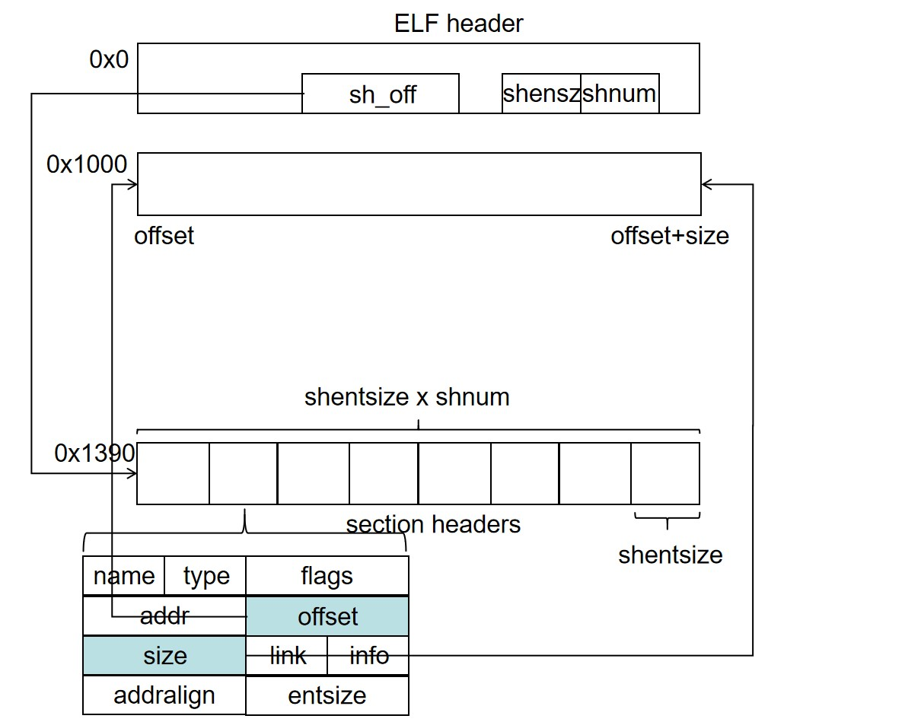
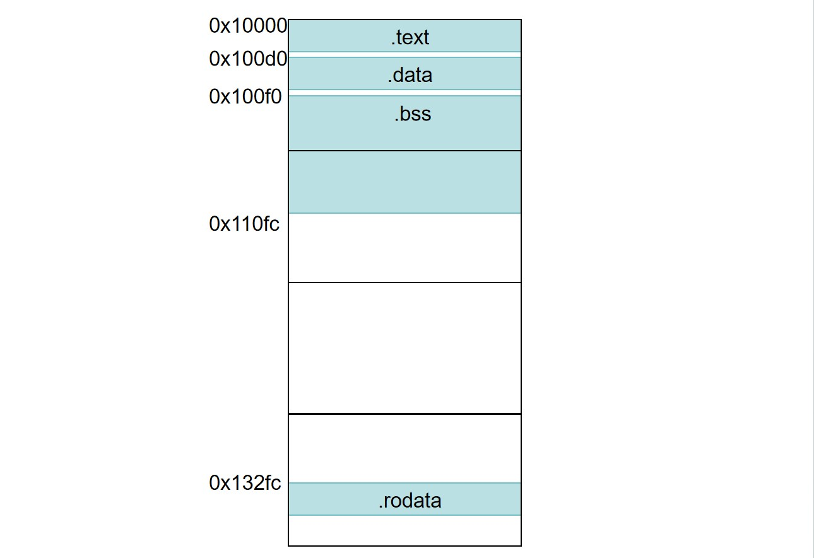
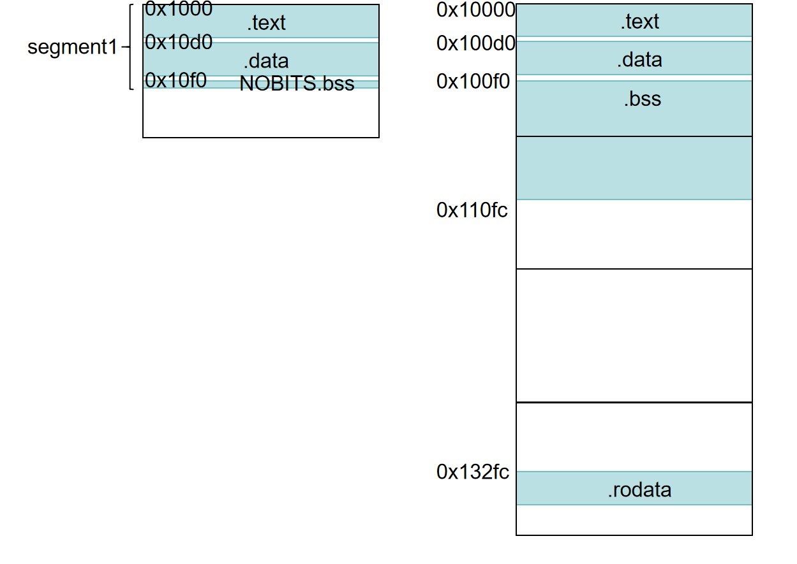
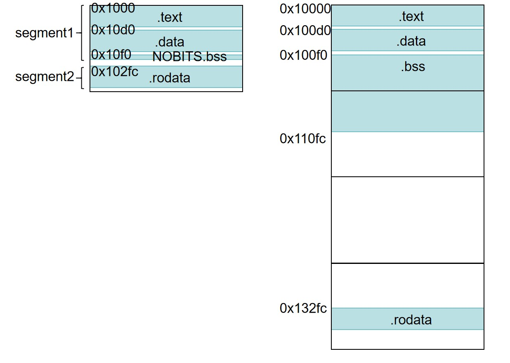
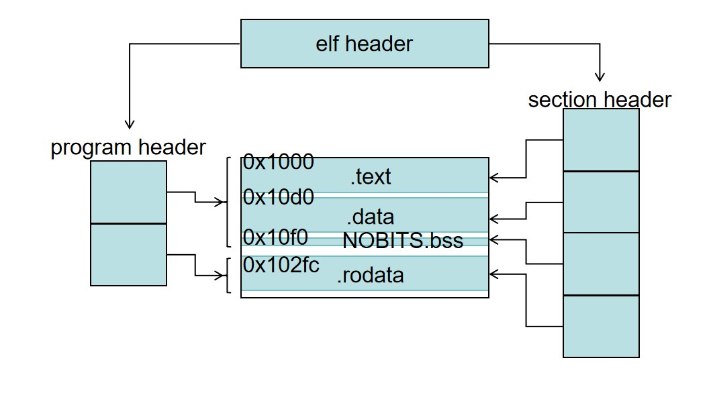
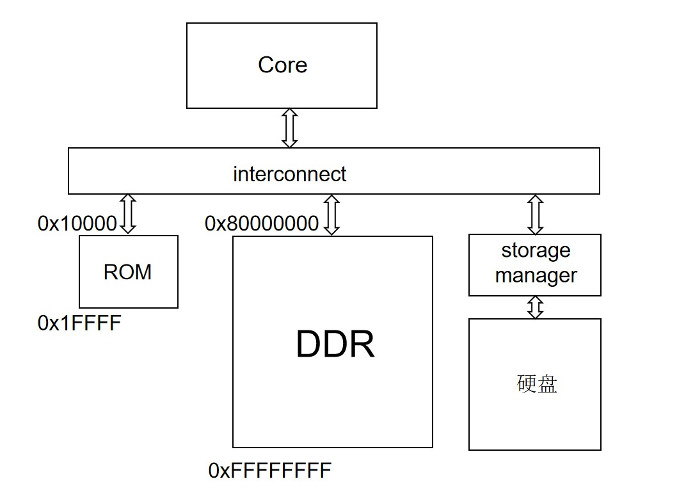

# ELF 的一些探索（五）：ELF、BIN、HEX 的加载和使用场景

## ELF 程序加载
我们现在来看一下我们的 elf 程序是如何被计算机加载和使用的。这里我们先不讲真实的计算机是基于何等机制将躺在硬盘中的 elf 程序加载进内存的，我们先假设有一个全知全能的神秘力量早已洞察了硬盘中的 elf 格式，然后这个神秘力量又可以随心所欲地将 elf 文件偏移的内容写入内存的任意地址。

其实这个过程就是之前汇编器、链接器将汇编文件、link 脚本转换为 elf 文件的逆操作。我们在编译的时候将每个内存中的段编译为 elf 中的 section，构造了 section header 数组记录这些段的加载位置、段属性（这些段属性是 PROGBITS）、长度、文件内位置等信息，最后还构造了一个 elf header 来指示 section header 数组的位置。



所以程序加载的过程就可以反过来。首先我们读取 elf 文件的 elf header，然后找到 section headers。我们遍历 section header 数组，如果表项的属性为 PROGBITS，我们就知道这个是应该加载到内存中的应用程序的段。于是我们根据段在文件中的偏移地址 offset 找到段起始位置，然后根据段在内存中的 addr 找到内存中需要写入段的位置，然后根据段的长度 len，将文件中的 offset 开始长度为 len 的段的内容 copy 到内存中 addr 开始的内存地址，然后通过内存管理机制把内存权限设置为对应的 flag 即可。

最后我们根据 elf header 把 entry 的值设置为 PC 的值开始执行即可。

### .bss 段
我们来看我们之前 elf-3 最后得到的数据段，它的内容是这样的：
```
.section .data
src:
    .word 0x82919283
    .word 0x98127364
    .word 0x98769876
    .word 0x98769876
    .word 0x12341234
    .word 0x00001234
    .word 0x12340000
    .word 0x12340000
dest:
    .space 0x8
i:
    .space 0x4
base:
    .space 0x8
```
我们可以看到最后得到的 data section 会是这样的，因此我们的 data section 的二进制如下，src 对应的 .word imm 部分是 imm 的小端序的值，之后的 dest、i、base 的部分是全 0 的数组：
```
Hex dump of section '.data':
  0x000100d0 83929182 64731298 76987698 76987698 ....ds..v.v.v.v.
  0x000100e0 34123412 34120000 00003412 00003412 4.4.4.....4...4.
  0x000100f0 00000000 00000000 00000000 00000000 ................
  0x00010100 00000000                            ....
```
这种未初始化的全局变量是很常见的一件事情，有时候甚至会达到几百 KB 甚至更多。如果我们的 elf 大量存储这种无意义的 0，其实是很浪费空间的，所以对于这些情况 elf 提供了一种压缩的方法。首先我们把所有不初始化的变量单独定义一个段称为 .bss，然后修改 link.ld 脚本重新编译即可：
```S
.section .data
src:
    .word 0x82919283
    .word 0x98127364
    .word 0x98769876
    .word 0x98769876
    .word 0x12341234
    .word 0x00001234
    .word 0x12340000
    .word 0x12340000

.section .bss
dest:
    .space 0x8
i:
    .space 0x4
base:
    .space 0x8
```
我们来看一下得到的段的特点。它的文件类型是 NOBITS，但是其他属性似乎都很正常，段的文件内的偏移是 0x10f8、长度是 0x14。但是我们看到紧接着 .bss 的 .riscv.attributes 的 offset 也是 0x10f8，那岂不是 .bss 段和 .riscv.attributes 段重合？
```
[Nr] Name              Type             Address           Offset
    Size              EntSize          Flags  Link  Info  Align
[ 4] .bss              NOBITS           00000000000100f8  000010f8
    0000000000000014  0000000000000000  WA       0     0     1
[ 5] .riscv.attributes RISCV_ATTRIBUTE  0000000000000000  000010f8
    000000000000002e  0000000000000000           0     0     1
```
我们可以执行`readelf -x .bss a.out`来查看这个段的内容，结果如下。可以看到这个段没有内容，所以 .bss 段仅仅只有一个 section header 记录了他的段长度，但是并没有实际的文件空间（或者说硬盘）存储他的内容，因为它是未初始化的变量，值默认都是 0，没必要专门存储。
```
    Section '.bss' has no data to dump.
```
所以我们总结一下，.bss 段只是在文件的 section headers 中存储自己类型为 NOBITS 的 section header，记录自己的段长度，也就是哪些未初始化全局变量的总的内存占用和载入地址即可。之后将 elf 文件的程序载入内存时，如果段的类型是 NOBITS，那么就 section header 的信息，将 size 个 byte 的 0 写入内存的 address 地址即可。.bss 内存也可以看作对全 0 数组简单的压缩解压缩的方式，一来可以节约内存空间，二来做数组填 0 比作数组拷贝要快很多。

### 按页管理
#### 权限按页管理
我们之前说过，我们有一些特殊的安全机制可以对内存中的段做运行时的安全保护，比如让 .text 段只能被执行和读、不能被写入，让 .rodata 段只能被读取、不能被执行或者写入。这个怎么实现请读者自行学习**分页**相关的知识，我们这里只要明白这个安全机制是以页为内存单位进行内存管理的。一页大小是 4KB，地址范围必须是 xxx000-xxxffff，我们可以为比如 0xabcd000-0xabcdfff 这个页设置我们需要的权限，比如 RW，则这个页的内存只能被读写，不能被执行，不然就会硬件报错。如果一个页我们只希望使用一部分内存，比如 0x10000-0x11fff 只有 0x10100-0x10200 被载入需要执行的段，照理说只需要 0x10100-0x10200 被设置对应的权限即可，但是页是分页管理机制的最小管理单元，所以这一页没被使用的内存也会被这个权限保护。

那么如果有多个段在同一页上面呢？比如 .text 和 .data 的地址范围都在页 0x10000-0x11000 上，一个权限是 RE，一个权限是 RW，那怎么做权限管理？设置为 RE 就会导致 .data 段没法写入，设置为 RW 就会导致 .text 段没法被执行，为了确保所有段都可以被正常执行，那么我们只能把权限设置为所有段权限的并集，也就是 RW|RE = RWX。当然这也会导致 .data 段可以被执行、.text 段可以被写，使得我们之前安全机制的权限设置形同虚设，所以 ld 脚本在使用的时候最好确保不同权限的段不要共用一个页，不然会导致这部分权限管理失效。比如我们可以如下写 ld 脚本：
```
OUTPUT_ARCH( "riscv" )
ENTRY(main)

SECTIONS
{
  . = 0x10000;
  .text : { *(.text*)}
  . = ALIGN(0x1000);
  .data : { *(.data) }
  . = ALIGN(0x10);
  .bss : {*(.bss)}
  . = ALIGN(0x1000);
  .rodata : { *(.rodata) }
}
```
.text 是 RE 权限；.data 是 RW 权限，我们不希望和 .text 段内存重叠，所以在 .data 和 .text 之间加一句`. = ALIGN(0X1000)`，让 .text 和 .data 不共用同一页；而 .data 和 .bss 是同一权限可以同一页，所以中间只是`. = ALIGN(0x10)`做一个字节对齐就好了；.rodata 因为是 RO 权限，和 .bss 不希望同一页，所以中间也加一个`. = ALIGN(0x1000)`把页隔开。

#### 加载按页管理
program 加载进入内存在真实情况下不是以 section 为单位载入的，也是以页为单位载入的。怎么以页为单位载入的呢？程序访问（执行、读数据、写数据都是访问）到某一页的地址，然后分页管理机制会检查这一页 program 是不是在内存中，如果在内存中继续执行，不然的话根据要访问的地址把文件中对应的一页载入。

那怎么在文件中找到我需要的那一页，然后载入内存呢？我们检查 program 不在页内的时候是知道我要访问的地址，然后我们可以考虑遍历所有 PROGBITS 和 NOBITS 类型的 section headers，然后看看我要访问的地址是不是在这个段里面，然后把这个段里属于这一页的内容载入到内存中。这里有若干个问题：
1. section headers 当中很多的段是和 program 没关系，我们遍历这些段对于 program 载入没有意义
2. 一个页可能包含了多个 section 的部分，也许每个 section 的内容很少，但是要分别载入很多次。少量多次的额外开销往往是远远大于一次载入所有的额外开销的
3. 一个也包含多个 section，权限管理比较麻烦

所以这个时候最好重新组织 section 的组织和结构，让 section 的数据结构和 page 的管理要求相统一，确保我们可以避免至少这四个问题。

### program segment
为了和 page 管理相统一，elf 将若干个相邻的 section 组织成 segment，然后每个 segment 用一个 program header 来描述，所有的 program header 组织为一个 program headers 的数组，我们慢慢描述这个机制，首先介绍 section 是如何被组织成 section。

#### program segment 的剖分
我们以下面这个 ld 基本为例：
```
    OUTPUT_ARCH( "riscv" )
    ENTRY(main)

    SECTIONS
    {
        . = 0x10000;
        .text : { *(.text*)}
        . = ALIGN(0x10);
        .data : { *(.data) }
        . = ALIGN(0x10);
        .bss : {*(.bss)}
        . = . + 0x2200;
        .rodata : { *(.rodata) }
    }
```
这是 ld 对应的内存排布：


.text 第一个段肯定属于第一个 segment，权限至少是 .text 的权限 RE；然后我们来看下一个段是 .data 和 .text 是有 1 页是重叠的，所以我们将这两个 section 组成同一个 segment，对应的权限就是 RE|RW = REW；再看第三个段 .bss，这个段和 .data 段也有一个页的重叠，那我们就可以将这三个段一起组织为一个 segment，权限变为 REW|RW = REW。下一个段 .rodata 和 .bss 没有页重叠了，权限也和第一个 segment 的 REW 不一样本来也不应该组织在一起，就不选择将它们组织在一起了。于是我们得到了第一个 segment：.text + .data + .bss，权限是 REW。之后的 .rodata 自然就是第二个 segment，权限是 RO。


这样组织有什么好处呢？
1. 我们检查一个页的位置的时候只需要检查位于哪个 segment。segment 只包括载入内存的 section，而且 segment 的个数少于这些载入内存的 section 的个数，所以定位起来可以更快。（即描述 segment 的 program header 远远少于描述 section 的 section header）
2. 一个页如果横跨多个 section，这些 section 都在一个 segment 了，所以我们使用 segment 为载入单位的时候不会存在一个 page 横跨都个 segment，自然就不需要查找多个 segment，可以一次性载入
3. 同理，也不需要维护不同 segement 的不同 flag 问题

不过有读者会说，我的 .text 和 .data 最多只重叠一个页，我是不是可以只让这个页的权限是 REW，其他不重叠的页保持 RE 和 RW 呢？确实可以，但是这样一来会引入更复杂的数据结构，造成是 segment 组织和 load 更复杂；二来既然权限管理已经被破坏了，这种补救方式不能从根本上解决问题，不如让不同权限的段之间做段首地址的页对齐。


#### segment 的文件存储
那么下一个问题，我们的 segment 是怎么存储在文件当中。

首先我们看一下 segment 第一个 section 的内存地址，例如是 0x101bc，然后这个segment的起始地址就是第一个页内偏移从 0x1bc 开始是空的文件页帧开始存储，例如 segment 前面的数据已经写到文件偏移 0x1200 的地方了，那么就从下一个页对齐然后偏移 0x1bc 也就是文件偏移 0x21bc 开始存储 segment。如果文件偏移只写到 0x1100，那么就可以从当前页 0x11bc 的文件偏移开始存储。然后同一个 segment 中的 section 在文件偏移中的相对排布就和内存中的相对排布保持一致即可。

例如 .text 起始地址是 0x10000，那么存储在文件中的起始地址就是第一个空闲的 0xxxxx000，这里是 0x1000，然后写入 .text 段。之后看 .data 起始地址和 .text 相距 0xd0，那么 .data 在文件中也从相距 .text 起始地址 0xd0 的 0x10d0 开始存储。.text 和 .data 在文件中可能会有一段间隔，这部分空隙填 0。这样做主要是为了让文件内 .text 和 .data 之间的间隔和内存中保持一致，这样当我们要载入跨 .text 和 .data 的页的时候就可以直接把文件中跨 .text 和 .data 的对应区域 copy 过去，而无需考虑中间的间隙，因为相对位置都是对应的。比较特别的是 .bss 段，它根据相对位置的规则所以是从 0x10f0 开始存储的，不过因为自己没有长度，所以不占文件内容。所以第一个段存储末尾其实就是 .bss 的起始地址 0x10f0。



然后我们存储第二个段，我们看到 .rodata 的内存地址是 0x132fc，所以他存储的文件内偏移是紧接着第一个 segment 的第低12位是 0x2fc 的地址，那么就是 0x12fc。如果第一个 segment 的结束位置是 0x13f0，那么第二个 segment 的起始地址就只能是下一个 0x2fc，也就是 0x13fc 了。



所以我们总结一下：
1. 如果两个 section 在内存中有共用的页，那么这两个 section 属于同一个 segment
2. 如果一个 section 和之前的 segment 没有共用的页，且它们的权限不一致，则不属于同一个 segment
3. 一个 segment 的文件偏移和内存地址的第 12 位保持一致，且 segment 内的 section 的相对偏移保持一致，section 间的空格补 0
4. segment 的排列顺序和内存的排列顺序一致

我们这里第二点提到“如果一个 section 和之前的 segment 没有共用的页，且它们的权限不一致，则不属于同一个 segment”，那么如果这个 section 和 segment 的权限是相同，但是没有共用的页那还算一个 segment 吗？实践证明如果 section 和 segment 的距离在 0x4000 以内是属于一个 segment，反之则不属于。如果 section 和 segment 的距离范围超过一个页，那么会导致文件中多出额外的几个页的内容充当 segment 内部 section 的间隔（如果 section 不被纳入这个 segment，这个间隔中多余的页可以被压缩）。因此我们再加一条规则：

5. 如果一个 section 和之前的 segment 权限一致，且间距小于 0x4000，则属于同一个 segment，反之不属于一个 segment

#### program header
现在我们来查看一下描述每个 segment 的 program header 的格式和内容。还记得第三章当中的 elf header 的结构吗？我们当时有三个参数没有讲，分别是 e_phoff、e_phentsize、e_phnum，它们分别是 program header 数组的起始地址、每个数组表项的大小、数组的表项个数，和 section header 数组的 e_shoff、e_shentsize、e_phnum 设计思路是一样的。所以我们可以根据这三个字段快速找到 program header 数组，进而一次得到每个段的信息。
```C
    typedef struct {
        ...
        Elf64_Off     e_phoff;
        ...
        Elf64_Half    e_phentsize;
        Elf64_Half    e_phnum;
        ...
    } Elf64_Ehdr;
```
program header 的数据结构如下：
```C
    typedef struct {
        Elf64_Word    p_type;
        Elf64_Word    p_flags;
        Elf64_Off     p_offset;
        Elf64_Addr    p_vaddr;
        Elf64_Addr    p_paddr;
        Elf64_Xword   p_filesz;
        Elf64_Xword   p_memsz;
        Elf64_Xword   p_align;
    } Elf64_Phdr;
```
* p_type：segment 的类别，我们等介绍之后的 segment 的时候再对应介绍出现的种类
* p_flags：segment 的权限，R 表示可读、W 表示可写、E 表示可执行，和 section 的 AWE 一一对应。我们在上一节阐述过 segment 的 flag 的由来了。
* p_offset：segment 在文件中的文件偏移，也就是存储位置。我们在上一节阐述过每个 segment 在文件中如何确定存储位置。
* p_vaddr 和 p_paddr：p_vaddr 是 segment 载入内存的虚拟地址。p_paddr 是 segment 载入内存的物理地址。计算机启动的时候是只有物理地址模式的，然后操作系统建立虚拟地址模式。像操作系统之前的启动程序都是在物理地址载入和运行的，所以对应的 elf 程序只有物理地址，虚拟地址没有意义，虚拟地址和物理地址保持一致（额外具有在虚拟地址运行的可能）；当虚拟地址模式被打开之后，操作系统需要运行在虚拟地址模式，所以操作系统的 elf 兼具虚拟地址和物理地址，且值往往不一样；操作系统加载的用户态程序都是运行在虚拟地址上的，所以只需要有虚拟地址就可以了，可以没有物理地址，物理地址和虚拟地址保持一致（额外具有在物理地址运行的可能）。
* p_filesz 和 p_memsz：p_filesz 是 segment 存储在文件中的大小。p_memsz 是 segment 在内存中的大小。我们可以看到 segment1 的 .bss 段在 memsz 中有额外 0x100c 的大小，但是在文件中因为不会被存储，所以一个 segment 的 p_memsz 会大于 p_filesz，大于的部分就是因为 segment 的末尾的 NOBITS section 被压缩的部分。
* p_align：segment 的对齐

我们可以用`readelf -l elf文件名`来查看每个 program header 数组记录的 segment 信息，可以看到每个段的存储地址、物理地址、文件大小、内存大小、权限信息和我们的模型推断保持一致的。最下面还可以看到组成每个 segment 的 section。
```
Program Headers:
  Type           Offset             VirtAddr           PhysAddr
                 FileSiz            MemSiz              Flags  Align
  RISCV_ATTRIBUT 0x0000000000001304 0x0000000000000000 0x0000000000000000
                 0x000000000000002e 0x0000000000000000  R      0x1
  LOAD           0x0000000000001000 0x0000000000010000 0x0000000000010000
                 0x00000000000000f0 0x00000000000010fc  RWE    0x1000
  LOAD           0x00000000000012fc 0x00000000000132fc 0x00000000000132fc
                 0x0000000000000008 0x0000000000000008  R      0x1000

Section to Segment mapping:
  Segment Sections...
   00     .riscv.attributes 
   01     .text .data .bss 
   02     .rodata 
```
第一个 segment 类型是 RISCV_ATTRIBUT，包含的是 .riscv.attribute 段，所以这个类型是用于存储指令集信息的，应该是载入之前做平台指令集支持检查的，不会被真的载入内存。

第二个 segment 类型是 LOAD，包含的是 .text、.data、.bss，所以这个类型才是会被载入内存的 program 的数据。我们可以看到因为 .bss 段的存在 file size 节约了 .bss 的 0x100c 字节，比 memory size 小了这 0x100c。所以当我们根据 segment 将数据从文件载入 memory 的时候，既要根据 filesize 载入文件保存的数据，也要根据 memsize-filesz 补全 NOBITS section 压缩的 0。

但是如果我们不是以 .bss 结尾，我们让 .bss 和 .data 在 lds 脚本中交换位置们就可以得到如下的段信息：
```
Program Headers:
  Type           Offset             VirtAddr           PhysAddr
                 FileSiz            MemSiz              Flags  Align
  LOAD           0x0000000000001000 0x0000000000010000 0x0000000000010000
                 0x0000000000001100 0x0000000000001100  RWE    0x1000
```
可以看到 filesz 和 memsz 的大小就保持一致了。其中 .bss 虽然没有存储数据，但是 .bss 和 .data 是存在 0x1010 的间隔的，这部分间隔会被存入 0，所以还是占用了文件 0x1010 的空间，相当于说我们在 file 中还是存在一个大小是 0x100c 的 .bss 段，并没有节约这部分空间。因此我们在设计 ld 脚本的时候需要精心安排同一个 segment 的 section 的位置，让 NOBITS 的 section 位于 segment 的末尾。

第三个 segment 也是 LOAD 类型需要被载入内存的，也就是 .rodata 段，可以看到 LOAD 的内容要求是 0x1000 对齐也就是页对齐的，所以合法的 program 的 segment 应该是从页首开始存储内容的。这里的 segment 它的起始地址其实不是合法的，所以真实运行的时候应该载入失败，合理的情况下，所有 LOAD segment 都应该从页首开始存储自己的数据，这样我们每次把一页数据从文件搬运到内存，就不需要检查 segment 起始地址和页起始地址的关系了，segment 肯定是刚好等于或者覆盖页起始地址的。

因此在编写 ld 脚本的时候最好遵循以下规则：
1. 同一权限的 section 排布在一起，之间做 16 字节对齐即可（字节对齐+尽可能少引入间隔和段数）
2. 同一权限的 section 排布时将 NOBITS section 排在末尾（使得 NOBITS 可以有效压缩）
3. 不同权限的 section 之间做页对齐，确保不共用同一页（满足最小权限管理规则+满足 LOAD 段对齐要求）

所以最好的 ld 脚本和对应的 segment 布局如下：
```
    OUTPUT_ARCH( "riscv" )
    ENTRY(main)

    SECTIONS
    {
    . = 0x10000;
    .text : { *(.text*)}
    . = ALIGN(0x1000);
    .data : { *(.data) }
    . = ALIGN(0x10);
    .bss : {*(.bss)}
    . = ALIGN(0x1000);
    .rodata : { *(.rodata) }
    }

Program Headers:
  Type           Offset             VirtAddr           PhysAddr
                 FileSiz            MemSiz              Flags  Align
  RISCV_ATTRIBUT 0x0000000000003008 0x0000000000000000 0x0000000000000000
                 0x000000000000002e 0x0000000000000000  R      0x1
  LOAD           0x0000000000001000 0x0000000000010000 0x0000000000010000
                 0x00000000000000d0 0x00000000000000d0  R E    0x1000
  LOAD           0x0000000000002000 0x0000000000011000 0x0000000000011000
                 0x0000000000000020 0x000000000000102c  RW     0x1000
  LOAD           0x0000000000003000 0x0000000000013000 0x0000000000013000
                 0x0000000000000008 0x0000000000000008  R      0x1000

 Section to Segment mapping:
  Segment Sections...
   00     .riscv.attributes 
   01     .text 
   02     .data .bss 
   03     .rodata 
```
可以看到运用三条规则后所有 segment 之间就没有了权限冲突问题，做到了页对齐、满足权限最小下的间隔最小、利用到了 NOBITS 段的压缩等等优点。

### program load
介绍完 elf 文件的 program header 数组和 section 序列组织得到的 segment 序列之后，我们就可以得到 elf 完整的结构。首先是 elf header 指示了 program header 数组和 section header 数组的范围，两个数组之间是一系列组织为 segment 的 section，program header 数组的每个表项描述一个 segment，section header 数组的每个表项描述一个 section。如下图：


#### 全部载入
如果是一次性载入所有的程序，我们首先通过 elf header 定位到 program header 数组，然后遍历数组中所有 type 为 LOAD 的表项。然后根据表项中的 offset 找到 segment 的起始地址，然后将前 filesz 长度的数据 copy 到内存中。如果是物理地址模式，copy 到物理内存地址 paddr 处；如果是虚拟地址模式，copy 到虚拟内存地址 vaddr 处。写入之前检查地址是不是 0x1000 地址对齐，如果不是的话也许会给出报错。然后将 memsz-filesz 个 0 写入紧接着的地址即可。设置这个 segment 覆盖的页的权限为 flag。

载入所有的 segment 之后，将 PC 设置为 e_entry 开始执行程序。

#### 按页载入
前部分机制暂时隐去，因为涉及到页表、虚拟地址、异常中断、操作系统等知识点，我们假设这部分的前期准备工作已经做好，使得我们的程序有了缺页异常的检查和缺页异常处理做按页载入的能力，那么一旦我们发现某一个被访问的页不存在，我们会调用按页载入的机制来载入这个缺失的页。我们根据访问的地址遍历 segment 找到缺失的页所在的 segment，然后检查这个页和 filesz 范围内的 segment 的重叠范围，将这部分 copy 进入页。如果 segment 满足 align=0x1000 的页对其要求，重叠部分的 begin 地址不需要检查，segment 肯定覆盖 page 的 begin；结尾部分要做一个检查。如果页的范围超出了 filesz，余下部分写入全 0，这样可以略过 memsz 的检查。

按页载入是需要一段额外的复杂代码做辅助才可以实现的，对于普通的用户程序而言，这部分代码是操作系统，硬件机制检查是否发生了缺页，然后中断异常机制进入操作系统做对应的按页载入，然后中断异常机制返回用户程序继续执行。但是如果我们的操作系统没有额外的代码为它做按页载入，而且操作系统是管理硬件资源的，所有的代码需要再执行之前都准备好，所以操作系统这些系统代码是一次性全部载入的。

## 系统启动的简易模型
在聊 BIN 和 HEX 文件格式的内容和作用之前，我们先简单讲一下一个简化版的系统启动过程，然后以这个任务为应用场景来描述 BIN 和 HEX 文件格式的作用。

### DDR 和 ROM
我们之前讲的内存一般是使用 DDR 芯片实现的，这种芯片的存储我们在之前讲过可以看作是二维数组，它有数据存储空间大、制作成本低、耗电量低等优点，但是一旦断电，DDR 中存储的所有数据都会丢失，所以是掉电易失型存储。所以我们的系统代码并不是一开始就存储在 DDR 当中，因为系统一开始是不上电的，自然 DDR 没法存储系统代码。系统代码以某种格式存储在硬盘当中，这里的硬盘可能是机械硬盘，也可能是固态硬盘，然后系统上电开始运行之后，才将数据从硬盘载入到内存。

但是我们要怎么将数据从硬盘载入到内存中呢？我们首先明确一点，实际上内存的物理实现是多种多样的，一个系统中的内存也可以是多块的，彼此可以是不同的物理实现。我们之前讲的掉电易失型存储 DDR 因为成本低、存储空间大，被作为系统中最大、最常用、最核心的内存，被称为主存 main memory，但是我们至少还有一块掉电非易失型的内存作为辅助。

这块掉电非易失型的内存一般被叫做 ROM，即 read only memory，我们在制作这块内存的时候将一些重要的代码和数据做到 ROM 当中，这部分数据处理器只能读不能写，当系统一上电，ROM 中的指令和数据就已经准备好了，不需要额外做从硬盘到内存的初始化。又因为这块内存中的内容已经先是固化在其中了，所以它又是系统的固件。我们读取硬盘、解析文件、将系统代码加载进入内存的代码就可以保存在这个 ROM 当中。

不过为什么我们不用大号的 ROM 替代 DDR 成为主存呢？主要是 ROM 读写速度慢、造价昂贵、占地面积大，不利于大量使用，所以开头启动的少量代码存放在 ROM 中，而其他庞大的指令和数据则存储在硬盘中、运行在 DDR 中，执行效率更高、综合成本更低。

### 物理地址分配
我们之前访问主存的时候，处理器向主存发送需要访问的地址，然后主存将地址解析为自己的第几行第几列，然后将里面的数据发送给处理器。那么我们现在有 ROM 和 DDR 两块内存了，我们要怎么访问内存呢？难道同时把访问物理地址发送给两个内存，让他们各自返回一个数据吗？其实我们要明确一个概念，就是物理地址和内存地址不是一个概念，他们是一个映射的关系。

我们的 ROM 比如大小是 0x10000B，有 0x10000 个存储单元，当输入的地址信号是 0x????（0x0000-0xFFFF）的时候就将存储阵列中对应的第 0x???（0x0000-0xFFFF）个存储单元的数据返回。

我们的 DDR 比如大小是 0x80000000，有 0x80000000 个存储单元，当输入的地址信号是 0x????????（0x00000000-0x7FFFFFFF）的时候就将存储阵列中对应的第 0x????????（0x00000000-0x7FFFFFFF）个存储单元的数据返回。 

64 位物理地址指的是处理器的物理地址寻址能力可以访问 2^64 个存储单元。现在我们将 0x10000-0x1FFFF 的物理地址映射到 ROM 的存储单元上去；将 0x80000000-0xFFFFFFFF 的物理地址映射到 DDR 的存储单元上去。然后当我们处理器发送的物理地址是 0x10000-0x1FFFF，就向 ROM 发送读写请求和 0x0000-0xFFFF 的地址信号；访问 0x80000000-0xFFFFFFFF 就是向 DDR 发送读写请求和 0x00000000-0x7FFFFFFF 的地址信号。

这个物理地址和内存地址的转换、读写请求的分发、读写数据的路由是由总线互联实现的。我们的处理器和这两块内存之间用总线相互连接，根据我们系统架构设计时候物理地址分配的协议和其他的设计协议，实现我们系统架构内存、处理器之间的总线互联。实际上的系统架构有复杂的存储单员，比如内存有多块 ROM、多块 main memory、多块 flash，各类外设的可编程寄存器（下图的 storage manager，通过编写这里的寄存器可以间接读写硬盘），各类电源开关的管理寄存器等等，这谢存储单元都是在架构设计的时候就分配好了物理地址，然后用总线根据物理地址连接起来。总线的内部结构、联结、层次、协议也许非常复杂，我们现在只需要知道他帮我们连接了各个部件，做了地址转化就可以了。



### 正式启动
我们以上图的体系结构为基础开始启动，在一开始系统代码的内容保存在硬盘中，DDR 内没有任何数据，ROM 内是硬盘读写的代码、文件解析的代码、内存写入的代码。我们上电初始化之后，处理器的 PC 的值是 ROM 的起始地址 0x10000，所以 ROM 的代码入口地址也需要是 0x10000。然后我们根据 ROM 中的程序读写 storage manger 的控制寄存器得到内部系统代码文件的内容，然后将系统代码文件的值读出来，将需要载入内存的部分写入内存。

如果我们 ROM 中的程序比较强大，具有 ELF 文件解析的能力，那么硬盘中的系统代码可以存成 ELF 的格式。ROM 的程序解析 ELF 中的 program header 数组，将对应的 segment 载入内存。然后跳入 DDR 的起始地址 0x80000000 开始执行系统代码。因此系统代码的入口地址也要是 0x80000000。这都是 RISCV 平台设计的时候规定好的。

## BIN 文件格式
但是存在一些情况，比如我的 ROM 比较小，无法保存下 ELF 解析这么强大程序，只能提供一些简单的硬盘读取功能，我们就没法讲系统代码存储为 ELF 格式，需要一些更简单的存储格式，来便于 ROM 的文件载入。这里就提供了 BIN 文件。

我们可以使用`riscv64-linux-gnu-objcopy -O bnary elf文件名 二进制文件名`将 elf 文件转换为 BIN 格式。方法很简单，将 ELF 中的 segement 转换为内存中保存的格式，然后直接把整个内存按页存储下来就得到了 BIN 文件。因此 BIN 文件的存储大小可能远大于 ELF 文件，ELF 中的 NOBITS 段直接展开为 0，segment 之间的间隔也被原封不动地保留。

但是这为 ROM 的载入带来了便利，它只要知道 BIN 文件的载入地址和长度，直接原封不动的 copy 过去就好了，不需要做 elf header、program header、segment 的解析。我们很多时候说的文件镜像 img，其实就是这种 binary 文件，因为相当于把内存排布直接快照保存了下来。

## HEX 文件格式
BIN 文件格式是二进制文件，这个不具有可读性，因此可以转换为 16 进制数的文本格式，这样有更好的可读性，可以执行如下语句`od -v -An -tx8 二进制文件.bin > HEX文件.hex`将二进制文件转化为 HEX 文件。得到：
```
 0000809300003097 000011170000b083
 0011302302010113 0100809300001097
 0940006f0000a023 0040809300001097
 000011170000b083 00001197fcc10113
 0001a183fec18193 0031013300219193
 0220c46300013103 fa81819300001197
 ....
```
可以看到每一个条目都是 8 个小端序的 byte 组合得到的 64 位二进制对应的十六进制数。条目之间是小端序，条目内部是大端序。此外还可以看到很多的 0，其实就是段之间的间隔被 0 填充了。

BIN 文件和 HEX 文件还可以用于构造 ROM。如果 ROM 固件是通过外部引脚烧写进去的，烧写的文件往往就是对应程序的 BIN 文件。如果 ROM 固件使用 FPGA 的 bram、reg array 模拟的，初始化这些器件的时候用的就是 HEX 文件。

例如对于一个 reg array 我们可以做如下的初始化：
```
reg [63:0] mem [0:127];
readmem("a.hex");

a.hex:
 0000809300003097 000011170000b083
 0011302302010113 0100809300001097
 0940006f0000a023 0040809300001097
 000011170000b083 00001197fcc10113
 0001a183fec18193 0031013300219193
 0220c46300013103 fa81819300001197
```
然后 a.hex 的条目就会被用于填充 mem 数组，第一个条目 0000809300003097 会被写入 mem 的第一个寄存器数组 `mem[0]` 的 63-0 位，于是 `mem[0][63]` 的值就是 0000809300003097 的最高位 0，而不是最低位 1。如果 mem 的数据类型为`reg [0:63] mem [0:127]`，那么`mem[0][0]`会被载入 1，`mem[0][63]`会被载入 0。然后第二个条目 000011170000b083 依次载入`mem[1]`当中，以此类推。如果 mem 的数据类型为 `reg [63:0] mem [127:0]`，则首先被初始化的是`mem[127]`，然后是`mem[126]`，依次递减到`mem[0]`。

至此我们介绍完了 ELF 文件的基本格式、载入的方法，BIN 和 HEX 的基本格式。下一节，我们将更复杂的 C 程序的汇编实现和引入的新的 elf 结构。


