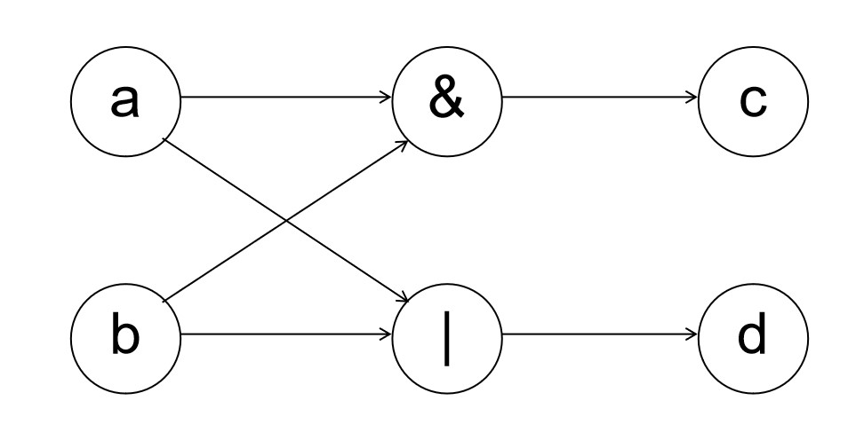
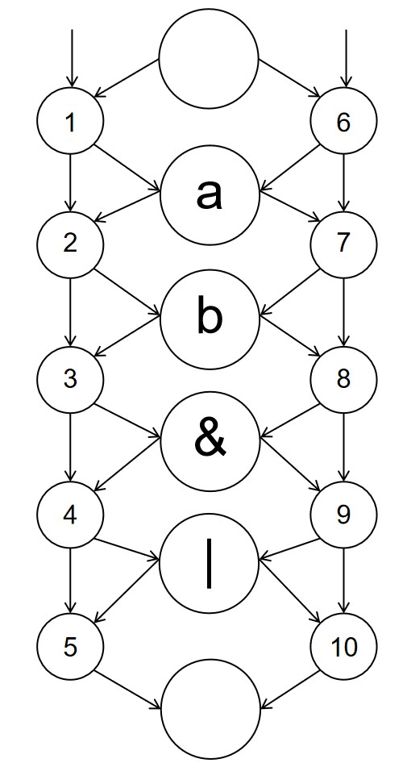
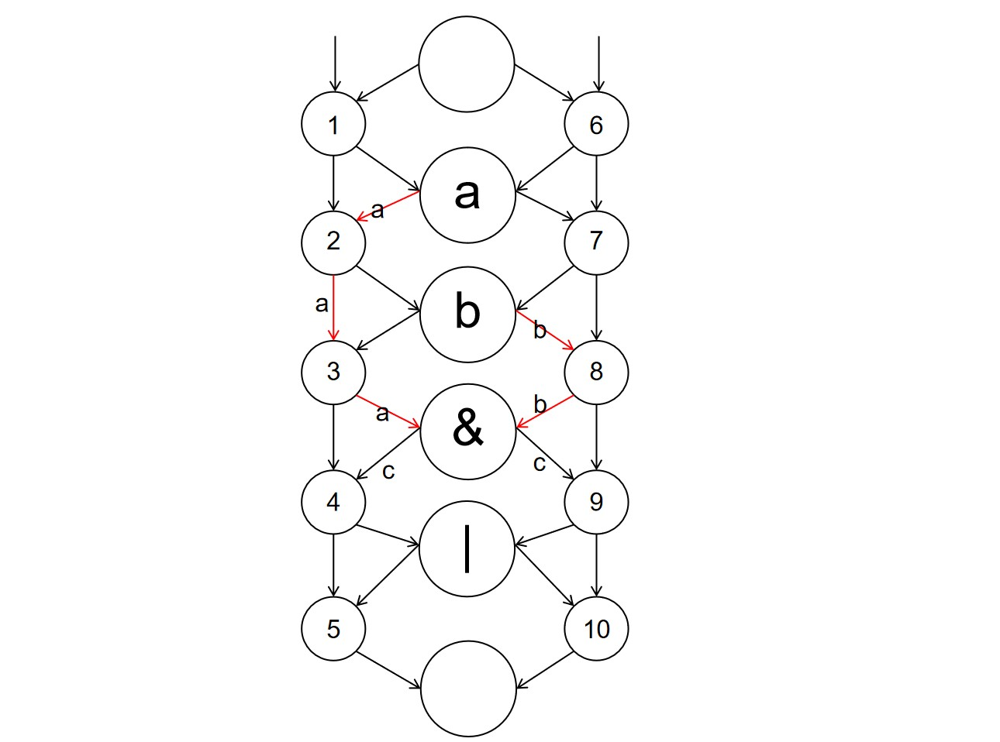
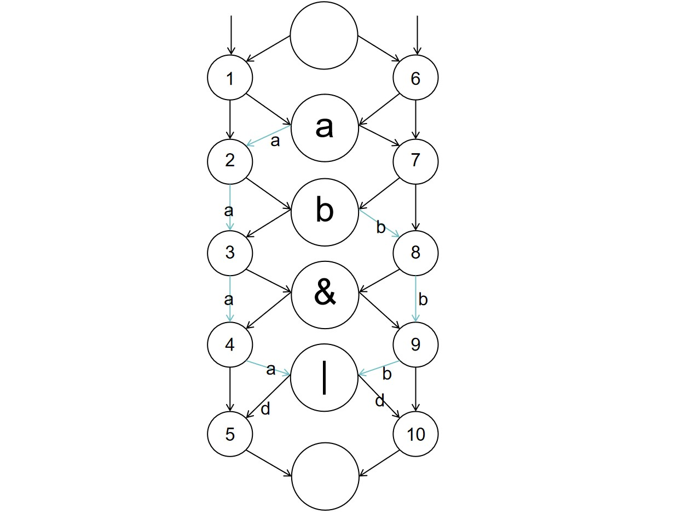
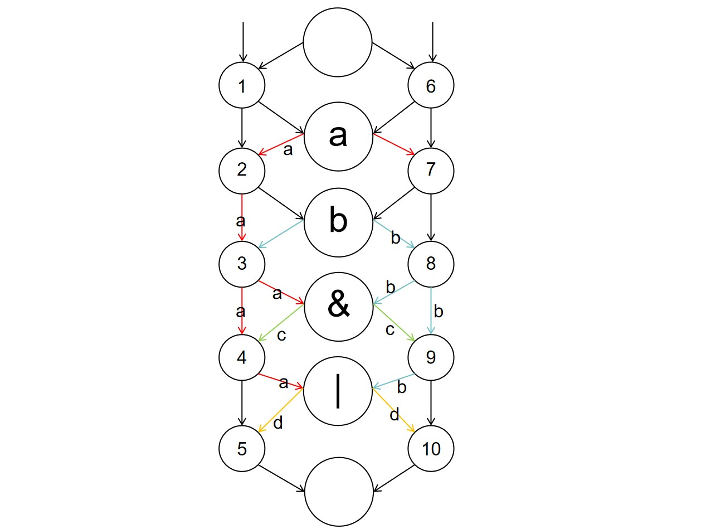
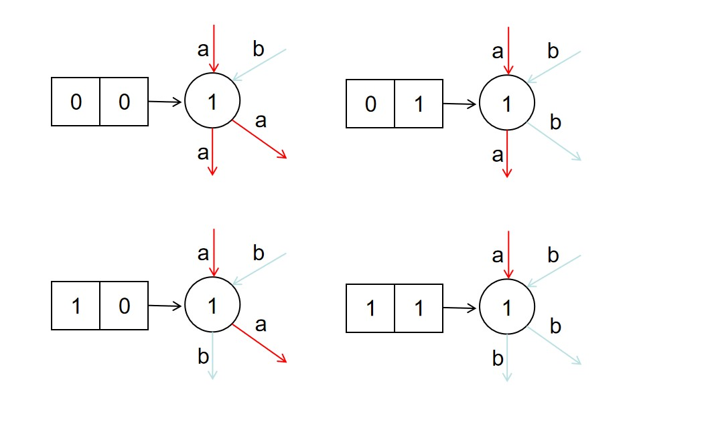
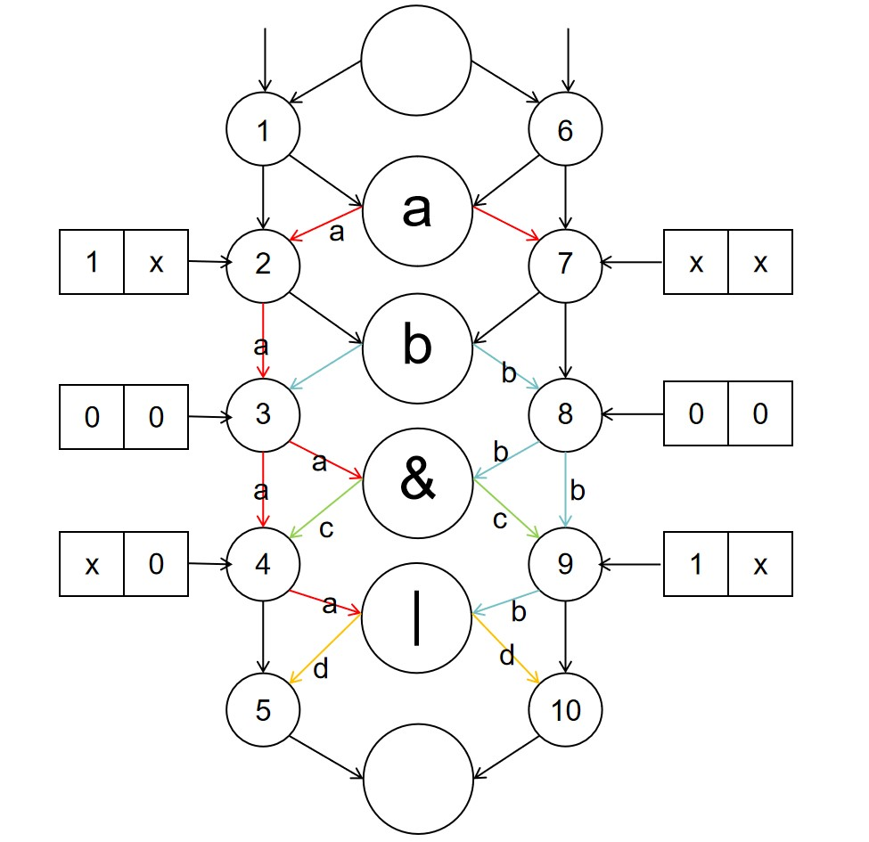

假设我们需要综合的Verilog内容如下：
```
    assign c=a&b;
    assign d=a|b;
```
然后我们通过 synthesis 阶段就可以解析这个符合 Verilog 的字符串得到如下的电路构造：


经过 synthesis 阶段，vivado 知道需要使用两个输入、两个输出、一个与门和一个或门得到了最后的电路，之后的 implementation 阶段，它就会组织 FPGA 上面的门电路资源和各种资源来构造这个电路。下图是一个通用电路构造模型，我们用它对我们的 FPGA 进行建模。


箭头表示电路的流通方向，指示了输入输出的方向。

大圆圈表示电器元件节点：
1. 节点a表示输入信号a，节点a的输出就是输入a的值
2. 节点b表示输入信号b，节点b的输出就是输入b的值
3. 节点&表示与门，节点&的输出就是两个输入经过与门的结果
4. 节点|表示或门，节点|的输出就是两个输入经过或门的结果

现在我们希望得到 c=a&b，于是可以让电流按照红线指示的方式流通：

这样与门电路的输出就是a&b的结果，也就是c的输出，因此我们可以说与门电路节点&就是我们需要构造的节点c。

同理为了得到 d=a|b，我们可以让电流按照蓝线指示的方式流通，让或门电路得到a|b的结果，成为需要构造的节点d：


这里我们也可以看到其实节点a和节点b本质上也是一些门电路：这里的节点&和节点|之于节点a和节点b，等价于节点a和节点b之于它们的上游节点；节点&和节点|之于它们的下游节点也可以直接认为是输入c、d对应的节点c和节点d。

因此为了满足我们电路构造的需要，我们可以用这个通用电路模型得到如下的电路连接方式：


我们再来看我们的两侧的小结点，它们是用于控制电路流通方向的可编程节点，我们在它的控制单元中写入不同的二进制，可以控制输入输出呈现不同的流通关系，如下图：


因此我们可以对所有的小节点的控制单元选择合适的输入，让通用电路按照我们需要的方式流通，x表示填0还是填1都可以或者无法决定：


我们的 FPGA 可以认为是这种通用模型的升级版本，具有更复杂的连接方式和更高级的电路资源，但是就数学模型而言是等价的。implementation 的过程就是计算构建 synthesis 得到的电路需要的电路连接控制单元的编码。生成的 bitstream 的一部分是控制单元编码的集合，vivado 将 bitstream 输入到 FPGA 的一个重要过程就是将这些控制单元编码写入到对应的控制单元中，来得到我们需要的电路。
