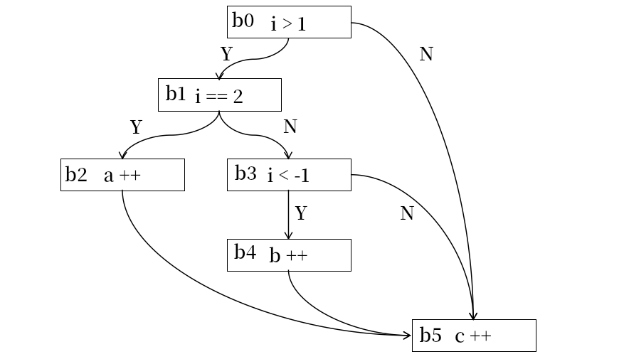
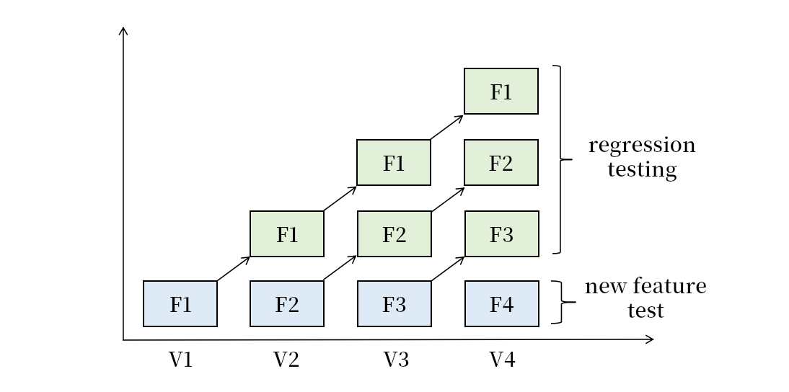
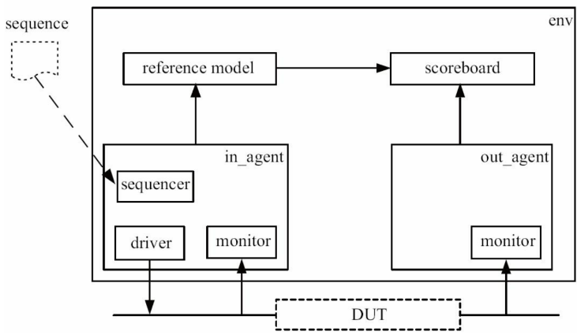

# 处理器验证与处理器模糊测试（一）

处理器验证是硬件验证的一个子方向，用于在预硅阶段检验处理器设计实现的正确性，即处理器功能实现和处理器功能设计是否保持一致。为了最大程度地确保处理器流片的正确性，工业界会将超过 60% 的时间用于 RTL 设计的功能验证、时序验证等验证工作，每个 RTL 设计工程师甚至需要 4 个以上的验证工程师配合完成验证工作。硬件验证的重要性在一定程度上超过了单纯的硬件设计实现。

本文将首先对传统的硬件验证方式进行介绍，帮助读者对传统的验证方法有个具体直观的认识，做为后续介绍处理器模糊测试领域的前沿知识。本文主要用于 sycurcion 小队内部交流学习，同时欢迎其他工业界、学术界的朋友借鉴学习和批评指正。任何对知识点的补充和对勘误的指正都是欢迎的。

传统的处理器验证大致分为两大类：

* 静态验证：在不仿真模拟硬件的前提下，根据硬件代码直接分析正确性，主要是形式化分析。可以充分证明模块的正确性，但是验证难度随着模块大小指数上升，仅适用于小型模块
* 动态验证：通过仿真模拟硬件执行，根据执行结果正确性检查硬件的正确性。仿真执行的测试样例输入可以手动构造，也可以自动化构造，可以扩展验证大型电路的正确性，但是无法证明验证的完整性。主要技术如下：
    * 基于 benchmark 的样例测试，测试快捷高效，可以覆盖大多数功能点，但是扩展性差，人力成本高
    * 基于 UVM 的动态验证，测试快捷高效，自动化程度高，扩展性好，但是测试的质量没有保障

接下来，我们将对这些方法依次进行展开。

## 静态验证 static verification —— 形式化验证 formal verification

### 形式化基本概念

在介绍处理器形式化验证技术之前，我们先介绍一些简单的形式化概念和语法，方便初学者有一个直观感性的认识。

典型的 IPO 过程就分为三个子部分：

* 对需要处理的 input 范围进行了约束，如输入是整数，输入在 -100 到 100 之间；这也暗示了如果输入超出了这个范围可以不予理睬。这种针对 input 的约束被称之为**前置约束**
* 对输入 input 计算得到的输出 output 的性质进行约束，如这里输出是整数，输出在 0 到 100 之间。这种对 output 的约束被称之为**后置约束**
* 对于 process 代码片段，如果满足任何满足前置约束的输入 input 在经过 process 处理之后的得到的 output 都满足后置约束，则说明这段代码是满足约束的；反之如果存在满足前置约束的输入 input 再经过 process 处理之后得到的 output 不满足后置约束，则说明存在反例，这部分代码是不满足约束的。

这里我们可以将代码片段、代码输入的前置约束、代码输出的后置约束这三部分交给形式化验证工具进行验证。如果验证通过，说明所有满足前置条件的输入可以得到满足后值条件的输出，代码满足要求；如果验证失败，则形式化工具发现存在不满足条件的反例，并且一般会输出反例，代码不满足要求；当然，形式化工具可能在有限的时间内无法给出证明结果，这个时候既不能证明满足要求，也不能证明不满足要去。
```
Pre(input)
output = process(input)
Post(output)
```
有两种情况是形式化无法解决的。第一，Rice 定理证明了，对于给定性质 L，对任何一台图灵机 M，都可以找到另一台图灵机 M'，使得 M 无法判断 M' 是否满足性质 L。也就是对于给定的形式化工具，总有一个问题他是无法给出证明的。第二，即使理论上一个代码可以被证明，但是实际上因为这个代码状态过于庞大，导致形式化工具在有限时间内无法证明完全，则也无法证明。这导致形式化工具的可扩展性、应用范围受限。

现在我们用 C 扩展代码为例介绍形式化验证的一些功能。

### 验证代码正确性

我们可以用形式化工具验证代码片段实现的正确性。例如，我们有一个代码需求：
```text
    对于在 -100 到 100 之间的整数输入，输出对应的绝对值
```

于是我们编写了如下的代码：
```C
    if(a < 0) b = -a;
    else b = a;
```

现在我们希望用形式化工具验证这部分代码的正确性，于是我们需要描述该问题的前置约束 Pre 和后置约束 Post。在 cbmc 的 C 扩展语法中，前置约束是一个用 assume 关键字修饰的布尔表达式，后置约束是一个用 assert 关键字修饰的布尔表达式，并且提供了一些布尔表达式的宏，所以可以写作：
```C
    assume( -100 <= a && a <= 100);
    if(a < 0) b = -a;
    else b = a;
    assert( b == abs(a) )
```
然后我们可以用 cbmc 将这部分代码编译为 SMT 语言，然后用 Z3 求解器求解 SMT 语言判断是否满足约束，进而判断代码是否正确。

当我们用形式化对代码的正确性进行检查的时候，前置约束就是代码需求中输入的约束，后置约束就是代码需求中输出的约束，不过很多时候如何将需求的自然语言描述为二进制语言是一件复杂的、不直观的问题，并没有那么容易。其次，在形式化验证的时候，我们必须假设前置约束、后置约束、形式化工具是正确的，不然最后结果的正确性无从谈起，而这只能靠仔细检查、社会经验、甚至理想信念来保证了。

### 求解变量的值

我们可以用形式化工具求解一些满足约束的变量。例如如下代码：

```C
    uint a = nondet_uint();
    assume(true);
    b = a + 5;
    assert(b == 10)
```

这里的 a 是一个待定的需要求解的值，然后我们可以用 cbmc+z3 的组合求解该代码，然后再满足约束的条件下得到 a 的一组求解结果。这里很显然 a 的结果是 5。当然也存在求解失败的情况，包括证明不存在满足约束的 a 和有限时间内无法完成求解。

代码证明，其实一定程度上来说就是变量求解的弱化版本。待求解个数为 0 的变量求解就等价于是代码证明。
变量求解也可以看作是特化的代码证明，这里的 a 是任意值可以看作证明布尔表达式
`Pre(input) => exists a, Post(process(a, input))`
而得到一组解 a 的过程就是求解布尔表达式正确性的过程。

从这个角度看代码证明和变量求解是等价的。

### 求解路径的可达性

代码块是一个单一入口、多出口的代码片段，一个程序是一个由多代码块组成复杂图结构。从一个代码块 b0 到另一个代码块 bn 的转移路径`b0 -> b1 -> b2 -> ... -> bn-1 -> bn`是一个路径。如果我们从程序入口存在一条执行路径可以到达代码块 bn 则称代码块是可达的，反之则是不可达的。

对于代码块的可达性，我们往往具有两种需求。第一，这个代码块是否可达；第二，这个代码块如果可达，那么可达的条件是什么？例如下图的代码片段：
```
i = nondet_int();
j = nondet_int();
if(i > 1){
    if(i == 2){
        a ++;
    }else if(i < -1){
        b ++;
    }
}
c ++;
```
对应的代码块控制流图如下：


通过形式化工具的求解我们可以得到 b2 是可以到达的，这个时候要求 i 是 2；对于 b4 则是不可达的，没有 i 满足对应的条件。进一步的，我们可以通过形式化的工具得到代码块的可达性以及到达代码块的条件。

### systemverilog 的形式化支持

对于  RTL 硬件我们同样也可以做形式化验证。软件代码是输入到输出的映射转换，硬件电路同样也是从输入到输出的映射转换，是等价的。systemverilog 的 SVA 提供了形式化的语法支持，我们这里介绍一下基本的语法，即对于电路如何设置对应的前置约束、后置约束和布尔表达式等。

SVA 提供 property 来设置约束的布尔表达式，包括 property-endproperty 关键字，property 命名，以及 property 的内容。然后就可以用 assume、assert 关键字分别设置前置约束的 property 和后置约束的 property。包括前置约束、后置约束的名字，关键字和 property 名。assume 就是对输入信号满足的 property 条件进行设置，assert 就是对输出信号满足的 property 条件进行设置。
```systemverilog
property value_eq;
    a == b;
endproperty

assume_property:assume property(vaule_eq);
assert_property:assert property(vaule_eq);
```

比如我们写了如下的代码，我们希望描述的硬件可以在 en=1、reset=0 的时候每个周期累加 1,然后在 00-01-10-11 之间不断的循环。为了证明这一点，我们需要设置对应的 assume 和 assert 约束。
```systemverilog
logic [1:0] state;
logic [1:0] old_state;
always_ff@(posedge clk)begin
    if(reset)begin
        old_state <= 2'b11;
        state <= 2'b00;
    end else if(en)begin
        old_state <= state;
        case(state)
            2'b00: state <= 2'b01;
            2'b01: state <= 2'b10;
            2'b10: state <= 2'b11;
            default: state <= 2'b00;
        endcase
    end
end
```

这里的 input_assume 的布尔表达式要求`reset == 0 && en == 1`,所以在形式化验证的时候相当于设置 reset 的输入为 1,设置 en 的输入为 0。这种直接的布尔表达式的写法导致的 property 是永远成立的，也就是无时无刻不成立的，因此可以用来约束组合电路这种一直需要被检查的对象。 

```systemverilog
property input_assume;
    reset == 0 && en == 1;
endproperty;
assume_property: assume property(input_assume);
```

acc_assert 的 `@(posedge clk)` 表示仅在时钟上沿的时候才进行这个 property 的检查，这和时序电路仅仅在时钟上升沿修改寄存器导致电平变化的电气特性相吻合。`en |=> state == old_state + 2'b01` 表示在上个周期满足`en == 1`的条件下，下个周期满足`state == old_state + 2'b01`，也就是 en 使能的时候，下个周期 state 累加。|=> 前的是上个时钟区域的电平满足的布尔关系，|=> 后的是下个时钟区域的电平满足的布尔关系，表达了时钟触发前后电平变化关系，适用于非阻塞赋值的电路描述。如果是 |-> 就是本周期内部的电平关系，适用于阻塞电路。

```systemverilog
property acc_assert;
    @(posedge clk)
        en |=> state == old_state + 2'b01; 
endproperty;
assert_property: assert property(acc_assert);
```

`state == 2'b01 ##1 state == 2'b10`中的 ## 可以用来表示时序关系，也就是下个周期满足`state == 2'b01`，然后过了一个单位的仿真时间后，电平满足`state == 2'b10`。一般我们让 clk 的翻转时间是 0.5,所以 1 也就是一个时钟周期的长度，这样就可以反映一个时钟序列当中电平的变化过程。这里就是在 state 是 0 的时候，之后会依次变为 1 和 2。

```systemverilog
property acc_assert;
    @(posedge clk)
        state == 2'b00 |=> state == 2'b01 ##1 state == 2'b10;
endproperty;
assert_property: assert property(acc_assert);
```

除了用 assume 和 assert 的 propert 进行功能验证之外，也可以用 cov 的 propert 进行覆盖率的检测。当我们验证处理器的时候，有时候需要检测某部分代码是否可以被执行到，即这部分代码逻辑是不是可达的。比如上述的 case 语句有四个分支，对应了 FSM 有四个状态，需要检查四个状态是不是都可以执行到，如果有执行不到那就是存在了错误。这个时候就可用下面的语法设置 cover property，如果这个 cover 对应的 property 可以被执行到，那么对应的功能就可以被执行覆盖到，说明是可达的，并且可以求解对应的触发路径。
```
<cover_name> : cover property (property_name)
```

### 小结

对于 SVA 的功能验证和可达性求解，我们可以用形式化的工具进行静态验证和分析。这些 SVA 的形式化工具一般是闭源的，包括 JasperGold 和 Synopsys VCS-Formal。通过插入 assume、assert、cover propert，这些工具可以自动化的进行功能验证和可达性求解，并且可以在验证通过的时候，可以百分百验证模块的正确性。但是随着电路模块的规模增长，验证的状态空间会呈指数级的上升，验证时间和验证难度也会同比增加。当寄存器规模达到上万之后，形式化工具就基本不失效了。对于现代处理器这种有数十万甚至上百万晶体管的集成电路，形式化验证往往用于小型子模块的开发验证，但是对于处理器整体的验证仅仅起到辅助作用。

## 动态验证 dynamic verification —— 手动构造样例测试

更传统的测试方式，其实是手工构造测试样例，然后检查执行结果是否正确。例如，下面的 max 函数输入正整数 a、b，然后输出两个数当中的最大值，为了检查这个函数的正确性我们针对各种特殊情况构造测试样例，如：
* a 大于 b
* a 小于 b
* a 等于 b

我们的代码需要可以完整的解决这个问题的所有情况，需要尽可能地考虑和处理问题所包含的所有常见情况和各种难以预料。那么为了充分验证功能的完整性，测试工程师就需要构造足够多的测试样例，尽可能地覆盖代码的所有功能情况，包括常见的情况和各种难以预料的边角情况（corner case），而这往往是很依赖于经验的，毕竟在理论指导有限的情况下，人类难以想象自己那没有见到过的特殊情况的存在。例如上述我们提出了三种测试情况，但是也许还有：
* 如果 a、b 都是正数
* 如果 a、b 都是负数
* 如果 a、b 一正一负
* 如果 a、b 一个是最大值、一个是最小值
* 如果存在 0

此外对于一个功能类型只提供一个测试样例，一般来说是不够的，一般会用边界值组合和一组随机值组合作为测试样例集合。

```C
int max(int a, int b){
    if(a > b) return a;
    else if(a == b) return b;
    else return b;
}

int main(){
    assert(max(12, 5) == 12);
    assert(max(3, 7) == 7);
    assert(max(24, 24) == 24);
    assert(max(-12, -5) == -5);
    assert(max(2147483647, -2147483648) == 2147483647);
    ...
}
```

对于硬件也是如此，只不过这里的输入输出是以仿真激励的形式提供的。

### 回归测试 regression testing

对于一个长期开发的工程，我们是没法一步到位的，只能用渐进式的方法进行开发，每一轮的代码迭代都包括代码设计、代码实现和代码测试。这里的代码测试既要检验新加入的代码引入的新功能是否正确，还要检验原有代码实现的旧功能是否被意外破坏。因此我们既要检测新功能点对应的新测试样例，也要重放旧的测试样例。这种对已有功能点是否仍然正确的测试就是回归测试。


因此，我们需要维护并迭代一个测试集 benchmark。在第一次开发功能 f1 的时候，实现第一版测试集 benchmark v1，然后检验功能点 f1。后续迭代开发功能 fn 的时候，在第 n-1 版本测试集 benchmark vn-1 的基础上迭代 benchmark vn，然后检验功能 f1、f2 ... fn。其中测试 f1 ... fn-1 属于 regression testing；测试新功能 fn 属于 new feature tests。




我们可以用一个伪代码描述这个过程。

```txt
    code = null
    benchmark = []
    each code iteration:
        code = update(code, new_function)
        new_testcase = construct_testcase(new_function)
        test(code, new_testcase) // new feature tests
        for testcase in benchmark:  // regression tests
            test(code, testcase)
        benchmark.append(new_testcase)
```

### riscv-tests

对于 riscv 处理器，我们可以使用 open source 的 riscv-tests 的 benchmark 作为回归测试的 benchmark。处理器的功能是被指令集手册 ISA 完整定义的，因此检验处理器的功能是否正确，就是检验指令集手册定义的内容是否正确，包括：每条指令的功能，各类特权寄存器的功能，中断异常的处理，虚拟地址的管理等等。riscv-tests 的 benchmark 为这些功能点提供了对应的指令序列，如果处理器可以顺利通过该测试则说明暂时未发现问题；如果被检查出执行错误，则说明发现问题。

在前期测试阶段发现错误，永远比在后期测试阶段、甚至流片完成后发现错误，损失要小得多————不要害怕做测试，应该庆幸早早地发现了问题。

执行`make benchmark`就可以编译 isa 对应的测试样例到`riscv-tests/build/share/riscv-tests/isa`中，包括对应的 elf、disasm、binary 等文件。isa 包括上百个测试样例，以`rv32ua-p-amomax_w`为例，32 表示是测试 32 位处理器的，u 表示测试的特权级是用户态，a 表示指令扩展为 A 扩展，p 表示地址空间类型为物理地址空间，amomax_w 表示测试的指令是 amomax_w，当然多数时候一个测试会测试一组指令功能的正确性。测试的时候，处理器仿真将 isa 测试对应的 hex 载入处理器内存，然后从 0x80000000 的地址开始执行测试的第一条指令。

#### 测试框架结构

riscv-tests 的测试样例代码结构布局和执行流程如下：

* 执行 _start 的跳转指令，执行 reset_vector
* reset_vector 对各个寄存器进行初始化
    * 包括 GPR、FPR 一般设置为 0
    * mstatus.mpp 设置需要跳转到的特权级
    * mepc 设置需要跳转的目标地址
    * mret 进入对应的地址和特权级
* 执行后续的各个测试样例（编号从 2 开始），每个测试样例执行过程如下：
    * gp 载入测试样例对应的序号，比如 test_2 载入 2
    * 给指令的源寄存器载入对应的立即数
    * 执行待测试的指令，计算结果写入目标寄存器
    * 给 t2 载入预期的计算结果
    * 将预期结果和计算结果进行比较，如果结果正确顺序执行后续操作，不然 bne 跳转到 fail
* 根据上述的 self-check 机制，如果通过所有的测试就可以进入 pass，反之进入 fail
* fail 区域设置`gp = gp<<1 + 1`, 然后 ecall 进入 trap_handler
* pass 区域设置`gp = 1`，然后 ecall 进入 trap_handler
* 当测试执行完毕进入 fail、pass，或者触发各类异常的时候会进入 trap_handler，trap_handler 根据异常种类进行处理。但一般就是简单的跳入 write_tohost 准备退出
*  write_tohost 将 gp 的结果写入特殊地址 to_host，然后死循环
    * 一般测试的时候会对测试硬件进行插桩，如果 to_host 被写入，testbench 就可以接收到来自测试内部的信息
    * 写入值的最后一位是 1，说明是 fail、pass 导致的退出，表示测试结束
    * 如果除了第 1 位以外的高位是 0，就说明是 pass，测试通过
    * 如果除了第 1 位以外的高位不是 0，那么就是执行失败的 test 的编号，根据这个编号可以快速定位出错位置，然后进行调试
    * testbench 接收到来自 to_host 的信号之后会根据额外的逻辑停止仿真，因此 riscv-tests 的仿真测试是需要 host 配合的

```text
    +-----------------------------------+
    |   _start:     j reset_vector      |
    +-----------------------------------+
    |                                   |
    |           trap_handler            |
    |                                   |
    +-----------------------------------+
    |   write_tohost: sw gp, tohost     |
    |                 j write_host      |
    +-----------------------------------+
    |   reset_vector:                   |
    |          initialize GPR           |
    |          initialize FPR           |
    |          initialize CSR           |
    |          mret                     |
    +-----------------------------------+
    |   test_2:     li gp, 2            |
    |               li a1, op1          |
    |               li a2, op2          |
    |               opcode a4, a1, a2   |
    |               li t2, result       |
    |               bne a4, t2, fail    |
    +-----------------------------------+
    |           test_3                  |
    +-----------------------------------+
    |           test_4                  |
    +-----------------------------------+
    |           ......                  |
    +-----------------------------------+
    |           j pass                  |
    +-----------------------------------+
    |   fail:       fence               |
    |               slli gp, gp, 1      |
    |               ori gp, gp, 1       |
    |               ecall               |
    +-----------------------------------+
    |   pass:       fence               |
    |               li gp, 1            |
    |               ecall               |
    +-----------------------------------+
```

#### 虚拟地址空间管理

上面的执行流程只适用于物理地址空间，为了支持和测试虚拟地址空间的代码执行，riscv-tests 需要额外提供页表管理能力，缺页异常处理能力，页表数据结构等组件。riscv-tests 的 env/v 提供了对应的代码，用巧妙的方法解决了虚拟地址空间的页表设置问题，并提供了页表管理能力的检查。

因为需要支持虚拟地址，所以现在的内存在原有的基础上需要为页表和其他相关的数据结构预留地址空间；此外因为需要同时支持 S 和 U 的虚拟地址空间映射，所以需要划分各个虚拟地址空间的虚拟地址和物理地址区域的映射关系。内存区域的划分如下图左侧所示：

* text，大小由测试程序的大小而定，包含测试程序和其他框架代码
* data，和 text 协同工作的 data 区域，大小由测试程序所需的数据大小而定
* page table，用于设置页表，页对齐，共四页
* user_mapping，用于记录 user 地址空间的映射情况（虚拟地址是否被映射，对应的物理地址），共 64 个表项
* free_list，用于记录 64 个 free_page 的使用情况（是否被使用，对应的物理地址），共 64 个表项
* pad to 64 page，一个空当，其实并没有被真正定义和使用，前 64 个页可以看作是一个整体
* free_page，64 个空闲页，被 free_list 管理

这里 text 的起始地址是 0x80000000；free_page 的起始地址是 0x80040000，结束地址是 0x8008000。

```
    +-------------------+               +-----------------------+
    |                   |-------------->|    j reset_handler    |
    |       text        |               +-----------------------+
    |                   |               |trap_handler:          |
    +-------------------+               |   page_fault:         |
    |                   |               |       j handle_fault  |
    |       data        |               |   other:              |
    |                   |               |       j write_tohost  |
    +-------------------+               +-----------------------+
    |                   |               |       write_tohost    |
    |   page_table[4]   |               +-----------------------+
    |                   |               |reset_handler:         |
    +-------------------+               |       initialize GPR  |
    |  user_mapping[64] |               |       initialize CSR  |
    +-------------------+               |       vm_boot         |
    |    freelist[64]   |               |       initialize GPR  |
    +-------------------+               |       initialize sepc |
    |                   |               |       sret            |
    |   pad to 64 page  |               +-----------------------+
    |                   |               |       vm_boot         |
    +-------------------+               +-----------------------+
    |                   |               |       handle_fault    |
    |   free_page[64]   |               +-----------------------+
    |                   |               |       other code      |
    +-------------------+               +-----------------------+
                                        |                       |
                                        |       test list       |
                                        |                       |
                                        +-----------------------+
                                        |       pass            |
                                        +-----------------------+
                                        |       fail            |
                                        +-----------------------+
```

现在我们描述虚拟地址和物理地址的映射关系，以及页表的使用情况。

* S 态虚拟地址空间映射：0x80000000 开始的 512/1024 个物理页被虚拟地址范围映射到 0xff...fe00000-0xff...fffffff 的地址范围，高位都是 1
* U 态虚拟地址空间映射：虚拟地址空间范围是 0x0-0x100000/0x200000 共 512/1024 个页的范围，对应的物理页暂时先不决定，由 freelist 管理的 free_page 提供
* 页表使用情况：第一张页表作为一级页表，然后最后一个表项映射 kernel 的二级页表，kernel 二级页表的最后一个表项用大页配置映射物理内存的前 512/1024 个页，之后 kernel 就可以随意访问所有内存范围了；一级页表的第一个表项映射 user 的二级页表，user 二级页表的第一个表项映射 user 的三级页表，三级页表暂时都设置为 0，地址空间范围 0x0-0x100000/0x200000，后期用来映射 free page 的物理地址。

```
    +------------+                  +-------------+                  +-----------+
    | 0x00000000 |----------------->| 0x000000000 |----------------->|           |---->[0x00000000, 0x000000fff]
    +------------+                  +-------------+                  +-----------+
    |            |                  |             |                  |           |---->[0x00001000, 0x000001fff]
    |    ...     |                  |     ...     |                  +-----------+
    |            |                  |             |                  |           |---->[0x00002000, 0x000002fff]
    +------------+                  +-------------+                  +-----------+
    | 0xf.000000 |----------+                                        |           |---->[0x00003000, 0x000003fff]
    +------------+          |                                        +-----------+
                            |       +------------+                   |           |
                            +------>|            |                   |    ...    |
                                    +------------+                   |           |
                                    |            |                   +-----------+
                                    |    ...     |
                                    |            |
                                    +------------+
                                    | 0xf.e00000 |---->[0xffe00000, 0xffffffff]
                                    +------------+
```

现在我们介绍虚拟地址空间管理的过程：
* 初始化阶段除了常规的寄存器初始化之外，会执行 vm_boot 函数对页表数据结构进行初始化
    * 对顶层页表、user 二级页表、kernel 二级页表按照上述划分进行初始化，user 的三级页表先设置为全 0
    * user_mapping 映射关系设置为全 0
    * free_list 将列表表项管理的地址和 free page 一一对应起来，为了防止对应关系是线性递增的，用一个算法将 0-64 打乱了
    * 初始化 satp、pmp 等寄存器
    * sepc 设置为第一个测试地址对应的 user 虚拟空间地址（物理地址减 0x80000000）
    * 然后 sret 进入对应的地址和特权态
* 进入虚拟地址空间执行 testcase2, 但是因为地址没有映射进入 trap_handler
* trap_handler 检查异常类型，如果是其他的就直接报错退出，如果是 page_fault 就进行处理
* 进入 handle_fault 处理 page_fault，检查对应的表项情况
    * 如果映射了，但是 D 和 A 没有设置，设置这两个表项
    * 如果没有映射，从 free_list 中挑选一个空闲的物理页，将他映射到页表中，然后将 testcase2 所在的物理页的内容拷贝过去（想不想 ma）
    * 退出异常处理程序，继续执行
* 返回 user 虚拟地址空间执行，因为这个页被设置好了，所以可以继续执行这个页的代码
* 直到访问下一个没有被映射的地址范围/因为访问页需要设置 A 或者存储操作需要设置 D 触发 page fault，则重复上述操作
* 执行完所有测试，从 fail、pass 进入 write tohost 退出

该方法既巧妙地解决了页表设置、地址划分等问题，还可以在代码执行的过程中检测地址翻译、页表设置、页表刷新、缺页异常、AD 设置等 ISA 功能。

### 小结

编写测试样例进行测试是最传统、最直观的硬件验证方式。在上一章节我们提到过，当硬件规模太大的时候，形式化验证工具的效果会大打折扣，可扩展性不佳；但是测试样例就不存在这样的问题，硬件规模再大，也可以比较快捷的进行样例测试，更适用于大型硬件验证。并且足够多样性的测试样例可以提供比较全面的功能测试能力，在实际验证中可以取得足够好的效果。缺点在于，样例测试不能确保模块百分百有效，仍然存在功能实现错误的风险；其次，编写测试样例需要投入大量的人力成本，并且只有经验丰富、对硬件功能足够了解的工程师才可以编写足够高质量的测试集，因此测试集的扩展成本较大，且测试集质量参差不齐。因此如何自动化的产生足够多样性、足够高质量的测试样例，减轻人力负担，提高验证效率，就变成了重要问题。

## 动态验证 dynamic verification ———— UVM

### 差分测试技术 differential test

差分测试技术是常见的硬件功能验证技术，用于检查硬件的执行结果是否正确。实际上在设计硬件之前，往往会先用其他语言构造一个功能原型，来快速检验功能设计的有效性。比如在设计一个处理器模块之前，工程师会先在 GEM5 中构造一个 C 模型实现，然后检验功能、性能等参数，在认为设计合理之后才会编写对应的硬件模块，这个时候就要求这个硬件模块的功能、性能等参数和这个 C 原型可以保持一致。

所谓功能一致，就是一样的输入可以产生一样的输出，所以我们可以给硬件设计和他的参考模型（比如 C 原型）输入一样的测试输入，然后比对他们的输出结果是否保持一致，如果存在差异，那么两者的实现存在不一致。实际上形式化工具也可以验证两个模型功能是否保持一致，但对于功能过于复杂的模块，则只能用动态的方法进行验证了。

```
                              +--------+
                              |        |
                    +-------->|   RM   |------------++
                    |         |        |            ||
                    |         +--------+            \/
    input  ---------+                        ouput1 == output2
                    |         +--------+            /\
                    |         |        |            ||
                    +-------->|   DUT  |------------++
                              |        |
                              +--------+   

```

### UVM

单独的差分测试框架是没有办法很好的支持自动化动态验证的，我们需要根据需求为他逐渐丰富组件。首先 DUT 的输入、输出很多时候的复杂的，比如要遵守 valid-ready 握手协议、AXI 总线协议等等，因此并不能用简单的 input、ouput 端口来传递输入输出，而需要提供一个 driver 模块来完成测试输入的交互传递、一个 monitor 模块来完成执行结果的交互传递。

```
                                   +--------+
                                   |        |
                    +------------->|   RM   |-------------++
                    |              |        |             ||
                    |              +--------+             \/
    input  ---------+                              ouput1 == output2
                    | +--------+  +--------+              /\
                    +-| driver |->|        | +---------+  ||
                      +--------+  |  DUT   |-| monitor |--++
                      +--------+  |        | +---------+
                      | monitor|<-|        |
                      +--------+  +--------+   

```

对于 input，需要构造一个测试样例生成器来自动化产生测试样例，测试样例的生成是多样化的，可以依次输出实现手动编写的测试样例，也可以用一些随机化或者生成策略动态构造。对于测试结果得比较，因为 DUT 和 RM 的输出不一定是同步的，因此需要一个 scoreboard 模块记录两者的输出，然后一一配对比较，并且记录最后得比较结果。所以最后的 UVM 架构一般如下。这里面向输入的 sequencer、driver、monitor 和 面向输出的 monitor 被封装在 agent1 和 agent2 中，以此来面对提高模块化程度，方便移植和重用。所有用于验证的 UVM 组件统一称为 env。



这些 UVM 组件使用 systemverilog 语言编写的，通过继承对应的 uvm class 就可以定制自己需要的 uvm 组件。systemverilog class 提供了大量类似 C++ 的语法和执行逻辑，可以定义各种方法和函数，并且只能用于仿真和验证，并不具备硬件综合能力。在仿真的时候这些 class 可以被看到纯粹的软件，只是为了快速构造一个硬件驱动和验证的功能。这也是为什么，systemverilog 是硬件描述语言，但更是硬件验证语言的原因了。

当我们使用 UVM 进行动态验证的时候，sequencer 就会自动化生成大量的测试样例，然后分别教给 RM 和 DUT 执行，然后 scoreboard 比较两者的执行结果。如果执行结果存在差异，则可以自动化的发现实现错误。

### riscv-dv

riscv-dv 就是针对 riscv 处理器功能验证开发的基于 UVM 的 dynamic verification 工具。它可以自动化生成大量的 riscv 指令序列作为测试输入，然后发送给 DUT 和 RM 执行，并比较执行结果。RM 支持 spike、sail 等各开放仿真器。

### 小结

相比于手动构造测试集，UVM 提供了更加完整的测试框架，并且可以自动化的产生测试输入，使得动态验证的成本更低、效率更高。而且诸如 riscv-tests 是基于 self-check，检查的组件被集成在测试的代码当中，会影响测试代码的复杂性和多样性。但是 UVM 自动生成地测试样例的质量取决于 sequencer 的生成策略，如果生成策略较差，反而测试效果不如精心设计的 benchmark 的效果。

