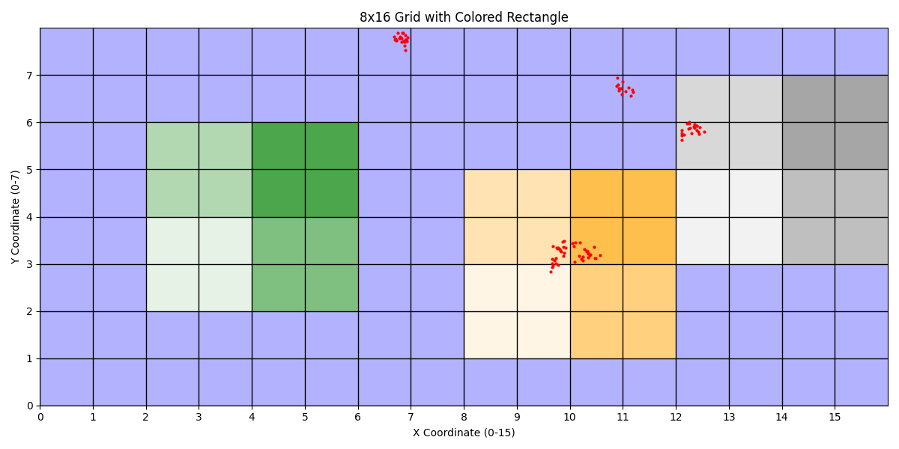
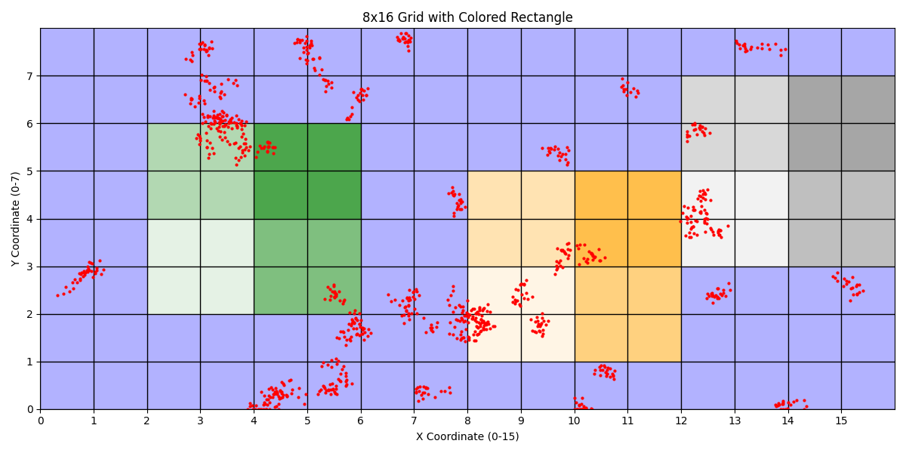
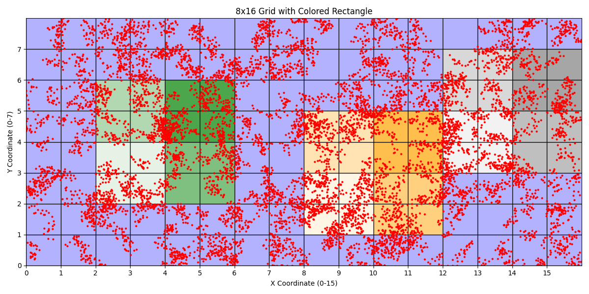

# 处理器验证与处理器模糊测试（二）

本章节我们介绍测试样例生成的一些基本方法，以及分析其行之有效的原理。

## 基本测试方法

我们以下面这个功能模块为例子设计测试。这个功能模块（不需要在意是软件还是硬件）接受两个输入，一个输入的范围是 0-7,一个输入范围是 0-15，输出是一个值，我们用不同的颜色表示不同值的输出。现在我们需要设计充分的测试样例，来测试这个功能模块。当然，这里的“充分”与否是一个充满主观的词汇，其充分性视现状和我论述的需求而定。


### 遍历测试
最简单也是最有效的方法，我们遍历所有的输入组合。这样我们就覆盖了所有的功能测试点，用朴素的方法完美解决了这个问题。唯一的问题在于这个方法生成的测试样例集合巨大，可扩展性级差。现在输入的范围是(0-7, 0-15)，共计 128 个测试样例，但是如果是(0-79,0-159)，那就是 12800 个测试样例。其实上万个测试样例也还好，但即使只是简单的 64 位输入，他的全集也有 2^64 次方，那我们也不可能在有生之年完成验证，便显得没有意义了。因此，这种遍历测试仅适用于最基本模块、小型模块的测试。


对于(0-79,0-159)，遍历所有的测试已经比较困难了（这里我们假设受到硬件设备的约束无法遍历，但是在实际情况中一万个测试样例还是比较适中的测试规模），所以我们被迫选择测试的部分输入组合来试图获得较好的验证结果。即使从节约成本的角度考虑，用少很多的测试样例就可以得到比较高的验证效果，也是有意义的。但是怎么选择这部分输入呢？怎样用尽可能少的测试样例取得尽可能好的验证效果呢？（近似算法问题）

### 随机测试
最简单的方法就是随机生成测试输入，这种生成方法是最简单的。很多时候，大家会对这种随机算法保持高度的怀疑，因为这样就是把验证结果的好坏交给了天老爷。但是实际上，随机算法的输出一般是均匀分布的，理论上只要测试时间足够就就可以覆盖所有的输入组合，或者说只要执行时间够长，一个测试点被覆盖的概率就会足够高。因此从理论上讲，在足够长的时间内，随机测试的效果和遍历测试是等价的。但是在实际上，这个时间是很有限的，因此必然只有一部分测试点可以被覆盖。下图为随机测试 1280 个样例的覆盖结果，虽然只测试了 10% 的功能点，但是基本覆盖了所有的重要区域。总的来说，随机测试的算法和工程部署足够简单，测试样例生成效率极高，并且在实践中能取得不错的效果；缺点则是可控性较差，而且测试结果的可信度存疑。


### 边界测试
我们观察一下输出的细节。在(19,20)和(20,20)的位置，我们可以看到输出的颜色从紫色变为了绿色，发生了输出的突变。这里对于边界判断就是边界条件，19 或者说 20 将输出左侧和右侧划分为了两大类，因此我们需要检测这个边界附近的输出结果，判断区域边界的划分是否正确。这种边界测试在整体测试点中的占比显然是很小的，所以我们即使遍历验证开销也会小很多。考虑到边界更具有临界突变的特殊性，并且占比很小，如果我们简单用随机的方法很难覆盖到这些特殊点，因此更适用于手工定制。当然如何分析模块特点，确定和构造这些边界，也是一个复杂、不通用的问题。边界测试的结果如下：


如果边界测试的集合仍然太大了，我们仍然可以用随机的方式对边界测试点进行测试，来逼近期待的效果。


## 边界信息模型
这是我为了分析随机测试和边界测试内在的机理而建立的模型，其不合理之处请批评指正，但也请尊重我的学术版权。

编程的过程就是用一种语言描述功能信息的过程。我们定义功能 F 蕴含的信息是 I，然后用语言 L 的元素 l 对功能 F 进行描述。l 的每个字符 c 承载了 I 的部分信息 i。我们验证的目标就是验证 l 的各个子部分的蕴含的信息 i 是否正确。

我们可以用简单但庞大的真值表对功能进行描述，每个真值表表项表述一个输入到输出的关系。例如，对于上述的功能，我们可以用如下的 C 代码进行编程描述，可以看到二维数组的每个表项描述一对输入输出关系，我们假设描述问题所需的信息含量是单位 I，这里用 12800 个表项来完成问题描述，所以每个表项的信息含量仅为 I/12800。可见这种描述方法所用的 l 字符长度极大，每个子部分蕴含的信息量极小。
```C
代码一：
assume(0 <= i <= 159);
assume(0 <= j <= 79);
int array[80][160] = {
    ...
};
int o = array[j][i];
```
为了检验所有输入输出的关系的正确性，需要检验所有 12800 的输入组合，不然无论如何是不能完全测试正确的，正是因为每个子部分的信息量含量极低，所以我们每个测试可以验证的信息量极低，进而导致测试效率很低。对于这种基于点对的功能描述方法，只有遍历测试才可以测试完全（所以理论上随机测试、边界测试不是万能的，知识不得以而为之的折衷选择）。

这里我们引入“边界信息模型”作为功能信息描述的建模方式，并以此论证一些测试方式的有效性。计算机编程的问题，可以被看作一个分类问题，我们把输入划分为若干个子类别，每个类别有一致的输出方式，这个问题的信息就可以由各个类别的划分边界和每个类别的表示方式表示。我们上述案例明显就是一个分类问题，我们用四条边界把模型划分为两个区域，一个区域输出绿色，一个区域输出紫色。我们可以用 if-else 语句构造分类的边界，并给每个区域赋值对应的颜色：
```C
代码二：
if(20 <= i && i < 80 && 20 <= j && j < 60){
    o = 绿色;
} else {
    o = 紫色;
}
```
假设我们的建模和功能是一致的，我们现在只需要检验边界是否构造正确，以及每个区域的表达方式是否分配正确即可。对于边界，我们就可以手动构造边界测试，检验边界位置是否和理论模型保持一致；对于每个类别，我们需要检测类别是否一致，而不需要检测所有的输入输出点对。这里我们用四个边界+两个区域表示完成了对功能的描述，因此每个子部分表述的信息量极高；我们验证每个子部分可以覆盖的信息量极大，所以验证效率极高。

实际上，代码一也可以看作一种边界模型。数组的每个表项都可以看作是一个单独的子部分，所以这个模型相当于把问题分割为 12800 类，然后给每一类分配绿色还是紫色。因为分类众多，这就导致最后验证的边界数量和类表示方式众多，每个子部分信息含量低，验证效率低。

我们编程的时候会自觉的将问题进行高度抽象和归类，例如上述例子，根据区域的特点，可以将 12800 个子类合并为 1000 类、10 类乃至 2 类，这种信息压缩的方式，大大提高了信息表达的效率，也包括代码开发的效率，进而提高了验证的效率。可见，代码开发效率、验证效率是和问题的抽象程度、模块化程度正相关的。

### 边界测试有效性的论证

我们提到只要检测四条边和两个区域的正确性，就可以证明上述功能的有效性，这里涉及到为什么边和区域表达的正确性可以快速验证。
```C
代码二：
if(20 <= i && i < 80 && 20 <= j && j < 60){
    o = 绿色;
} else {
    o = 紫色;
}
```

这个快速验证不是无条件正确的，是基于代码高度的模块化和子模块先验的正确性这两个前提上的。这里我们需要检验绿色的矩阵区域都是被设置为绿色的，这里的表达式是`o = 绿色`，因为`=`可以将任何一个输入位置的输出都变为对应的值，所以只要有一个位置被验证颜色正确，那么所有位置都可以被验证颜色正确。再比如我们需要验证 20 是不是被正确划分，只需要检验附近的一组点就可以了，因为`20 <= i`的边界 19、20、21 都被验证边界正确了，无论了 j 怎么变化都可以边界正确。但这些前提不是天然成立的，而是基于`=, <=, &&, <`等算子的正确性和模块化的前提下。如`20 <=`本质上是一个输入范围为 0~159 的算子，如果是我们自己用 cmos 管构，是需要充分测试所有 160 情况的，但是因为默认提供的`<=`模块是对的（或者说历史上验证了他的正确性），所以这么多的状态只需要检验 20 的边界即可，需要验证的状态就从 160 种压缩为了 2 种。

正是这种模块化、层次化的设计提高了信息的表达能力，提高了验证的效率。模块化将长长的函数语句转化为简单的函数调用，层次化将小模块组装为大模块，从而不断提高子部分的信息表达能力，不断降低需要验证的信息空间。比如我们首先验证加减乘除等基本算子的正确性，这样就可以验证所有被使用算子的正确性；之后验证基本算子构造的基本函数的正确性，此时只需要验证算子的组合，而不是需要再验证算子本身，相当于基本算子压缩了输入分类，所以可以大大降低待验证的空间；然后用基本函数构造复杂函数，依次了类推。

### 随机测试对边界测试的补充

这是出于四方面的考虑。

* 区域内部表达验证：边界测试需要检测边界内部地实现是否正确，虽然因为高度模块化的存在，一个点的正确可以推理得到所有点的正确，但是还是随机采样测试其中一个点的。

* 对分类构造的补充：想要构造正确的边界测试，需要对问题的边界模型有深刻的认识。这不仅仅需要对问题有充分的认识，还要对代码实现有充分的认识。下图的代码中，输入数据依次发生了三次变换，然后类别依次可以分为 2 类、4 类、6 类和 2 类。所以为了充分进行边界验证，我们其实应该针对 6 类的边界进行测试。因此，除非我们对代码逻辑有深刻的认识，不然是无法构造完备的边界测试的。对于复杂的代码逻辑，验证者难以构造正确的边界，更不要说有时候没有源代码。这个时候就可以考虑用随机测试尝试覆盖验证者无法意识不到的边界。


* 对复杂边界的妥协：对于复杂的测试逻辑而言，其内部的分类情况是非常复杂的。也许一个 12800 输入组合的类别内部真的有 10000 种组合。这个时候边界描述的信息含量会快速上升，以至于和点阵描述相比信息含量没有明显优势，甚至更差，那只能用随机测试的方式在测试效果和测试效率之间寻求妥协了。

* 检验模块正确性假设：我们之前说边界测试的正确性是基于模块化假设的，例如我们默认基本算子、基本函数是正确的，但是这也是有概率不成立的，比如流片失败、芯片老坏、磁盘损坏、高能粒子流等影响，所以在高正确性要求的情况下，随机测试有保底的作用。


我们最后小结一下二者的优缺点:
* 随机测试：生成高效快速、不需要额外知识和人力、针对性弱、泛化性好、适用于低模块化场景和黑盒场景
* 边界测试：需要额外知识和人力成本、针对性强、泛化性差、适用于高度模块化场景

## 模糊测试

### 信息量搜索
我们继续沿用边界信息模型作为信息量的分布模型，认为不同输出颜色的输入是属于不同类别的，类别之间的分界线是信息量含量很高的结构。测试分界线周围的功能点信息验证效率高，测试分界线内部的功能点信息验证效率低。我们理想的测试生成是对信息量高的区域进行较多的测试，对于信息量低的区域进行较少的测试，但很多时候我们缺少对模块内部构造的认识（比如没有源代码，比如代码结构过于复杂），因此我们可以考虑用一个搜索算法慢慢寻找模块内部信息量高的区域，勾勒出信息量的分布（在边界信息模型中就是边界地分布情况），然后根据信息量的多少进行不同程度的测试。

现在我们设计了如下的测试算法：

1. 随机生成一个测试输入作为搜索的原点，检查测试输入的颜色信息
2. 以上个测试输入做为起点随机游走一段距离（如 0.1），然后检测颜色信息变化
    * 如果颜色信息没有变化，就说明现在是在一个类别内部进行测试，信息量较低，甚至没有提供新的信息量
    * 如果颜色信息发生变化，就说明现在跨越了类别的边界，发现了类别边界这个信息量较高的结构，提供了新的信息量
3. 如果发现信息量较高的结构，就继续重复 2 的游走过程，尽可能地测试边界附近的测试点
    * 如果 3 可以一直重复，就说明一直在围绕边界进行测试，可能在原地打转，可能沿着边不断测试
4. 如果连续一段时间（比如 20 次突变）都没有找到新的边界（没有提供足够的信息量），就会进入 1
    * 说明附近大概率没有什么新的有待发掘的信息量，所以去一个较远的处女地进行信息量探索

我们现在用这个算法进行测试，下图分别是第 100、1000、10000 次测试的执行结果：




我们可以清晰地看到在色块的边界测试的规模比较密集，而在色块的内部测试比较均匀分散。前者逼近了我们需要的边界测试，后者逼近了我们需要测试的随机测试。这样我们就再没有先验知识保证的情况下哎，得到了和之前测试类似的效果。

### 通用算法

我们现在正式介绍通用的模糊测试算法：
1. 获得一组测试集合作为语料库 corpus
2. 挑选语料库的中的一个测试节点或者随机生成一个节点，进行突变 mutate
3. 用突变结果进行测试，反馈覆盖率 coverage
4. 如果突变提供了新的覆盖率就继续突变，并且将这些有意义的突变加入语料库
5. 如果突变长期没有提供新的覆盖率，就选择其他的语料或者随机生成新的输入，执行步骤 2。

**突变 mutate**：突变就是对输入进行修改，例如将 01010 翻转若干个 bit 得到 11110, 或者将 01010 加上一个值得到 01011，或者产生一个新的随机数等等。突变的过程，其实就是之前讲到的测试输入随机游走的过程，只不过随机游走是在 N 空间下走一个步长，而 bit 翻转是在 GP(2) 空间下走一个步长。设计难点在于如何设计突变规则，如怎么修改输入，何时修改输入等等。

**覆盖率 coverage**：在边界信息模型的语义下验证的信息量占总的信息量的比值。我们的信息量是 I，如果我们可以验证 0.75 I，那么覆盖率就是 0.75。我们的目的就是提高信息量验证的覆盖率，让覆盖率向 100% 靠拢。上述的搜索信息量的过程，其实就是寻找新的覆盖率、提高覆盖率的过程。设计难点在于如何设计评估信息量的覆盖率，不同的模型适用于不同的覆盖率测量方式。

**种子 seed**：在上述算法中，我们搜索信息量的过程就是从一个测试点出发，然后开始随机游走。这个起始点的位置对于寻找信息量是有很大帮助的，如果这个点在边界附近，那么就可以很快找到很多信息量；如果点在色块内部远离边界，那么就很难找到信息量。所以如果可以有一组优秀的测试点作为起始测试，那么就可以大大提高信息量搜索的效率。起始点被称之为种子 seed，优秀的种子带来优秀的测试效果。设计难点在于寻找优秀的种子。

**语料库 corpus**：如果我们发现一个测试样例可以提供很高的信息量，那么这个测试样例本身就是一个优秀的测试点，我们可以收集这些测试点作为 benchmark 来进行回归测试。另一方面，这些测试点周围往往存在其他优秀的测试点，比如一个边界沿线都是优秀的测试点，所以我们可以收集这些测试点，然后在这些测试点的基础上进行游走，来提高信息量收集的效率。那个用于突变的测试集合就是语料库。设计难点在于寻找优秀的测试集合作为语料库。

### 二进制突变工具 AFL
我们现在介绍 SOTA 的软件模糊测试工具 AFL，我们通过介绍该工具拓宽大家对模糊测试各组件、测试流程的视野。


