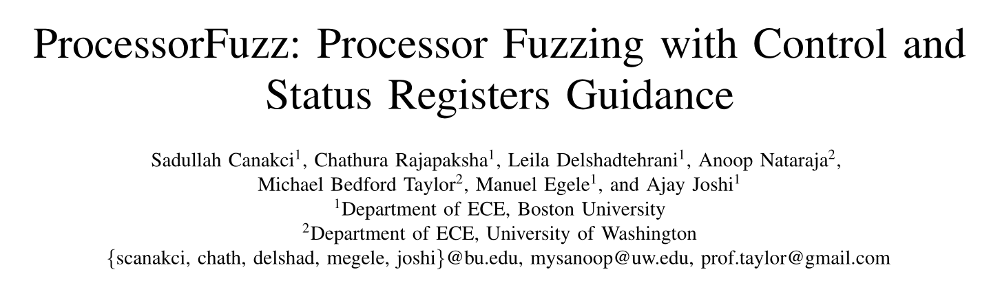
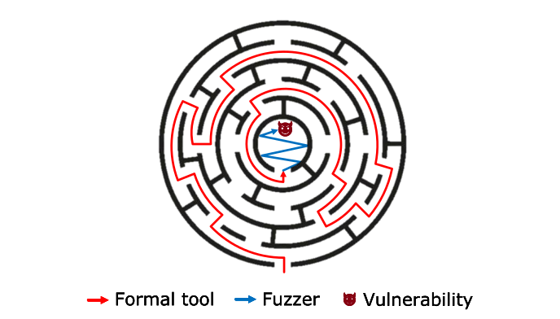

# 处理器验证与处理器模糊测试（三）

本文将介绍处理器模糊测试领域近年来有代表性 paper 的创新点和解决思路，帮助读者厘清学术界处理器模糊测试领域的发展脉络，同时也对我长达两年的处理器模糊测试工作进行回顾和总结。

## RFUZZ

RFUZZ 发表于 ICCAD 2018，是近来学术界处理器模糊测试领域的滥觞之作。该论文将软件的模糊测试技术迁移到了硬件测试领域，针对硬件特性设计了对应的 MUX SELECTOR 覆盖率插桩，并移植 AFL 设计对应的二进制突变技术。此外，RFUZZ 构造 FPGA 模糊测试平台，对模糊测试进行硬件加速，适用于所有的数字电路。


### 覆盖率指标和覆盖率插桩

为了衡量模糊测试的质量，我们需要对硬件的覆盖率指标进行设计。在上一篇文章中我们介绍了传统的硬件覆盖率指标，如行覆盖率、分支覆盖率、状态机覆盖率等。这些覆盖率大多借鉴软件软件覆盖率的设计方法，与抽象的 Verilog 语句相关联，更适用于仿真测试的场景，这导致如下两个缺点：
* 对底层 RTL 单元的反映不够直接充分
* 覆盖率指标不可综合（难以综合），无法运用于硬件加速的测试场景

数字电路的电信号可以分为数据信号和控制信号两部分，控制信号指的就是各个 MUX 单元的 SELECTOR 信号，可以反映有限状态机的状态变化、数据的选择等信息，在设计思路上和传统覆盖率中的分支覆盖率有异曲同工之妙。因此 RFUZZ 使用数字电路中的各个 MUX 的 SELECTOR 的值作为覆盖率：
* 对于每个 1 位 MUX，SELECTOR = 0/1，共 2 个 coverage
* 对于每个 N 位 MUX，可以看作 $2^N - 1$ 个 MUX 的组合，共 $2^{N-1} - 2$ 个 coverage
* 每个 SELECTOR 的覆盖率相互独立，N 个 1 位 MUX，共 2N 个 coverage

RFUZZ 在 Chisel 编译阶段从 Verilog 层面对代码进行覆盖率插桩。RFUZZ 会对将每个 MUX 的 SELECTOR 接入一个 Coverage 记数单元，根据 SELECTOR 的值变化统计 CoverageSum，并且各个子部分的 CoverageSum 汇总到顶层得到总体的 CoverageSum。类似于如下的实现：


**优点**：MUX SELECTOR 覆盖率和 RTL 单元紧密关联，直观反映了数字电路的执行状态，并且便于生成可综合的覆盖率插桩，从而可以结合 FPGA 进行覆盖率测量的硬件加速。

<span id="rfuzz-cover-shortcoming">**缺点**：</span>
MUX SELECTOR 用单个 SELECOTR 的值作为一个覆盖点，只反映了数字电路局部的覆盖情况，但是没有反映数字电路整体的覆盖情况。例如对于一个二位的 MUX SELECTOR，每个 SELECTOR 有 0/1 两种情况，当 MUX 遍历 01 和 10 两种情况后所有的覆盖点都被覆盖了，这样就将对 00 和 11 这两种覆盖点的探索排除在外。这是该覆盖率指标在设计之初就没能覆盖到的情况，需要设计覆盖范围更全面的指标来加以解决。

### 输入接口和二进制突变

为了进行模糊测试，我们需要设计测试样例生成和突变机制。RFUZZ 借鉴 AFL 设计了硬件的二进制生成和突变技术。

我们首先介绍 RFUZZ AFL 突变算法的输入定义：对于输入为 N 位的数字电路，我们需要检测该电路在 K 个时钟周期内的执行结果是否总是正确；因为数字电路每个周期有对应的 N 位输入，所以该数字电路需要接受 K 组 N 位输入，也就是长度为 KN 的二进制序列。如下图的 DUT 每周期接受 66(32+32+1+1) bit 的输入，共执行 4 个周期，那么 RFUZZ 需要生成 264(66*4) bit 的二进制序列。


RFUZZ 同样借鉴 AFL 设计了二进制突变原语，并且用 Rust 进行实现。二进制突变原语如下，可以看到和 AFL 大同小异：


对于处理器，RFUZZ 的测试对象是处理器内核加处理器数据段内存，其输入包括 32 位的指令信号、全局使能信号、全局复位信号、外部中断信号等，因此二进制的突变包括了对指令序列、全局控制信号、外部中断事件的生成，基本覆盖了处理器执行需要的执行内容。

**优点**：该二进制突变算法借鉴了 AFL 的成熟经验，在理论上可以覆盖所有可能的测试情况，实现起来也非常简洁。并且该算法是针对二进制级别进行突变的，具有很好的通用性，不仅适用于处理器硬件模糊测试，还适用于所有数字电路的硬件模糊测试。

<span id="rfuzz-mutate-shortcoming">**缺点**：</span>
二进制突变算法极强的通用性，也决定了它过于孱弱的专用性，即它没有针对处理器输入的特点进行突变。如我们在上一篇文章中提到的，信息量在二进制输入空间中分布是不均匀的，二进制突变算法给予每个输入一样的初始权重，是缺乏针对性的。RFUZZ 用二进制突变算法生成 32 位指令输入，一共有 $2^{32}$ 的突变范围，但是根据 RISCV 指令手册，只有很小一部分二进制组合是合法的指令，这导致大多数的突变生成都是非法指令，只能检测取值、译码等很有限的模块，而难以深入其他模块。此外，如 riscv-test 等手工的测试程序往往有几百条指令组成，且功能复杂，排列巧妙，希望 AFL 通过随机突变就生成如此复杂的指令组合，不啻于让猴子随机敲键盘写出莎士比亚的作品，因此其突变生成的指令序列规模及其有限。再加上其他的输入信息也需要满足一些条件约束才可以实现功能，这就导致输入能达到的功能进一步变差。虽然理论上，二进制突变算法只要有足够长的测试时间，就可以覆盖所有的执行情况；但实际上，时间是极其有限的，只有根据处理器的特点增加突变算法的针对性，才可以在有限的时间内覆盖更多的执行情况。

### FPGA 加速

过去的处理器验证工作主要是在 EDA 工具上仿真执行的，导致测试速度较慢。RFUZZ 设计了可综合的硬件验证框架，将验证平台迁移到 FPGA 上进行硬件加速，其对 Rocket 处理器的测试速度从 Verilator 的 6.89 KHz 提高到了 1.46 MHz，提高了 212 x。

FPGA 验证平台需要 FPGA 和上位机器相互配合，如下图所示：
1. Fuzzer 工具用二进制突变生成输入序列，然后写入 shared memory 的 input buffer
2. DMA 将 input buffer 中的信息发送给 FPGA 中的 StreamUnit，进而发送给 DUT
3. DMA 根据输入的测试样例进行执行，并且计算覆盖率，然后发送给 StreamUnit，通过 DMA 发送给 shared memory 的 Coverage Buffer
4. Fuzzer 从 Coverage Buffer 得到对应的覆盖率增长情况，然后调整突变策略，引导突变

因此 FPGA 除了将 coverage 插桩后的处理器 Verilog 综合下板子之外，还需要编写对应的 StreamUnit 和 Fuzzer 驱动代码。


**MetaReset 技术**：测试平台出于验证和复现的需要，需要处理器初始化到稳定可控的初始状态。但是很多寄存器在全局初始化结束之后就无法手动初始化，或者如部分中间寄存器根本不会被初始化（没有初始化状态），对此 RFUZZ 设计了 MetaReset 的 Chisel Transform。该 Transform 对处理器增加了全局的 MetaReset 信号，并且会在 Chisel 代码生成阶段对每个寄存器增加 MetaReset 高位有效的 0 初始化操作，从而解决初始化不可控或者无法初始化问题。如下面的代码，当 MetaRest=1 的时候，r 寄存器就可以初始化为 0。

```Verilog
    reg [31:0] r;            
    always@(posedge clk)begin
        if(reset)begin       
            r <= 32'h1993;   
        end else begin       
            r <= r_next;     
        end                  
    end                      
                            
    =>

    reg [31:0] r;               
    always@(posedge clk)begin   
        if(MetaReset)begin       // add MetaReset   
            r <= 32'h0;          // add MetaReset
        end else if(reset)begin
            r <= 32'h1993;
        end else begin
            r <= r_next;
        end
    end
``` 

**SparseMem 技术**：除了部分寄存器无法初始化之外，SRAM、DRAM 等内存也因为其物理特性无法初始化。考虑到 RFUZZ 模糊测试的内存访问规模很小，RFUZZ 用寄存器数组实现了可记录访存地址的稀疏数组结构，来取代原来的内存单元作为可复位的内存单元。
* 稀疏数组由一系列（地址、数据）对组成
* 当执行写操作的时候，根据地址更新对应的数据，或者分配新的表项写入
* 当执行读操作的时候，根据地址读出对应的数据，或者分配新的表项，返回初始值 0

SparseMem 读操作的电路图如下图所示：


### 存在的问题

**缺少正确性检查模块**：RFUZZ 虽然搭建了完整的硬件模糊测试框架，但是没有设计的数字电路功能正确性检测模块，因此虽然该工作可以生成任意程序、覆盖各个数字电路功能点，但无法检测和报告电路内部存在的错误。（可以回顾上一篇文章，模糊测试仅负责触发程序内部各个状态，不负责检查状态的正确性和异常情况的发生，这是需要额外设计的）因此还需要设计功能检测模块，才可以自动化验证功能正确性。

**覆盖率指标缺乏整体性**：MUX SELECTOR 覆盖率指标仅仅考虑单个 MUX SELECTOR 的状态，不考虑整体的 MUX SELECTOR 组合情况，无法反映数字电路整体的执行情况。详情参见[覆盖率指标和覆盖率插桩](#rfuzz-cover-shortcoming)一节。

**二进制突变的局限性**：二进制突变难以在有限时间内生成足够多样性和复杂度的测试程序，并且对应的指令序列长度、规模、功能有限。详情参见[输入接口和二进制突变](#rfuzz-mutate-shortcoming)一节。

## hw-fuzzing

hw-fuzzing 是对标 RFUZZ 发表的工作，由 google 设计发表在 usenix 2022。不同于 RFUZZ 设计了新的硬件友好覆盖率指标和硬件加速的模糊测试技术，hw-fuzzing 认为硬件仿真程序本身就是一种特殊的软件，沿用成熟的传统软件模糊测试技术足以取得较好的成果。hw-fuzzing 充分利用已有的软件测试和验证技术，提高处理器验证能力；并设计了基于总线协议的数据输入格式，提高了数据生成的针对性和通用性。


### hw-fuzzing 流水线

虽然硬件代码在设计方法和设计产物上和软件有巨大的区别，但是硬件在仿真模拟的时候，仍然会先被 EDA 工具转化为软件模型和二进制程执行。所以硬件在仿真模拟的时候，本质上还是一种特殊的软件，因此可以继续沿用软件模糊测试的技术进行硬件模糊测试。

hw-fuzzing 采用开源的仿真综合 Verilator 工具将数字电路 HDL、外围接口代码、仿真激励代码综合为硬件仿真二进制 HSB。仿真的软件引擎、覆盖率检测的软件引擎等可以软件库可以直接链接，得到完整的仿真程序。之外对于 HSB 的输入生成、突变、种子收集、漏洞检测、覆盖率反馈等和常规的软件模糊测试大同小异。


* 在覆盖率检测方面，hw-fuzzing 并没有自定义新的覆盖率指标，而是沿用了 AFL 软件模糊测试自带的块代码覆盖率、边代码覆盖率的插桩机制
* 在输入生成和突变方面，hw-fuzzing 使用 AFL 对输入进行二进制突变，不过他对输入格式做了更进一步的定制，详情参见[总线中心的驱动设计](#hw-fuzzing-drive-design)
* 在漏洞检测方面，hw-fuzzing 一方面利用 SVA 进行违例检查，当内部状态不满足设计约束的时候程序崩溃；另一方面利用处理器模拟器作为黄金模型，用差分测试检测处理器执行结果的正确性。这有效解决了 RFUZZ 没有提供错误检测的问题。

虽然 hw-fuzzing 失去了 FPGA 综合加速的优点，降低了测试的速度；但是 hw-fuzzing 利用软件的灵活性，充分结合了已有的 AFL 模糊测试技术、SVA 检测技术、黄金模型模块，提供了通用、灵活、功能健全的测试框架。

### <span id="hw-fuzzing-drive-design">总线中心的驱动设计</span>

各个数字电路模块的接口格式和协议是互不相同的。RFUZZ 将接口输入简单的建模为二进制序列，虽然解决了通用性问题，但是因为约束过于宽泛，导致 AFL 生成有效输入的效率不高。hw-fuzzing 将待测的电路模块连接到 TILE-LINK Uncached Lightwreight(TL-UL) 总线上，这样多样化的接口协议就转化为了统一的 TL-UL 协议。

hw-fuzzing 设计了如下的 hw-fuzzing 模糊测试指令格式，格式为 8 bit 的 opcode，32 bit 的 address，32 bit 的 data。hw-fuzzing 的 testcase 生成程序生成一系列的 hw-fuzzing inst，然后交给 TL-UL 依次根据 opcode 执行：
* 如果 opcode 是 wait，TL-UL 等一个周期，不发送任何请求
* 如果 opcode 是 read，TL-UL 就执行读操作，读取待测模块对应地址的数据（如 output）
* 如果 opcode 是 write，TL-UL 久之行写操作，写入代测模块对应地址的数据（如 input）


该设计允许用户在总线和待测模块之间加入一层自定义的数据抽象，利用得当就可以解决待测模块数据交换时的协议问题（如握手信号满足约束），相对于 RFUZZ 有效解决了协议握手的问题。但是在 address/data 具体内容的生成上仍然缺乏针对性的约束，对处理器的针对性一般。这个设计启发我们，即使不在数据生成阶段对数据内容进行约束，在数据处理阶段对数据进行约束转换也是有意义的。

### 基于锁状态机状态探索的能力验证

为了验证 hw-fuzzing 对于复杂路径深入探索的能力，hw-fuzzing 设计了 lock FSM 的探索实验：

lock FSM 是一个简单的有限状态机，只有当输入依次是 $correct_1, correct_2 ... correct_n$ 的时候，lock FSM 的状态才可以从 $state_1, state_2$ 依次跳转到 $state_n$，然后输出 unlock，不然就保持不变。为了让 lock FSM 可以达到 unlock 状态，就需要模糊测试工具突变生成对应的输入序列。lock FSM 问题的 n 的值越大，模糊测试工具需要探索的路径越长，需要的能力也就越强。


该工作通过让 hw-fuzzing 求解不同难度的 lock FSM 问题来证明其探索能力，论文表明 hw-fuzzing 最多可以求解 480 个状态的 FSM。

### 缺点

除了设计了总线中心的驱动接口外，hw-fuzzing 更像是把已有的开源工具做了结合，提供了一个成熟易用的模糊测试验证平台，但对于生成约束和覆盖率设计这些核心问题，贡献乏善可陈。

## DifuzzRTL

DifuzzRTL 由 SNU 大学发表于 SP 2021，是处理器模糊测试的奠基之作。该工作针对处理器的特点，设计了基于指令的输入生成和突变技术，以及基于控制寄存器的全局覆盖率指标，为 RFUZZ 遗留的两大问题给出了基本解决思路；此外，DifuzzRTL 还囊括了中断生成机制和执行结果检查机制，实现的功能完整的测试验证框架，并支持硬件加速。这为后续的处理器模糊测试工作奠定了基本框架。


### 基于控制寄存器的覆盖率指标

我们在介绍 RFUZZ 的时候指出，其 MUX SELECTOR 只能反映局部的执行情况，无法反映和覆盖全局的执行情况，DifuzzRTL 称之为：时间不敏感。直观的解决方法就是不使用单个 MUX SELECTOR 的值作为覆盖率指标，而是将所有的 MUX SELECTOR 组成一个高位向量，作为覆盖率指标，如 $(s_0, s_1, s_2 ... s_n)$。但是 MUX SELECTOR 的个数非常庞大，达到上万个，统计和存储这么大的覆盖率指标开销是巨大的，因此 DifuzzRTL 需要对该指标进行压缩。

考虑到 MUX SELECTOR 的值是由组合电路计算得到的，而组合电路的输入源于寄存器和外部输入。对于处理器这样的复杂电路，外部输入基本都会先用中间寄存器存储起来，因此可以简单认为组合电路的输入源于寄存器。DifuzzRTL 称参与 MUX SELECTOR 控制信号计算的源寄存器为控制寄存器，控制寄存器的值决定了控制信号的值，因此可以用控制寄存器值的组合近似等价于控制信号值的组合。一个控制寄存器往往决定多个控制信号的值，比如 Regfile 的 1 位写使能寄存器和 5 位索引寄存器可以控制所有 32 个寄存器写使能信号（指数级别的放大）。因此控制寄存器的值远少于控制信号，最大能起到指数级别的压缩效果。

DifuzzRTL 在 Chisel 代码生成的时候加入对应的 Transform，首先针对所有的 MUX SELECTOR 找到对应的源寄存器作为控制寄存器。DifuzzRTL 在每个周期将所有这些控制寄存器的值 hash 起来（进一步压缩），然后作为最终的 coverage 指标，置位对应的 cov_map，如果有新的 coverage，则累加 cov_sum。


### 基于指令格式的输入生成

DifuzzRTL 对处理器测试输入生成有了本质的飞跃。处理器作为特殊的数字电路，其工作流程是从内存中读入指令、解释指令、执行指令，指令是处理器执行的最小粒度，因此与其以 bit 为粒度进行输入生成，不如按照指令粒度进行输入生成。

考虑到合法指令本身的格式、各个位的值域是受到指令集手册严格约束的，因此 DifuzzRTL 根据指令集手册规定的指令格式生成满足 field 约束的合发指令。具体来说，DifuzzRTL 首先选择要生成指令的 opcode，然后根据 opcode 规定的指令格式进一步生成各个 field 的值。考虑到非法指令的存在，DifuzzRTL 也会刻意生成一些opcode 非法的指令，作为非法指令。和 RFUZZ 基于 bit 粒度的二进制突变技术相比，DifuzzRTL 基于指令格式的生成技术从根本上满足了指令内部约束，使得 DifuzzRTL 可以将更多的测试用在合法指令上。

后续指令突变的时候，就在原有指令的基础上突变其 operand、field 或者 opcode，确保指令格式仍然满足。

### 指令的摆放（控制流约束问题）

DifuzzRTL 虽然生成了一组合法的指令序列，但还需要将指令序列根据数据交换协议发送给处理器。RFUZZ 选择将指令直接发送给处理器内核暴露的 32 位指令接口，但 RFUZZ 仍然需要二进制突变生成有效的握手信号序列，才可以成功发送指令，这进一步降低了 RFUZZ 输入生成的有效性。DifuzzRTL 选择将指令直接存储到内存中，然后让处理器、内存通过总线协同工作，由总线接口电路直接完成数据交换协议——这个思路在 hw-fuzzing 中也有所体现。

<span id="control-constraint">处理器</span>根据 PC 寄存器的值访问内存，读取对应的指令。如果指令在内存中只是简单地顺序摆放，当处理器执行了一条跳转操作之后，处理器就会不执行中间大量的指令，直接执行后续的指令，这会导致指令生成阶段生成的大量指令不会真的起到测试作用。如下图，第 2 条跳转指令直接跳转到第 101 条指令，导致中间 98 条指令没有被执行（实际经验指出，80% 以上的指令都会被略过）。因此，DifuzzRTL 需要将指令摆放到内存中合适的位置，构造控制流将所有指令尽可能多地串联起来，形成行之有效的程序。

```

    +-------------------+
    |       inst 1      |
    +-------------------+
    |       jmp 101     |--------+
    +-------------------+        |
    |         ...       |        |
    +-------------------+        |
    |       inst 100    |        |
    +-------------------+        |
    |       inst 101    |<-------+
    +-------------------+

```

这个控制流约束问题是后续所有基于内存的处理器模糊测试工作都必须解决的问题，它除了会导致大量指令不会被执行到外，还会进一步导致许多严重的问题。首先，处理器的执行代码包括：1.初始化代码，2.测试代码，3.结束代码。其中 1,3 部分是对测试没有帮助的系统开销，只有测试部分才有有意义的执行负载，测试代码可执行部分的降低，会导致有效执行时间大大降低。其次，突变程序并不知道测试代码的执行情况，简单地将覆盖率反馈当作所有的测试代码的贡献，于是很多没被执行到的优秀指令序列，会因为没有贡献新的覆盖率，而被突变技术抛弃，误导模糊测试的突变方向。

DifuzzRTL 引入 spike 模拟器解决这一问题。第一条指令被摆放在处理器 PC 的初始位置，spike 模拟执行该指令，计算新的寄存器值和下一条 PC 值，然后将下一条指令摆放在该 PC 对应的内存位置，依次类推。最后 DifuzzRTL 得以确定所有的指令在内存中的位置，并且得到了所有寄存器最终的计算结果。这个指令排布会被生成一个 testcase，初始化到仿真的内存区域，或者通过 jtag 总线写入 FPGA 的内存单元。

### <span id="each-block-vs-each-inst">结果的检查（整体检测 vs 逐条检测）</span>

我们最终介绍 DifuzzRTL 的结果检查方案。DifuzzRTL 的测试程序在执行结束之后，会跳转到一个特定代码块，该代码块会将所有的寄存器值写入到一个特殊的内存区域，从而暴露给测试者。软件仿真测试可以将改内存区域的值和 spike 模拟得到的最终结果进行比较，检验结果的正确性。硬件 FPGA 加速平台则可以将特殊内存区域的内容通过 StreamUnit 发送给上位机器，再加以比较。

相比于 hw-fuzzing 的逐条指令结果比较，DifuzzRTL 块定位的做法大大降低了比较的次数和数据量，特别是在硬件加速平台上，大大减少 FPGA 和上位机间传递的数据量——如果每执行一条指令就传递所有的寄存器值，则 FPGA 模拟就难以进行了。但另一方面，逐条比较的方法可以立即定位漏洞的位置，且错误不会被后续执行覆盖（如寄存器错误的值被后续计算覆盖），大大降低了错误定位的成本，也显著提高了漏洞检测的精度。

### 对中断触发、中断异常处理、虚拟地址的支持

**中断触发**：为了测试处理器处理外部中断的能力，输入生成的时候需要同时生成中断事件。DifuzzRTL 在生成每条指令的时候，会额外生成一个中断事件列表，包括是否发生中断、发生几个中断、各个中断的事件类型是什么（onehot 编码）。后序执行程序的时候，这些中断事件会被外部驱动依次触发，从而检验处理器的响应能力。


**中断异常处理**：一方面，DifuzzRTL 会构造中断事件；另一方面，程序本身因为没有做更进一步的约束，潜在很多的异常（如 divide zero/access fault/illegal/ebreak 等）。当这些程序发生后，处理器要跳转到 mtvec/stvec 位置继续执行。对于 mtvec/stvec 的设置、后续代码的排布也可以作为随机生成的一部分，但是想要约束生成有意义的向量设置和处理程序是困难，且真实处理器中的向量设置和处理程序内容非常固定，没有太多随机测试的必要。因此 DifuzzRTL 放弃了对这部分功能的深入测试，而是照搬了 riscv-test/env 的异常处理程序代码简单处理。对于缺页异常，该代码分配并设置页表项，对于其他异常则直接退出。详情参见第一篇文章对 riscv-test 的介绍。

**虚拟地址**：虚拟空间程序的正确运行依赖于正确的页表生成，但依靠二进制突变的方法直接生成正确的页表格式还是太困难了，这里 DifuzzRTL 照搬了 riscv-test 的页表设置方式。DifuzzRTL 首先不设置页表，然后等发生缺页异常的时候，异常处理程序再根据虚拟地址分配对应的物理地址、拷贝程序、设置页表，然后返回执行。这里虚拟地址和测试程序的逻辑地址是简单的线性映射关系，如果虚拟地址范围超过线性范围是没有办法 handle 的。参见第一篇文章对 riscv-test 的介绍。详情参见第一篇文章对 riscv-test 的介绍。

DifuzzRTL 对于页表和异常处理方式的选择也成为后续处理器模糊测试的默认范式。通过放弃对部分复杂但模式固定的硬件机制的测试，改用人为设计的固定代码直接支持。对于一个复杂的功能组件，在条件有限的情况下，也许我们没有必要把所有的功能都设计得面面俱到，选择最重要的功能重点设计，然后依次兼顾其他功能也是可取的。

最后我们对 DifuzzRTL 的流程进行小节：
* 根据种子库生成指令序列和中断事件列表
* 对指令序列、中断列表进行突变
* 通过模拟器模拟决定指令在内存中的位置，并生成最终执行结果
* 将指令存入内存，然后进行仿真/硬件执行
* 将执行结果和模拟器结果比较，汇报错误
* 根据覆盖率反馈调整突变策略和储存新的种子
* loop


### <span id="difuzzrtl-ctrl-problem">仍然存在的控制流约束问题</span>

虽然 DifuzzRTL 考虑了控制流约束问题，并且给出了解决方案，但是并不能解决所有的控制流问题。

对于普通的分支、跳转指令，因为跳转地址没有进行约束，这会导致跳转地址可能进入无效的地址空间范围，从而触发 access fault，而不能继续摆放和执行后续指令。而对于异常相关的控制流，因为 DifuzzRTL 对于内存访问地址、程序跳转地址没有约束，这导致生成的程序很容易触发 access fault/illegal 等异常问题；包括 ebreak/illegal 等其他异常。一但异常发生，DifuzzRTL 就直接结束仿真退出程序，这就导致后续的指令没有办法继续测试执行，从而使得有效指令占比大大降低。

## ProcessorFuzz

ProcessorFuzz 发表在 HOST 2023 上，是对标 DifuzzRTL 做的改进工作。该工作在控制寄存器覆盖率指标的基础上设计了 CSR 寄存器覆盖率指标，并以此为基础设计了自洽的突变、结果检测、程序过滤技术，降低了执行时间和开销。但 ProcessorFuzz 总体来说并没有解决新的问题，也没有提供突破性的贡献。



### CSR 寄存器覆盖率

DifuzzRTL 用控制寄存器值的摘要作为覆盖率指标，任何一个控制寄存器值的变化都会产生新的覆盖率，然后诱导突变。该策略认为所有的控制寄存器都是一样的重要的，乘法单元里的 FSM 寄存器的重要性和 CSR 中的 satp 寄存器的重要性是等价的，于是 DifuzzRTL 容易陷入对比较平庸的控制寄存器（如计算单元的 FSM 寄存器）引发的状态探索上，而放弃了对重要控制寄存器（如控制部件的寄存器）的状态探索。

<span id="processorfuzz-coverage">ProcessorFuzz 指出，不同的控制寄存器重要性和地位是不一样的</span>，诸如 satp、mstatus、mie 等寄存器可以直接影响整个处理器的工作状态，而诸如乘法单元、浮点单元内部的状态寄存器则只能影响局部电路的工作状态，显然前者的改变带来的状态改变更大，突变探索的价值更大。我们在上一篇文章中提到，覆盖率指标是对信息量的定量描述，覆盖率指标分布和信息量分布越吻合，起到的引导效果越好，同样是控制寄存器，前者就应该比后者分配到更大的权重，而不是简单的平均。

在所有的控制寄存器中，CSR 中起控制作用的架构层寄存器无疑是影响最广泛、应该分配的权重最高的，因此 ProcessorFuzz 干脆使用这部分 CSR 的状态变化作为覆盖率指标，而抛弃了其他次要的控制寄存器，相当于给 CSR 寄存器较高的权重，而给其他寄存器 0 权重。ProcessorFuzz 相当于在有限的测试时间内将探索收益最大化；而 DifuzzRTL 虽然在理论上有更大的未来收益，但实际上，因为测试时间有限，它即不能得到太高的既得收益，又没有时间给他在未来翻盘。

在判断控制寄存器权重的时候，有两个启发式的方法：
* 影响的 MUX 越多，权重越大
* 影响的电路功能相似或者相同，则权重降低；或者说影响电路功能越多，权重越大

并不是所有的 CSR 都是控制寄存器，诸如 mtvec、mepc、mscratch、mtval 等数据 buffer 并不能起到控制作用，因此被选作覆盖率指标的 CSR 寄存器仅下表的 20 个 CSR：


架构层的 CSR 只会因为 csr 指令和部分指令的副作用才会改变，根据 RISCV 指令集手册的定义，每条指令最多改变一个 CSR 的值，因此用所有寄存器的值的组合作为覆盖率指标，和用当前变化的寄存器的值的组合作为覆盖率指标效果是一样的。更进一步的，ProcessorFuzz 用当前指令引起的 CSR 值变化的三元组 (csr_name, before_value, after_value) 作为最终的覆盖率指标，csr_name 是寄存器的名字，before_value 是变化前的值，after_value 是变化后的值。该覆盖率指标反映了处理器状态的变化路径，在效果的改进上类似于 AFL 边覆盖率之于块覆盖率。


### 逐条结果检测

DifuzzRTL 只在测试结束后进行一次结果检查，可能错过中间的错误结果，而 ProcessorFuzz 选择逐条检查就可以解决这个问题。但每次都检查所有的寄存器的值，会引入不小的开销。考虑到每条指令最多改变一个通用寄存器和若干个特权寄存器，因此只需要检查指令引入的寄存器差异即可，这就大大降低了需要检查的数据量。

ProcessorFuzz 在生成测试程序之后，让 ISA simulation 仿真执行，得到执行的 trace，然后检查相邻 trace 之间寄存器的变化情况，然后将这些寄存器变化记录下来作为每条指令执行结果的检查点。之后让 RTL simulation 执行测试程序，输出对应的 trace，然后进行 trace difference 的比较就可以了。


### 程序过滤

ProcessorFuzz 使用 CSR 的变化作为覆盖率，而 CSR 的变化在 ISA simulation 阶段就可以计算得到，因此在 RTL Simulation 之前，ProcessorFuzz 就可以知道覆盖率的增长情况。如果 ISA simulation 发现覆盖率没有提高，就可以略过 RTL simulation 阶段直接进行下一轮突变，节约了模糊测试的时间。


此外，因为不需要像 RFUZZ、DifuzzRTL 那样检查内部 MUX/REG 的状态，进而统计 coverage，ProcessorFuzz 不需要进行 RTL 插桩，又进一步节约了插桩的编译时间、降低了仿真时插桩电路的模拟时间。

### 和 DifuzzRTL 的比较结果

因为 ProcessorFuzz 只能软件模拟执行，无法进行硬件加速，所以这里是和 DifuzzRTL 的软件仿真部分比较的。可以看到 ProcessFuzz 的执行效率是 DifuzzRTL 的 2 倍，不过 ProcessFuzz 只有 1/3 的程序是真正执行的，其他 2/3 都是被过滤的。并用 1.23x 于 DifuzzRTL 的时间触发真实的处理器 bug。


从覆盖率上看 ProcessorFuzz 反而略低于 DifuzzRTL。但是考虑到 ProcessorFuzz 只记录了 CSR 的状态变化，而 DifuzzRTL 则记录了所有控制寄存器状态变化，从这个角度看反而说明 ProcessorFuzz 效率、质量更高。


不过还是要说明，这里的提高都比较有限，很难说产生了飞跃性的突破。

## TheHuzz

TheHuzz 是 Texas A&M 大学发表在 usenix 2022 上的论文。该论文在 DifuzzRTL 的基础上设计了突变优化算法，可以用尽量少的测试指令得到较高的覆盖率效果，最终同指令数取得了相比 DifuzzRTL 3.33x 倍的验证效率，并能在多个处理器上找到 11 个 bug，其中 8 个是真实的处理器漏洞。


### 回归传统覆盖率指标

相比于 RFUZZ、DifuzzRTL 设计了硬件友好的覆盖率指标，TheHuzz 和 hw-fuzzing 一样选择使用传统的 SV 验证覆盖率指标的组合：语句覆盖率、表达式覆盖率、分支覆盖率、条件覆盖率、翻转覆盖率、FSM 覆盖率。和自定义的覆盖率指标相比，传统的覆盖率指标不依赖特定的硬件描述语言，由 EDA 工具直接支持，有更好的通用性和扩展性。在这一派看来，MUX 覆盖率、REG 覆盖率除了可以用于硬件加速验证外，对于突变引导的帮助并不优于传统方法，甚至不如传统方法完备，甚至对于设计新的覆盖率指标持怀疑和悲观态度——与其设计对模糊测试帮助不大的硬件覆盖率指标，不如设计更优秀的输入生成和突变算法。

在漏洞检测上，TheHuzz 和 hw-fuzzing 一样选择回归基于黄金模型的逐条指令比较。

### 突变优化算法

我们在介绍模糊测试时，反复强调其特点：**根据覆盖率反馈引导输入突变**。但是在介绍了这么多的处理器模糊测试工作后，我们会发现，这些工作的覆盖率反馈对于输入突变的引导极其有限。

再上一篇文章中，我们用搜索算法类比模糊测试的突变算法。搜索算法根据当前位置 x 收集的信息 Info 决定下一步的步长 4h(x)$ 和搜索方向 $d(x)$，因此搜索算法从 x 走到 x‘：
$$ x' = x + \Delta x = x + h(x) d(x)$$
最经典的就是梯度下降法：
$$ x' = x - \alpha \nabla f(x), d(x) = -\nabla f(x), h(x) = \alpha $$
可以看到这些搜索算法根据当前信息反馈（如梯度），不仅可以决定是否搜索，甚至可以定量的计算出迭代方向和迭代距离；但是过去的硬件模糊测试算法只能根据是否有新的覆盖率反馈，选择继续在当前测试样例的基础上继续突变，还是选择其他测试样例。覆盖率反馈只起到了一个剪枝的作用，帮助我们过滤没有价值的测试样例，至于如何找到有价值的测试样例很大程度上仅依赖于随机化操作，而不是数学算法。我们希望可以找到这样的一个算法 F，根据输入 I 的覆盖率反馈 C(I)，可以定量生成下一个有价值的输入 I‘：
$$ I' = F(I, C) $$
固然我们暂时无法得到一个优美的数学表达式，但是至少我们可以充分利用已知的覆盖率反馈信息，来接近这个目标。

TheHuzz 将单次测试程序分为 CI（配置指令 config instruction，用于初始化、配置设置、异常处理等）和 FI（功能指令 function instruction，用于功能测试）。TheHuzz 为了追求覆盖率的快速增长，需要精心挑选一组 FI，让较少的 FI 可以带来较大的 coverage 提升。

TheHuzz 的突变优化算法如下：
* 针对指令集合 I 作用突变 M（如 bit 翻转、整数加法、opcode 替换），构造一系列 (I, M) 对
* 然后将单条 (I, M) 和 CI 相组合，得到一个测试程序进行测试，此时得到的 coverage 反馈就是该 (I, M) 贡献的 coverage
* 如此遍历所有的 (I, M) 得到 coverage 集合 C
* 根据 (I, M) -> C，求解一组最小的 (I, M) 集合，使得 $\cup C(I, M) = C$，给这组 (I, M) 较高的突变权重，给其余较低的突变权重；如果求解失败，就分配相同的权重
* 根据权重随机选择指令突变，得到新的程序

TheHuzz 第一次正视了**覆盖率引导突变**这个重要问题，用相同的指令可以取得 DifuzzRTL 3.33x 的 coverage，但是他给出的方案在实际执行的时候仍然存在很多瑕疵。首先，TheHuzz 的运行开销其实比 DifuzzRTL 大很多，考虑到他的优化算法也需要很多的执行时间，也许其本身的执行效率并不理想。再加上 TheHuzz 的突变技术是二进制突变技术，而不是约束性更好的二进制突变，使得其真实性能越发可疑。更可惜的是 TheHuzz 并没有开源，因此他的实现细节和真实性能无法得到验证。

但 TheHuzz 启发了我们两个开放性问题：覆盖率指标的作用到底有多大，新设计的覆盖率指标到底有没有意义；如何用覆盖率指标引导突变，如何设计定量的算法。对这两个问题的看法随着该方向科研地推进，将不断的发生转变。

## Cascade

Cascade 是 ETH Zurich 发表在 usenix 2024 的工作。该工作将工作重心放在了提升测试程序的生成质量，通过控制流、数据流纠缠的方式解决了控制流约束问题，并提高了控制流指令的复杂度和测试压力。该工作还涉及了二分法的漏洞定位技术和规避已知漏洞的生成放案。Cascade 在 6 个处理器上进行测试，并最终找到了 37 个处理器漏洞。

### 强制控制流约束

之前的工作如 DifuzzRTL 都是先生成指令，然后根据指令对应的控制流排布指令位置，因此这些工作存在控制流约束无法彻底满足的问题，导致很多的指令无法被正常执行，详情参见DifuzzRTL 章节的[控制流约束问题](#control-constraint)和[仍存在的控制流约束问题](#difuzzrtl-ctrl-problem)部分。

Cascade 则截然相反，他先决定控制流的执行情况，然后生成满足控制流的指令。Cascade 根据指令手册进行指令级别的程序生成，满足指令内部约束。Cascade 将指令分为三大类：
* 不跳转指令，包括 ALU 指令、FPU 指令等，如 add、fadd 等
* 跳转指令，包括 JMP 指令、部分异常指令，如 jalr、ecall 等
* 二义性指令，即可能跳、可能不跳，包括 LOAD/STORE 指令（可能触发异常）、BRANCH 指令，如 ld、beq 等

Cascade 的基本块生成算法如下：
* 随机生成一条指令
* 如果是不跳转指令，继续生成下一条
* 如果是二义性指令，决定是否跳转，如果不跳转，就生成下一条指令
* 如果是跳转指令/决定跳转的二义性指令，决定跳转地址
* 生成一个基本块，从跳转地址开始生成下一个基本块

由此可见，一个 Cascade 基本块由一系列非跳转指令和一条跳转指令组成（这也是基本块的基本定义，是符合设计直觉的）。为了确保跳转指令的跳转地址必须是目标地址，Cascade 在跳转地址前加入了若干条调整指令。如我们希望`jalr zero, 0x12(a0)`指令可以跳转到目标地址 0x10024，因此 Cascade 在`jalr`前加入一些立即数生成指令对相关的寄存器`a0`进行设置，确保他的值满足要求。

```
    lui a0, 0x10
    addi a0, 0x12
    jalr zero, 0x12(a0)
```

对于异常跳转，其跳转地址取决于`stvec/mtvec`寄存器，因此，Cascade 在该寄存器前加入立即数指令构造目标地址，然后生成`csrw`指令修改`stvec/mtvec`寄存器。如下列代码就让`sd`指令触发异常后跳转到`mtvec`所在的 0x10014 地址。

```
    lui t0, 0x10
    addi t0, 0x14
    csrw mtvec, t0
    sd zero, 1(t0)
```

因为两条指令就可以生成 32 位立即数，对于模糊测试的小地址空间已经足够了，所以在跳转指令前加入 3 条立即数指令即可。

Cascade 最终生成的完整指令序列包括如下几部分：
* 用于初始化所有寄存器的初始化块
* 一系列用于测试的基本块
* 用于 dump 所有寄存器值的退出块

```

    +----------+        +---------------+
    |          |   +--->|               |
    |          |   |    |               |
    |  初始块   |   |    |    顺序指令    |        +---------+
    |          |   |    |               |   +--->|         |
    |          |   |    |               |   |    |         |
    |          |---+    |               |   |    |  退出块  |
    +----------+        +---------------+   |    |         |
                        |               |   |    +---------+
                        | 立即数调整指令  |   |
                        |               |   |
                        +---------------+   |
                        |    跳转指令    |---+
                        +---------------+

```

### 控制流、数据流纠缠

上一节的强指控制流约束技术虽然解决了控制流约束问题，但是可以看到这里的控制流指令组合都是简单的立即数指令构造寄存器参数+单条跳转指令的组合，控制流多样性甚至不如 riscv-test 手工构造的跳转指令测试，这会导致测试程序的测试能力大打折扣。Cascade 使用控制流、数据流纠缠技术来解决该问题，即让跳转指令的寄存器依赖于顺序指令系列的计算结果，这样就可以构造数据竞争+控制竞争的复杂情况，提高处理器流水线的测试压力，覆盖更多的 corner 情况。

具体来说，Cascade 在生成指令序列之后，用 spike 模拟执行所有的指令，然后得到各个指令执行结束后的寄存器值。然后 Cascade 对基本块中的立即数调整指令进行替换，Cascade 从顺序指令的目的寄存器中挑选一个作为数据 src，用跳转指令的目标寄存器作为数据 dest，然后构造立即数调整指令生成立即数 diff，让 src 和 diff 计算生成 dest 需要的值，并写入 dest 寄存器。如下，src 寄存器 a0 的值是 0x10012，而我们需要的 dest 寄存器 t0 的值是 0x20034，所以 Cascade 构造 t1=0x10022，然后让 t1 和 a0 相加（也可以是其他算术操作），然后写入 t0，从而满足调整的目的。

```
    src: a0 = 0x10012
    dest: t0 = 0x20034
    lui t1, 0x10
    addi t1, 0x22
    addi t0, a0, diff
```

上述例子可以发现 t1 寄存器的值需要根据 a0、t0 模拟的结果进行修正，也就是说 t1 的值在模拟-指令调整之后会发生改变。如果下一个基本块也使用了 t1 作为 src 寄存器，那么这个调整操作就会导致后续基本块的模拟结果都发生变化，那必须重新进行 spike 模拟，然后重新调整指令，在这个假设下每修改一个基本块就要进行一次 spike 模拟，这是非常低效的，有没有办法让调整指令不影响后续指令的仿真结果呢？

方法很简单，如果这个寄存器被作为调整指令目的寄存器，那么后续基本块就不使用该寄存器，直到该寄存器被顺序指令重新赋值（值不再受调整指令操作影响）为止。因此 Cascade 设计了一个 FSM 来记录每个寄存器的状态，防止使用会因为调整指令而修改值的寄存器，被作为后续指令的源寄存器。FSM 如下图所示：


调整指令由三条指令组成，分别是 lui、addi、xor，$r_d$ 是上文提到的源寄存器 a0，$r_{app}$是上文提到的目的寄存器 t0，$r_{off}$是上文提到的用于调整的寄存器 t1。

* free 状态的寄存器表示他不受调整指令影响，可以被顺序指令任意使用
* 如果指令被 lui 调整指令操作，他从 free 进入了 gen 状态
* gen 状态的寄存器会被 addi 进一步修改，然后进入 ready 状态，立即数设置到位
* ready 状态的寄存器会和 $r_{app}$ 寄存器结合，得到最后的结果，这个时候他的任务完成了，进入 unrel 状态
* unrel 状态的寄存器的值还是会被调整指令影响，仍然不能被继续使用
* 当 unrel 寄存器被顺序寄存器（状态图中的 e 指令）重新赋值就进入 free，可以再次被使用
* 被用于跳转指令的寄存器是 applied 状态，不可以用作调整寄存器

其实这篇文章说的过于复杂了，其实只需要六个双向转换：
* 跳转指令的寄存器作为 dest（free->dest）
* 某个 free 寄存器作为 src（free->src）
* 选择除 src 和 dest 外的 free/off 作为 off (free->off)
* off 在被寄存器调整指令外的指令重新赋值后成为 free (off->free)
* src 和 dest 在调整结束后成为 free（src/dest -> free）

通过该方法，Cascade 的单次程序生成只需要一次 ISA Simualtion 即可，比多次 ISA Simualtion 和 DifuzzRTL 的逐条仿真要高效很多。

### 漏洞规避、检测和定位

**漏洞规避**：漏洞规避是模糊测试的一个重要问题。当模糊测试程序找到一个漏洞之后，模糊测试后续的突变程序很容易反复触发这个漏洞，最后局限于这个漏洞，无法深入探索其他的漏洞。Cascade 在代码生成阶段规避已知漏洞。的那个找到新的漏洞之外，Cascade 的使用者手工分析漏洞的成因，然后在代码生成的时候规避对应指令组合的生成。

**漏洞的检测**：考虑到逐条检测的低效性，Cascade 回归了块检测技术。当程序执行到最后会进入退出块——当然如果程序很长时间没退出，大概率是处理器执行出现控制流错误，导致不能正确退出，这个时候超时关闭进程，然后报告漏洞即可——退出块会 dump 所有寄存器的值，然后再和 ISA Simualtion 阶段的推测结果进行比较即可。

**漏洞定位**：因为不是逐条检测，所以不能直接定位出错位置。不同于 DifuzzRTL 的手工定位，Cascade 设计了二分法机制，就是根据二分法生成新的程序再次执行，不断缩小漏洞范围，最终定位漏洞位置。这中自动化的方法大大减轻了人工时间，1000 条指令只要执行 10 次仿真即可，比人工快多了。

### <span id="about-coverage">关于覆盖率</span>

Cascade 并没有设计覆盖率，也没有涉及覆盖率反馈机制，而是直接放弃了覆盖率再模糊测试中的应用。ETH Zuirch 组认为，覆盖率对于处理器模糊测试的测试程序生成帮助十分有限（毕竟只能剪枝），甚至于没什么帮助，只要测试程序生成工具生成的测试程序足够优秀，就能够覆盖足够多的功能点和触发足够多的异常。Cascade 和 DifuzzRTL 进行了覆盖率比较，它的覆盖率是 DifuzzRTL 的 10 倍，似乎有力佐证了他们的观点。这至少说明对于覆盖率仅作为剪枝依据的测试程序生成工作，测试程序本身决定了测试覆盖范围的上限，覆盖率反馈仅仅起到了微弱的加速作用。


## Morfuzz

Morfuzz 是浙江大学徐金焱团队发表于 usenix 2023 的工作。Morfuzz 设计了语义级别的生成原语，增强测试程序的内部约束；更重要的是，Morfuzz 通过软硬件结合的设计思想，彻底突破了软硬件之间的界限，将指令突变技术提升到前所未有的境界，并解决了架构合法差异引入的漏洞误报。截至今日，Morfuzz 仍然是硬件模糊测试的巅峰之作，后续的 Cascade、Hyperfuzz 等工作在对比工作中往往避其锋芒，对之避而不谈。在 Intel 的硬件模糊测试工作评估中，Morfuzz 被认为是唯一行之有效、具有现实意义的处理器模糊测试工作。


### 基于语义的程序生成

想要生成特定的程序功能，不仅要满足指令内部的 field 格式约束，还要满足指令间的语义约束。例如，想要生成一条合发的内存访问，仅仅生成一条格式正确的 ld 指令是不够的，还需要确保访问地址在合法的地址范围，因此需要额外指令进行合法地址生成。为了满足指令间这种复杂的语义约束，Morfuzz 不再以指令作为最小的程序生成单位，而以特定语义功能作为最小的程序生成单位，成为 block。根据语义，Morfuzz 生成了如下的 block：
* IntArithmeticBlock: 由一系列 I 扩展的算术指令组成
* FloatArithmeticBlock: 由一系列 F/D 扩展的浮点指令组成，以及对于 frm/fflags 的读取和设置
* LoadStoreBlock: 首先计算一个内存基地址，然后根据该地址生成一些列 load/store 指令
* PteBlock: 首先计算 PTE 的地址，然后对部分页表项加以修改，最后 fence.vma
* CsrBlock: 由一些列 csr 读写操作组成，仅修改部分 csr（诸如 mtvec/stvec/satp 不修改）
* SystemOPerationBlock: 由一系列系统调用指令/同步指令/ROCC 指令组成
* AmoBlock: 由一些 A 扩展的原子操作指令组成，首先计算一个内存基地址，然后基于该地址进行一系列内存计算
* ZkBlock: 由一系列密码学操作指令组成

Morfuzz 在程序生成的时候给每个块生成一个随机权重，然后根据这个权重随机选择一类块进行生成，如次迭代得到一组语义基本块，作为测试程序的主体。此外，Morfuzz 随机生成若干页的随机页作为随机数据部分。

### 基于约束求解的指令生成

DifuzzRTL 和 Cascade 都已经实现了单一指令的生成，前者根据指令格式对每个指令 field 随机生成值，然后对每个指令都构造了单独的类，然后根据传入的参数构造指令。这两种做法首先不能解决指令间的约束问题，其次指令 field 的约束没有结构化、模块化的代码支持，依赖于纯手工构造，对于编程、扩展都比较繁琐。Morfuzz 第一次将这个指令 field 约束求解的编程问题模块化了，大大便利了代码编程和指令集扩展。

Morfuzz 根据指令的 yaml 格式构造指令的 json 格式，下图为 JALR 指令的 json 格式，包括指令的指令集扩展（extension）、类别（category）、各个 field（RD/RS1/IMM），并且定义了每个 field 的取值范围。

```hjson
    "JALR": 
    {
        "extension": [
            "RV_I"
        ],
        "category": "JUMP",
        "format": "jalr {RD}, {IMM}({RS1})",
        "imm_type": "IMM",
        "imm_length": 12,
        "variables": [
            "RD",
            "RS1",
            "IMM"
        ]
    }

    variable_range = {
        'RD': reg_range,
        'RS1': reg_range,
        ...
    }
    reg_range = [
        "ZERO", "RA", "SP", "GP", "TP", "T0", "T1", "T2", "S0", "S1", "A0", "A1",
        "A2", "A3", "A4", "A5", "A6", "A7", "S2", "S3", "S4", "S5", "S6", "S7",
        "S8", "S9", "S10", "S11", "T3", "T4", "T5", "T6"
    ]
```

之后编程者基于 constraint 构造一个 Instruction 的求解器，值域范围是所有指令，包括指令名和指令各个 field 的值。Morfuzz 可以对指令的 extension、category、name 等进行约束，可以对立即数的取指范围进行约束，甚至可以自定义约束，对各个 field 的值组合做非常细致的约束（如`RS1 != RS2 and RS2 in ['A0', 'A1']`等）。在构造指令间约束的时候，只需要构造求解器、设置对应的约束函数，然后求解就可以得到满足要求的指令。不过求解器的能力也不是无限的，如果指令约束过于复杂还是存在求解错误的风险，有时候需要做必要的检查和修正，但多数情况下还是很方便的。指令求解技术并不能从本质上提高代码生成的质量，因此只是一个工程设计的巧思。

### 解决控制流约束问题

上面介绍的所有 block 都只是简单的顺序执行代码块，因此还需要引入控制流代码引入控制流测试，并将上述代码连接起来——因此 Morfuzz 不可避免的也需要解决控制流约束问题。我们在介绍 DifuzzRTL 的时候，着重介绍了控制流约束问题的重要性，并指出了 DifuzzRTL 存在异常退出过多、虚拟地址超过内存合法范围无法解决等控制流问题。相比于 Cascade 根据 ISA Simulation 和 FSM 对代码进行精细布局（不过 Morfuzz 发表地比 Cascade 早），Morfuzz 采用了更为简单且巧妙的方法，优雅地解决了这个繁琐的技术问题。

Morfuzz 将 block 序列分为 3 个一组，然后用控制流指令将组内 3 个块串联起来：
* block1 结尾加入一个 branch 指令，跳转地址为 block3 起始地址
* block2 结尾加入一个 jmp 指令，无条件跳到 block4（下一组的第一个块）
* block3 结尾加入一个 jmp 指令，无条件跳到 block2

这样虽然我们没有经过 ISA Simulation 阶段，不知道 branch 跳转与否，但是可以料到控制流方向是`block1->(block3)->block2->block4`，最多只有 1/3 的 block 不会被执行到。考虑到每个基本 block 中只有一类指令，为了可以覆盖多种不同类型的指令同时执行的测试组合，Morfuzz 会让相邻的 block 随机交换部分指令，从而覆盖上述指令组合。但是这部分功能在源代码中实现的一般，贡献有限。

```

    +-------------------+
    |                   |
    |      block1       |
    |                   |
    +-------------------+
    |   branch block3   |
    +-------+-----------+       
            |
            |   +-------------------+
        +---+-->|                   |
        |   |   |      block2       |
        |   |   |                   |
        |   |   +-------------------+
        |   |   |    jump block4    |---------------+
        |   |   +-------------------+               |   
        |   |                                       |   
        |   |               +-------------------+   |   
        |   +-------------->|                   |   |
        |                   |      block3       |   |
        |                   |                   |   |
        |                   +-------------------+   |
        +-------------------|    jump block2    |   |
                            +-------------------+   |
                                                    |
                                                    +--->

```

对于异常引发的测试中断问题，Morfuzz 对异常处理程序进行简单修改，一但捕捉到无法处理的程序异常，就让 epc+4 然后返回，忽略该异常，这样后续的程序就可以继续执行了。对于地址超出内存范围的问题，Morfuzz 修改缺页异常处理程序进行解决。Morfuzz 给指令分配了两个物理页，给数据分配了两个物理页。当取指缺页异常发生的时候，缺页异常处理程序将虚拟地址映射到对应的指令页物理地址，从而可以继续取指执行；当存取缺页异常发生的时候，缺页异常处理程序将虚拟地址映射到对应的数据页物理地址，从而可以顺利存取数据。此外，Morfuzz 的测试代码不存在类似 exit 块的退出机制，所以不会自动退出。这样无论访问的内存地址如何、无论指令是否触发异常、无论控制流如何跳转，Morfuzz 测试程序都可以在四页的物理地址空间和无限的虚拟地址空间当中，无限循环执行下去。

### 突破软硬件界限的突变技术

上述两个技术虽然解决了语义约束和控制流约束两大难题，但是生成的指令组合非常有限，至少存在以下几个问题：

1. 单个 block 内部的指令类型过于单一，没有办法测试多种不同类型指令组合的场景
2. 多数 block 没有对指令间寄存器依赖做约束，随机生成的指令间数据依赖不足，流水线压力测试不够
3. 控制流指令复杂度较低，缺少数据流、控制流纠缠能力，缺少连续控制流指令场景，甚至没有 JALR 间接跳转指令
4. 缺少内存间数据依赖，缺少对测试地址别名问题的设计

最后一个问题，所有的模糊测试工作其实都没有涉及，但对于前三个问题，DifuzzRTL 和 Cascade 虽然支持力度一般，但至少可以通过突变加以覆盖。反观 Morfuzz 在测试程序生成阶段也不过是修改 block 权重，生成新的 block，也不能依靠突变覆盖这些测试。难度这个 Morfuzz 反而不如 DIfuzzRTL？各位，Morfuzz 的神奇之处就在于他不是在静态生成阶段解决问题的，而是在动态执行阶段用其神奇的**突变技术**加以解决的。

**morph 指令突变模块**：DifuzzRTL 的突变技术会对上一个测试程序的所有指令进行突变，但是因为存在执行流问题，最后只有很少一部分突变指令会被有效执行，这导致突变的效率极其低下。这就引出了一个问题——如何让突变的指令可以被处理器有效执行到？Morfuzz 的答案是出乎意料的，于其让突变的指令被执行，不如让被执行的指令发生突变！指令执行包括取指、译码、执行三个阶段，指令被取指后就相当于被执行到了，但是如何执行指令要等译码阶段之后才会被确定。因此 Morfuzz 在 fetch 电路和 decode 电路之间加入了一个 DPI-C 实现的 morph 模块，对取指的指令的各个 field 进行突变，这样就确保了突变的指令一定可以被处理器执行，确保了突变执行的**完成度**。


Morph 模块是一个伪装成硬件的软件模块，他的突变方案包括如下：
1. 随机对 opcode 进行突变
2. 根据指令的 opcode 判断指令格式，对指令的各个 field 进行突变，特别是 funct field
3. 对于指令的 rd/rs1/rs2/frd/frs1/frs2/frs3 等 field，morph 会首先查看流水线内部正在被使用的 GPR/FPR 情况，然后随机选择突变为正在被使用的寄存器，或其他寄存器
4. 对于控制流指令的跳转地址、内存操作的地址，morph 突变为特殊 label 的地址，或者随机地址

因为 opcode 可以突变，所以 block 内的指令组合可以多样化；因为寄存器索引是根据流水线内部的寄存器使用突变的，所以必然可以引入指令间数据依赖；因为控制指令、内存操作的地址可以被突变为特殊/任意结果，因此内存重命名、连续控制流指令等问题也可以得到解决。基于该动态突变技术，处理器就可以执行丰富的指令组合，确保了突变执行的**多样性**。

最后，过去的工作在执行完所有指令后必须退出程序，然后开始下一个迭代，因此需要重复突变程序、生成测试程序、初始化仿真程序、执行配置代码等前置工作，导致模糊测试的效率降低。Morfuzz 的测试程序一方面是动态突变的，一方面是从不会执行结束的，因此 Morfuzz 可以不间断的进行指令突变和测试执行，确保了突变执行的**连续性**。

**image 立即数突变模块**：morph 可以有效突变指令格式和指令参数，但是对于指令操作数中的立即数和地址，morph 这种单条指令突变的能力有限，这就需要设计更高语义维度的软硬件结合的方案。Morfuzz 在总线上新增了 image MMIO 模块，该硬件模块也是 DIP-C 软件模拟，通过访问这个模块的不同 MMIO 地址，可以读去不同类型的随机立即数：

* 地址 0x0-0x8：返回 64 位随机数
* 地址 0x8-0x10：返回 64 位整数
* 地址 0x10-0x18：返回 64 位单精度浮点数
* 地址 0x18-0x20：返回 64 位双精度浮点数
* 地址 0x20-0x28：返回代码段地址
* 地址 0x28-0x30：返回数据段地址
* 地址 0x30-0x38：返回 next mepc
* 地址 0x38-0x40：返回 next sepc
* 地址 0x40-0x48：返回随机页表地址

在之前 8 个基本块的基础上增加了两个 block，分别是 magicloadblock 和 magicjumpblock，分别从 image MMIO 模块对应的地址读出需要的数据段地址和代码段地址，然后执行 load 操作和 jump 操作。通过软件指令读 magic MMIO 模块的方法可以让同一条指令在每次执行的时候读到不同的立即数，起到突变的效果。同时 magic 模块在随机生成各类立即数的时候可以根据立即数的格式、内容定制化生成策略，提高立即数的质量。例如，对于浮点数，image 对符号位、指数位、尾数位分别进行生成，调整 inf、nan、0 等特殊格式的权重，让立即数生成的分布更符合信息量的分布情况；对于地址则根据测试程序内部的 label 地址进行生成，容易得到有特殊意义的地址。

Morfuzz 沿用 DifuzzRTL 的控制寄存器覆盖率指标，当处理器在不间断进行模糊测试的时候，Morfuzz 也不间断的记录覆盖率反馈的增长。随着时间的推移，覆盖率的增长速度会慢慢下降，当局部增长速度小于平均增长速度的 1/2 的时候，Morfuzz 就认为当前突变已经失去价值了，发送 interrupt 停止测试，重新生成测试程序。这里生成的测试程序类似于种子，后续的突变测试类似于原来的基于种子的不断突变。Morfuzz 利用软硬件协同的动态突变技术，解决了模糊测试突变执行的完整度、多样性、连续性三大难题。

如果要吹毛求疵的话，该突变策略仍然有很多边角情况没有覆盖到，比如复杂的内存别名问题需要多条指令读写统一内存地址；对于 cache 解码结果的处理器，也没有办法应用 morph 突变机制；等等。但现实中的处理器，例如 rocket-chip 相对比较简单，对一些特殊的情况并不存在特殊的优化策略，因此即使遇到了这些精心构造的场景，也不会触发新的处理器行为。在这种情况下，继续细化测试程序的复杂程度就好比修炼屠龙术，虽然技艺精湛，奈何无龙可屠。模糊测试测试程序的多样化程度以测试对象的复杂程度为限，了解处理器的设计结构对特化测试程序的细节是有必要的。

**测试瞬态执行机制**：现代处理器广泛支持乱序执行和分支预测（比如 BOOM），处理器会根据控制流历史记录对分支、跳转行为进行预测，加速取指和代码执行效率，如果预测失败还需要支持状态回滚等机制，这还会引发瞬态执行现象。瞬态执行现象指出，会提交的代码会影响处理器执行结果，不提交的代码也可能影响处理器执行结果，这两者都是需要被考虑到的。想要充分检验处理器预测回滚机制的正确性，需要测试程序可以训练预测模块、触发瞬态窗口、触发回滚事件，需要构造精妙的训练代码和窗口代码。大多数模糊测试工作连基本的控制流约束都捉襟见肘，遑论瞬态执行了，但是 Morfuzz 却可以覆盖了这种情况。

首先，Morfuzz 是在两个代码页内循环执行的，这就可以让同一地址的控制流指令被反复执行，深入训练预测模块的历史条目，进而可以触发各种情况的预测事件；但大多数测试工作的测试程序是单向的，无法起到重复执行、反复训练的效果。其次，Morfuzz 的两个代码页是被多样化的指令填满的，因此引发的瞬态窗口内部的指令组合也是多样化的，进而可以触发对不同类型指令的回滚测试；但大多数程序内存存在大量的无效代码空隙，无法构造指令多样化的瞬态窗口。

纵然 Morfuzz 在设计之处是没有考虑瞬态执行的，但是它的突变方法却完美的覆盖了这一大类情况。

### 基于架构同步的漏洞检测

Morfuzz 用 spike 作为黄金模型，进行逐条代码结果检测。Morfuzz 发现指令的执行并不会影响所有的架构层寄存器，在控制流上会修改 PC 寄存器的值，在数据流上会修改最多一个 GPR/FPR/mem unit 的值，且对应的修改会在对应的硬件结构进行提交，因此只需要对这部分修改进行验证即可，无需验证所有架构层状态的值。这一点 ProccessorFuzz 也有提到。

指令控制流的提交（PC 的架构层修改）和数据流的提交（GPR/FPR/mem 的架构层修改）并不一定是同步的，因此可以分开检测。当对 PC 的提交信号拉高的时候，处理器调用 ISA Simulation 模拟一条指令，然后比较 PC 和 instruction 的值是否一致；然后等 wdata 提交信号拉高的时候，调用 spike 接口比较 wdata 修改的值是否一致。该方法没有直接检查 store 对内存的修改结果是否正确，因此测试程序在修改内存后会考虑加入 load 指令，将写入内存的数据写会寄存器进行检查；部分指令的副作用可能会影响特权寄存器的值，测试程序通过 csrr 将特权寄存器的值读入寄存器进行检查。


指令集手册对于处理器的实现存在一些宽泛的定义，比如对于 reserved 的 csr bit 可以是 1，也可以是 0。这就会导致不同处理器、模拟器的实现可能存在不一致，但是他们都是对的。这一现象同样会导致结果比较阶段，处理器和模拟器的执行结果存在指令集允许范围内的不一致；但模糊测试框架认为找到了一个实现漏洞，于是就会错误地中断测试，并汇报漏洞，这就导致了很多假阳性，以及测试效率的下降。

为了让模糊测试框架忽略这种误报，Morfuzz 在 spike 的基础上开发了 cosim。如果这种差异是指令集允许的，cosim 就会把处理器架构层的执行结果同步到模拟器的架构层。这样不但同步了当前指令引起的架构层差异，也可以消除后续指令对架构层差异的传播，cosim 支持对于 csr 部分 bit 和 mmio 读写一致性的架构层同步。


### 未解决的问题

首先，Morfuzz 并没有解决 DifuzzRTL coverage 存在的瑕疵，对于处理器覆盖率指标的设计没有更多的推进。其次，Morfuzz 仍然无法根据覆盖率反馈，对测试程序进行定量突变，覆盖率仍然只起到剪枝的作用。最后，所有模糊测试工作都在追求通用的测试程序生成策略，但是上一篇文章我们提到，测试程序生成的关键，在于根据程序的语义进行功能验证，通用的测试程序对于简单处理器已经太复杂了，但对于复杂处理器可能仍然太简单，因此如何根据处理器的架构特点和具体实现，针对性的生成测试程序，仍然悬而未决。

## HyperFuzz

HyperFuzz 是 Texas A&M 大学发表在 usenix 2023 的工作（TheHuzz 也是这个组做的，发表于 usenix 2022）。该工作首次将形式化的方法（或者说静态分析的方法）引入到处理器模糊测试领域，将形式化方法的定向性和模糊测试方法的随机性结合起来，覆盖模糊测试难以覆盖的情况，因而比前做快了 3x。形式化的方法根据覆盖率点和处理器的设计代码进行测试程序生成，为解决覆盖率引导突变、根据处理器实现生成测试程序问题提供了方案，弥补了方法论上的空白。HyperFuzz 和 TheHuzz 一样没有开源代码，实验评估结果和实现方法的可靠性存疑问，但不影响其在形式化方法上的开创性。


### HyperFuzz 的形式化求解方法

开源形式化工具 JasperGold 可以将行覆盖率/分支覆盖率等基础的仿真覆盖率转换为 cover property，然后进行形式化求解得到对应的输入和波形序列。因此 HyperFuzz 也回归了传统的软件覆盖率，然后用 JasperGold 工具进行路径求解。

因为软件覆盖率的覆盖率范围是先验的，所有在测试之初就可以知道所有覆盖点的集合范围（当然，有些覆盖点也许不可达），HyperFuzz 首先选择比较重要的覆盖率节点，然后用 JasperGold 将之转化为 cover property，然后求解生成对应的波形，之后从波形中还原得到触发指令序列。不过具体的实现过程仍然存疑。

不同的覆盖点重要性是不一样的（参见 ProcessFuzz 的 [CSR 覆盖率](#processorfuzz-coverage)一节），在测试时间有限的前提下，应该率先测试重要的节点。HyperFuzz 给出了三个启发式的选择方式：
* 选择 fanout 多的模块，输出变化后影响的模块多
* 选择覆盖点个数多的模块，方便后续突变覆盖周围的模块
* 选择传播深度深的模块，这样可以得到较深的探索路径

### 形式化方法和模糊测试的优劣

HyperFuzz 是这样介绍二者的优劣的。现在我们有一个复杂的迷宫，我们希望探索这个迷宫，找到深处的漏洞。模糊测试技术类似于到处穿梭的无头苍蝇，它的探索方向具有很强的随机性，可以探索一个区域的所用空间，但是如果遇到比较曲折的通道就很容易碰壁，然后来回打转、难以深入。而形式化方法则可以根据目标位置和迷宫形状求解出探索路径，做到精确制导，但是因为他是定向定点搜索的，所以难以快速遍历整个区域。因此当我们探索迷宫的时候，我们可以先用形式化的方法帮助我们进入迷宫的深处，然后再用模糊测试的方法从深处开始各向探索，试图找到目标漏洞。



以下图的代码路径为例，我们假设模糊测试的取值概率是均匀的。对于特定的覆盖率节点 coverage1，使用模糊测试的方法四个方向的探索概率是相同的，那么到达该节点的概率只有 25%；而形式化方法可以求解到达路径并求解输入组合，到达该节点的概率就是 100%（从这个功能看，形式化方法和静态分析方法效果是差不多的，这里的形式化和模糊测试结合其实就是静态分析和动态测试相结合）。可以看到形式化有较好的定向探索能力，适合深度探索；而模糊测试则呈现出较高的随机游走特性，适合浅度覆盖。


Morfuzz 的作者徐金焱则给出了相反的评价。对于深度有限的路径问题，形式化工具可以有很好的定向求解能力；但是随着问题深度、广度的变大（比如深度 100），问题的规模和复杂度会快速超出形式化工具的求解的能力，导致形式化工具无法有效求解。反而是模糊测试工具依赖其随机性和遗传算法，还有可能进入较深的路径范围，这种情况下，反而模糊测试比形式化方法更适合深度探索。而对于浅度覆盖，模糊测试工作因为其随机性，很难覆盖所有的情况，反而是形式化工具可以用数学方法验证所有情况，反而更适合浅度覆盖。因此，不妨使用模糊测试工具探索深度路径，在这个基础上用形式化方法验证附近情况。

可见工具的求解效果并不由工具本身决定，而是由工具的求解能力和待解决问题的难度共同决定。其实我们在第一篇文章就提到了，对于简单问题，形式化有很好的通解效果，但是随着问题复杂度的提高，其效果快速下降，反而模糊测试方法还勉强能用，这也是处理器验证模糊测试领域诞生的原因。因此，引入形式化的方法重点不是如何取代模糊测试，而是如何将两者的优点结合起来。

### 形式化方法和模糊测试的切换

对于初等深度问题，形式化可以给出充分验证，比模糊测试覆盖效果好；对于高等深度问题，形式化已经无能为力了，只能用模糊测试尝试覆盖；对于中等深度问题，形式化单次求解成本高，但是准确度高，收益有保障，而模糊测试单次求解成本低，但是准确度也低，收益没保障，因此 HyperFuzz 形式化方法可以用单次高成本得到一次高收益，然后让模糊测试方法在该基础上突变，用低成本进一步得到持续收益。

当然这是定性而言，定量上对于二者在不同问题尺度上的收益缺少先验的知识，因此 HyperFuzz 采用统计的方法判断二者的收益，并且选择收益大的方法。HyperFuzz 统计形式化方法和模糊测试方法各自覆盖点的平均探索时间：
$$r_{fuzz}(w) = \frac{\sum_{k_i \in k_w} n(k_i)}{\sum_{k_i \in k_w} t_{fuzz}(k_i)}$$
$$r_{formal}(w) = \frac{\sum_{k_i \in k_w} n(k_i)}{\sum_{k_i \in k_w} t_{formal}(k_i)}$$
先用模糊测试，随着模糊测试进行，探索的效率会下降，如果小于形式化方法的效率，切换到形式化方法；形式化方法效率下降到小于模糊测试效率，则切换到模糊测试方法。

## ChatFuzz

CHatFuzz 是 Darmstadt 大学和 Texas A&M 大学 24 年的工作，但是目前没有被会议接收，还挂在 arxiv 上。该工作第一次将 LLM 引入处理器模糊测试领域，利用 LLM 和强化学习技术进行测试程序生成。虽然该工作的方案和结果可信度充满水分，也没有被权威会议接收，但是其将处理器验证和 LLM 结合的创举是值的肯定的。


### 基于 LLM 的测试程序生成

在 LLM 烈火烹油的今天，结合 LLM 进行静态分析、模糊测试、漏洞定位已经是司空见惯得了，虽然该技术在处理器模糊测试还不成熟，但必然也是将来的发展方向。

ChatFuzz 基于 ChatGPT2 进行模型训练，选择让 ChatGPT 直接生成二进制作为输入。为了让 ChatGPT 生成的指令满足指令格式，并且满足一些指令组合，该工作将 linux 内核等复杂的开源工程编译为二进制数据，作为二进制输入，让 ChatGPT 学习，试图让 GPT 可以总结出 riscv 处理器的二进制指令格式，并且指令间存在一些语义组合。

在 GPT 有了基础的二进制生成能力之后，ChatFuzz 用强化学习技术让 GPT 生成的二进制进一步满足 RISCV 指令格式。该工作将 GPT 生成的二进制输入给 RISCV 反汇编器进行格式检查，如果格式正确就给予奖励，不然就给予惩罚，如此不断增加 GPT 的正确性。

在 GPT5 发售的今天（当时 GPT3 也大行其道了），GPT2 的生成能力已经很弱了，所以最后的效果也不会太好。从二进制学习指令格式，这个问题本身也太复杂了，何况还有数据段部分是没有格式，这部分噪声也需要做屏蔽。实际上完全可以让 GPT 学习 RISCV 的格式列表，然后根据列表和一些代码反汇编学习 RISCV 汇编序列的生成。考虑到 GPT 本身就很懂 RISCV 汇编，反而生成效果可以很好。

### 基于 覆盖率反馈的 LLM 训练

ChatGPT 用 LLM 的方法对覆盖率反馈引导突变做了解答。它对 LLM 做了一个强化学习，以期让 LLM 生成的测试程序可以覆盖尽可能多的覆盖点。ChatGPT 一边进行模糊测试，一边将覆盖率的覆盖结果作为反馈，根据覆盖的节点情况给予奖励或者惩罚。通过初步的训练之后，LLM 的测试程序生成可以更符合当前处理器覆盖率的需要，然后正式开始测试。漏洞检测使用黄金模型进行差分测试，这也是老生常谈得了。

### LLM 对于模糊测试的启发

ChatFuzz 最后给出的实验指标可信度并不高，首先他只用了分支覆盖率作为指标，但是这该指标本身就不能覆盖很多状态，而且只能体现局部特征，不如 DifuzzRTL 的寄存器指标有全局特征，也不如 TheHuzz 的传统指标组全面。对于处理器生成约束的理解，对于处理器语义的理解都还处于 RFUZZ 的年代，仅仅只是蹭了 LLM 的热度。

LLM 至少在三个方面可以增强处理器模糊测试的功能：

* 对于测试程序生成，LLM 可以学习 RISCV 指令集手册和 RISCV-TEST 等回归测试，学习指令格式和指令间语义约束，提高生成的指令多样性和语义多样性。并且我们可以将一些总结出来的启发式生成规则教给 LLM，提高他的生成能力。
* 对于测试程序的生成，LLM 可以学习处理器的实现细节。考虑到 LLM 有很强的静态分析的能力，完全可以让大模型替代形式化工具进行触发路径的探索和触发指令序列的生成。
* 对于漏洞检测，一方面可以考虑让 LLM 对代码进行静态分析，通过和指令集的对比检测代码存在的漏洞细节，不过考虑到这方面的 pattern 不成熟，也许难以做到；另一方面，当漏洞发生之后，可以让大模型根据波形和代码进行 root 定位，降低人力成本。

## GenHuzz

GenHuzz 是 Darmstadt 大学和 Texas A&M 大学发表在 usenix 2025 的工作，是 ChatFuzz 的续作。GenHuzz 的模型参数仅有 GPT 2 的 1/10，其在强化训练时考虑了指令集抽象和控制流约束，仅用 1% 的测试程序就取得和 TheHuzz 一样的效果，和 ChatFuzz 相比原理和质量有了质的飞跃。


### 基于指令汇编的 token 编码和训练

GenHuzz 通过自己构造 NLP 神经网络来进行模型训练，该模型由 NLP 惯用的 transform 和多头注意力机制等组成，具有强的 NLP 能力，其参数量只有 GPT2 的 1/10。

不同于 ChatFuzz 基于二进制的生成策略，GenHuzz 则选择生成汇编语言。首先，汇编语言作为一种结构简单的语言，更适合自然语言生成模型进行处理；其次，这避免了对二进制格式的学习和解析，更容易满足指令内部 field 的约束要求。在训练模型的时候，GenHuzz 用指令序列的字符串作为输入，然后期待 GenHuzz 输出相同的字符串。

指令的各个字段，如 opcode（add，beq 等）、operand（a0、a1、fa0、fa1、satp、mstatus、label、imm 等）被拆解为对应的词元，并且 embeding 模块转化为对应的编码，供 GenHuzz 模型学习和生成。指令-词-编码关系如下：
$$I_1,I_2...(add\ t0, t1, t3;sub\ t5, t2, t1;...)$$
$$t_{1,1}t_{1,2}t_{1,3}t_{seq}t_{2,1}t_{2,2}t_{2,3}...(add|t0|t1|t3|;|sub|t5|t2|t1|;|...)$$
$$f(t_{1,1})f(t_{1,2})f(t_{1,3})f(t_{seq})...(12|24|31|0|...)$$

训练的时候用交叉熵作为 loss，然后让下一个词生成满足学习到的指令序列的可能性最大。例如学习的是`add t0, t1, t3`，在模型输出`add|t0|t1`之后，我们希望模型下一个 token 输出 t3 的概率最大。于是需要让`P(t3|add,t0,t1)`最大。因此对应的训练公式是：
$$L(\theta)=-\sum^{M-1}_{t=1}P_{\theta}(x_{t+1}|x_1x_2...x_{t})$$

对应的梯度下降的迭代公式为：
$$\theta^{(k+1)} = \theta^{(k)} - \eta\nabla_{\theta}L(\theta^{(k)})$$

在这之后，GenHuzz 模型就可以得到基本的汇编生成能力，但是汇编格式的正确性、控制流约束能力仍然缺少保证。

### 基于指令有效性和覆盖率反馈的强化学习

为了提高模型生成正确指令的能力、指令控制流尽可能被执行、覆盖率尽可能地提高，GenHuzz 在测试的过程中通过强化学习，根据上述三个需要进行 reward 设置，调整模型的参数，改进生成的质量。因此 GenHuzz 设置了如下的奖励机制：
$$ reward = r_{valid} + \alpha Coverage + r_{bonus}$$

指令被赋予三种指标，在执行过程中只有 valid 并且 executable 的指令才被认为是有效的，给予$r_valid$奖励，其他的指令都是无效生成，因此需要让第一类的比例变高。
* valid/invalid：根据指令格式是否有效
* executable/unexecuatable：根据指令是否被执行到
* success/failed：根据指令是否抛出异常

为了让程序可以覆盖更多的 coverage，coverage 被作为奖励参数，$\alpha$作为超参数调整覆盖率的奖励权重。最后，当测试程序达到新的最大覆盖率之后，会给予额外的$r_{bonus}$，鼓励模型追求更高的覆盖率。为了让 reward 满足个性化的要求，GenHuzz 特地构造了一个 Scorer 神经网络进行打分。

另外，模型训练到一定程度之后会收敛到局部最优，之后难以探索新的 coverage，到这个时候 GenHuzz 会初始化模型到最开始的基本模式，然后开始新的 PPO 训练，以期探索更多的覆盖率情况。这里的强化学习类似于测试程序的突变，而对于模型的初始化类似于生成全新的测试程序种子。


其训练过程如下：
1. 加载初始化的生成模型
2. 生成 token 列表，编码转化为测试程序
3. DUT 执行得到覆盖率反馈，Scorer 进一步计算 reward
4. 迭代训练生成模型，重复步骤 2
5. 如果 coverage 饱和就初始化模型，重复步骤 1,开始新的 PPO

该方法使用行覆盖率、分支覆盖率等作为覆盖率，但是在和之前的多个工作对比的时候，一如既往只使用了分支覆盖率，效果和 Cascade 接近。但分支覆盖率就和 RFUZZ 提出的 MUX 覆盖率一样，容易饱和，且反映的全剧情况有限，不是好的测试指标，因此其覆盖率对效果的证明存疑。

## Encarsia

Encarsia 是 ETH Zurich（Cascade 的团队）发表在 usenix 2025 的工作。该工作设计了一个处理器模糊测试的评估框架，对已有的多个 SOTA 进行评估，并且对处理器模糊测试的技术和设计方向做了评价和提议。当然，部分意见存在争议，每个参与者可以有自己的看法。

### 模糊测试评估工作的缺失

从 2018 年 RFUZZ 出世到 2025 年，DifuzzRTL、ProcessorFuzz、TheHuzz、Morfuzz、Cascade 等优秀的处理器模糊测试工作陆续问世。无论有意还是无意，每个工作都试图用自己的实验数据，证明自己才是当之无愧的 SOTA，其言语纷杂，莫衷一是。这些工作证明自己测试效果的指标无外乎两种：获得了多少倍的覆盖率提升，找到了多少个新的 bug 和 CVE。

但各个工作的实验指标往往是难以比较的，或者存在片面性甚至虚假夸大的成分。就覆盖率而言，每个处理器工作都是在自己的覆盖率指标下进行实验的，必然会针对自己的覆盖率指标刻意优化，也许他的对比工作在这类指标下效果一般，但是在其他指标下却可以取得好的效果。甚至有些工作只展示占优的覆盖率数据，比如 ChatFuzz 和 GenHuzz 只展示在分支覆盖率上的能力，对于其他类型的覆盖率情况则避而不谈。而对于 bug 和 CVE，不同的处理器测试的处理器设计版本是不同的，并不具有太强的可比性。随着处理器设计能力的提高，找到 bug 和 CVE 的难度会越来越高，但这不说明该工作能力变差；但是他能复现已有的 bug 也不能说明其方法论有效，因为针对已知漏洞做适配也是常见的。有些工作还会专门测试一些冷门的处理器或者版本不稳定的处理器，用一些好挖的漏洞丰富自己的 bug 成果。甚至有些工作的实验数据、漏洞存在争议甚至明显水分，还有些优秀工作并没有开源或者难以复现，其真实性和有效性也要打个问号。

这就需要一个相对客观和全面的评估工作，来对这些处理器模糊测试工作做一个公正的测试，以期从繁芜丛生的实验数据中还原世界的真相。

### 评估框架的构造

既然要做能力评估，那么首先要设计一组评估指标。Encarsia 认为，覆盖率指标的可信度并不高。一方面，各个工作的覆盖率指标互不相同，将这些覆盖率指标统一起来是困难的；另一方面，很多工作动不动讲覆盖率提高了 3x、5x，但实际用起来效果差距不大，因此要么是数据掺杂了水分，要么覆盖率确实没有什么参考价值。因此 Encarsia 采信了 bug 挖掘能力作为评估指标。Encarsia 的基本思路是在处理器内埋设若干个人造 bug，然后让各个模糊测试工具进行漏洞挖掘，找到 bug 多者胜出——类似于设计了一场处理器 CTF 竞赛。

Encarsia 对已知的 bug 类型进行了总结，主要总结为两类：针对组合电路线路连接错误引发的 signal mix-up 类型；针对时序电路分值条件错误引发的 broken conditional 错误。Encarsia 讲处理器设计转化为 IR 格式，然后加入这两类漏洞

**signal mix-up**：该类 bug 是在编写 assign 电路的时候，因为线路连接错误导致的，如本来要输入 a 的，结果输入了 b。为了加入这类漏洞，Encarsia 将原有的部分连接断开，然后和其他的线路重新进行连接，以达到连错的效果。


**broken conditional**：该类 bug 是在编写 always 电路的时候，因为 if-else 的条件写错导致的，比如逻辑表达式写错或者写漏等。Encarsia 首先将 always 的 if-else 表达式转换为真值表，然后将真值表的输入、输出进行篡改，然后重新声称 always 对应的 IR。 


不过修改电路逻辑之后不一定会产生有效的漏洞，比如他修改的是无效的状态或者冗余的电路。之后 Encarsia 设计了一个形式化工具来判断漏洞是否生效，验证基本逻辑如下，他的目的是形式化检测是否存在一个输入让原电路和植入漏洞的电路输出不同。考虑到处理器的输入很多，Encarsia 用模糊测试的方式对部分输入进行随机设置，然后再进行验证，以此来降低验证空间。

为了降低验证的难度，Encarsia 设计了两阶段的验证方法，首先验证 input 能不能在修改电路输出上造成差异；如果可以的话，再进一步验证 input 可不可以在架构层造成差异。以此起到过滤、降低验证时间的方法。Encarsia 的平均验证时间随处理器规模而增大，在 80-800s 不等，但考虑到这是一次性开销，因此是可以接受的。


### 评估结论和建议

Encarsia 主要对 DifuzzRTL、ProcessorFuzz、Cascade 进行评估，无论是否启用覆盖率，DifuzzRTL 和 ProcessorFuzz 找到的漏洞完全一样，而 DifuzzRTL 和 Cascade 找到的漏洞互有长短。Encarsia 得出结论：
* 逐条指令检查并不比逐块效果更好，还浪费时间
* 覆盖率对于测试能力影响不大，还浪费时间

这两点我们在前文都有解释，前者我持反对意见，参见 ProssorFuzz 的[整体检测 vs 逐条检测](#each-block-vs-each-inst)。后者，在覆盖率仅起到剪枝的条件下，确实不能提高测试程序生成的上限，参见 Cascade 的[关于覆盖率](#about-coverage)；但是如果这个问题可以得到解决，我们可以根据覆盖率和设计得到更好的测试程序，也许就可以打破这种窘境，也许 HyperFuzz 为代表的形式化工作和 ChatFuzz 为代表的 LLM 工作可以给出答案。

此外 Encarsia 还提出了很多零散的建议，诸如：要覆盖边界情况，要覆盖完整指令集，要考虑微架构反馈，初始化种子是重要的，已有漏洞影响后续深入探索，可以将多个模糊测试工具结合起来等等。大多是一些老生常谈的指导性思想，或者自然的设计方向，并没有提出新的问题，也没有给出具体的指导方案。帮助有限。

### 论处理器模糊测试工具评估指标

可以看到 Encarsia 最终选择抛弃覆盖率指标，反而选择漏洞复现能力作为评估指标。从理论上来说，我并不认同这一点。对于真实的模糊测试场景，漏洞地分布呈现**整体稀疏、局部分散**的现象，在大部分区域没有漏洞，而在小部分区域附近充满了漏洞，因此一个模糊测试工具很可能很长时间没有找到漏洞，但是在某几次突变集中找到了一个模块的多个漏洞。工作 A 可能只探索了很少的状态空间，但正好找到了聚集在这个空间的很多 bug；工作 B 可能探索了很大的状态空间范围，但这个范围正好没有 bug。如果因此就说工作 A 比工作 B 好，就有用局部取代整体、偶然取代必然的风险。因为也许换一个漏洞分布环境，工作 B 的效果就比工作 A 好了。

模糊测试的目的是做处理器验证，处理器验证的目的是验证处理器**对的部分是对的，错的部分是错的**。证明一个功能是对的，提高工作的可信度和开发者的信心，和证明一个功能是错的，找到一个需要修补的漏洞，其贡献应该是等价的！使用覆盖率作为评估指标就是同时承认了“证明对”和“证明错”的价值，而使用漏洞挖掘能力为指标则只承认了“证明错”的价值，在验证能力的评估上是片面的。在安全科研领域有一种 BUG 导向的习惯，因为找到一个新的 BUG 可以引起新的市场效应，无论是攻击者还是防御者都必须闻风而动，及时展开攻击或者进行防御，它可以为市场带来及时的经济反馈；而没有找到 BUG 或者说明该工作是没有 BUG，其被市场认可的程度就会小很多。所以，一旦我的工作可以找到前人没有找到的漏洞，那么大家就容易承认工作的价值。如果从找到一类特殊的漏洞的角度来讲，工作 A 比工作 B 好当然是没问题的，但认为工作 A 在整体验证能力上比工作 B 好，甚至好很多，就没有道理了。这种价值判断在我看来不是单纯科学严谨的，反而是受到市场经济价值观导向，是有所偏差的。

我认为还是应该用覆盖率作为模糊测试能力的重要评估指标，只不过现在流行的处理器覆盖率指标往往不够全面，可以考虑设计更有整体表达能力的覆盖率指标，或者将多个覆盖率指标结合起来，从多个维度进行考察。而对于漏洞挖掘的测试指标，这个方法虽然简单直观，但是它插入的漏洞不一定具有足够的代表性，容易出现偏向性；如果漏洞是随着处理器功能越不是均匀分布的，他评估的公正性就越难得到保障。

## 总结

本章节，我们对学术界处理器模糊测试领域的发展脉络进行梳理，并简单叙述我在该领域长达两年的科研经历。

### 检查机制的发展和讨论

处理器漏洞检查机制大体分为两类。一种是在处理器实现中插入 SVA 的 assert，如果在执行过程中违反了 assert 则发现异常。这类行为在软件漏洞检测中比较常见，但是对于硬件功能性漏洞检测，编写 assert 的人力成本很大，效果一般，所以使用不多。另一种则是将处理器架构层结果和 ISA Simulation 的结果进行比较，如果存在差异就则汇报漏洞，该方法因为逻辑统一、实现简单，被各个处理器模糊测试工作广泛使用。

基于 ISA Simulation 的漏洞检测技术分为全部指令结果比较和逐条指令结果比较两大类。前者指所有指令执行完毕后，统一检查所有架构层寄存器的结果是否保持一致，代表工作如 DifuzzRTL、Cascade 等，该方法可以降低漏洞检查的开销；后者指执行一条指令就检查该指令造成的架构层差异，代表工作如 ProcessorFuzz、Morfuzz 等，该方法可以提高检查的精度，抓住转瞬即逝的漏洞，提高漏洞定位的效率。Cascade 虽然也是整体检测的工作，但是当他发现漏洞之后会用二分搜索的方法定位漏洞位置，可以起到和逐条检测类似的漏洞定位精度。内存、MMIO 等设备因为缺少通用的架构层建模，难以直接比较执行结果，往往将数据用软件指令迁移到其他易观测架构层进行观察。

理论上单条指令引发的漏洞，必然存在一个指令序列，可以在整体检测中触发，因此从长期的角度来看，整体检测的漏洞检测能力和单条检测是保持一致的，此时关注时间收益是合理的。但还是那句话，测试时间很多时候是有限的，处理器模糊测试工作的收敛时间普遍在 1-7 天内完成，执行时间往往不是那么重要，因而短期内漏洞检测的精度收益更为重要。如果没有特殊的时间需求，个人建议使用逐条比较的方法。

Cascade、Encarsia 都提及了模糊测试工作因为反复触发已知漏洞，导致难以深入探索其他的未知漏洞。Cascade 给出的方法是手动检查漏洞的成因，然后在代码生成阶段避免生成这些代码。逐条检测因为代码检测精度过高，很容易陷入这类问题，导致后续的测试程序无法深入执行；而整体检测在执行阶段会忽略已知漏洞检查，反而有利于后续测试程序的深入执行——不过，我们让检测模块发现漏洞后继续执行，也是可行的解决方案。Morfuzz 提到了因为处理器实现差异引发的假阳性问题，为此 Morfuzz 引入了 ISA Simulation 架构层同步机制，来消除这类假阳性问题。Morfuzz 正是利用逐条检测的高精度来及时进行架构层差异同步的，而整体检测则无法做到该功能。更进一步的，我们也可以让 Morfuzz 在发现漏洞之后仅仅汇报错误，然后通过架构同步继续后续的测试，以此避免陷入已知漏洞的问题。

因此，后续的开发者可以从平衡这五个角度触发，根据自己的场景需要选择检测方法：
* 检测的时间成本
* 检测的精度
* 定位的时间成本
* 已知漏洞的陷入问题
* 架构差异的假阳性问题

但总的来说，检测机制已经是硬件处理器模糊测试领域极其成熟的技术了，并没有太多更进的空间，也不是模糊测试能力主要的提高方向。

### 覆盖率指标的发展和讨论

传统处理器验证工作在覆盖率指标方面已经有了长足的发展，常见的指标有行覆盖率、分支覆盖率、条件覆盖率、状态机覆盖率等，并且现代 EDA 工具已经有了很好的工具链支持。RFUZZ 出于硬件加速的需要，设计了硬件综合友好的 MUX 覆盖率指标；DifuzzRTL 兼具硬件友好和整体表征的考虑，在 MUX 覆盖率的基础上设计了控制寄存器覆盖率，Morfuzz 也沿用了该设计；ProcessorFuzz 更进一步，考虑到了控制寄存器覆盖率权重偏好的问题，用重要性最强的 CSR 控制寄存器作为覆盖率指标，抓住了矛盾的主要方面。其中 MUX 覆盖率和控制寄存器覆盖率提供了全新的微架构层覆盖率指标，为反映处理器内部状态和促进硬件加速作出了贡献。

hw-fuzzing、TheHuzz、HyperFuzz、ChatFuzz、GenHuzz 选择继续沿用传统的处理器覆盖率指标。首先，这些工作采用软件仿真的方式进行模糊测试，对于综合友好的覆盖率指标没有要求；其次，他们认为传统的覆盖率指标足够全面，可以很好的反映处理器微架构的方方面面，最终也取得了不错的效果，因此没必要设计新的、更通用的覆盖率指标；最后，现有的工具链对于这些覆盖率指标可以直接插桩、统计、求解，大大降低了开发的成本和难度。

Cascade 和 Encarsia 甚至否定了覆盖率的必要性。Cascade 在没有使用覆盖率指标引导的情况下，就取得了比 DifuzzRTL、TheHuzz 好很多的效果；Encarsia 也发现 DifuzzRTL/ProcessorFuzz 等工作在有无 coverage 引导的情况下，挖掘到的漏洞集合保持不变。因而二者认为（其实就是 ETH Zurich 那个组）覆盖率对于提高模糊测试能力没有帮助，于其考虑设计好的覆盖率指标，不如直接提高模糊测试程序的生成质量。

但是浙大徐金焱、周杨叶团队对比则保持不同的意见。过去的工作，包括 DifuzzRTL、ProcessorFuzz、Morfuzz、ChatFuzz、GenHuzz 将覆盖率反馈作为重新突变的指标，帮助模糊测试框架及时抛弃无效的测试点，起到了搜索剪枝的作用。从这个角度看，覆盖率反馈确实不能提高模糊测试测试程序生成算法的状态覆盖范围，只要测试时间足够长，这个范围是趋于稳定的，故而 Cascade/Encarsia 的推断是有理论依据的。虽然覆盖率不能提高算法搜索空间上限，但是却起到了剪枝的作用，这加速了模糊测试状态搜索的速度，至少让覆盖率的增长曲线更加陡峭，或者收敛速度更快。在测试时间有限的客观现实下，这仍然是有现实意义的。此外，随着形式化技术、大模型技术被引入到处理器模糊测试领域之后，这个问题也许可以得到突破，覆盖率指标也许将起到更强的作用。

在实验测试的时候，我们其实很难判断覆盖率曲线什么时候真的收敛，一般当覆盖率增长足够慢之后就认为其收敛了。再有覆盖率引导的情况下，模糊测试也许在 24 hour 内就到 30k，增长速度趋于 0，认为稳定；在没有覆盖率引导的情况下，模糊测试在 24 hour 也许只到 25k，增长速度趋于 0。于是我们容易作出覆盖率引导技术让模糊测试工作的覆盖率提高 20% 的结论。但其实无覆盖率引导情况的覆盖率还远远没有收敛，也许再给他 5-10x 的时间就可以得到一样的覆盖率范围。这就导致覆盖率引导在短期内让模糊测试覆盖率提高了，但是长期来说却没有贡献——我们对这两种观点作出一个辩证统一的解释。

恰如软件覆盖率在软件模糊测试领域被广泛接收和承认一样，浙大徐金焱、周杨叶团队认为硬件覆盖率在硬件模糊领域也可以起到一样的效果，只不过我们目前还没有设计出一个有足够表征效果的覆盖率指标，因此不能得到足够好的评估效果。理想中的硬件覆盖率指标也许会满足如下的性质：
* 可以反映处理器全局的运行状态，DIfuzzRTL 的控制寄存器指标就是很好的例子
* 可以反映处理器各个部件的重要性，ProcessorFuzz 的覆盖率设计和 HyperFuzz 的覆盖率选取就有了类似的意识
* 可以反映处理器执行的时序变化，ProcessorFuzz 的覆盖率就反映了 CSR 的状态转移，但是对于微架构的反映、对于时序链条地反映仍然不够
* 可以反映处理器的语义信息和事件状态，比如回滚、溢出、进位、替换等等，这些信息也许更能反映设计者的设计初衷，是需要被覆盖的抽象功能点，需要 LLM 会从这种设计中得到收益

如果读者也认为覆盖率指标仍然有其价值，不妨从这些角度进行设计。

### 生成突变技术的发展和讨论


### 处理器模糊测试的科研窘境

### 自述和告别


