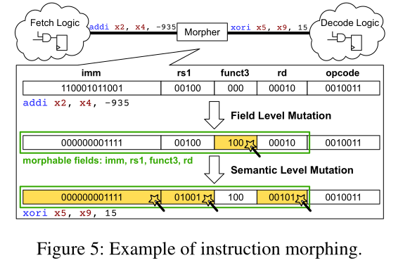
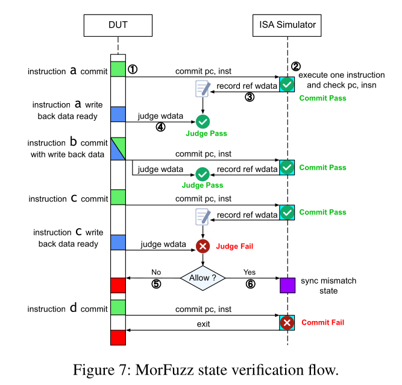
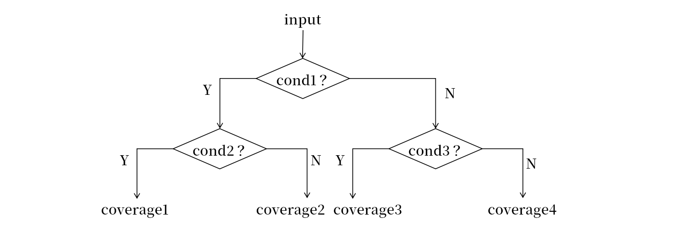

## Morfuzz

Morfuzz 是浙江大学徐金焱团队发表于 usenix 2023 的工作。Morfuzz 设计了语义级别的生成原语，增强测试程序的内部约束；更重要的是，Morfuzz 通过软硬件结合的设计思想，彻底突破了软硬件之间的界限，将指令突变技术提升到前所未有的境界，并解决了架构合法差异引入的漏洞误报。截至今日，Morfuzz 仍然是硬件模糊测试的巅峰之作，后续的 Cascade、Hyperfuzz 等工作在对比工作中往往避其锋芒，对之避而不谈。在 Intel 的硬件模糊测试工作评估中，Morfuzz 被认为是唯一行之有效、具有现实意义的处理器模糊测试工作。


### 基于语义的程序生成

想要生成特定的程序功能，不仅要满足指令内部的 field 格式约束，还要满足指令间的语义约束。例如，想要生成一条合发的内存访问，仅仅生成一条格式正确的 ld 指令是不够的，还需要确保访问地址在合法的地址范围，因此需要额外指令进行合法地址生成。为了满足指令间这种复杂的语义约束，Morfuzz 不再以指令作为最小的程序生成单位，而以特定语义功能作为最小的程序生成单位，成为 block。根据语义，Morfuzz 生成了如下的 block：
* IntArithmeticBlock: 由一系列 I 扩展的算术指令组成
* FloatArithmeticBlock: 由一系列 F/D 扩展的浮点指令组成，以及对于 frm/fflags 的读取和设置
* LoadStoreBlock: 首先计算一个内存基地址，然后根据该地址生成一些列 load/store 指令
* PteBlock: 首先计算 PTE 的地址，然后对部分页表项加以修改，最后 fence.vma
* CsrBlock: 由一些列 csr 读写操作组成，仅修改部分 csr（诸如 mtvec/stvec/satp 不修改）
* SystemOPerationBlock: 由一系列系统调用指令/同步指令/ROCC 指令组成
* AmoBlock: 由一些 A 扩展的原子操作指令组成，首先计算一个内存基地址，然后基于该地址进行一系列内存计算
* ZkBlock: 由一系列密码学操作指令组成

Morfuzz 在程序生成的时候给每个块生成一个随机权重，然后根据这个权重随机选择一类块进行生成，如次迭代得到一组语义基本块，作为测试程序的主体。此外，Morfuzz 随机生成若干页的随机页作为随机数据部分。

### 基于约束求解的指令生成

DifuzzRTL 和 Cascade 都已经实现了单一指令的生成，前者根据指令格式对每个指令 field 随机生成值，然后对每个指令都构造了单独的类，然后根据传入的参数构造指令。这两种做法首先不能解决指令间的约束问题，其次指令 field 的约束没有结构化、模块化的代码支持，依赖于纯手工构造，对于编程、扩展都比较繁琐。Morfuzz 第一次将这个指令 field 约束求解的编程问题模块化了，大大便利了代码编程和指令集扩展。

Morfuzz 根据指令的 yaml 格式构造指令的 json 格式，下图为 JALR 指令的 json 格式，包括指令的指令集扩展（extension）、类别（category）、各个 field（RD/RS1/IMM），并且定义了每个 field 的取值范围。

```hjson
    "JALR": 
    {
        "extension": [
            "RV_I"
        ],
        "category": "JUMP",
        "format": "jalr {RD}, {IMM}({RS1})",
        "imm_type": "IMM",
        "imm_length": 12,
        "variables": [
            "RD",
            "RS1",
            "IMM"
        ]
    }

    variable_range = {
        'RD': reg_range,
        'RS1': reg_range,
        ...
    }
    reg_range = [
        "ZERO", "RA", "SP", "GP", "TP", "T0", "T1", "T2", "S0", "S1", "A0", "A1",
        "A2", "A3", "A4", "A5", "A6", "A7", "S2", "S3", "S4", "S5", "S6", "S7",
        "S8", "S9", "S10", "S11", "T3", "T4", "T5", "T6"
    ]
```

之后编程者基于 constraint 构造一个 Instruction 的求解器，值域范围是所有指令，包括指令名和指令各个 field 的值。Morfuzz 可以对指令的 extension、category、name 等进行约束，可以对立即数的取指范围进行约束，甚至可以自定义约束，对各个 field 的值组合做非常细致的约束（如`RS1 != RS2 and RS2 in ['A0', 'A1']`等）。在构造指令间约束的时候，只需要构造求解器、设置对应的约束函数，然后求解就可以得到满足要求的指令。不过求解器的能力也不是无限的，如果指令约束过于复杂还是存在求解错误的风险，有时候需要做必要的检查和修正，但多数情况下还是很方便的。指令求解技术并不能从本质上提高代码生成的质量，因此只是一个工程设计的巧思。

### 解决控制流约束问题

上面介绍的所有 block 都只是简单的顺序执行代码块，因此还需要引入控制流代码引入控制流测试，并将上述代码连接起来——因此 Morfuzz 不可避免的也需要解决控制流约束问题。我们在介绍 DifuzzRTL 的时候，着重介绍了控制流约束问题的重要性，并指出了 DifuzzRTL 存在异常退出过多、虚拟地址超过内存合法范围无法解决等控制流问题。相比于 Cascade 根据 ISA Simulation 和 FSM 对代码进行精细布局（不过 Morfuzz 发表地比 Cascade 早），Morfuzz 采用了更为简单且巧妙的方法，优雅地解决了这个繁琐的技术问题。

Morfuzz 将 block 序列分为 3 个一组，然后用控制流指令将组内 3 个块串联起来：
* block1 结尾加入一个 branch 指令，跳转地址为 block3 起始地址
* block2 结尾加入一个 jmp 指令，无条件跳到 block4（下一组的第一个块）
* block3 结尾加入一个 jmp 指令，无条件跳到 block2

这样虽然我们没有经过 ISA Simulation 阶段，不知道 branch 跳转与否，但是可以料到控制流方向是`block1->(block3)->block2->block4`，最多只有 1/3 的 block 不会被执行到。考虑到每个基本 block 中只有一类指令，为了可以覆盖多种不同类型的指令同时执行的测试组合，Morfuzz 会让相邻的 block 随机交换部分指令，从而覆盖上述指令组合。但是这部分功能在源代码中实现的一般，贡献有限。

```

    +-------------------+
    |                   |
    |      block1       |
    |                   |
    +-------------------+
    |   branch block3   |
    +-------+-----------+       
            |
            |   +-------------------+
        +---+-->|                   |
        |   |   |      block2       |
        |   |   |                   |
        |   |   +-------------------+
        |   |   |    jump block4    |---------------+
        |   |   +-------------------+               |   
        |   |                                       |   
        |   |               +-------------------+   |   
        |   +-------------->|                   |   |
        |                   |      block3       |   |
        |                   |                   |   |
        |                   +-------------------+   |
        +-------------------|    jump block2    |   |
                            +-------------------+   |
                                                    |
                                                    +--->

```

对于异常引发的测试中断问题，Morfuzz 对异常处理程序进行简单修改，一但捕捉到无法处理的程序异常，就让 epc+4 然后返回，忽略该异常，这样后续的程序就可以继续执行了。对于地址超出内存范围的问题，Morfuzz 修改缺页异常处理程序进行解决。Morfuzz 给指令分配了两个物理页，给数据分配了两个物理页。当取指缺页异常发生的时候，缺页异常处理程序将虚拟地址映射到对应的指令页物理地址，从而可以继续取指执行；当存取缺页异常发生的时候，缺页异常处理程序将虚拟地址映射到对应的数据页物理地址，从而可以顺利存取数据。此外，Morfuzz 的测试代码不存在类似 exit 块的退出机制，所以不会自动退出。这样无论访问的内存地址如何、无论指令是否触发异常、无论控制流如何跳转，Morfuzz 测试程序都可以在四页的物理地址空间和无限的虚拟地址空间当中，无限循环执行下去。

### 突破软硬件界限的突变技术

上述两个技术虽然解决了语义约束和控制流约束两大难题，但是生成的指令组合非常有限，至少存在以下几个问题：

1. 单个 block 内部的指令类型过于单一，没有办法测试多种不同类型指令组合的场景
2. 多数 block 没有对指令间寄存器依赖做约束，随机生成的指令间数据依赖不足，流水线压力测试不够
3. 控制流指令复杂度较低，缺少数据流、控制流纠缠能力，缺少连续控制流指令场景，甚至没有 JALR 间接跳转指令
4. 缺少内存间数据依赖，缺少对测试地址别名问题的设计

最后一个问题，所有的模糊测试工作其实都没有涉及，但对于前三个问题，DifuzzRTL 和 Cascade 虽然支持力度一般，但至少可以通过突变加以覆盖。反观 Morfuzz 在测试程序生成阶段也不过是修改 block 权重，生成新的 block，也不能依靠突变覆盖这些测试。难度这个 Morfuzz 反而不如 DIfuzzRTL？各位，Morfuzz 的神奇之处就在于他不是在静态生成阶段解决问题的，而是在动态执行阶段用其神奇的**突变技术**加以解决的。

**morph 指令突变模块**：DifuzzRTL 的突变技术会对上一个测试程序的所有指令进行突变，但是因为存在执行流问题，最后只有很少一部分突变指令会被有效执行，这导致突变的效率极其低下。这就引出了一个问题——如何让突变的指令可以被处理器有效执行到？Morfuzz 的答案是出乎意料的，于其让突变的指令被执行，不如让被执行的指令发生突变！指令执行包括取指、译码、执行三个阶段，指令被取指后就相当于被执行到了，但是如何执行指令要等译码阶段之后才会被确定。因此 Morfuzz 在 fetch 电路和 decode 电路之间加入了一个 DPI-C 实现的 morph 模块，对取指的指令的各个 field 进行突变，这样就确保了突变的指令一定可以被处理器执行，确保了突变执行的**完成度**。



Morph 模块是一个伪装成硬件的软件模块，他的突变方案包括如下：
1. 随机对 opcode 进行突变
2. 根据指令的 opcode 判断指令格式，对指令的各个 field 进行突变，特别是 funct field
3. 对于指令的 rd/rs1/rs2/frd/frs1/frs2/frs3 等 field，morph 会首先查看流水线内部正在被使用的 GPR/FPR 情况，然后随机选择突变为正在被使用的寄存器，或其他寄存器
4. 对于控制流指令的跳转地址、内存操作的地址，morph 突变为特殊 label 的地址，或者随机地址

因为 opcode 可以突变，所以 block 内的指令组合可以多样化；因为寄存器索引是根据流水线内部的寄存器使用突变的，所以必然可以引入指令间数据依赖；因为控制指令、内存操作的地址可以被突变为特殊/任意结果，因此内存重命名、连续控制流指令等问题也可以得到解决。基于该动态突变技术，处理器就可以执行丰富的指令组合，确保了突变执行的**多样性**。

最后，过去的工作在执行完所有指令后必须退出程序，然后开始下一个迭代，因此需要重复突变程序、生成测试程序、初始化仿真程序、执行配置代码等前置工作，导致模糊测试的效率降低。Morfuzz 的测试程序一方面是动态突变的，一方面是从不会执行结束的，因此 Morfuzz 可以不间断的进行指令突变和测试执行，确保了突变执行的**连续性**。

**image 立即数突变模块**：morph 可以有效突变指令格式和指令参数，但是对于指令操作数中的立即数和地址，morph 这种单条指令突变的能力有限，这就需要设计更高语义维度的软硬件结合的方案。Morfuzz 在总线上新增了 image MMIO 模块，该硬件模块也是 DIP-C 软件模拟，通过访问这个模块的不同 MMIO 地址，可以读去不同类型的随机立即数：

* 地址 0x0-0x8：返回 64 位随机数
* 地址 0x8-0x10：返回 64 位整数
* 地址 0x10-0x18：返回 64 位单精度浮点数
* 地址 0x18-0x20：返回 64 位双精度浮点数
* 地址 0x20-0x28：返回代码段地址
* 地址 0x28-0x30：返回数据段地址
* 地址 0x30-0x38：返回 next mepc
* 地址 0x38-0x40：返回 next sepc
* 地址 0x40-0x48：返回随机页表地址

在之前 8 个基本块的基础上增加了两个 block，分别是 magicloadblock 和 magicjumpblock，分别从 image MMIO 模块对应的地址读出需要的数据段地址和代码段地址，然后执行 load 操作和 jump 操作。通过软件指令读 magic MMIO 模块的方法可以让同一条指令在每次执行的时候读到不同的立即数，起到突变的效果。同时 magic 模块在随机生成各类立即数的时候可以根据立即数的格式、内容定制化生成策略，提高立即数的质量。例如，对于浮点数，image 对符号位、指数位、尾数位分别进行生成，调整 inf、nan、0 等特殊格式的权重，让立即数生成的分布更符合信息量的分布情况；对于地址则根据测试程序内部的 label 地址进行生成，容易得到有特殊意义的地址。

Morfuzz 沿用 DifuzzRTL 的控制寄存器覆盖率指标，当处理器在不间断进行模糊测试的时候，Morfuzz 也不间断的记录覆盖率反馈的增长。随着时间的推移，覆盖率的增长速度会慢慢下降，当局部增长速度小于平均增长速度的 1/2 的时候，Morfuzz 就认为当前突变已经失去价值了，发送 interrupt 停止测试，重新生成测试程序。这里生成的测试程序类似于种子，后续的突变测试类似于原来的基于种子的不断突变。Morfuzz 利用软硬件协同的动态突变技术，解决了模糊测试突变执行的完整度、多样性、连续性三大难题。

如果要吹毛求疵的话，该突变策略仍然有很多边角情况没有覆盖到，比如复杂的内存别名问题需要多条指令读写统一内存地址；对于 cache 解码结果的处理器，也没有办法应用 morph 突变机制；等等。但现实中的处理器，例如 rocket-chip 相对比较简单，对一些特殊的情况并不存在特殊的优化策略，因此即使遇到了这些精心构造的场景，也不会触发新的处理器行为。在这种情况下，继续细化测试程序的复杂程度就好比修炼屠龙术，虽然技艺精湛，奈何无龙可屠。模糊测试测试程序的多样化程度以测试对象的复杂程度为限，了解处理器的设计结构对特化测试程序的细节是有必要的。

**测试瞬态执行机制**：现代处理器广泛支持乱序执行和分支预测（比如 BOOM），处理器会根据控制流历史记录对分支、跳转行为进行预测，加速取指和代码执行效率，如果预测失败还需要支持状态回滚等机制，这还会引发瞬态执行现象。瞬态执行现象指出，会提交的代码会影响处理器执行结果，不提交的代码也可能影响处理器执行结果，这两者都是需要被考虑到的。想要充分检验处理器预测回滚机制的正确性，需要测试程序可以训练预测模块、触发瞬态窗口、触发回滚事件，需要构造精妙的训练代码和窗口代码。大多数模糊测试工作连基本的控制流约束都捉襟见肘，遑论瞬态执行了，但是 Morfuzz 却可以覆盖了这种情况。

首先，Morfuzz 是在两个代码页内循环执行的，这就可以让同一地址的控制流指令被反复执行，深入训练预测模块的历史条目，进而可以触发各种情况的预测事件；但大多数测试工作的测试程序是单向的，无法起到重复执行、反复训练的效果。其次，Morfuzz 的两个代码页是被多样化的指令填满的，因此引发的瞬态窗口内部的指令组合也是多样化的，进而可以触发对不同类型指令的回滚测试；但大多数程序内存存在大量的无效代码空隙，无法构造指令多样化的瞬态窗口。

纵然 Morfuzz 在设计之处是没有考虑瞬态执行的，但是它的突变方法却完美的覆盖了这一大类情况。

### 基于架构同步的漏洞检测

Morfuzz 用 spike 作为黄金模型，进行逐条代码结果检测。Morfuzz 发现指令的执行并不会影响所有的架构层寄存器，在控制流上会修改 PC 寄存器的值，在数据流上会修改最多一个 GPR/FPR/mem unit 的值，且对应的修改会在对应的硬件结构进行提交，因此只需要对这部分修改进行验证即可，无需验证所有架构层状态的值。这一点 ProccessorFuzz 也有提到。

指令控制流的提交（PC 的架构层修改）和数据流的提交（GPR/FPR/mem 的架构层修改）并不一定是同步的，因此可以分开检测。当对 PC 的提交信号拉高的时候，处理器调用 ISA Simulation 模拟一条指令，然后比较 PC 和 instruction 的值是否一致；然后等 wdata 提交信号拉高的时候，调用 spike 接口比较 wdata 修改的值是否一致。该方法没有直接检查 store 对内存的修改结果是否正确，因此测试程序在修改内存后会考虑加入 load 指令，将写入内存的数据写会寄存器进行检查；部分指令的副作用可能会影响特权寄存器的值，测试程序通过 csrr 将特权寄存器的值读入寄存器进行检查。



指令集手册对于处理器的实现存在一些宽泛的定义，比如对于 reserved 的 csr bit 可以是 1，也可以是 0。这就会导致不同处理器、模拟器的实现可能存在不一致，但是他们都是对的。这一现象同样会导致结果比较阶段，处理器和模拟器的执行结果存在指令集允许范围内的不一致；但模糊测试框架认为找到了一个实现漏洞，于是就会错误地中断测试，并汇报漏洞，这就导致了很多假阳性，以及测试效率的下降。

为了让模糊测试框架忽略这种误报，Morfuzz 在 spike 的基础上开发了 cosim。如果这种差异是指令集允许的，cosim 就会把处理器架构层的执行结果同步到模拟器的架构层。这样不但同步了当前指令引起的架构层差异，也可以消除后续指令对架构层差异的传播。


### 未解决的问题

首先，Morfuzz 并没有解决 DifuzzRTL coverage 存在的瑕疵，对于处理器覆盖率指标的设计没有更多的推进。其次，Morfuzz 仍然无法根据覆盖率反馈，对测试程序进行定量突变，覆盖率仍然只起到剪枝的作用。最后，所有模糊测试工作都在追求通用的测试程序生成策略，但是上一篇文章我们提到，测试程序生成的关键，在于根据程序的语义进行功能验证，通用的测试程序对于简单处理器已经太复杂了，但对于复杂处理器可能仍然太简单，因此如何根据处理器的架构特点和具体实现，针对性的生成测试程序，仍然悬而未决。

## HyperFuzz

HyperFuzz 是 Texas A&M 大学发表在 usenix 2023 的工作（TheHuzz 也是这个组做的，发表于 usenix 2022）。该工作首次将形式化的方法（或者说静态分析的方法）引入到处理器模糊测试领域，将形式化方法的定向性和模糊测试方法的随机性结合起来，覆盖模糊测试难以覆盖的情况，因而比前做快了 3x。形式化的方法根据覆盖率点和处理器的设计代码进行测试程序生成，为解决覆盖率引导突变、根据处理器实现生成测试程序问题提供了方案，弥补了方法论上的空白。HyperFuzz 和 TheHuzz 一样没有开源代码，实验评估结果和实现方法的可靠性存疑问，但不影响其在形式化方法上的开创性。


### HyperFuzz 的形式化求解方法

开源形式化工具 JasperGold 可以将行覆盖率/分支覆盖率等基础的仿真覆盖率转换为 cover property，然后进行形式化求解得到对应的输入和波形序列。因此 HyperFuzz 也回归了传统的软件覆盖率，然后用 JasperGold 工具进行路径求解。

因为软件覆盖率的覆盖率范围是先验的，所有在测试之初就可以知道所有覆盖点的集合范围（当然，有些覆盖点也许不可达），HyperFuzz 首先选择比较重要的覆盖率节点，然后用 JasperGold 将之转化为 cover property，然后求解生成对应的波形，之后从波形中还原得到触发指令序列。不过具体的实现过程仍然存疑。

不同的覆盖点重要性是不一样的（参见 ProcessFuzz 的 [CSR 覆盖率](#processorfuzz-coverage)一节），在测试时间有限的前提下，应该率先测试重要的节点。HyperFuzz 给出了三个启发式的选择方式：
* 选择 fanout 多的模块，输出变化后影响的模块多
* 选择覆盖点个数多的模块，方便后续突变覆盖周围的模块
* 选择传播深度深的模块，这样可以得到较深的探索路径

### 形式化方法和模糊测试的优劣

HyperFuzz 是这样介绍二者的优劣的。现在我们有一个复杂的迷宫，我们希望探索这个迷宫，找到深处的漏洞。模糊测试技术类似于到处穿梭的无头苍蝇，它的探索方向具有很强的随机性，可以探索一个区域的所用空间，但是如果遇到比较曲折的通道就很容易碰壁，然后来回打转、难以深入。而形式化方法则可以根据目标位置和迷宫形状求解出探索路径，做到精确制导，但是因为他是定向定点搜索的，所以难以快速遍历整个区域。因此当我们探索迷宫的时候，我们可以先用形式化的方法帮助我们进入迷宫的深处，然后再用模糊测试的方法从深处开始各向探索，试图找到目标漏洞。


以下图的代码路径为例，我们假设模糊测试的取值概率是均匀的。对于特定的覆盖率节点 coverage1，使用模糊测试的方法四个方向的探索概率是相同的，那么到达该节点的概率只有 25%；而形式化方法可以求解到达路径并求解输入组合，到达该节点的概率就是 100%（从这个功能看，形式化方法和静态分析方法效果是差不多的，这里的形式化和模糊测试结合其实就是静态分析和动态测试相结合）。可以看到形式化有较好的定向探索能力，适合深度探索；而模糊测试则呈现出较高的随机游走特性，适合浅度覆盖。



Morfuzz 的作者徐金焱则给出了相反的评价。对于深度有限的路径问题，形式化工具可以有很好的定向求解能力；但是随着问题深度、广度的变大（比如深度 100），问题的规模和复杂度会快速超出形式化工具的求解的能力，导致形式化工具无法有效求解。反而是模糊测试工具依赖其随机性和遗传算法，还有可能进入较深的路径范围，这种情况下，反而模糊测试比形式化方法更适合深度探索。而对于浅度覆盖，模糊测试工作因为其随机性，很难覆盖所有的情况，反而是形式化工具可以用数学方法验证所有情况，反而更适合浅度覆盖。因此，不妨使用模糊测试工具探索深度路径，在这个基础上用形式化方法验证附近情况。

可见工具的求解效果并不由工具本身决定，而是由工具的求解能力和待解决问题的难度共同决定。其实我们在第一篇文章就提到了，对于简单问题，形式化有很好的通解效果，但是随着问题复杂度的提高，其效果快速下降，反而模糊测试方法还勉强能用，这也是处理器验证模糊测试领域诞生的原因。因此，引入形式化的方法重点不是如何取代模糊测试，而是如何将两者的优点结合起来。

### 形式化方法和模糊测试的切换

对于初等深度问题，形式化可以给出充分验证，比模糊测试覆盖效果好；对于高等深度问题，形式化已经无能为力了，只能用模糊测试尝试覆盖；对于中等深度问题，形式化单次求解成本高，但是准确度高，收益有保障，而模糊测试单次求解成本低，但是准确度也低，收益没保障，因此 HyperFuzz 形式化方法可以用单次高成本得到一次高收益，然后让模糊测试方法在该基础上突变，用低成本进一步得到持续收益。

当然这是定性而言，定量上对于二者在不同问题尺度上的收益缺少先验的知识，因此 HyperFuzz 采用统计的方法判断二者的收益，并且选择收益大的方法。HyperFuzz 统计形式化方法和模糊测试方法各自覆盖点的平均探索时间：
$$r_{fuzz}(w) = \frac{\sum_{k_i \in k_w} n(k_i)}{\sum_{k_i \in k_w} t_{fuzz}(k_i)}$$
$$r_{formal}(w) = \frac{\sum_{k_i \in k_w} n(k_i)}{\sum_{k_i \in k_w} t_{formal}(k_i)}$$
先用模糊测试，随着模糊测试进行，探索的效率会下降，如果小于形式化方法的效率，切换到形式化方法；形式化方法效率下降到小于模糊测试效率，则切换到模糊测试方法。

## ChatFuzz

CHatFuzz 是 Darmstadt 大学和 Texas A&M 大学 24 年的工作，但是目前没有被会议接收，还挂在 arxiv 上。该工作第一次将 LLM 引入处理器模糊测试领域，利用 LLM 和强化学习技术进行测试程序生成。虽然该工作的方案和结果可信度充满水分，也没有被权威会议接收，但是其将处理器验证和 LLM 结合的创举是值的肯定的。


### 基于 LLM 的测试程序生成

在 LLM 烈火烹油的今天，结合 LLM 进行静态分析、模糊测试、漏洞定位已经是司空见惯得了，虽然该技术在处理器模糊测试还不成熟，但必然也是将来的发展方向。

ChatFuzz 基于 ChatGPT2 进行模型训练，选择让 ChatGPT 直接生成二进制作为输入。为了让 ChatGPT 生成的指令满足指令格式，并且满足一些指令组合，该工作将 linux 内核等复杂的开源工程编译为二进制数据，作为二进制输入，让 ChatGPT 学习，试图让 GPT 可以总结出 riscv 处理器的二进制指令格式，并且指令间存在一些语义组合。

在 GPT 有了基础的二进制生成能力之后，ChatFuzz 用强化学习技术让 GPT 生成的二进制进一步满足 RISCV 指令格式。该工作将 GPT 生成的二进制输入给 RISCV 反汇编器进行格式检查，如果格式正确就给予奖励，不然就给予惩罚，如此不断增加 GPT 的正确性。

在 GPT5 发售的今天（当时 GPT3 也大行其道了），GPT2 的生成能力已经很弱了，所以最后的效果也不会太好。从二进制学习指令格式，这个问题本身也太复杂了，何况还有数据段部分是没有格式，这部分噪声也需要做屏蔽。实际上完全可以让 GPT 学习 RISCV 的格式列表，然后根据列表和一些代码反汇编学习 RISCV 汇编序列的生成。考虑到 GPT 本身就很懂 RISCV 汇编，反而生成效果可以很好。

### 基于 覆盖率反馈的 LLM 训练

ChatGPT 用 LLM 的方法对覆盖率反馈引导突变做了解答。它对 LLM 做了一个强化学习，以期让 LLM 生成的测试程序可以覆盖尽可能多的覆盖点。ChatGPT 一边进行模糊测试，一边将覆盖率的覆盖结果作为反馈，根据覆盖的节点情况给予奖励或者惩罚。通过初步的训练之后，LLM 的测试程序生成可以更符合当前处理器覆盖率的需要，然后正式开始测试。漏洞检测使用黄金模型进行差分测试，这也是老生常谈得了。

### LLM 对于模糊测试的启发

ChatFuzz 最后给出的实验指标可信度并不高，首先他只用了分支覆盖率作为指标，但是这该指标本身就不能覆盖很多状态，而且只能体现局部特征，不如 DifuzzRTL 的寄存器指标有全局特征，也不如 TheHuzz 的传统指标组全面。对于处理器生成约束的理解，对于处理器语义的理解都还处于 RFUZZ 的年代，仅仅只是蹭了 LLM 的热度。

LLM 至少在三个方面可以增强处理器模糊测试的功能：

* 对于测试程序生成，LLM 可以学习 RISCV 指令集手册和 RISCV-TEST 等回归测试，学习指令格式和指令间语义约束，提高生成的指令多样性和语义多样性。并且我们可以将一些总结出来的启发式生成规则教给 LLM，提高他的生成能力。
* 对于测试程序的生成，LLM 可以学习处理器的实现细节。考虑到 LLM 有很强的静态分析的能力，完全可以让大模型替代形式化工具进行触发路径的探索和触发指令序列的生成。
* 对于漏洞检测，一方面可以考虑让 LLM 对代码进行静态分析，通过和指令集的对比检测代码存在的漏洞细节，不过考虑到这方面的 pattern 不成熟，也许难以做到；另一方面，当漏洞发生之后，可以让大模型根据波形和代码进行 root 定位，降低人力成本。

## GenHuzz

GenHuzz 是 Darmstadt 大学和 Texas A&M 大学发表在 usenix 2025 的工作，是 ChatFuzz 的续作。GenHuzz 的模型参数仅有 GPT 2 的 1/10，其在强化训练时考虑了指令集抽象和控制流约束，仅用 1% 的测试程序就取得和 TheHuzz 一样的效果，和 ChatFuzz 相比原理和质量有了质的飞跃。


### 基于指令汇编的 token 编码和训练

GenHuzz 通过自己构造 NLP 神经网络来进行模型训练，该模型由 NLP 惯用的 transform 和多头注意力机制等组成，具有强的 NLP 能力，其参数量只有 GPT2 的 1/10。

不同于 ChatFuzz 基于二进制的生成策略，GenHuzz 则选择生成汇编语言。首先，汇编语言作为一种结构简单的语言，更适合自然语言生成模型进行处理；其次，这避免了对二进制格式的学习和解析，更容易满足指令内部 field 的约束要求。在训练模型的时候，GenHuzz 用指令序列的字符串作为输入，然后期待 GenHuzz 输出相同的字符串。

指令的各个字段，如 opcode（add，beq 等）、operand（a0、a1、fa0、fa1、satp、mstatus、label、imm 等）被拆解为对应的词元，并且 embeding 模块转化为对应的编码，供 GenHuzz 模型学习和生成。指令-词-编码关系如下：
$$I_1,I_2...(add\ t0, t1, t3;sub\ t5, t2, t1;...)$$
$$t_{1,1}t_{1,2}t_{1,3}t_{seq}t_{2,1}t_{2,2}t_{2,3}...(add|t0|t1|t3|;|sub|t5|t2|t1|;|...)$$
$$f(t_{1,1})f(t_{1,2})f(t_{1,3})f(t_{seq})...(12|24|31|0|...)$$

训练的时候用交叉熵作为 loss，然后让下一个词生成满足学习到的指令序列的可能性最大。例如学习的是`add t0, t1, t3`，在模型输出`add|t0|t1`之后，我们希望模型下一个 token 输出 t3 的概率最大。于是需要让`P(t3|add,t0,t1)`最大。因此对应的训练公式是：
$$L(\theta)=-\sum^{M-1}_{t=1}P_{\theta}(x_{t+1}|x_1x_2...x_{t})$$

对应的梯度下降的迭代公式为：
$$\theta^{(k+1)} = \theta^{(k)} - \eta\nabla_{\theta}L(\theta^{(k)})$$

在这之后，GenHuzz 模型就可以得到基本的汇编生成能力，但是汇编格式的正确性、控制流约束能力仍然缺少保证。

### 基于指令有效性和覆盖率反馈的强化学习

为了提高模型生成正确指令的能力、指令控制流尽可能被执行、覆盖率尽可能地提高，GenHuzz 在测试的过程中通过强化学习，根据上述三个需要进行 reward 设置，调整模型的参数，改进生成的质量。因此 GenHuzz 设置了如下的奖励机制：
$$ reward = r_{valid} + \alpha Coverage + r_{bonus}$$

指令被赋予三种指标，在执行过程中只有 valid 并且 executable 的指令才被认为是有效的，给予$r_valid$奖励，其他的指令都是无效生成，因此需要让第一类的比例变高。
* valid/invalid：根据指令格式是否有效
* executable/unexecuatable：根据指令是否被执行到
* success/failed：根据指令是否抛出异常

为了让程序可以覆盖更多的 coverage，coverage 被作为奖励参数，$\alpha$作为超参数调整覆盖率的奖励权重。最后，当测试程序达到新的最大覆盖率之后，会给予额外的$r_{bonus}$，鼓励模型追求更高的覆盖率。为了让 reward 满足个性化的要求，GenHuzz 特地构造了一个 Scorer 神经网络进行打分。

另外，模型训练到一定程度之后会收敛到局部最优，之后难以探索新的 coverage，到这个时候 GenHuzz 会初始化模型到最开始的基本模式，然后开始新的 PPO 训练，以期探索更多的覆盖率情况。这里的强化学习类似于测试程序的突变，而对于模型的初始化类似于生成全新的测试程序种子。


其训练过程如下：
1. 加载初始化的生成模型
2. 生成 token 列表，编码转化为测试程序
3. DUT 执行得到覆盖率反馈，Scorer 进一步计算 reward
4. 迭代训练生成模型，重复步骤 2
5. 如果 coverage 饱和就初始化模型，重复步骤 1,开始新的 PPO

该方法使用行覆盖率、分支覆盖率等作为覆盖率，但是在和之前的多个工作对比的时候，一如既往只使用了分支覆盖率，效果和 Cascade 接近。但分支覆盖率就和 RFUZZ 提出的 MUX 覆盖率一样，容易饱和，且反映的全剧情况有限，不是好的测试指标，因此其覆盖率对效果的证明存疑。

## Encarsia

Encarsia 是 ETH Zurich（Cascade 的团队）发表在 usenix 2025 的工作。该工作设计了一个处理器模糊测试的评估框架，对已有的多个 SOTA 进行评估，并且对处理器模糊测试的技术和设计方向做了评价和提议。当然，部分意见存在争议，也不一定以此为主。

### 模糊测试评估工作的缺失

### 评估框架的构造

## 总结和自述

### 检查机制的发展和讨论

### 覆盖率指标的发展和讨论

### 突变技术的发展和讨论

### 处理器模糊测试的科研窘境

### 自述和告别


