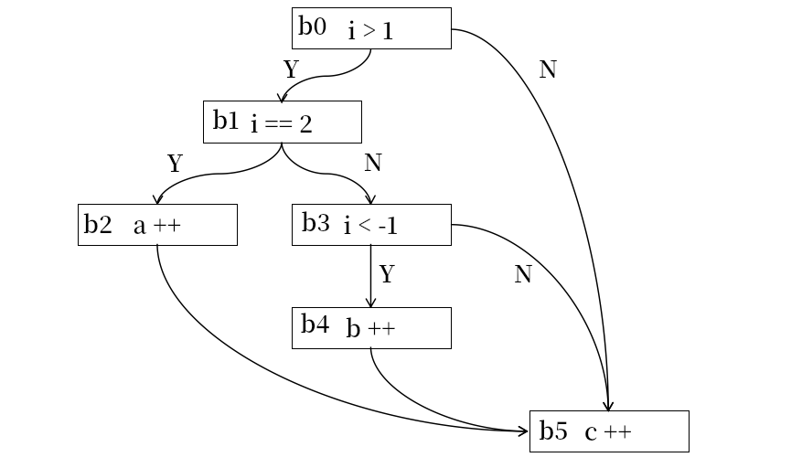

# 处理器验证与处理器模糊测试

处理器验证是硬件验证的一个子方向，用于在预硅阶段检验处理器设计实现的正确性，即处理器功能实现和处理器功能设计是否保持一致。为了最大程度地确保处理器流片的正确性，工业界会将超过 60% 的时间用于 RTL 设计的功能验证、时序验证等验证工作，每个 RTL 设计工程师甚至需要 4 个以上的验证工程师配合完成验证工作。硬件验证的重要性在一定程度上超过了单纯的硬件设计实现。

本文将首先对传统的硬件验证方式进行介绍，帮助读者对传统的验证方法有个具体直观的认识。之后，本文将介绍处理器模糊测试领域近年来有代表性 paper 的创新点和解决思路，帮助读者厘清学术界处理器模糊测试领域的发展脉络。本文主要用于 sycurcion 小队内部交流学习，同时欢迎其他工业界、学术界的朋友借鉴学习和批评指正。任何对知识点的补充和对勘误的指正都是欢迎的。

## 传统的处理器验证

传统的处理器验证大致分为三大类：

* 基于形式化的静态验证，可以充分证明模块的正确性，但是验证难度随着模块大小指数上升，仅适用于小型模块
* 基于 benchmark 的回归测试，测试快捷高效，可以覆盖大多数功能点，但是扩展性差，人力成本高，不能验证完全
* 基于 UVM 的动态验证，测试快捷高效，自动化程度高，扩展性好，但是测试的随机性和覆盖率吧没有保障，也不能验证完全

接下来，我们将对这三个基本方法依次进行展开。

### 静态验证 static verification —— 形式化验证 formal verification

#### 形式化基本概念

在介绍处理器形式化验证技术之前，我们先介绍一些简单的形式化概念和语法，方便初学者有一个直观感性的认识。

典型的 IPO 过程就分为三个子部分：

* 对需要处理的 input 范围进行了约束，如输入是整数，输入在 -100 到 100 之间；这也暗示了如果输入超出了这个范围可以不予理睬。这种针对 input 的约束被称之为**前置约束**
* 对输入 input 计算得到的输出 output 的性质进行约束，如这里输出是整数，输出在 0 到 100 之间。这种对 output 的约束被称之为**后置约束**
* 对于 process 代码片段，如果满足任何满足前置约束的输入 input 在经过 process 处理之后的得到的 output 都满足后置约束，则说明这段代码是满足约束的；反之如果存在满足前置约束的输入 input 再经过 process 处理之后得到的 output 不满足后置约束，则说明存在反例，这部分代码是不满足约束的。

这里我们可以将代码片段、代码输入的前置约束、代码输出的后置约束这三部分交给形式化验证工具进行验证。如果验证通过，说明所有满足前置条件的输入可以得到满足后值条件的输出，代码满足要求；如果验证失败，则形式化工具发现存在不满足条件的反例，并且一般会输出反例，代码不满足要求；当然，形式化工具可能在有限的时间内无法给出证明结果，这个时候既不能证明满足要求，也不能证明不满足要去。
```
Pre(input)
output = process(input)
Post(output)
```
有两种情况是形式化无法解决的。第一，Rice 定理证明了，对于给定性质 L，对任何一台图灵机 M，都可以找到另一台图灵机 M'，使得 M 无法判断 M' 是否满足性质 L。也就是对于给定的形式化工具，总有一个问题他是无法给出证明的。第二，即使理论上一个代码可以被证明，但是实际上因为这个代码状态过于庞大，导致形式化工具在有限时间内无法证明完全，则也无法证明。这导致形式化工具的可扩展性、应用范围受限。

现在我们用 C 扩展代码为例介绍形式化验证的一些功能。

#### 验证代码正确性

我们可以用形式化工具验证代码片段实现的正确性。例如，我们有一个代码需求：
```text
    对于在 -100 到 100 之间的整数输入，输出对应的绝对值
```

于是我们编写了如下的代码：
```C
    if(a < 0) b = -a;
    else b = a;
```

现在我们希望用形式化工具验证这部分代码的正确性，于是我们需要描述该问题的前置约束 Pre 和后置约束 Post。在 cbmc 的 C 扩展语法中，前置约束是一个用 assume 关键字修饰的布尔表达式，后置约束是一个用 assert 关键字修饰的布尔表达式，并且提供了一些布尔表达式的宏，所以可以写作：
```C
    assume( -100 <= a && a <= 100);
    if(a < 0) b = -a;
    else b = a;
    assert( b == abs(a) )
```
然后我们可以用 cbmc 将这部分代码编译为 SMT 语言，然后用 Z3 求解器求解 SMT 语言判断是否满足约束，进而判断代码是否正确。

当我们用形式化对代码的正确性进行检查的时候，前置约束就是代码需求中输入的约束，后置约束就是代码需求中输出的约束，不过很多时候如何将需求的自然语言描述为二进制语言是一件复杂的、不直观的问题，并没有那么容易。其次，在形式化验证的时候，我们必须假设前置约束、后置约束、形式化工具是正确的，不然最后结果的正确性无从谈起，而这只能靠仔细检查、社会经验、甚至理想信念来保证了。

#### 求解变量的值

我们可以用形式化工具求解一些满足约束的变量。例如如下代码：

```C
    uint a = nondet_uint();
    assume(true);
    b = a + 5;
    assert(b == 10)
```

这里的 a 是一个待定的需要求解的值，然后我们可以用 cbmc+z3 的组合求解该代码，然后再满足约束的条件下得到 a 的一组求解结果。这里很显然 a 的结果是 5。当然也存在求解失败的情况，包括证明不存在满足约束的 a 和有限时间内无法完成求解。

代码证明，其实一定程度上来说就是变量求解的弱化版本。待求解个数为 0 的变量求解就等价于是代码证明。
变量求解也可以看作是特化的代码证明，这里的 a 是任意值可以看作证明布尔表达式
`Pre(input) => exists a, Post(process(a, input))`
而得到一组解 a 的过程就是求解布尔表达式正确性的过程。

从这个角度看代码证明和变量求解是等价的。

#### 求解路径的可达性

代码块是一个单一入口、多出口的代码片段，一个程序是一个由多代码块组成复杂图结构。从一个代码块 b0 到另一个代码块 bn 的转移路径`b0 -> b1 -> b2 -> ... -> bn-1 -> bn`是一个路径。如果我们从程序入口存在一条执行路径可以到达代码块 bn 则称代码块是可达的，反之则是不可达的。

对于代码块的可达性，我们往往具有两种需求。第一，这个代码块是否可达；第二，这个代码块如果可达，那么可达的条件是什么？例如下图的代码片段：
```
i = nondet_int();
j = nondet_int();
if(i > 1){
    if(i == 2){
        a ++;
    }else if(i < -1){
        b ++;
    }
}
c ++;
```
对应的代码块控制流图如下：


通过形式化工具的求解我们可以得到 b2 是可以到达的，这个时候要求 i 是 2；对于 b4 则是不可达的，没有 i 满足对应的条件。进一步的，我们可以通过形式化的工具得到代码块的可达性以及到达代码块的条件。

#### systemverilog 的形式化支持

对于  RTL 硬件我们同样也可以做形式化验证。软件代码是输入到输出的映射转换，硬件电路同样也是从输入到输出的映射转换，是等价的。systemverilog 的 SVA 提供了形式化的语法支持，我们这里介绍一下基本的语法，即对于电路如何设置对应的前置约束、后置约束和布尔表达式等。

SVA 提供 property 来设置约束的布尔表达式，包括 property-endproperty 关键字，property 命名，以及 property 的内容。然后就可以用 assume、assert 关键字分别设置前置约束的 property 和后置约束的 property。包括前置约束、后置约束的名字，关键字和 property 名。assume 就是对输入信号满足的 property 条件进行设置，assert 就是对输出信号满足的 property 条件进行设置。
```systemverilog
property value_eq;
    a == b;
endproperty

assume_property:assume property(vaule_eq);
assert_property:assert property(vaule_eq);
```

比如我们写了如下的代码，我们希望描述的硬件可以在 en=1、reset=0 的时候每个周期累加 1,然后在 00-01-10-11 之间不断的循环。为了证明这一点，我们需要设置对应的 assume 和 assert 约束。
```systemverilog
logic [1:0] state;
logic [1:0] old_state;
always_ff@(posedge clk)begin
    if(reset)begin
        old_state <= 2'b11;
        state <= 2'b00;
    end else if(en)begin
        old_state <= state;
        case(state)
            2'b00: state <= 2'b01;
            2'b01: state <= 2'b10;
            2'b10: state <= 2'b11;
            default: state <= 2'b00;
        endcase
    end
end
```

这里的 input_assume 的布尔表达式要求`reset == 0 && en == 1`,所以在形式化验证的时候相当于设置 reset 的输入为 1,设置 en 的输入为 0。这种直接的布尔表达式的写法导致的 property 是永远成立的，也就是无时无刻不成立的，因此可以用来约束组合电路这种一直需要被检查的对象。 

```systemverilog
property input_assume;
    reset == 0 && en == 1;
endproperty;
assume_property: assume property(input_assume);
```

acc_assert 的 `@(posedge clk)` 表示仅在时钟上沿的时候才进行这个 property 的检查，这和时序电路仅仅在时钟上升沿修改寄存器导致电平变化的电气特性相吻合。`en |=> state == old_state + 2'b01` 表示在上个周期满足`en == 1`的条件下，下个周期满足`state == old_state + 2'b01`，也就是 en 使能的时候，下个周期 state 累加。|=> 前的是上个时钟区域的电平满足的布尔关系，|=> 后的是下个时钟区域的电平满足的布尔关系，表达了时钟触发前后电平变化关系，适用于非阻塞赋值的电路描述。如果是 |-> 就是本周期内部的电平关系，适用于阻塞电路。

```systemverilog
property acc_assert;
    @(posedge clk)
        en |=> state == old_state + 2'b01; 
endproperty;
assert_property: assert property(acc_assert);
```

`state == 2'b01 ##1 state == 2'b10`中的 ## 可以用来表示时序关系，也就是下个周期满足`state == 2'b01`，然后过了一个单位的仿真时间后，电平满足`state == 2'b10`。一般我们让 clk 的翻转时间是 0.5,所以 1 也就是一个时钟周期的长度，这样就可以反映一个时钟序列当中电平的变化过程。这里就是在 state 是 0 的时候，之后会依次变为 1 和 2。

```systemverilog
property acc_assert;
    @(posedge clk)
        state == 2'b00 |=> state == 2'b01 ##1 state == 2'b10;
endproperty;
assert_property: assert property(acc_assert);
```

除了用 assume 和 assert 的 propert 进行功能验证之外，也可以用 cov 的 propert 进行覆盖率的检测。当我们验证处理器的时候，有时候需要检测某部分代码是否可以被执行到，即这部分代码逻辑是不是可达的。比如上述的 case 语句有四个分支，对应了 FSM 有四个状态，需要检查四个状态是不是都可以执行到，如果有执行不到那就是存在了错误。这个时候就可用下面的语法设置 cover property，如果这个 cover 对应的 property 可以被执行到，那么对应的功能就可以被执行覆盖到，说明是可达的，并且可以求解对应的触发路径。
```
<cover_name> : cover property (property_name)
```

#### 小结

对于 SVA 的功能验证和可达性求解，我们可以用形式化的工具进行静态验证和分析。这些 SVA 的形式化工具一般是闭源的，包括 JasperGold 和 Synopsys VCS-Formal。通过插入 assume、assert、cover propert，这些工具可以自动化的进行功能验证和可达性求解，并且可以在验证通过的时候，可以百分百验证模块的正确性。但是随着电路模块的规模增长，验证的状态空间会呈指数级的上升，验证时间和验证难度也会同比增加。当寄存器规模达到上万之后，形式化工具就基本不失效了。对于现代处理器这种有数十万甚至上百万晶体管的集成电路，形式化验证往往用于小型子模块的开发验证，但是对于处理器整体的验证仅仅起到辅助作用。


