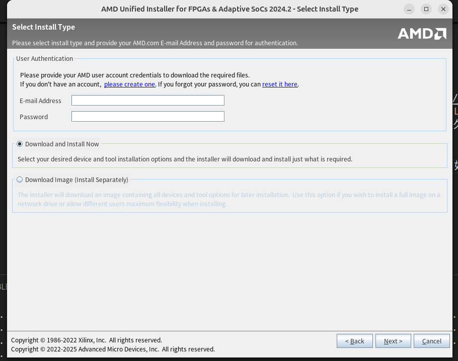

# 配置 ubuntu 24.04 环境

## 杂七杂八

vim htop gcc autoconf cmake
git help2man perl python3 make 
autoconf g++ flex bison ccache
libgoogle-perftools-dev numactl 
perl-doc gcc-riscv64-unknown-elf
gcc-riscv64-linux-gnu gtkwave
net-tools

## 安装办公软件

### 安装微信

```
wget -c -O atzlinux-v12-archive-keyring_lastest_all.deb https://www.atzlinux.com/atzlinux/pool/main/a/atzlinux-archive-keyring/atzlinux-v12-archive-keyring_lastest_all.deb

sudo apt -y install ./atzlinux-v12-archive-keyring_lastest_all.deb

sudo apt -y install wechat
```

功能和 windows 的微信高度一致，甚至可以看朋友圈。但是界面的字体、美术风格、布局等比较生硬，没那么好看。

进入“设置->通用”，将字体修改到“大”

### 安装QQ

* 进入 [QQ 官网](https://im.qq.com/index/)下载安装包，选择 下载->Linux->x86->.deb。下载得到`QQ_3.2.16_250307_amd64_01.deb`。
* 之后执行`sudo dpkg -i QQ_3.2.16_250307_amd64_01.deb`进行安装。

图形界面和 windows 桌面版不太一样，需要重新适应一下。

### 安装钉钉

* 进入 [钉钉 官网](https://www.dingtalk.com/download#/)下载安装包，选择 Linux 当中的 AMD 版本。下载得到`com.alibabainc.dingtalk_7.6.25.4122001_amd64.deb`。
* 之后执行`sudo dpkg -i com.alibabainc.dingtalk_7.6.25.4122001_amd64.deb`进行安装。

和 windows 的钉钉界面排布差不多。

### 安装腾讯会议

* 登陆[腾讯会议下载官网](https://meeting.tencent.com/download/)
* 选择 linux->x86_64 下载`TencentMeeting_0300000000_3.19.2.400_x86_64_default.publish.officialwebsite.deb`
* 执行`sudo dpkg -i TencentMeeting_0300000000_3.19.2.400_x86_64_default.publish.officialwebsite.deb`安装腾讯会议
* 直接执行可能会遇到报错“不兼容桌面的 wayland 协议”，这个时候需要对桌面的配置作修改
* 执行`sudo vim /etc/gdm3/custom.conf`，修改 gdm 桌面配置
* 将`#WaylandEnable=false`的注释去掉，关闭 Wayland 功能
* 执行`sudo service gdm3 restart`，重启桌面，然后就可以正常使用腾讯会议了

### 安装 WPS

* 可以用 ubuntu 的应用商店一键安装，但是安装的结果似乎不能用
* 登陆[WPS 官网](https://www.wps.cn/product/wpslinux#)
* 下载 x86 的 deb，然后`sudo dpkg -i wps-office_12.1.0.17900_amd64.deb`安装即可

## 安装 clash 梯子

* 进入[魔戒梯子官网](https://mojie.app/)，选择 “下载客户端” 中的 ubuntu，然后下载 Clash.Verge__amd64.deb
* 执行`sudo dpkg -i Clash.Verge__amd64.deb`安装 clash
* 根据网站教程执行后续操作
* 选择“订阅”，将网站的订单号复制到边框，然后导入 config.yaml
* 选择“设置”，将“系统代理”打开，将“ipv6”关闭，即可使用

## 安装 google 浏览器

### 安装

谷歌浏览器有 chromium 和 chrome，后者是我们常用的 google，前者是 chrome 的一种替代实现。请注意 chromium 不能登陆 google 账号。

对于 chromium：

* `sudo apt update`
* `sudo apt install chromium-browser`

对于 chrome：

* `wget https://dl.google.com/linux/direct/google-chrome-stable_current_amd64.deb`
* `sudo dpkg -i google-chrome-stable_current_amd64.deb`

之后就可以在 ubuntu 软件栏中看到 google 的快捷键图标。之后右键图标，点击“固定到快捷栏”，就可以将打开快捷方式显示在左侧快捷栏。


### 简单配置

* 点击右上角进入设置，然后选择“默认浏览器”，将 google 设置为默认浏览器；
<!-- 
* 点击“外观”，本人不喜欢看小字，所以将字号设置为“大”，将页面大小设置为“125%” -->

* 点击“起始页面”，本人喜欢用必应浏览器（国内不需要装梯子），选择“打开特定页面或一组页面”，新增页面“cn.bing.com”


### 登陆账号

登陆 google 浏览器账号，这一部需要挂梯子

## 安装 vscode 开发环境

### 安装

* 访问[vscode官网](https://code.visualstudio.com)
* 点击下载 .deb 文件，会被下载到`~/下载`路径中
* 进入对应路径执行`sudo dpkg -i code_1.75.0-1675266613_amd64.deb`即可安装
* 将 vscode 固定到快捷边栏

### 简单配置

感觉字体太小了，可以将 File->preference->settings->windows 的 zoom level 修改到合适的结果。数字 1 表示放大 20%，-1 表示缩小 20%，以此类推。

### 基本插件

* Python:
    * Python
    * Python Debugger
    * Pylance
* C/C++:
    * C/C++
    * C/C++ themes
* Verilog:
    * Verilog-HDL/SystemVerilog/Bluespec SystemVerilog
    * Chisel Syntax
    * Firrtl
    * Scala Syntax

## 配置远程连接

### 生成 ssh 密钥

执行`ssh-keygen -t rsa`生成 rsa 公私密钥对，复制`~/.ssh/id_rsa.pub`的公钥值

### 设置 github

设置 github 的 ssh 公私钥连接

* 登陆 github
* 选择 settings->SSH and GPG Keys->New SSH key
* 填入 key 名称，rsa.pub 内容，创建密钥即可
* 尝试用 git@github:xxx.git 的方式进行 clone，检查是否私钥连接成功

前几次 clone 如果失败，也许只是设备没有同步到位，可以重启 sshd 之后再尝试 clone

### 设置远程连接

把原来 pc 设备的 ssh 配置拷贝过来，作必要的整理。用原来的设备，将本机器的 id_rsa.pub 依次加入到需要远程连接的机器的 .ssh/authorized_keys 中。之后就可以 ssh 远程连接这些设备了。

第一次连接的时候会因为设备不认识而提示，输入 yes 即可。如果一开始显示密钥验证不通过，多试几次或者重启 sshd 即可。

### vscode 远程连接

安装插件：

* Remote Explorer
* Remote-SSH: Editing Configuration FIles
* Remote-SSH

之后就可以用 vscode ssh 连接、编辑、执行远程设备的文件了 

### 配置 nebula

* 从[github官网](https://github.com/slackhq/nebula/releases)下载最新对应的 nebula 发行版，解压得到 nebula、nebula-cra 可执行程序
* 拷贝对应 config 文件
* 执行`sudo nebula -config ./config/config.yml`就可以直接访问 nebula 网络了 

### 安装 vnc viewer

* 从[vnc viewer 官网](https://www.realvnc.com/en/connect/download/viewer/?lai_vid=WKjlmvxMbCB4R&lai_sr=5-9&lai_sl=l)选择 linux->deb x86，然后下在得到`VNC-Viewer-7.13.1-Linux-x64.deb`
* 执行`sudo dpkg -i VNC-Viewer-7.13.1-Linux-x64.deb`安装 vnc viewer
* 在需要 vnc 连接的设备上执行`vncserver -list`观察有没有已经存在的 vnc 连接，如果有的话，比如 x,就可以连接 590x 端口进行 vnc 连接；如果没有就执行`vncserver`建立一个新的 vnc 连接
* 打开 vnc viewer，然后进行连接即可，输入对应的 ip 地址和 vnc 连接的端口

## 安装 vivado

### 安装下载 vivado 2024.4

* 进入 Xilinx 的[官网](https://www.xilinx.com/support/download/index.html/content/xilinx/en/downloadNav/vivado-design-tools/2024-2.html)进行安装程序的下载，这里我们选择`Linux Self Extracting Web Installer`进行下载。该安装包是 linux 专用的，对 vivado 进行联网下载，安装时间比较久，要求网络通畅，但是安装程序比较小（330M） 

* 执行安装程序`sh FPGAs_AdaptiveSoCs_Unified_2024.2_1113_1001_Lin64.bin`，如果没有权限就`chmod +x`一下。
* 进入 vivado 的图形安装界面，进行安装

    * 输入自己的 xilinx 帐号密码，然后开始下载
    
    * 选择 vivado
    
    * 选择 vivado 的版本，其实两个版本都可以
    
    * 选择对应的安装配置
    
    * 对 license 全部选择同意
    
    * 设置安装路径，可以看到需要 270 G
    
    * 开始安装，根据网速，大概下载+安装要 7-8 小时
* `vim ~/.bashrc`修改 bash 启动设置，加入`source /path/to/vivado/Vivado/2024.2/settings64.sh`，这样 bash 每次启动的时候会自动执行 vivado 的配置 shell，将 vivado 的路径加入到 PATH 环境变量中
* 执行 vivado 就可以启动 vivado

### 进行环境管理

为了让 vivado 可以顺利执行，需要对环境做一些简单的调整

* vivado 可能会报错需要`en_US.UTF-8`的 locale，所以我们需要我们的 locale 支持对应的环境语言，执行下面的代码加入 `en_US.UTF-8`的环境语言。后续执行`locale -a`可以看到新加入的`en_US.UTF-8`
```
sudo locale-gen “en_US.UTF-8”
sudo update-locale LANG=en_US.UTF-8
```
* 安装必要的依赖包 libncurses5-dev, libtinfo-dev
* 默认安装的是 libtinfo.so.6，vivado 需要的是 libtinfo.so.5，可以做一个软链接
```
sudo apt-get install libncurses5-dev
sudo apt-get install libcanberra-gtk-module
sudo apt install libtinfo-dev
sudo ln -s /lib/x86_64-linux-gnu/libtinfo.so.6 /lib/x86_64-linux-gnu/libtinfo.so.5
```


