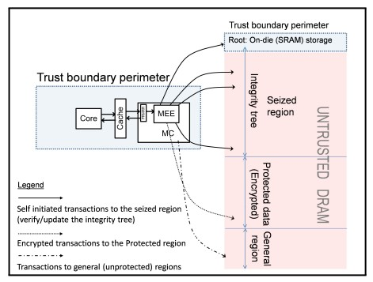
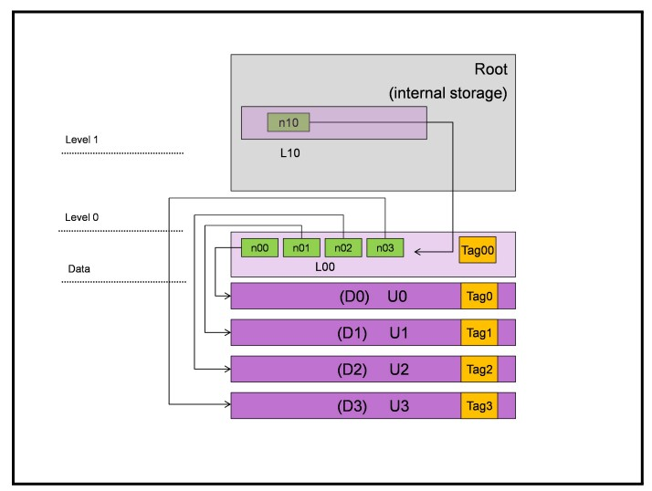
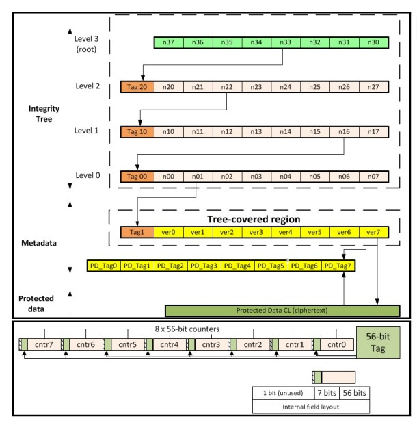
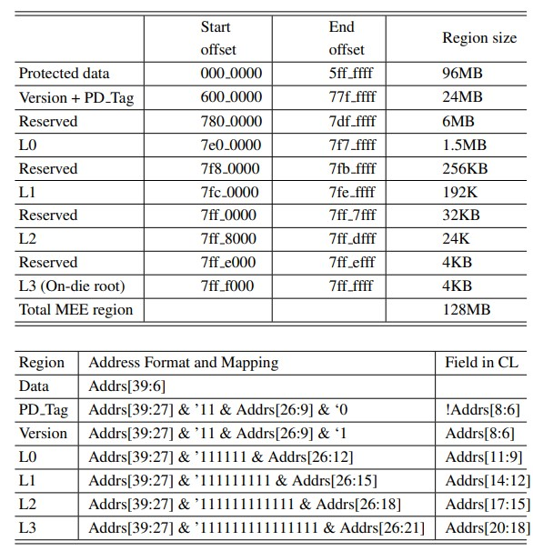

# MEE

MEE(memory encrypt engine)技术是 Intel 用于 SGX 的内存加密技术。MEE 被集成到 MC(memory controller) 当中，对于平台指定的内存区域，MEE 会对写入该区域的数据进行加密，对读出的数据进行解密。

MEE 被用于维护内存数据的完整性，防止恶意设备读取或者破坏内存设备。MEE 设备并不是针对 CPU 中的隔离机制进行的必要的保护机制，因为对于任何 CPU 侧发送的数据，MEE 都会做自动的加密和解密，因此对于 CPU 侧而言 MEE 是透明的。但是平台上大量的其他设备，部分恶意设备可能可以绕过 MC 对内存进行窃听、修改等操作，此时 MEE 的加密机制可以防止这些恶意设备轻易得到 memory 中的明文数据，故而 MEE 防护的其实是 CPU 以外的那些部件。

## MEE 实现

现在我们来简要介绍 MEE 的数据结构和读写操作。计算机硬件的设计和软件的设计在面向对象上都有异曲同工之妙，我们都是确定一个功能，然后设计一个数据结构，并提供一些操作调用，然后把它们封装成一个模块，对外提供接口调用，对内封装数据和操作细节。

### MEE 的数据结构

#### PRMRR 

MC 内部内置了一组 PRMRR 寄存器用于指定 MEE 内存的范围。当处理器启动的时候，固件首先对 RPMRR 寄存器进行初始化，确定被 MEE 保护的内存范围。后续当处理器访问的物理地址范围落在 PRMRR 指定的范围之后，内存请求就会被发送给 MEE 部件，由 MEE 进行内存读写和加解密操作。如果不在这个范围则 MC 直接对内存进行读写操作，不进行加解密。

#### MEE 内存划分

PRMRR 将内存区域划分为 MEE 内存和 general 内存。其中 MEE 内存又被划分为三个部分：
* Encrypted Data(Protected Region)：保护区域，存储了被加密之后的数据，是 MEE 的数据部分
* Integrity Tree(Seized Region)：被额外占用部分，这部分数据被用于存储 Protected Region 部分的元数据，这些元数据被用于 Protected Region 数据的加解密和维护其数据完整性，并且用树结构组织起来
* Root(On-die storage)：Integrity Tree 的树根被保存在片上内存 SRAM 中，而不是内存。此外 MEE 还有一些内存的 cache 结构也合并在这个 SRAM 实现中。

#### Integrity Tree 结构

可以看到 Proected Region 区域的内存被分割为 U0、U1、U2 等一个个内存行。因为内存已经被保密了，所以恶意设备没有办法绕过 MEE 对数据进行解密，直接读到 memory 中的 secret，但是它可以写内存，破坏内存的完整性。

为此，Protected Region 的每个内存行都需要做一个数据签名，通过数据签名确保数据的完整性。例如 U0 中的 D0 签名得到 Tag0，如果而已设备只修改 D0 而不能正确修改 Tag0 也不能伪造数据或者破坏数据完整性。

但这个时候可以用重放攻击，用 D1、Tag1 修改 D0、Tag0 起到一样的效果。为了防止不同内存行的数据加密结果一样，MEE 为每一个内存行提供了不同的 nounce 如 n00、n01，在计算签名的时候 Dx 和 nx 一起进行计算，来杜绝上述的问题发生。

同样的，为了防止 n00、n01 也被修改，这种 nounce 结构被组织为一个多层次的树状结构。L0 的 nounce 行需要结合 L1 的 nounce 构造签名，L1 的 nounce 行需要结合 L2 的 nounce 构造签名。并且因为低层次的多个 nounce 行只需要高层次一个 nounce 行就可以管理，所以 nounce 行随着等级的升高不断减少下，形成一个树状结构。

最顶层的 nounce 行被保存到 SRAM 中去，这个 nounce 行因为在 MEE 内部的 SRAM，不可能被其他的恶意设备需改，其数据完整性可以得到彻底的保护，基于其数据的完整性，下面每一层的 nounce 和数据的完整性都可以得到最终的保护。

#### nounce 的分配

如何让每一个内存行有自己独一无二的 nounce 是亟待解决的问题。最简单的方法是，用当前内存行的地址充当 nounce，如果是这样的话，我们还可以省略 nounce 的存储，因为 MEE 是知道内存行的地址的。

但是这会引起时间上的重放攻击。如果一个恶意设备有读写内存的能力，他就可以读到一个内存行加密后的 D 和 Tag。在后续后世的时机，它可以把 D 和 Tag 重新写回内存行，这样同样可以被签名认证通过，从而破坏数据的完整性。

因此这个 nounce 需要额外和时间挂钩。我们可以在这个 nounce 存储一个计数器，每次修改内存行的数据，对应的 nounce 的值就递增，内存行的 D 改变之后，nounce 也会随着改变，从而抵御时间维度的重放攻击。

因为 nounce 发生了自增，所以这个 nounce 行发生了改变，随意这个 nounce 行的 nounce 也要改变，对应的 tag 签名也要改变。之后各个 nounce 行也要自增和重新签名。

因此 Integrity Tree 通过数据的签名、nounce 的签名、nounce 的自增这三个技术解决了内存完整性问题，抵御内存恶意写和内存重放攻击。（内存读问题已经被加密结束解决了）

### MEE 的操作

#### 密钥生成

MEE 工作需要两个密钥，一个是数据加密的密钥，一个是数据签名的密钥。用两个密钥相对更加安全一些。这两个密钥不是由厂商固化在 MEE 内部的，而是在系统启动的时候 MEE 随机产生的，其次不会被硬件逆向出来。

数据加密和密钥签名使用的都是 128 位密钥的 AES 加密算法，相对于 hash 算法比较高效简洁。

#### 内存读操作

当内存访问 Protected Region 的内存地址的时候，MEE 会将当前内存行的数据和 nounce 读出来，用签名密钥进行签名，如果签名结果和 tag 不一致，就会阻塞所有的 MC 操作和 LLC 操作，导致计算机停止工作。这个时候只能重启系统。

除了检查内存行，数据设计的每一级 nounce 行都要进行重新的签名验算，只有全部通过才能确保数据完整性，允许读取数据。然后内存行被读出，用加密密钥进行解密，然后发送给 LLC。

考虑到这个内存的权限检查是很慢的，需要多次内存检查，所以很有可能内存数据先解密发送，然后再进行权限检验，在一定程度上会导致 meltdown 的攻击。不过考虑到检验还是比较快的，还没有通过 convert channel 的数据传输，系统已经已经被 MEE 阻塞了。

#### 内存写操作

当我们修改了一个内存行之后，这个内存行的 nounce 就对应的递增，然后用新的 nounce 和数据作签名更新 tage。上述所有的 nounce 行都要依次重新更新 nounce 和 tage，维护 Integrity Tree 的完整性结构。

需要注意，nounce 的位宽有限，所以随着写次数的增加，nounce 会递增到原来的值（虽然概率很小，但是对于大型服务器还是要防备的），这个时候重放攻击提供了短暂的窗口。这个时候 MEE 就会暂停内存服务，然后重新生成新的密钥，同时还要把旧的数据重新加密、签名，必然非常的耗时。

#### Integrity Tree 的初始化

当系统启动的时候，固件会先做一次内存的检查，这个检查操作一般会对每 4K 内存做一次读写操作，从而确定当前内存页是否可写。当第一次读写 MEE 内存的时候，因为 Integrity Tree 没有初始化，一定会导致完整性检测异常，这个时候 MEE 会暂时配置自己进入不检查完整性异常的状态，然后开始初始化 Integrity Tree。

MEE 依次给每一个 nounce 初始化一个 nounce_init 值作为起始值，然后构建签名。初始化的时候从第一层 nounce 做起，这样如果同时有写操作发生，底层的签名操作可以先维护起来。从而自底向上建立完整的 Integrity Tree。

## 一个真实的 MEE 实现

在 Protected Region 区域，一个内存数据行长度为 512 个 bit，也就是 64 个字节，是每次内存读写的最小单位。

对于 Protected Region 的元数据区域，每个内存行有一个 56 bit 的 version 数据充当 nounce，计算得到一个长度为 64 bit 的签名 PD_tag。8 个内存行的元数据组成一个新的内存行，
8 个 64 bit 的 PD_tage 组成一个新的行，8 个 56 bit 的 version 数据和对应的 56 bit 签名组成一个新的行。

之后是 Integrity Tree 区域。我们只为 version 数据建立 Integrity Tree。每个内存行提供一个 56 bit 的 nounce，一个 56 bit 的 tage。8 个 nounce + 1 个 tage 凑成一个新一级的内存行，所以树节点宽度为 8。最高一层 nounce 保存在 SRAM 中。

就这个数据排布而言，将 version 视为 Integrity Tree 的中间节点而不是叶子节点也是完全可以的，他们在结构上并没有什么不同。

此外，也许是为了数据存写的方便，tage 和 nounce 是交错存储的。每 56 位 nounce 和 7 bit tage 存在一个 8 字节的 bank 中，保留 1 bit 的空位。也许这样可以让每个 counter 的各个 bit 保存在一个 bank 上，便于读写？

MEE 内存区域各部分的内存范围和地址排布如下。一个 MEE 的区域大小是 128 MB。对于 8 字节的 protected data，需要 1 字节的 version 和 1 字节的 PD_tage，所以有 1/4 的 meta region。L0、L1、L2、L3 依次占对方的 1/8，L0 是 version 的 1/8，所以占了 meta data 的 1/16。

reserved 填充起到对其的效果，让寻址更加的方便。实验表明这种方式可以利用 PRM 的 3/4 空间，性能损失在 5% 左右。

## MEE 防御

上面的描述已经说明 MEE 可以防御恶意的内存读操作、写操作、重放攻击，现在我们介绍 MEE 可以防御的其他攻击。

### 冷启动攻击

这是一种物理层面的攻击。当一个内存条掉电之后，我们将它迅速置于一个低温的环境，内存中的电压可以保存很长一段时间（几分钟到几周）。这个时候我们重启设备，或者将内存条转移到另一台没有防护的电脑中运行，那么内存中原来的数据就会被得到较好的保留。

重启设备的时候处理器还没有对内存建立隔离和保护，或者在新的设备上根本没有对内存的保护，这个时候就可以乘机把内存中的数据读出来，从而起到泄漏原来内存中秘密数据的作用。

但是因为 MEE 对内存中的数据加密了，即使冷启动可以读出内存中的数据，但是这些密文也没有办法解密出来。再加上 MEE 每次启动之后的密钥是不一样，重启之后密钥也会丢失，即使掌握了 CPU 的控制权也没有办法解开密文。

### 内存嗅探攻击

这是一种旁路攻击。MC 到内存条中的线路可能不是被保护的，这个线路可能被连接到其他的设备上面，比如一些恶意的外设。因为线路上的数据往往是群发的，所有的线上设备都可以看到线上的数据，所以恶意设备就可以监控线路上的内容得到 MC 写入内存条的值。常见的有 pcie 总线的嗅探，不过 MC 和 DDR 之间的线路需要额外搭建线路才可以被监听。

但是在 MEE 加密之后，线路上的数据是被加密的，这样即使被嗅探了，也没有办法得到数据的值。即使通过一些统计的方法得到明文、密文的对应关系，也没法用重放攻击对内存完整性进行破坏。

## 参考文献
[A Memory Encryption Engine Suitable for General Purpose Processors](https://eprint.iacr.org/2016/204.pdf)
[A Memory Encryption Engine Suitable for General Purpose Processors PPT](https://rwc.iacr.org/2016/Slides/RWC_2016_Gueron_2016_01_08.pdf)
[Intel MEE《A Memory Encryption Engine Suitable for General Purpose Processors》笔记](https://blog.csdn.net/clh14281055/article/details/112200474)