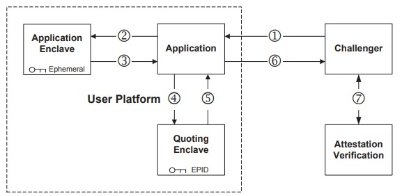

# SGX

SGX（Software Guard eXtensions）是 Intel 提出的一种软件保护扩展技术。SGX 利用特殊的指令集和硬件构造和维护安全区域 enclave（飞地），并在 enclave 执行程序、处理安全任务。enclave 利用硬件特性实现 enclave 间的隔离、enclave 和普通程序之间的隔离，以此确保 enclave 内部代码和数据的安全性。

## SGX 模型

### PRM

利用特权级的隔离归根到底只能实现权限和物理内存逻辑上的隔离，只要绕开了必要的逻辑检查就可以绕开这些隔离机制。对于代码，可以通过控制流的劫持的方式获得代码控制权限；对于数据，可以通过一些 OOB 等方法读写不应该被访问的内存；对于页表等元数据，可以先通过漏洞修改元数据权限，然后再对代码和数据进行窃取。enclave 在硬件上缓解了这些问题。

#### PRMRR 寄存器

SGX 体系结构提供了一组专用的 PRMRR 寄存器（类似于 riscv 的 pmpaddr）。当 SGX 体系结构启动时，固件代码会对 PRMRR 进行设置，从而预留一段内存作为 PRM（processor reserved memory）作为 SGX 专用内存。这部分内存被 PRMRR 保护，当处理器在 normal 模式下执行时，PRMRR 会检查内存访问地址，然后禁止处理器对 PRM 进行内存访问，只有当处理器在 enclave 模式下执行 enclave 时才可以访问这部分 PRM。这杜绝了 normal 程序对 enclave 代码、数据的直接修改和访问。

#### MEE 机制

此外 SGX 对内存进行扩展，使内存成为可以自动化加密的内存。内存中集成了内存加密引擎 MEE(memory encrypt engine)，MEE 会对特殊用户写入特殊区域的内存进行加密，防止其他用户恶意窃取这部分数据。MEE 可以管理加密的内存区域被称为 MEE 区域，PRM 内存会被一个或者多个 MEE 加密保护起来。所以处理器在 enclave 状态写入内存的 enclave 数据会先被加密成密文，再存入内存；读取 enclave 数据时会先将数据解密，再写入 cache、tlb 和寄存器。当 normal 程序即使访问 enclave 内存，得到的也是加密后的数据，没有办法得到直接可用的数据。

### enclave 的管理

我们的内存被 PRMRR 切分为了 normal 区域和 EPC 区域。normal 区域的内存是按照正常操作系统的管理逻辑被管理；EPC 区域的内存只能在 normal 状态下被处理器直接读写，但是 SGX 指令集架构提供了两个接口：
* 首先，SGX 指令集架构提供了一组 ECLS 指令，当处理器位于 RING0 特权级的时候，可以用 ECLS 指令对 EPC 页面的也进行管理，比如创造 enclave、分配 EP 页、移除 EP 页、载入 EP 页等。从这个角度上来看，我们的 EPC 类似于一个密封的数据结构，内部的数据是各类页和页的数据结构，调用接口是一组 SGX 指令。这样可以确保用户对 EPC 的操作被硬件直接管理和封装起来，最大限度地防止用户用软件漏洞破坏或者泄露 EPC 内部数据结构的细节值。
* 其次，虽然 normal 处理器无法知道 EPC 内部各个字段的确切的值，比如数据段的值等，也没有办法对 EP 直接做读写，但是它对于 EPC 内部每个页的使用情况是了如指掌的，因为每个页是它用 SGX 指令构建起来的，所以它知道每个页的分配情况、数据类型，各个元数据的基本值。因此当他要选择页面做调换、选择页面新建结构的时候，他可以精确找到需要的 EP、VA slot 等信息。

前者限制了系统软件管理 EPC 的能力，防止过多的能力造成恶意的操作；后者为系统软件提供了足够的 EPC 知识，保障了系统软件管理 EPC 的能力。

### enclave 页表

处理器平台是知道 EPC 内存的范围和 EPCM 地址的，这个是软硬件协同的一部分。处理器按照下面的逻辑进行内存访问：

* 根据分段机制将逻辑地址转化为线性地址，或者说虚拟地址
* 检查当前处理器模式和访问范围，如果是 enclave 模式并且访问的是程序中的 enclave 地址空间（虚拟地址空间的逻辑定义，实际上是不是真的 enclave 地址空间请求不做保证），则 enclave_access 设置为 1，是 enclave 访问请求，反之是普通请求。
* 走页表得到对应的物理地址
* 如果是 enclave access
    * 检查物理地址范围是不是 EPC 内部
        * 是的话，检查 EPCM 权限，访问 EP
        * 不是的话，触发异常
* 如果不是 enclave access
    * 检查物理地址范围是不是 EPC 内部
        * 是的话，将地址替换另一个不存在的物理地址进行访问
        * 不是的话，访问内存

从这里可以得到如下几个结论：
* 页表中的 enclave 虚拟地址空间有且只能映射真实的 EPC 页面，反之亦然，这确保程序在逻辑层面是正确的，即有且仅有认为被保护的真实被保护
* normal 程序只能访问 normal 内存
* enclave 程序既可以访问 normal 内存，也可以访问 enclave 内存

## enclave 程序结构简介

上一节解释了，我们使用 PRM 中的内存区域来实现 enclave，这一节我们简要介绍一个 enclave 程序的组成。enclave 的作者为我们提供了一个包含 enclave 程序的二进制文件，同时为 enclave 提供了一个 SIGSTRUCT 结构，该结构记录了 enclave 初始化需要的属性，并用于验证 enclave 的正确性。通过 SIGSTRUCT 和 enclave 二进制文件，可以创建一个 enclave 程序。

enclave 组件的关系可以如下图所示。dram 内部保留一块 PRM 区域供 SGX 机制使用，SGX 机制将部分 PRM 作为 EPC 使用，EPC 被划分为各个 EP 页，每个页被一个 EPCM 的表项管理。当构建一个 enclave 的时候，一个 EP 页会被初始化为 SECS 用于管理 enclave，多个 EP 页被用于构建 enclave 程序，对于执行 enclave 的 thread 会构建 TCS 管理 thread 对 enclave 的执行。

* EP(enclave page)：enclave 所使用的页，用于存放 enclave 的代码段、数据段、堆栈段等
* EPC(enclave page cache)：用于存放和管理 enclave 所需要的内存。EPC 中的内存被划为了 4KB 大小的页，当 EPC 中的页被用于执行 enclave 程序或者充当 enclave 的元数据结构的时候，该 EPC 页也就会被标记为有效；当该页被释放时，则会被重新标记为无效。
* SECS(SGX enclave control struct)：用于存放 enclave 的元数据。当一个 enclave 被创建的时候，一个 EPC 页会被申请用于充当 SECS 以记录这个 enclave 的各类元数据信息，例如 enclave 的起始地址、enclave 的内存大小、enclave 的身份标识等。
* TCS(thread control struct)：用于管理每个执行的 enclave 的 thread。
* EPCM(enclave page cache management)：用于管理每一个 enclave page cache 的属性、是否被使用、用途等信息，没有查到具体的对应关系，但可以想见是类似页表或者数组的查找机制。

enclave 有自己的代码段、数据段、堆栈段。此外还有 ssa frame。

#### ssa(state save area)

此外，因为 enclave 在 enclave 和非 enclave 之间做切换的时候需要保存上下文，所以上下文寄存器和中断相关的信息保存在 ssa 当中，等再次发生切换 enclave 时再通过 ssa 保存的数据恢复现场。考虑到一个 enclave 可以发生嵌套的 enclave 调用和异步退出（类似于嵌套中断），每次 thread 重入都需要有自己各自的 ssa，所以 enclave 提供了一个 ssa frame 供每次 thread 使用，这个数据结构工作类似于堆栈。ssa 的部分重要 field 如下：
* gpr sgx：存储 enclave 现场的通用寄存器、栈帧寄存器、段寄存器、IP寄存器、其他寄存器；存储中断类型和中断号
* misc：存储 enclave 中的中断相关的杂项信息，比如引起缺页异常的地址、非法指令的指令内容等
* xsave：杂项指令存储，比如浮点相关的寄存器和特权寄存器、向量相关的寄存器等，根据情况大小不定

因为 ssa frame 中 ssa 的个数需要事先确定，所以 thread 的个数也要事先确定，所以 TCS 的个数也要事先确定。

## SGX 指令集

在后文描述中，我们会提到诸如 ecreate、eadd、eentry 的等各种 SGX 指令，但实际上 Intel 只提供了两条 SGX 指令，分别是 ENCLS 和 ENCLU，前者是 supervisor 可用的 encalve 指令，后者是 user 可用的 enclave 指令。之后 enclave 指令依靠 EAX 寄存器的值来进一步确定要执行的功能，如 ecreate、eadd 等，这些被成为指令的叶子功能（leaf function）。我们可以列一张简单的表格：
| ENCLS | EAX | funct                 | ENCLU | EAX | funct                 |
|-------|-----|-----------------------|-------|-----|-----------------------|
|ecreate|00H  |为 enclave 创建 SECS   |ereport|00H  |生成 enclave 的验证报告  |
|eadd   |01H  |为 enclave 增加一个页面 |eenter |02H  |进入 enclave            |
|einit  |02H  |提交 enclave 初始化     |eresume|03H  |中断退出的返回           |
|eextend|06H  |对 enclave 页面做度量   |eexit  |04H  |退出 enclave            |
|eldb   |07H  |载入被替换的 EP 页      |egetkey |05H  |得到加密的密钥          |
|eldu   |08H  |载入被替换的 EP 页      |       |     |                       |
|eblock |09H  |将 EP 也设置为 blcoked  |       |     |                       |
|epa    |0AH  |新建一个 VA 页          |       |     |                       |
|ewb    |0BH  |将一个 EP 加密替换出 EPC |       |     |                       |
|etrace |0CH  |跟踪 SECS 的执行状态    |       |     |                       |

Intel 的 eclave 指令调用在某种程度上类似于 int 指令的调用。首先 EAX 寄存器的值为对应的调用号，决定需要调用的 enclave 功能；ebx、ecx 等寄存器载入需要传入的参数或者结构体。然后执行 enclave 指令进行执行对应调用号的函数操作。

可以看到 ENCLS 指令主要负责 enclave 的创建、毁灭等管理 enclave 的操作，需要比较高的安全性、精密性和权限要求，所以必须在 RING0 中使用；而 ENCLU 仅执行进入推出 enclave 等 enclave 调用操作，只需要比较低的优先级，可以在 user 太直接执行。

就权限而言，enclave 根本上不是特权操作，而是安全操作，它需要的不是更强的资源管理能力和抽象级别，而是更强的隔离能力，所以他的权限是独立于 normal 的 enclave，和 U/S/M 等正交。

## enclave 创建

现在我们需要创建一个 enclave 来执行特殊的程序。enclave 往往是由非 enclave 代码执行，所以创建 enclave 的时候往往处于一个非安全可信的状态。创建一个 enclave 分为如下几个步骤：
* 使用 ECREATE 创建并初始化 enclave 的 SECS 结构
* 使用 EADD 分配 enclave 的 EP 页面，将 enclave 程序的二进制加载到 REG 页面中
* 使用 EADD 分配 enclave 的 EP 页面，为 enclave 的每个线程创建 TCS
* 使用 EEXTEND 对 enclave 进行度量
* 使用 EINIT，用 SIGSTRUCT 验证 enclave 是否构建正确，之后 enclave 的 SECS 被密封，之后不允许使用 EADD 新增 EP

### 创建 SECS 结构
SGX 提供了 ECREATE 指令来构建 SECS。我们分别介绍一下 SECS 结构和 ECREATE 指令。

#### SECS 结构体
SECS 结构体的 field 如下：
* 用于定义 enclave 内存范围的 field
    * SIZE(size)：enclave 的内存长度，内存长度必须是二的幂次（如 4K、8M 等）
    * BASEADDR(base addr)：enclave 线性地址的起始地址（也可以简单认为是虚拟地址）
* 用于中断退出保存的 field
    * SSAFRAMESIZE(ssa frame size)：ssa 区域用于保存 enclave 中途退出时候的现场，该 field 描述 ssa 区域的大小，必须是 2 的 幂次
    * MISCSELECT(misc select)：位向量，对 SSA 中的各个 misc field 进行使能；当 enclave 中断退出时，只有 misc select 使用的 field 会将数据保存到 ssa misc field 中。记录在 SIGSTRUCT 中。
* 用于定义 enclave 权限的 field
    * ATTRIBUTE(attibute)：encalve 的各个属性，如能否调试、能否运行在 64 位、密钥的权限等。记录在 SIGSTRUCT 中。
* 用来标识 enclave 身份的 field
    * MRENCLAVE(measurement register of enclave)：存储 enclave 构建时的度量，作为 enclave 可信性和身份的标识
    * MRSIGNER(measurement rehister of signer)：存储 enclave 签名和密封时候的公钥度量，作为 enclave 认证和密封的标识
    * ISVPRODID(isv product id)：enclave 生产厂家的 ID 号。记录在 SIGSTRUCT 中。
    * ISVSVN(isv security version number)：enclave 的安全版本号，记录在 SIGSTRUCT 中。
    * EID(enclave identity)：enclave 的唯一标识号

#### PAGEINFO 结构体
PAGEINFO 是 ENCLAVE 执行所依赖的数据结构，Intel 的指令与其当作一条指令，不如当作是一个函数调用方式，它的参数除了寄存器值之外，甚至会用寄存器作为一个复杂结构体的指针，然后将这个结构体作为扩展参数，这一点和 C 函数调用如出一辙。

我们简要介绍 PAGEINFO 的各个域：
* LINADDR(linear address)：线性地址，在 ecreate 中是用于定义 enclave 的起始虚拟地址
* SRCPG(source page)：源页地址，在 ecreate 中是在普通内存定义的 SECS 结构的地址
* SECINFO(SECS information)：SECINFO 结构的地址，包含SECS 的扩展信息
    * FLAGS：包含 enclave 的状态、RW 权限等
    * RESERVE：其他预留的扩展内容
* SECS(SECS)：当前 enclave 指令所需要的 SECS 结构的地址，ecreate 的 SECS 就是它要初始化的 SECS

#### ECREATE 指令
ecreate 指令的参数格式如下：
* 大类：ENCLS
* eax：载入 ecreate 指令执行时需要的编号 00H
* ebx：载入初始化 SECS 需要的 PAGEINFO 结构的指针，指定了地址范围、初始化 SECS 的值
* ecx：被初始化为 SECS 页的 EP 页的地址

当指令被执行之后：
* 如果 ecx 指向的 EP 页没有被占用就会被分配作为 SECS 页，对应的 EPCM 中的 entry 也会被对应设置
* 然后这个 SECS 页会用 ebx 指向的 PAGEINFO.SRCPG 的值进行初始化
* 如果地址存在不对齐、地址不合法、SECS 内部初始化的内容不满足检查的要求，那么就会执行失败，导致 GF、FP 等错误
* 修改 SECS 的 MRENCLAVE，当 enclave 指令执行时，处理器将当前执行的 enclave 指令相关的信息用 SHA256 计算出来并叠加到当前的 MRENCLAVE 值上，随着一个 enclave 不断地执行 enclave 指令，它的度量也会随之不断修改。ecreate 用的摘要值是 ecreate 的魔数、enclave 的长度、enclave 的 ssa 长度
* 设置 EID。处理器有一个特殊的寄存器 CR_NEXT_EID 用来为 ENCLAVE 分配序号。当生成一个新的 enclave 时，寄存器自增一作为新的 EID

**微码转换**：可以看到 ecreate 的伪代码描述非常的复杂，如果直接用硬件有限状态机实现非常的繁琐，好在 intel 的微码转换在一定程度上可以有效解决指令实现的复杂程度问题。这里可以将 ecreate 的功能用长长的微码来重新实现，然后当处理器前端发射一条宏指令 ecreate 的时候，intel 就从微码转换器中找到 ecreate 对应的微码序列，然后发射和执行微码序列即可，而不需要额外修改硬件的实现。如果有一条对 ecreate 的实现需要做修改，也只要修改微码序列即可。

### 添加 EPC 页面

现在使用 eadd 指令，软件选择一个空闲的 EP 页面添加到 enclave 中。这里包括两种页面添加，一种是为 enclave 程序添加 REG 类型的 EP，一种是为执行 enclave 的 thread 添加 TCS 类型的 EP。我们首先简单介绍 EADD 指令。

#### EADD 指令
eadd 指令的参数格式如下：
* 大类：ENCLS
* eax：编号 01H
* ebx：载入初始化 EP 需要的 PAGEINFO 结构的指针，指定了需要被拷贝的数据
* ecx：被添加的 EP 地址

执行过程如下：
* 如果当前 ecx 指示的 EP 空闲，将 PAGEINFO.SRCPG 的内容拷贝到 EP 当中
* 检查 PAGEINFO.SECINFO.FLAGS.PT 判断需要初始化的 PC 的类型为 REG 还是 TCS
* 将 eadd 指令操作的信息用 sha256 度量之后累加到 SECS 的 MRENCLAVE 之中，参数为 eadd 的魔数、页在 enclave 内部的偏移、SECINFO 的信息也就是页的属性
* 设置 PC 页对应的 EPCM entry，如属性、类型、线性地址、enclave 序号等，如果是 TCS 强制不可读不可写不可执行，对于 REG 用户自定义参见 PAGEINFO.SECINFO.FLAGS

#### EPCM entry
这里对于 EPCM 的权限做一个简单介绍，每个 EP 对应一个 entry，部分重要的 field 如下：
* VALID(valid)：是否被使用
* W(write)：是否可写
* R(read)：是否可读
* X(execute)：是否可执行
* PT(page type)：页类型，包括 SECS、TCS、REG、VA、TRIM 五种
* ENCLAVESECS：enclave 序号，表示页归属于哪个 enclave
* ENCLAVEADDR：页的线性 enclave 地址
* BLOCKED：是否处于 BLOCKED 状态，后续密封的时候会讲到
* PENDING：是否处于 PENDING 状态
* MODIFIED：是否处于 MODIFIED 状态

EADD 指令在本阶段做两件事情，第一通过不断执行 EADD 操作将 enclave 程序从普通内存不断拷贝到 EPC 内存当中去，实现二进制的载入，此外还需要额外的 EADD 操作为 enclave 构建栈结构和堆结构区域。

第二，通过执行 EADD 操作为 enclave 不断构造 TCS 结构，如果希望一个线程可以执行 enclave 就需要为他构造一个独立的 TCS；如果希望 thread 可以嵌套执行多次，enclave 程序的 SSA slot 需要提供多个 SSA slot。TCS 指定了程序的入口地址，对于 FS、GS 段的处理，对于 SSA 的处理。

#### TCS 结构
这里对 TCS 的结构做一个简单介绍：
* FLAGS(flags)：设置一些属性，如能否调试
* OSSA(offset of ssa)：SSA 关于 BASEADDR 的偏移
* CSSA(current ssa)：当前用于存储 SSA 的 ssa frame 的 slot 序号。地址为`(SECS.BASEADDR + TCS.OSSA)[TCS.CSSA * sizeof(TCS)]`
* NSSA(number of ssa)：ssa frame 中 ssa slot 的个数
* OENTRY(offset of entry)：enclave 的入口地址关于 SECS.BASEADDR 的偏移量，当进入 enclave 的时候会从这个地址进入 enclave
* OFSBASEGX(offset fs base gx)、FSLIMIT(fs limit)：enclave 如果要有自己额外的 fs 段，则用 OFSBASEGX 定义 fs 段在 enclave 内部的偏移，FSLIMIT 定义 fs 段的长度。FS 范围就是`(SECS.BASEADDR+TCS.OFSBASEGX)[FSLIMIT]`
* OGSBASEGX(offset fs base gx)、GSLIMIT(fs limit)：GS 段和 FS 段同理

### 度量 EPC 页面

因为我们的 MRENCLAVE 作为 enclave 程序可信度的标识，所以它应该可以包含 enclave 程序程序内容的信息，因此需要将 eclave 二进制程序的代码、数据信息以及构造的 TCS 信息也度量之后，加入到 MRENCLAVE 当中。这一步可以用 eextend 指令来实现。

#### EEXTEND 指令
eadd 指令的参数格式如下：
* 大类：ENCLS
* eax：编号 06H
* ebx：载入 PAGEINFO 结构的指针
* ecx：需要度量的 256 个字节的首地址

执行过程如下：
* 将 eextend 指令操作的信息用 sha256 度量之后累加到 SECS 的 MRENCLAVE 之中，参数为 eextend 的魔数、被度量字节序列在 enclave 内部的偏移。
* 将 256 个字节用 sha256 度量之后添加到 SECS 的 MRENCLAVE 之中。

因为一个页有 4K 大小，所以需要用 eextend 指令度量 16 次才可以度量完全，对于一个程序则需要度量更多的次数。

通过这样的操作，我们的 MRENCLAVE 就记录了构建 enclave 过程中的 enclave 指令操作日志和 enclave 执行的程序的摘要。因为 enclave 是被一个不可信的软件构造的，因此用这个方法可以防止软件篡改 enclave 程序，确保 enclave 的完整性。

### 验证 enclave 的初始化

在初始化完成 enclave 的 SECS 和二进制程序之后，我们用 einit 指令来提交当前的 enclave 初始化操作。虽然我们用软件初始化了 enclave 的二进制和 SECS，但是这个软件是不可信的（不管是恶意的，还是有 bug 的），我们需要额外的手段来检验这个软件是不是正确的初始化了 enclave。

enclave 程序的作者为我们提供了 SIGSTRUCT 结构用于程序的验证，这里面包含了作者的各种信息和 enclave 正确初始化时的度量。之后通过 einit 将软件初始化的 enclave 的度量和作者提供的 SIGSTRUCT 中的度量进行比较，就可以判断 enclave 是否初始化正确。这里我们默认作者、作者的 SIGSTRUCT 和他的 enclave 程序是可信的。

#### SIGSTRUCT 结构

SIGSTRUCT（signer structure）的部分重要的 field 如下：
* 产品相关：
    * vendor：厂家标号，intel 提供的编号为 8086
    * isvprodid：enclave 的产品编号，vendor id 和 product id 共同表示 enclave 的身份
    * isvsvn：enclave 安全版本号
    * data：enclave 的生产日期
* 身份认证：
    * modulus：作者提供的认证公钥，同时也表示了作者的身份
    * exponent：RSA 计算时候用到的参数
    * Q1：RSA 计算用到的参数
    * Q2：RSA 计算用到的参数
    * signature：SIGSTRUCT 内部各个信息的作者签名，用于证明这部分信息的真实性
* enclave 信息相关，初始化 enclave 时用的属性设置：
    * miscmask、miscselect：初始化 SECS 的 miscsel 时使用，毕竟只有作者才知道那些 misc 需要额外保存
    * attributes、attributemask：初始化 SECS 的 attribute 时使用，毕竟只有作者才知道最合适的 attribute 是什么
* enclave 验证：
    * enclavehash：enclave 正确初始化时应该有的度量值

可以清晰地看到，产品相关部分和身份认证部分 field 用于验证 enclave 的产品身份和可信性；enclave 信息部分用于 enclave 的初始化；最后 enclavehash 验证 enclave 是否初始化正确。

SGX 的 einit 指令可以对初始化完毕之后的 enclave 进行检查，如果 SECS 的 MRENCLAVE 和 SIGSTRUCT 的 ENCLAVEHASH 保持一致，则验证通过，einit 对 SECS 做最后的初始化操作，然后对 SECS 做密封。至此 enclave 的 SECS、enclave 的程序布局、enclave 的二进制内容、enclave 的 TCS、enclave 的 SSA frame 都一比一还原了。

#### einit 指令
einit 指令的参数格式如下：
* 大类：ENCLS
* eax：编号 02H
* ebx：用于验证的 SIGSTRUCT
* ecx：用于验证的 SECS
* edx：用于验证的 EINITTOKEN，einit 有两种情况，我们现在考虑的用普通程序初始化一个 enclave 不需要使用 EINITTOKEN，所以我们不需要使用这个变量。暂时先忽略它的存在。

简化后 einit 执行如下的操作：
* 用 SIGSTRUCT 的公钥对 SIGNATURE 签名进行验证，确保 SIGSTRUCT 内部的信息没有被篡改，是真实可信的
* 检验 SIGSTRUCT 的 ENCLAVEHASH 和 SECS 的 MRENCLAVE 是否保持一致，从而确认 enclave 的初始化是否按照预期完成
* 检查 SIGSTRUCT 提供的初始化属性和 SECS 使用的初始化属性是否保持一致
* 暂时省略 einit token 相关的操作
* 用 SIGSTRUCT 提供的公钥的 sha256 摘要作为 SECS 的 MRSIGNER，完成封装
* 对 SECS 的 isv 等属性完成最后的初始化

* eax 返回 einit 是否执行成功

至此一个 normal 程序成功初始化了一个 enclave，我们可以用这个 enclave 开始后续的代码执行。SECS 的 MESINGER 被设置之后，SECS 就已经被密封了，之后不允许用 EADD、EEXTEND 对 enclave 做修改，确保 enclave 的完整性，防止他在被创建之后再被修改。

## enclave 进入和退出

### enclave 的同步进入

构造完 enclave 之后，程序就可以使用 EENTER 指令进入 enclave 的指定入口进行执行。该指令只要实现三件事情：
* 切换特权级和 PC
* 切换上下文
* 准备异常中断返回地址

#### EENTER 指令
eenter 指令的参数格式如下：
* 大类：ENCLU
* eax：编号 02H
* ebx：用于存放 TCS 的地址
* ecx：用于存放 AEP 的地址，AEP 存的是 enclave 异常中断退出的时候的返回地址

eenter 执行如下的操作：
* 格式检查：
    * 检查 TCS 的格式正确，并且根据 TCS 找到对应的 SECS
    * TCS 没有被 block、pend、modified
    * 如果 TCS.CSSA 等于 TCS.NSSA 则说明 TCS 的嵌套栈满了，不可以在被调用了
* 初始化 enclave 的特权寄存器，为处理器提供 enclave 的信息（enclave 信息从内存向处理器转移的过程）
    * 根据 TCS.XSAVE 的情况计算出 SSA 的大小，根据 TCS.OSSA 和 TCS.CSSA 计算出 SSA 的地址，将 SSA.XSAVE 的各个页的地址保存到 CR_XSAVE_PAGEn
    * 将当前 enclave 的 SECS 的地址写入 CR_ACTIVE_SECS，表示当前活跃的 SECS
    * 根据 SECS.BASEADDR 和 SECS.SIZE 载入 CR_ELRANGE，标识当前 enclave 的地址范围
    * 将 TCS 的物理地址保存在 CR_TCS_PA
    * 将 TCS 的线性地址保存在 CR_TCS_LA
    * 将 TCS 的异步退出地址保存在 CR_TCS_LA.AEP
    * 将 nrip 载入 rip
    * 将 TCS.FLAGS.DBGOPTIN 保存到 CR_DBGOPTIN
* 保存和切换上下文
    * 将 SSA 的 GPR 区域的地址保存到 CR_GPR_PA 寄存器中
    * 将 RSP 和 RBP 保存到 SSA 中
    * 将 crip 保存到 CR_ENCLAVE_ENTER_IP
    * 将 FLAGS.TF 保存到 CR_SAVE_TF 中
    * 将 XCR0 保存到 CR_SAVE_CR0 中，将 SECS.ATTRIBUTE.XFRM 修改 XCR0
    * 将 fs 和 gs 段寄存器信息保存到 CR_SAVE_FS_* 和 CR_SAVE_GS_*，fs、gs 替换为 TCS 设置的段信息
* 权限切换：
    * 将处理器工作模式设置为 ENCLAVE 模式，将 CR_ENCLAVE_MODE 设置为 1
    * 清空流水线和 TLB 中的表项

从这里可以看到 thread 的 ESP 和 EBP 并没有被修改，所以 enclave 使用的 stack 依然是 normal thread 自己的堆栈，他可以继续调用自己原有的 normal 数据。

### enclave 的同步退出

当 enclave 执行完毕后，执行 eexit 指令退出 enclave

#### eexit 指令
eexit 指令的参数格式如下：
* 大类：ENCLU
* eax：编号 04H
* ebx：enclave 外的返回地址
* ecx：aep 返回地址

eexit 执行如下的操作：
* 恢复 fs、gs，恢复 XCR0，恢复 FLAGS.TF
* RIP 载入 EBX 的值，控制流转移
* 权限切换为 normal
* 清空流水线、缓存的上下文

如果 ebx 指示的返回地址依旧是 enclave 内部的地址，eexit 依然会退出到这个地址，但是这个时候处理器权限已经是 normal 了。因为这个时候继续执行的是 enclave 内部的指令，从而产生异常从 ecx 指示的 AEP 地址退出。

### enclave 异步退出

当 enclave 在执行过程中发生中断异常，就会异步退出 enclave 执行。首先执行上下文的切换，然后退出到实现预设的 AEP 地址。

#### AEX 事件
异步事件导致 enclave 退出被称之为 AEX(asynchronous enclave exit)，导致 enclave 退出的异步事件被称之为 EEE(enclave exit event)。当发生 AEX 的时候处理器执行如下操作：
* 将 enclave 信息保存到 SSA
    * 将 GPR 保存到 SSA.GPR
    * 将异常相关的信息保存到 SSA.MISC.EXCINFO
    * 根据 SECS.MISCSELECT 将杂项信息保存到 SSA.MISC
    * 将 XFREM 等信息保存到 SSA.XSAVE
    * ...
* 恢复 normal 模式的寄存器
    * 恢复 FS、GS
    * 恢复 ESP、EBP
    * ...
* 提供返回值
    * 切换特权级
    * RIP 修改为返回地址 AEP
    * EAX 修改为 3，之后调用的 ERESUME 的调用号
    * EBX 修改为异常号
    * ECX 修改为 AEP 的值

此外，因为一个 SSA 被使用了，所以 TCS 的 CSSA++，下次 thread 调用 enclave 就会使用下一个 SSA，不会破环上一个未处理完毕的 thread 的 SSA 现场。如果所有的 SSA 都被占用了，也就是 CSSA == NSSA，则之后不允许 thread 进入 enclave 了。

### enclave 异步退出后的返回

当 enclave 发生 AEX 之后，他会进入 AEP 指定的外部地址。这个外部地址是一个跳板程序，之后它会进入 kernel 的 trap handler 对 enclave 的异常做进一步处理处理，处理完毕后返回跳板程序，最后 ERESUME 指令返回 enclave 继续执行。这一步类似于普通中断进入 kernel 之后，kernel 执行异常处理程序，然后执行 IRET 返回原来的程序执行流，只不过 enclave 的控制流要经 user 转移到 kernel，而不是直接转移到 kernel。

#### ERESUME 指令
eresume 指令的参数格式如下：
* 大类：ENCLU
* eax：编号 03H
* ebx：用于存放 TCS 的地址
* ecx：用于存放 AEP 的地址，AEP 存的是 enclave 异常中断退出的时候的返回地址

AEX 返回的时候将 EAX 设置为 3，将 ACX 设置为 AEP 就是为了方便 AEX 之后执行 ERESUME 返回（可以少设置两个寄存器）

指令执行的操作：
* 保存 normal 程序上下文：
    * 保存 AEP
    * 保存 EBP、ESP
    * 保存 FS、GS
    * 保存 XSAVE
    * ...
* 恢复 enclave 上下文：
    * 恢复 GPR、RIP
    * 恢复 FS、GS
    * 恢复 XSAVE
    * ...
* 其他：
    * 切换特权级
    * CSSA--

## enclave 替换

对比 swap memory。memory 的大小是有限的，当 memory 中的内存不够的时候，OS 会将部分 memory 的内容转移到磁盘的 swap memory 暂存起来，然后将替换出来的内存拿来作为 memory 使用。从而使得 OS 实际可以调度的内存范围大于 memory 的内存范围。同理，当 EPC 需要使用更多的 EPC 的时候，可以将部分 EP 页面的内容转移到普通 memory 中，然后使用空出来的 EP，从而使得 SGX 能够使用比 PRM 更多的 EP 空间。

替换一个 EP 页面分为三步：
* 首先选择一个合适的页面进行替换，将这个页面进行锁定，防止其他的进程继续调用它
* 然后将这个页面和页面的元数据进行加密保存到普通内存中，当然还需要额外的数据结构 VA 管理被替换的页的版本号
* 将替换出去的页解密，然后替换回来

### 锁定 enclave 页面

首先用系统软件选择可以被替换出去的 EP 页面。然后用 eblock 指令将这个 EP 页面的的状态设置为 blocked，防止其他的进程在调用这个页面。当一个页面被设置为 blocked，这个页面的 地址转换信息将不再被更新到 TLB 中。在替换一个页之前，我们需要确认这个页所在的 enclave 没有被执行，这是需要使用 etrack 指令对 enclave 的执行情况进行跟踪。

#### eblock 指令
eblock 指令的参数格式如下：
* 大类：ENCLS
* eax：编号 09H
* ecx：要设置为 block 的 EP 页面的地址

eblock 的执行过程如下：
* 将合法的 EP 页面在 EPCM entry 中的 blocked 设置为 1，之后这个页面就不能被其他各类 enclave 指令使用了
* 如果 block 操作失败，eax 会返回错误的编号：
    * SGX_BLK_STATE：当前也已经被 blocked 了
    * SGX_ENTEREPOCH_LOCKED：etrack 正在跟踪当前 SECS，当前的 enclave 正在被执行，我们不应该替换一个正在被执行的 enclave
    * SGX_NOTBLOCKABLE：当前页的类型不是 REG、TCS、TRIM 不可以被 blocked
    * SGX_BLK_IVD：当前页是 invalid 的无效页
    * SGX_LOCKFAIL：EPCM 正在被修改，说明有 encreate、eadd 等初始化操作正在被执行

这类可以看到一个可以 block 的 EP，必然是没有被执行的、有效的、没有被访问的 REG、TCS、TRIM 页

#### etrack 指令
etrack 指令的参数格式如下：
* 大类：ENCLS
* eax：编号 0CH
* ecx：要跟踪的 SECS 的 EP 页面地址

etrack 的执行过程如下：
* 检查 SECS 页面的 TRACKING 域，当 SECS 正在被执行时，这个 field 被设置。如果 SECS 正在被执行，则 etrack 返回错误，反之则返回 0
* 当且仅当所有的逻辑处理器执行 enclave 代码完毕，并且将所有的 enclave 相关的 TLB 清空，才认为 SECS 执行完毕

### 替换 enclave 页面

我们首先介绍几个 enclave 替换操作相关的数据结构。

#### VA array 结构
当一个 EP 被替换出内存之前，它的版本信息需要被保存在 VA array 当中，VA 是一个数组，每个表项用于记录一个 EP 的信息，每个 slot 的大小是 8 byte，用于记录当前 EP 的版本号，所以一个 VA 页可以保存 512 个 EP 页的信息。当一个 EP 被移除之前，会在 VA 中找到一个空闲的 slot，然后保存自己的版本号。如果 VA 已经满了，那么用 EPA 指令分配一个新的 VA。VA 本身也可以被替换出去，这个时候这个 VA 的版本号也会被记录到另一个 VA 的 slot 当中。

为什么需要记录版本号呢？因为一个 EP 被加密保存到了 memory。这个时候 SGX 的加解密器可能会热更新（比如微码更新），导致版本发生变化，这可能会导致加密 EP 的密钥发生变化，甚至加密的算法发生变化，因此原来的 EP 将无法被解密。为了管理这一变化，SGX 提供了版本号，如果 SGX 更新导致版本号发生变化，则旧的版本号的 EP 将无法被继续使用。

#### PCMD(PAGING CRYPTO META DATA)
PCMD 是 PAGEINFO 的一部分，PAGEINFO 的 SECINFO 部分是一个 union，既可以是 SECINFO，也可以是 PCMD。当执行页面替换操作的时候，因为 EP 直接拷贝到 normal memory 是不安全的，所以在拷贝之前，需要先对 EP 做一个加密。加密之后的各类信息会被保存在这个 PCMD 结构中返回。这个数据结构会被替换操作的 EWB 指令使用。PCMD 的数据结构如下：
* SECINFO：PCMD 的第一个 field 就是 SECINFO，所以预期是说 SECINFO 和 PCMD 是 union，不如说 ecreate 和 eadd 只是用了 PCMD 中的 SECINFO，而忽略了其他的数据结构
* ENCLAVEID：EP 页所关联的 enclave 的 id，和 SECS 的 eid 保持一致
* MAC：加密之后的签名结果，为了确保页面数据的完整性，页面数据、页面数据的元数据等信息会被签名保存起来，防止被篡改

现在我们正式介绍如何用 EWB 指令替换页面。

#### EWB 指令
ewb 指令的参数格式如下：
* 大类：ENCLS
* eax：编号 0BH
* ebx：PAGEINFO 数据结构的地址，SRCPG 是 EP 加密后被转移到的 normal memory 的地址，加密后的一些重要信息会通过 PAGEINFO 结构中的 PMCD 返回
* ecx：要被加密替换出去的 EP 的地址
* edx：被选择保存版本信息的 VA 表项的地址

ewb 指令的执行流程：
* 通过 EPCM 得到被替换的 EP 对应的 SECS，获得对应的 eid
* 填充用于加密的元数据数据结构，包括 EP 在 enclave 中的线性地址、EP 的 EPCM entry 信息（也包括 eid）
* 这个 128 位的元数据和 4K 的 EP 页面数据用 CR_BASE_PK 密钥进行 AES 加密，得到加密后的 EP 页面和 MAC 签名
* 加密后的页数据被保存到 PAGEINFO.SRCPG 指示的 normal 内存中
* PAGEINFO 返回加密的信息，其中 PMCD 的 SECINFO 载入 EP entry 信息、MAC 载入签名信息、ENCLAVEID 载入 eid 信息
* EP 的 entry 被标记为 invalid
* 将当前密封权威的版本号保存到 VA slot 当中

EWB 将 EP 页加密并保存到了 normal memory，并且构造了包含 EP 源信息的 PCMD 结构（如 EPCM 信息、MAC 信息）。这个 PCMD 结构和 VA slot 表项相关的信息需要系统软件手动保存到 normal memory 中管理起来。等后续需要将页面重新载入的时候可以再根据 PCMD、VA slot、EP 保存地址等信息将它重新加载回 EPC。

#### EPA 指令
顺便介绍一下用于扩展 VA 页面的 EPA 指令。

epa 指令的参数格式如下：
* 大类：ENCLS
* eax：编号 0AH
* ebx：PT_VA 的枚举值，用于填充 EPCM 的 PT
* ecx：被选中的 EP 页的地址

执行流程如下：
* 检查 EP 也是否已经被占用
* 将 EP 页内容清空，设置对应的 EPCM，类型为 VA

### 重新载入 enclave 页面

等需要将 enclave 页面重新载入 EPC 的时候（比如 enclave 缺页异常的时候），系统软件或者异常处理程序根据 AEX 退出时的 SSA 信息定位到需要的加密 EP 的地址、PCMD 的地址、VA 的地址。然后调用 ELDU、ELDB 将数据重新载入 EP 页面，并初始化 EPCM entry。

#### ELDU/ELDB 指令
eldu/eldb 指令的参数格式如下：
* 大类：ENCLS
* eax：ELDB 编号 07H、ELDU 编号 08H
* ebx：PAGEINFO 数据结构的地址，SRCPG 是加密后的 EP 在 normal memory 的地址，PMCD 是保存的元信息，SECS 保存对应的 SECS 的地址
* ecx：被载入数据的 EP 页面的地址
* edx：被选择保存版本信息的 VA 表项的地址

eldu/eldb 的执行流程如下：
* 将加密的页面数据、线性地址、PMCD 的各类元数据用 CR_BASE_PK 密钥作 AES 操作，可以计算得到解密后的页面数据和签名 MAC
* 将页面数据拷贝到 ecx 指示的 EPC 中
* 将计算得到的 MAC 和 PMCD 的 MAC 进行比较，如果相同则验证通过，数据有效
* 更新 EPCM 中的 entry 表项
* 如果是 ELDU，entry 的 blocked 设置为 0；如果是 ELDB 则设置为 1

## enclave 验证

一些复杂的功能需要多个 enclave 协同工作才可以实现，但是对于每个 enclave 其他的 enclave 是不可信的，因此需要验证机制让每个 enclave 知道对方 enclave 的可信性。对方 enclave 如果是在本地执行的话，enclave 之间可以用简单的本地验证策略进行验证；但是如果 enclave 在远端，则需要用比较复杂的远端验证的方式建立信任。

### 本地验证

enclave 在验证的时候，enclave A 可以用 ereport 指令构建自己的 report 报告发送给 enclave B，这个报告同时会用密钥签名；然后 enclave B 可以用 egetkey 得到和 enclave A 调用 report 时候一样的密钥，检验 report 的完整性和真实性，然后检查 report 的值确定 enclave A 的信息。因此我们首先对 ereport 和 egetkey 等概念进行介绍。

#### REPORT 数据结构
report 是 enclave 调用 ereport 指令得到的数据结构，他部分重要的 field 如下：
* CPUSVN：cpu 处理器的安全版本号
* MISCSELECT：enclave 的 miscselect属性
* ATTRIBUTE：enclave 的 attribute 属性
* MRENCLAVE：enclave 的 enclave 度量值
* MRSIGNER：enclave 的密封值
* ISVPRODID：enclave 对应的产品号
* ISVSVN：enclave 的安全版本号
* REPORTDATA：report 使用的 enclave 提供的特殊数据
* KEYID：ereport 构建 mac 签名时使用的 report 密钥的序号
* MAC：用 KEYID 对应的密钥对 report 做的签名

这些数据信息基本来自 enclave 的 SECS。其中 CPUSVN 等 field 用于报告平台信息，其余的汇报 enclave 信息，如果 CPUSVN 和 ISVSVN 等信息不满足要求，则说明平台和 enclave 不满足安全要求，enclave 是不会验证通过。

#### TARGETINFO 数据结构
在建立 report 的时候除了需要 enclave 自己的信息，也需要发起 report 请求的 enclave 的信息，这两部分信息回忆起被做成摘要，以表明当前的 report 是 enclave A 向 enclave B 发起的。部分重要的 field 如下：
* MISCSELECT：enclave 的 miscselect属性
* MRENCLAVE：enclave 的 enclave 度量值

#### ereport 指令
ereport 指令的参数格式如下：
* 大类：ENCLU
* eax：编号 00H
* ebx：TARGETINFO 数据结构地址，来自 target enclave 的信息
* ecx：readdata 地址，本地提供的额外 report 数据
* edx：生成的 REPORT 数据结构的地址

指令执行流程如下：
* 检查 TARGETINFO、READDATA、REPORT 地址都在 EPC 内部，并且结构合法
* 根据 SECS 的信息填充 REPORT 的各个 field，CPUSVN 来自 CR_CPU_SVN，KEYID 来自 CE_REPORT_KEY_ID
* 根据 TARGETINFO 中的信息和 KEYID 构建 KEYDEPENDENCE，然后用 SGX 的 TCB 硬件根据 KEYDEPENDENCE 构建一个 report 密钥，因此这个密钥是 enclave A 和 enclave B 之间加密通信独有的。可以用 TPM 来构造这个密钥。
* 得到密钥之后对 REPORT 的数据的哈希值进行签名，保存到 MAC 中，得到最终的完整 REPORT

#### KEYREQUEST 数据结构
egetkey 指令请求密钥时候所使用的数据结构，记录了请求密钥的 enclave 信息和密钥信息，部分重要的 field 如下：
* KEYNAME：记录了 key 的类型，可以请求的 key 密钥一共分为 5 种
    * SEAL_KEY：用于 enclave 的密封
    * REPORT_KEY：用于 enclave 的验证
    * INITTOKEN_KEY：用于 enclave 的 inittoken 生成
    * PROVISION_KEY、PROVISION_SEAL_KEY：检查 enclave 的 provision 权能
* KEYPOLICY：
* ISVSVN：记录 isv 安全版本号
* CPUSVN：记录 cpu 的安全版本号
* ATTRIBUTEMASK：记录 enclave 的属性掩码
* KEYID：来自 report 记录的 CR_REPORT_KEY_ID
* MISCMASK：enclave 的 miscselect 属性

#### egetkey 指令
ereport 指令的参数格式如下：
* 大类：ENCLU
* eax：编号 05H
* ebx：KEYREQUEST 数据结构地址
* ecx：存储导出密钥的 buffer 的地址

执行流程：
* 根据 KEYREQUEST.KEYNAME 填充对应的 KEYDEPENDENCE 数据结构，数据来自 KEYREQUEST、SECS 和其他寄存器
* 利用 KEYDEPENDENCE 到处对应的密钥 key，然后将 128 位的 AES 密钥保存到 buffer 中

这个操作存在一个危险性，就是密钥离开了处理器微架构进入了内存，那么就存在因为 enclave bug 而被泄露的风险。但是好在这个密钥仅仅在 enclave A 验证 enclave B 期间会被 enclave A 自己使用并导出到内存，它对于其他的 enclave 没有意义。最多这个密钥泄露之后，其他的恶意程序可以用这个密钥伪造其他的 enclave 的 report，导致 enclave A 被攻击。所以 enclave A 有义务保管好自己密钥不被泄露。

另外我们可以看到，一个 SECS 的密钥和他的 SECS 属性紧密相关，任何度量、版本之间的变化都会导致密钥的变化。

egetkey 会用到一个特殊的参数 OwnerEpoch。这个参数是平台所有者的表征，当平台的所有者发生转换的时候，这个 OwnerEpoch 就会发生转换，导致原来所有的密钥都失效，原来的加密全部都失效。

现在我们介绍本地验证中 enclave A 验证 enclave B 可靠性的具体流程：
* 首先 enclave A 和 enclave B 之间建立一条不可信的传输通道
* enclave A 将自己的 TARGETINFO 发送给 enclave B
* enclave B 根据 TARGETINFO 和自己的信息，调用 ereport 指令生成自己的 REPORT 数据结构
* enclave B 将 report 发送给 enclave A
* enclave A 利用 report 的信息和自己的信息构造 KEYREQUEST
* enclave A 调用 egetkey 指令和 KEYREQUEST 得到需要的密钥
* 使用密钥对 REPORT 的签名 MAC 进行检验，如果签名正确，则说明 REPORT 有效，enclave B 的身份得到验证
（不过则么应对重放攻击呢？）
* 之后 enclave B 向 enclave A 发送自己的 TARGETINFO，enclave B 对 enclave 进行验证

### 远程验证

SGX 的远程认证在 TPM 的远程认证 DDA 协议的基础上进行扩展实现 EPID（enhanced privacy ID）协议。为了让 enclave A 和远端的设备之间可以建立可信的连接，SGX 的系统软件提供了一个称为 Quoting Enclave 的可信 enclave。该 enclave 首先会生成一组 RSA 密钥，然后用和 DDA 协议一样的 Join 协议，让可信第三方为密钥颁发证书，从而得到第三方对于 Quoting Enclave 的确认。这个密钥就是 EPID Key。

之后的执行流程如下：
* Challenger 将一个随机数发送给 Application，同时发送认证请求，这个随机数是 DDA 协议的一部分
* Application 启动 Quoting Enclave 和 Application Encalve 之间的本地认证过程。Quoting Enclave 对 Application Enclave 认证通过，并且得到他的 REPORT。
* Quoting Enclave 对 REPORT 认证通过后，用 EPID Key 将这个 REPORT、REPORT 的签名、EPID Key 的证书发送给 Challenger。因为第三方可信、EPID Key 可信、REPORT 可信，所以 Challenger 可以通过分析 REPORT 的信息确认 Application Enclave 的平台是否满足要求。
* 如果满足要求，就可以继续开始后的远程调用了。

## 参考文献
[Intel@Software Guard Extension PPT](https://community.intel.com/legacyfs/online/drupal_files/332680-002.pdf)
[Intel@Software Guard Extension Program Reference](https://www.intel.com/content/dam/develop/external/us/en/documents/329298-002-629101.pdf)
[Innovative technology for CPU Based Attestation and Sealing](https://www.intel.com/content/dam/develop/external/us/en/documents/hasp-2013-innovative-technology-for-attestation-and-sealing-413939.pdf)
[Innovative Instructions and Software Model for Isolated Execution](https://www.intel.com/content/dam/develop/external/us/en/documents/hasp-2013-innovative-instructions-and-software-model-for-isolated-execution.pdf)
[Intel SGX Tutorial and Demo](https://github.com/GrahamAde/Intel_SGX_Tutorial_and_Demo)
[SGX-用于独立执行的创新指令集和软件模型（翻译）](https://blog.csdn.net/guojinglong/article/details/88735120)
[Intel SGX（3）——处理器](https://www.cnblogs.com/caidi/p/15469489.html)
[SGX基本原理](https://lingering.github.io/2020/06/18/SGX-%E5%9F%BA%E6%9C%AC%E5%8E%9F%E7%90%86/)
[Intel SGX初步学习理解笔记](https://blog.csdn.net/weixin_42492218/article/details/121318550#:~:text=SGX%EF%BC%88Software%20Guard%20eXtensions%EF%BC%89%E8%BD%AF%E4%BB%B6%E4%BF%9D%E6%8A%A4%E6%89%A9%E5%B1%95%EF%BC%9A%20%E6%98%AF%E4%B8%80%E7%BB%84CPU%E6%8C%87%E4%BB%A4%E6%89%A9%E5%B1%95%EF%BC%8C%E8%83%BD%E5%A4%9F%E5%88%9B%E9%80%A0%E5%87%BA%E4%B8%80%E4%B8%AA%20%E5%8F%AF%E4%BF%A1%E6%89%A7%E8%A1%8C%E7%8E%AF%E5%A2%83,%E6%9D%A5%E4%BF%9D%E6%8A%A4%E4%BB%A3%E7%A0%81%E5%92%8C%E6%95%B0%E6%8D%AE%EF%BC%8C%E5%8D%B3%E4%BD%BF%E4%BD%BF%E7%94%A8root%20%E6%9D%83%E9%99%90%E4%B9%9F%E6%97%A0%E6%B3%95%E8%AE%BF%E9%97%AE%E3%80%82%20%E9%80%9A%E8%BF%87%E8%BF%99%E4%B8%AA%E7%A1%AC%E4%BB%B6%E8%AE%BE%E6%96%BD%EF%BC%8C%E5%BA%94%E7%94%A8%E7%A8%8B%E5%BA%8F%E5%8F%AF%E4%BB%A5%E9%9A%94%E7%A6%BB%E4%BB%A3%E7%A0%81%E5%92%8C%E6%95%B0%E6%8D%AE%E6%9D%A5%E8%BE%BE%E5%88%B0%E5%AE%89%E5%85%A8%EF%BC%8C%E5%A4%A7%E5%A4%9A%E5%BA%94%E7%94%A8%E4%BA%8E%20%E5%88%86%E5%B8%83%E5%BC%8F%E7%B3%BB%E7%BB%9F%20%E4%B8%AD%E3%80%82)
