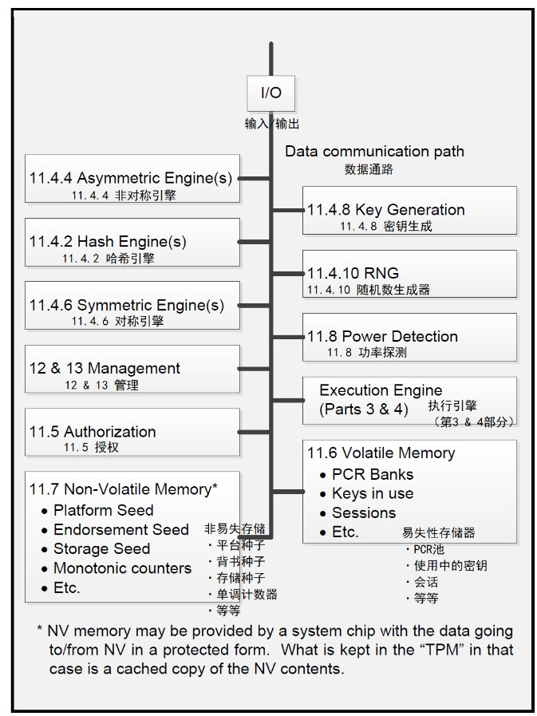
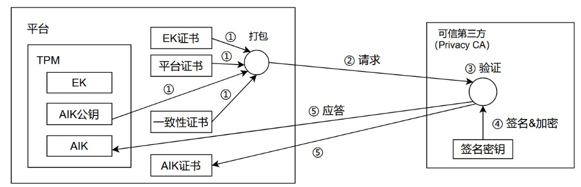
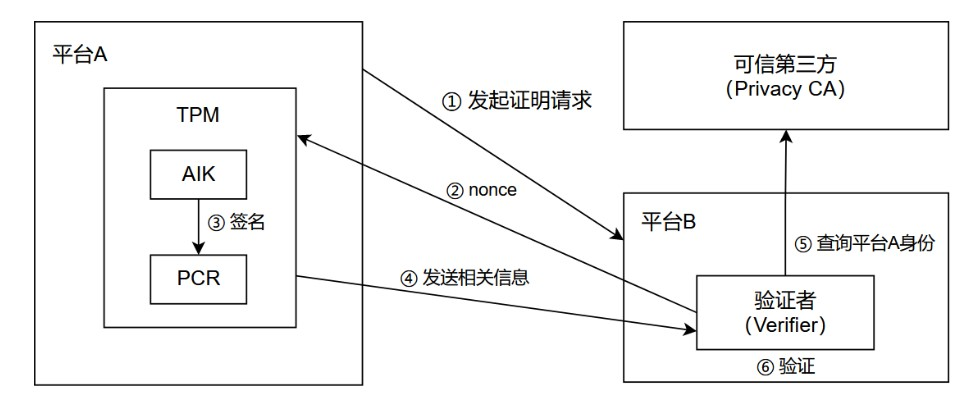
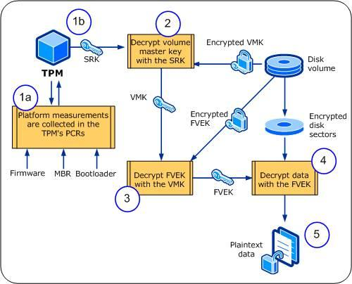

# TPM

## 简介

为了解决处理器平台日益严峻的安全问题，1999 年 10 月，Compaq、HP、IBM、Intel、Microsoft 等厂商组成了信任运算平台联盟（TCPA）以推进 PC 识别技术，从体系结构的层面上推进计算平台的安全性。2001 年 1 月，TCPA 改组为可信任运算集团（TCG），并提出了 TPM（Trusted Platform Module）规范。TPM 模块被用于 PC 的平台认证、数据加解密等领域，该规范包括 TPM 1.2x 和 TPM 2.x 两组协议，相互之间并不兼容，这里我们仅针对 TPM 2.x 进行简要介绍。

## TPM 硬件结构

TPM 模块可以认为是一个小型的加解密协处理器，它包含一个小型的处理器、密码运算引擎和存储区域。根据实现方式的不同，TPM 分为五种不同安全等级的实现，分别是：

* 独立的 TPM 芯片：存储区域完全独立，不会被外部设备而已访问存储的秘密数据，仅要求自身可信
* 和其他芯片集成的 TPM 芯片：可能受到集成在一起的其他部件的威胁，要求集成部件可信
* 基于固件的 fTPM：可能受到固件的威胁，要求固件可信
* 虚拟化的 vTPM：可能受到 hypervisor 等虚拟机管理设备的威胁，要求 hypervisor 或者 Host OS 可信
* 软件模拟的 TPM：直接受到软件管理者的威胁，要求软件可信（不太可能）

根据其独立性的降低，TPM 的安全性不断降低。

下图描述了 TPM 的体系结构，可以看到 TPM 主要提供如下功能：

* 独立的 TPM 芯片有自己的 CPU 可以在芯片内部执行机密计算；其他的 TPM 芯片则需要利用平台的 CPU 进行计算，只有在独占平台的时候才充分安全。
* 独立的 TPM 有自己的固件，存放了 TPM 相关的程序；部分 TPM 的执行程序则持久化在固件上。
* 随机数生成器，可以生成高强度的随机数。
* 密钥生成，可以利用一些特殊的种子、随机数生成器、各类配置生成对称密钥、非对称密钥。
* 加解密引擎，可以执行各类复杂的加解密操作，比如 ASE、RSA、ECC、SHA256 等对称加密、非对称加密、散列操作、签名等。
* 易失型内存，用于存储非持久化数据，比如存储当前正在被使用的密钥数据、用于平台认证摘要存储的 PCR、作为 TPM 计算的内存等。
* 非易失型内存，用于存储持久化数据，例如各类种子。

## TPM 平台可信认证

### 认证可信根

#### 可信根的组成

如果模块 A 是可信的，A 可以证明 B 是可信的，则认为 B 是可信的，以此类推就可以建立 A->B->C->D 的可信任链条，其中 A 是所有模块可信任的来源，被称之为可信根，其中对于可信根的信任往往是无条件的。因此当我们需要对处理器平台进行可信认证时，我们首先要建立这个平台的可信根（RT，Root of Trust）。

TCG 协议的可信根由三个逻辑部件组成：
* 可信度量根(Root of Trust for Measurement, RTM)：用于对被认证部件进行度量，得到该部件的特征信息度量结果。当平台被启动时，固件上的 CRTM 部件或者独立的 TPM 代码被率先执行，用于对当前的平台进行第一次的度量；后续每当新的组件被载入或者修改时，CRTM 也会这些部件进行新的度量操作，得到可信的度量结果。
* 可信存储根(Root of Trust for Storage, RTS)：用于存储用于验证的重要的机密信息，该部件可以防止数据被外部设备访问。TPM 的存储区域可以实现可信存储根，TPM 内部的机密数据不能离开 TPM 、或者在未被认证的情况是不允许离开 TPM 内存。
* 可信报告根(Root of Trust for Report, RTR)：可信度量根度量得到的度量结果需要被送入可信报告根生成可信的度量报告，这些度量报告在后续会被用于平台可信性的认证，生成的报告还需要存入可信存储根进行保存。TPM 的 PCR、签名程序等部件充当了可信报告根。

因此一个按照 TCG 协议正确实现的 TPM 和包含 TPM 的平台可以认为是可信根。

#### 可信根的认证

认证 TPM 和平台是可信的分为两步：
* 认证 TPM 部件是可信的
* 认证 TPM 部件所在的平台连接是可信的，包括但不限于：
    * TPM 和固件的连接是可信的
    * TPM 和 CPU 的连接是可信的
    * 其他平台的实现是可信的

我们首先认证 TPM 是可信的。TPM 没有办法正确自己的正确性，我们通过对 TPM 厂商的信任来信任 TPM 设备。TPM 厂商会为每一个 TPM 诸如一个唯一的非对称背书密钥（EK），这个密钥是每一个 TPM 的唯一标识，其中 TPM 的公钥是可以公开的，但是 TPM 的私钥是永远隐藏在 TPM 内部，绝对不允许离开 TPM 非易失存储的。之后 TPM 厂商为这个 TPM 设备提供一个证书，作为 TPM 厂商对于 TPM 设备安全性的担保。

TPM 厂商有自己独有的非对称密钥 key，该密钥对的公钥是公开的，私钥是保密的，他们可以充当厂商不可伪造的身份证明。证书中记录了 TPM 设备的 EK 公钥信息，和其他的重要信息，这些信息的 hash 被 TPM 厂商的私钥加密附加在证书的末尾。这个证书被用于证明 TPM 的正确性，CA 签名证明了厂商对于 TPM 安全性的担保，以及背书公钥信息的正确性。同理，TPM 平台制造商也提供了对应的平台证书来证明平台的可信性。

### 认证其他组件

现在我们已经认证 TPM 组件和平台是可信的，接下来我们认证其他的组件，比如 BIOS、UEFI、OS、应用程序都是可信的。

每当系统开始载入下一阶段的软件的时候（比如 UEFI、OS），CRTM 就会对这部分软件进行度量，度量的内容包括代码和数据的摘要、部分重要的代码和数据片段、其他可以表示组件特征的信息，然后将他们生成一个度量结果。因为度量根是可信的，所以我们认为度量结果也是可信的。

这些度量报告按照规定的格式保存到日志中，组成度量存储日志（MSL，measurement storage log），这次存储日志的摘要部分会被保存到 TPM 中的 PCR 当中。PCR（platform configuration register，平台配置寄存器）被用于存储各个平台组件的度量结果的摘要，以此证明度量日志的完整性。这个 PCR 是 TPM 中的易失内存的一部分，并不是真正的寄存器，它的存储范围可以根据需要动态扩展和调整。PCR 是可信报告根的一部分，因为被存储在可信存储根中不会被篡改，以此证明报告的可信性。

后续如果各个组件发生了修改，CRTM 也会得到新的度量结果，并且被保存到 MSL 和 PCR 当中，说明平台的可信状态发生了转移。本地用户可以根据 MSL 和 PCR 记载的平台信息对平台的可信性进行验证，如果发现可信状态不满足要求，就拒绝后续程序的启用或者直接锁定当前的系统。

### 远程认证

现虽然我们本地已经认证了平台的可信性，但是我们不可避免需要和其他设备联网交互，因此还需要进行远程的设备间的平台认证。

首先我们需要一个可以和远程设备进行交互的非对称密钥，同时这个密钥需要被证明是保存在 TPM 当中，这样才可以说明这是一个 TPM 认证过的平台系统。因此 TPM 需要生成一个非对称密钥，并且将它分发给对面的设备。这个密钥被称为 AIK（attestation identity key，身份认证密钥），为了确保这个 AIK 密钥的安全性，该密钥和 TPM 的 EK 一样之被用于签名，不被用于大规模数据的加解密，从而降低被破译或者重放攻击的风险。

首先平台向可信第三方请求 AIK 证书:
* 平台生成 AIK 公私钥对
* 平台将 AIK 公钥（需要被认证的数据），EK 证书、平台证书、一致性证书等（认证平台本身的可信性）打包发送给可信第三方
* 可信第三方对于各个证书的可靠性进行验证，证明该 AIK 公钥和证书确实来自 TPM 平台
* 对 AIK 进行私钥签名，颁发证书
* TPM 平台获得需要的证书

* 为了传输过程的安全，发送过去的数据先用对称密钥加密，然后对称密钥用非对称密钥加密，然后发送给对方；对方收到后反向解密即可

之后平台利用 AIK 密钥将平台度量发送给对方，对方根据平台度量对平台的可信性进行认证：
* 向对方发送证明请求，将 AIK 证书和公钥发送给对方
* 对方向 TPM 平台发送一个随机数
* 随机数、PCR 度量用 AIK 密钥进行签名，然后将签名结果、度量结果、AIK 证书和公钥发送给对方
* 对方用可信第三方对 AIK 证书进行认证，证明 TPM 平台的身份
* 然后对随机数进行认证，证明确实是 TPM 平台发送的度量信息
* 对度量信息进行检查，证明度量信息是满足要求的，进而认为平台是可信的

### 小结

所以远程认证包括如下的几个步骤：

* 利用 EK 证书证明 TPM 的可信性
* 利用厂商证书证明 TPM 平台的可信性
* 生成 AIK 签名证书
* 利用度量信息向第三方证明平台可信性

## 密钥生成与管理

### 主随机数

TPM 会生成一大堆的公钥、私钥、对称密钥来进行加密、解密、签名。理论上 TPM 内部就需要对每一组密钥进行存储和维护，这个开销是巨大的。TPM 提供了一个非常巧妙的方法，它首先产生了一个随机数，后续当平台申请密钥的时候，TPM 要求平台提供一组唯一的配置，然后根据随机数和配置生成对应的密钥。后续平台请求 TPM 使用密钥的时候，同时传入这一组配置，平台就可以恢复出对应的密钥，然后进行密码学操作。

TPM 有三大类密钥：
* 背书密钥：被用于 TPM 身份表述，就是上文介绍的 EK
* 平台密钥：平台需要使用密钥组，用户不可见
* 存储密钥：用户使用的密钥，往往用于存储数据的加解密

因此 TPM 为每一大类密钥提供了一个主随机数，分别是背书主随机数、平台主随机数和存储主随机数。为了确保随机数的安全性，随机数的长度要求是需要生成的最长密钥的长度的两倍。

### 主随机数生成和授权

背书密钥的主随机数在 TPM 出厂的时候，由 TPM 厂商生产制造，之后不会修改。

存储密钥的主随机数随着 TPM 的 ownership 变化。当 TPM 在用户平台上第一次被启用的时候，用户会正式成为 TPM 的 owner，然后 TPM 会要求用户设置一个 PIN 密码，该 PIN 密码的信息也会被保存在 TPM 当中（可能是 PIN，也可以是 PIN 被 TPM 加密、摘要后的值）。与此同时，TPM 会为 owner 生成一个非对称密钥 SRK 作为所有密钥的根密钥。当用户想要转让 PC 的 ownership 时，他可以启动 TPM 管理程序，然后输入自己的 PIN 值，之后 TPM 就会清除原来的 SRK，然后为新的 owner 建立新的 PIN 和 SRK。

当平台度量值错误需要恢复时，或者要求转让 TPM 的 ownership 的时候，TPM 要求输入 PIN 值。如果 PIN 输入错误，TPM 的字典攻击保护机制会导致系统锁定，从而防止恶意用户遍历输入来破解密码。

## bitblock 卷加密

### SRK

保存在磁盘中的明文信息很多时候是不安全的，如果我们的磁盘被盗走，那么其他用户就可以直接获得磁盘中的数据。安全的方法是，我们可以向 TPM 请求生成一个密钥 $Key_A$ ，然后用这个密钥 $Key_A$ 对磁盘中的数据进行加密，这样即使磁盘被盗走，恶意用户也无法揭秘得到磁盘中的信息。但是密钥 $Key_A$ 本身无法被它自己加密，如果我们把它明文保存到磁盘中，那么恶意用户仍然可以用这个密钥解密这个磁盘。

这个时候，我们可以用另一个密钥 $Key_B$ 来对 $Key_A$ 进行加密，这样 $Key_A$ 虽然安全了，但是 $Key_B$ 依然是危险的。无论我们重复多少次密钥加密操作，总会有一个密钥需要是以明文的形式保存在处理器体系结构当中。这个时候就可以考虑把这个最终的密钥保存在 TPM 的安全存储空间中，来从根本上解决这个问题。这个密钥被称之为 SRK（storage root key），是所有 TPM 生成的密钥的根密钥，这个密钥是由主存储随机数生成的最顶级的密钥，它的私钥不会离开 TPM 的持久化存储。

但这个 $Key_A$ 为什么一定要 TPM 生成，不可以用户自己设置吗？$Key_A$ 为什么一定要保存在磁盘上，不能让用户自己记忆吗？这里有几个问题，首先为了确保加密的有效性，密码往往需要 64 位甚至 128 位，但是用户自己产生的密钥往往过于简单，不能满足要求，不如 TPM 产生的机密性强；其次，密码由用户记忆在脑子里，或者脱离体系结构的设备会导致用户保存密钥、输入密钥的额外开销，这个开销其实是巨大的，不如直接存储在 TPM 中；最后，用户本身就是一个不稳定因素，很多时候他比计算机更容易泄露、篡改他的密钥，因此不如不让用户知道他的密钥更为安全。

### 加解密流程

上节中我们已经介绍了磁盘数据加密的场景，这一节我们来介绍使用 TPM 进行 bitblock 的细节。加密的大致流程如下：

* 首先我们调用 bitLocker 的 API 生成 FVEK（full volume encrypted key，全卷加密密钥），该密钥对所有的 volume 进行加密，然后将数据保存到磁盘中。
* 之后我们调用 bitLocker 的 API 生成 VMK（volume main key，卷主密钥），之后我们用 VMK 对 FVME 进行加密，然后将 FVEK 持久化到磁盘上。
* 最后我们用 TPM 对 VMK 进行加密，然后将 VMK 也持久化到磁盘上。

为什么不直接对 TPM 对 FVEK 进行加密，而要用 VMK 多此一举呢？实际上 bitLocker 需要的密钥和其他元信息是比较多的，都需要进行加密存储。如果都是用 TPM 进行密钥保护，那么每个密钥解密后的结果都要防止被恶意用户窃取；但是如果用 VMK 加密之后，只要保护 VMK 的明文不被窃取就可以了。

后续的解密过程就反其道而行之：
* 读取磁盘中被加密的 VMK，然后进行解密
* 读取磁盘中被加密的 FVEK，然后用 VMK 解密
* 用 FVEK 对磁盘进行解密

可以想见，不同的用户有自己各自的 VMK、FVEK，不然用户 A 就可以对用户 B 的数据进行解密，这是荒谬的。另外，引导分区是不会被加密的，磁盘总要备存足够多的明文数据，方便对密文数据进行解密。

磁盘的盗窃者虽然没有办法对磁盘进行解密，但是如果他同时盗取了磁盘和 TPM，然后在自己的平台上运行 TPM 和磁盘岂不是就可以用 TPM 解密磁盘？所以在正式进行解密之前，TPM 还要首先对平台进行认证，确保我们的程序在原来的平台上被启动，防止上述情况的发生。

## 参考链接
https://blog.csdn.net/zhangnn5/article/details/6857397
https://docs.pingcode.com/ask/241653.html
https://max.book118.com/html/2017/1116/140271009.shtm
https://zhuanlan.zhihu.com/p/29840740
https://www.cnblogs.com/chenguang/p/3742220.html
https://www.bilibili.com/video/BV1p84y1Y7zG/?spm_id_from=333.337.search-card.all.click&vd_source=52bc2af2c1e572022622663c478d513a
https://blog.csdn.net/weixin_49274884/article/details/124959208
https://blog.csdn.net/weixin_49274884/article/details/124969019
https://blog.csdn.net/weixin_49274884/article/details/125003668
https://blog.csdn.net/u013250169/article/details/121021008
https://blog.csdn.net/weixin_49274884/article/details/125271109
https://blog.csdn.net/weixin_49274884/article/details/125368321
https://blog.csdn.net/weixin_49274884/article/details/125398646
https://blog.csdn.net/weixin_49274884/article/details/125410594
https://blog.csdn.net/weixin_49274884/article/details/125529616
https://blog.csdn.net/weixin_49274884/article/details/125538746
https://blog.csdn.net/weixin_49274884/article/details/125554480
https://blog.csdn.net/xy010902100449/article/details/126320242
https://blog.csdn.net/lal_lal/article/details/122143368

